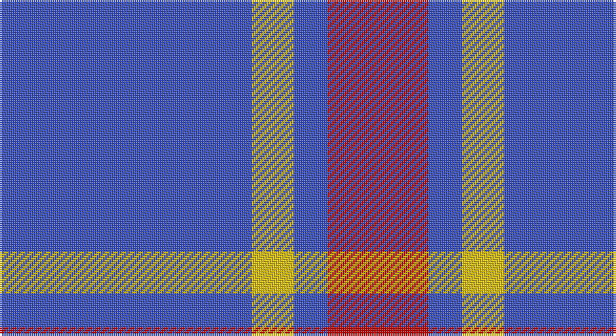

This page is one **sett** — a single exact thread-count. It belongs to the [tartan](/setts/b30ly5b4r12/)
(the same proportion at any scale), whose colour order is pattern [BYBR](/stripes/bybr/).

Sourced from tartans-authority.  It is a [4 stripe tartan](/stripes/stripes4/).

Original link http://www.tartansauthority.com/tartan-ferret/display/6385/

## Register references

External register numbers recorded for this tartan.

- Scottish Tartans Authority (ITI): 6385

## Thread count
B/120 Y20 B16 R/48

One full sett is **240 threads**.

## Palette

Palette: <strong>Tartan Register</strong>
<table><thead><tr><th>Colour</th><th>Threads</th><th>Shade</th><th>Base</th><th>OKLCh</th></tr></thead><tbody><tr><td>B/</td><td style="text-align:right;font-variant-numeric:tabular-nums">120</td><td><code style="background-color:#3850C8;">#3850C8</code> <small style="color:#888">#3850C8</small></td><td>B <code style="background-color:#2A418A;">#2A418A</code></td><td><small style="color:#888">oklch(48.8% 0.188 269.4)</small></td></tr><tr><td>Y</td><td style="text-align:right;font-variant-numeric:tabular-nums">20</td><td><code style="background-color:#E8C000;">#E8C000</code> <small style="color:#888">#E8C000</small></td><td>Y <code style="background-color:#F2BF00;">#F2BF00</code></td><td><small style="color:#888">oklch(81.9% 0.168 93.7)</small></td></tr><tr><td>B</td><td style="text-align:right;font-variant-numeric:tabular-nums">16</td><td><code style="background-color:#3850C8;">#3850C8</code> <small style="color:#888">#3850C8</small></td><td>B <code style="background-color:#2A418A;">#2A418A</code></td><td><small style="color:#888">oklch(48.8% 0.188 269.4)</small></td></tr><tr><td>R/</td><td style="text-align:right;font-variant-numeric:tabular-nums">48</td><td><code style="background-color:#C80000;">#C80000</code> <small style="color:#888">#C80000</small></td><td>R <code style="background-color:#CC0000;">#CC0000</code></td><td><small style="color:#888">oklch(52.3% 0.215 29.2)</small></td></tr></tbody></table>

# Sample pattern

## Nearest tartans

The nearest existing variants by ΔTartan distance, with this tartan at the top so the swatches line up against it.

ΔTartan

Tartan

Sett

—

<a href="/ttd/edit/#slug=b30ly5b4r12~x4">UEFA (Corporate)</a> <a class="nn-out" href="/variants/s4/b30ly5b4r12~x4/" title="open its dictionary page">↗</a>

1.12

<a href="/variants/s6/b30ly5b4r12~x4/">UEFA (Glasgow)</a>

1.38

<a href="/ttd/edit/#slug=dp30m5dp5t4dp4g12~x2&amp;base=b30ly5b4r12~x4">International Festival of Authors</a> <a class="nn-out" href="/variants/s6/dp30m5dp5t4dp4g12~x2/" title="open its dictionary page">↗</a>

1.44

<a href="/ttd/edit/#slug=db26lp11db3lp4k2~x4&amp;base=b30ly5b4r12~x4">Debbie Munro Memorial (Corporate)</a> <a class="nn-out" href="/variants/s5/db26lp11db3lp4k2~x4/" title="open its dictionary page">↗</a>

1.48

<a href="/variants/s6/db60ly6db11r25~x2/">South Australian Pipes &amp; Drums (Corp</a>

1.64

<a href="/ttd/edit/#slug=b11lo2r1lo2r1~x4&amp;base=b30ly5b4r12~x4">Carlisle Ancient</a> <a class="nn-out" href="/variants/s5/b11lo2r1lo2r1~x4/" title="open its dictionary page">↗</a>

1.64

<a href="/variants/s4/dp23w4r4~x4/">Auchmaliddie Samkoma</a>

1.77

<a href="/ttd/edit/#slug=db8r1w1r1k1~x8&amp;base=b30ly5b4r12~x4">Laing of Archiestown</a> <a class="nn-out" href="/variants/s5/db8r1w1r1k1~x8/" title="open its dictionary page">↗</a>

1.79

<a href="/ttd/edit/#slug=dp30m5dp5b4dp4g12~x2&amp;base=b30ly5b4r12~x4">International Festival of Authors (C</a> <a class="nn-out" href="/variants/s6/dp30m5dp5b4dp4g12~x2/" title="open its dictionary page">↗</a>

1.79

<a href="/ttd/edit/#slug=db13lb3db1r3lb1~x6&amp;base=b30ly5b4r12~x4">Glen Moy</a> <a class="nn-out" href="/variants/s5/db13lb3db1r3lb1~x6/" title="open its dictionary page">↗</a>

1.79

<a href="/ttd/edit/#slug=m13w3m1k3w1~x6&amp;base=b30ly5b4r12~x4">Glen App</a> <a class="nn-out" href="/variants/s5/m13w3m1k3w1~x6/" title="open its dictionary page">↗</a>

## Neighbour map

Every grey dot is one of 14360 variants placed by the first two principal components of the ΔTartan feature space (44% of its variance). Red is this tartan; blue dots are its nearest — click one to open its page.

<svg viewBox="0 0 640 380" role="img" style="max-width:100%;height:auto;border:1px solid #e0e0e0;border-radius:4px;display:block" xmlns="http://www.w3.org/2000/svg"><image href="/nn/cloud.v1.png" width="640" height="380"/><a href="/variants/s6/b30ly5b4r12~x4/"><circle cx="346.0" cy="218.8" r="4" fill="#3465a4"><title>UEFA (Glasgow)</title></circle></a><a href="/variants/s6/dp30m5dp5t4dp4g12~x2/"><circle cx="348.3" cy="211.4" r="4" fill="#3465a4"><title>International Festival of Authors</title></circle></a><a href="/variants/s5/db26lp11db3lp4k2~x4/"><circle cx="377.4" cy="207.0" r="4" fill="#3465a4"><title>Debbie Munro Memorial (Corporate)</title></circle></a><a href="/variants/s6/db60ly6db11r25~x2/"><circle cx="409.5" cy="215.7" r="4" fill="#3465a4"><title>South Australian Pipes &amp; Drums (Corp</title></circle></a><a href="/variants/s5/b11lo2r1lo2r1~x4/"><circle cx="395.7" cy="210.1" r="4" fill="#3465a4"><title>Carlisle Ancient</title></circle></a><a href="/variants/s4/dp23w4r4~x4/"><circle cx="349.2" cy="237.8" r="4" fill="#3465a4"><title>Auchmaliddie Samkoma</title></circle></a><a href="/variants/s5/db8r1w1r1k1~x8/"><circle cx="369.2" cy="199.8" r="4" fill="#3465a4"><title>Laing of Archiestown</title></circle></a><a href="/variants/s6/dp30m5dp5b4dp4g12~x2/"><circle cx="363.9" cy="210.5" r="4" fill="#3465a4"><title>International Festival of Authors (C</title></circle></a><a href="/variants/s5/db13lb3db1r3lb1~x6/"><circle cx="394.6" cy="201.9" r="4" fill="#3465a4"><title>Glen Moy</title></circle></a><a href="/variants/s5/m13w3m1k3w1~x6/"><circle cx="390.8" cy="185.7" r="4" fill="#3465a4"><title>Glen App</title></circle></a><circle cx="381.0" cy="251.8" r="5" fill="#c00000"/></svg>

ID: /variants/s4/b30ly5b4r12~x4/
