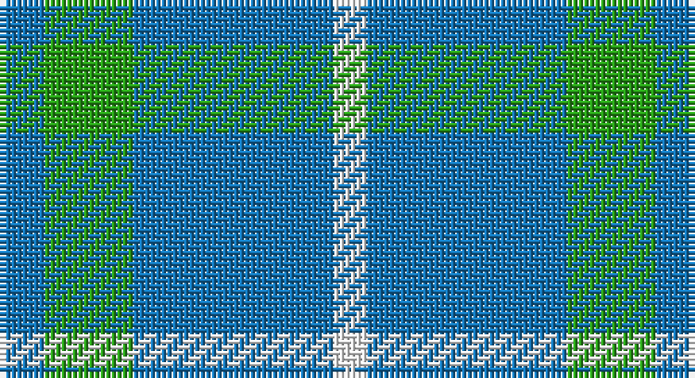

This page is one **sett** — a single exact thread-count. It belongs to the [tartan](/setts/b4g8b18w3/)
(the same proportion at any scale), whose colour order is pattern [BGBW](/stripes/bgbw/).

Sourced from tartans-authority.  It is a [4 stripe tartan](/stripes/stripes4/).

Original link http://www.tartansauthority.com/tartan-ferret/display/3707/

## Also known as

This cloth is also recorded under:

- Blue Meadow Check

2 attestations — the source records this cloth was collapsed from (oldest owns this page)

<ul>
<li>1973 Oct. — Blue Meadow Check (Fashion) (tartans-authority, <a href="http://www.tartansauthority.com/tartan-ferret/display/3707/">record</a>)</li>
<li>undated — Blue Meadow (register-of-tartans, <a href="https://www.tartanregister.gov.uk/tartanDetails.aspx?ref=4954">record</a>)</li>
</ul>

## Register references

External register numbers recorded for this tartan.

- Scottish Register of Tartans: [4954](https://www.tartanregister.gov.uk/tartanDetails.aspx?ref=4954)
- Scottish Tartans Authority (ITI): 3707

## Thread count
B/8 G16 B36 W/6

One full sett is **118 threads**.

## Palette

Palette: <strong>Tartan Register</strong>
<table><thead><tr><th>Colour</th><th>Threads</th><th>Shade</th><th>Base</th><th>OKLCh</th></tr></thead><tbody><tr><td>B/</td><td style="text-align:right;font-variant-numeric:tabular-nums">8</td><td><code style="background-color:#1474B4;">#1474B4</code> <small style="color:#888">#1474B4</small></td><td>B <code style="background-color:#2A418A;">#2A418A</code></td><td><small style="color:#888">oklch(54.0% 0.129 245.1)</small></td></tr><tr><td>G</td><td style="text-align:right;font-variant-numeric:tabular-nums">16</td><td><code style="background-color:#289C18;">#289C18</code> <small style="color:#888">#289C18</small></td><td>G <code style="background-color:#006100;">#006100</code></td><td><small style="color:#888">oklch(60.6% 0.191 141.6)</small></td></tr><tr><td>B</td><td style="text-align:right;font-variant-numeric:tabular-nums">36</td><td><code style="background-color:#1474B4;">#1474B4</code> <small style="color:#888">#1474B4</small></td><td>B <code style="background-color:#2A418A;">#2A418A</code></td><td><small style="color:#888">oklch(54.0% 0.129 245.1)</small></td></tr><tr><td>W/</td><td style="text-align:right;font-variant-numeric:tabular-nums">6</td><td><code style="background-color:#FCFCFC;">#FCFCFC</code> <small style="color:#888">#FCFCFC</small></td><td>W <code style="background-color:#F7F7F7;">#F7F7F7</code></td><td><small style="color:#888">oklch(99.1% 0.000 89.9)</small></td></tr></tbody></table>

# Sample pattern

## Nearest tartans

The nearest existing variants by ΔTartan distance, with this tartan at the top so the swatches line up against it.

ΔTartan

Tartan

Sett

—

<a href="/ttd/edit/#slug=b4g8b18w3~x2">Blue Meadow Check (Fashion)</a> <a class="nn-out" href="/variants/s4/b4g8b18w3~x2/" title="open its dictionary page">↗</a>

1.55

<a href="/variants/s4/t8dg1r2~x20/">Gyle</a>

1.69

<a href="/ttd/edit/#slug=t8dg1r2~x20&amp;base=b4g8b18w3~x2">Gyle (Corporate)</a> <a class="nn-out" href="/variants/s3/t8dg1r2~x20/" title="open its dictionary page">↗</a>

1.81

<a href="/ttd/edit/#slug=db2g7db7w1~x2&amp;base=b4g8b18w3~x2">Unnamed No 78</a> <a class="nn-out" href="/variants/s4/db2g7db7w1~x2/" title="open its dictionary page">↗</a>

1.83

<a href="/ttd/edit/#slug=b18w4b3lo12~x2&amp;base=b4g8b18w3~x2">Genesee Community College</a> <a class="nn-out" href="/variants/s4/b18w4b3lo12~x2/" title="open its dictionary page">↗</a>

1.83

<a href="/ttd/edit/#slug=w11t20ly3t8ly3t10~x2&amp;base=b4g8b18w3~x2">Lucard, Stphane (Personal))</a> <a class="nn-out" href="/variants/s6/w11t20ly3t8ly3t10~x2/" title="open its dictionary page">↗</a>

1.88

<a href="/ttd/edit/#slug=db11g2db15g18w2~x2&amp;base=b4g8b18w3~x2">Hamilton, hunting</a> <a class="nn-out" href="/variants/s5/db11g2db15g18w2~x2/" title="open its dictionary page">↗</a>

1.89

<a href="/ttd/edit/#slug=g6b1g7w1b7r1~x4&amp;base=b4g8b18w3~x2">Norris (1957)</a> <a class="nn-out" href="/variants/s6/g6b1g7w1b7r1~x4/" title="open its dictionary page">↗</a>

2.06

<a href="/ttd/edit/#slug=w11t20lo3t8~x2&amp;base=b4g8b18w3~x2">Lucard, Stéphane (Personal)</a> <a class="nn-out" href="/variants/s4/w11t20lo3t8~x2/" title="open its dictionary page">↗</a>

2.11

<a href="/ttd/edit/#slug=t12ly2t1k5t4k2~x4&amp;base=b4g8b18w3~x2">Rea</a> <a class="nn-out" href="/variants/s6/t12ly2t1k5t4k2~x4/" title="open its dictionary page">↗</a>

2.15

<a href="/ttd/edit/#slug=b3k1g4k1b4g9k2~x4&amp;base=b4g8b18w3~x2">Outdoorsmen (Fashion)</a> <a class="nn-out" href="/variants/s7/b3k1g4k1b4g9k2~x4/" title="open its dictionary page">↗</a>

## Neighbour map

Every grey dot is one of 14360 variants placed by the first two principal components of the ΔTartan feature space (44% of its variance). Red is this tartan; blue dots are its nearest — click one to open its page.

<svg viewBox="0 0 640 380" role="img" style="max-width:100%;height:auto;border:1px solid #e0e0e0;border-radius:4px;display:block" xmlns="http://www.w3.org/2000/svg"><image href="/nn/cloud.v1.png" width="640" height="380"/><a href="/variants/s4/t8dg1r2~x20/"><circle cx="405.4" cy="256.0" r="4" fill="#3465a4"><title>Gyle</title></circle></a><a href="/variants/s3/t8dg1r2~x20/"><circle cx="452.4" cy="281.5" r="4" fill="#3465a4"><title>Gyle (Corporate)</title></circle></a><a href="/variants/s4/db2g7db7w1~x2/"><circle cx="303.9" cy="288.5" r="4" fill="#3465a4"><title>Unnamed No 78</title></circle></a><a href="/variants/s4/b18w4b3lo12~x2/"><circle cx="288.0" cy="268.7" r="4" fill="#3465a4"><title>Genesee Community College</title></circle></a><a href="/variants/s6/w11t20ly3t8ly3t10~x2/"><circle cx="363.9" cy="258.2" r="4" fill="#3465a4"><title>Lucard, Stphane (Personal))</title></circle></a><a href="/variants/s5/db11g2db15g18w2~x2/"><circle cx="328.2" cy="271.2" r="4" fill="#3465a4"><title>Hamilton, hunting</title></circle></a><a href="/variants/s6/g6b1g7w1b7r1~x4/"><circle cx="311.8" cy="250.5" r="4" fill="#3465a4"><title>Norris (1957)</title></circle></a><a href="/variants/s4/w11t20lo3t8~x2/"><circle cx="363.0" cy="277.7" r="4" fill="#3465a4"><title>Lucard, Stéphane (Personal)</title></circle></a><a href="/variants/s6/t12ly2t1k5t4k2~x4/"><circle cx="363.3" cy="219.2" r="4" fill="#3465a4"><title>Rea</title></circle></a><a href="/variants/s7/b3k1g4k1b4g9k2~x4/"><circle cx="298.0" cy="246.4" r="4" fill="#3465a4"><title>Outdoorsmen (Fashion)</title></circle></a><circle cx="365.7" cy="286.1" r="5" fill="#c00000"/></svg>

ID: /variants/s4/b4g8b18w3~x2/
