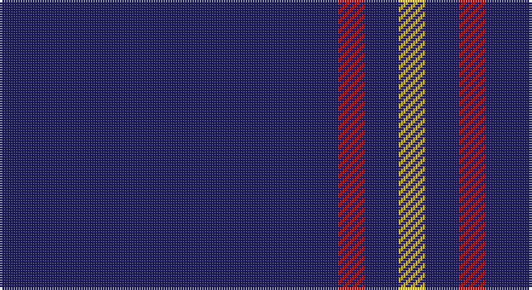

This page is one **sett** — a single exact thread-count. It belongs to the [tartan](/setts/db140r11db14ly11/)
(the same proportion at any scale), whose colour order is pattern [BRBY](/stripes/brby/).

Sourced from register-of-tartans.  It is a [4 stripe tartan](/stripes/stripes4/).

Original link https://www.tartanregister.gov.uk/tartanDetails.aspx?ref=1326

## Register references

External register numbers recorded for this tartan.

- Scottish Register of Tartans: [1326](https://www.tartanregister.gov.uk/tartanDetails.aspx?ref=1326)
- Scottish Tartans Authority (ITI): 6013

## Thread count
DB/140 R11 DB14 Y/11

One full sett is **201 threads**.

## Palette

Palette: <strong>Tartan Register</strong>
<table><thead><tr><th>Colour</th><th>Threads</th><th>Shade</th><th>Base</th><th>OKLCh</th></tr></thead><tbody><tr><td>DB/</td><td style="text-align:right;font-variant-numeric:tabular-nums">140</td><td><code style="background-color:#202060;">#202060</code> <small style="color:#888">#202060</small></td><td>B <code style="background-color:#2A418A;">#2A418A</code></td><td><small style="color:#888">oklch(28.9% 0.111 276.9)</small></td></tr><tr><td>R</td><td style="text-align:right;font-variant-numeric:tabular-nums">11</td><td><code style="background-color:#C80000;">#C80000</code> <small style="color:#888">#C80000</small></td><td>R <code style="background-color:#CC0000;">#CC0000</code></td><td><small style="color:#888">oklch(52.3% 0.215 29.2)</small></td></tr><tr><td>DB</td><td style="text-align:right;font-variant-numeric:tabular-nums">14</td><td><code style="background-color:#202060;">#202060</code> <small style="color:#888">#202060</small></td><td>B <code style="background-color:#2A418A;">#2A418A</code></td><td><small style="color:#888">oklch(28.9% 0.111 276.9)</small></td></tr><tr><td>Y/</td><td style="text-align:right;font-variant-numeric:tabular-nums">11</td><td><code style="background-color:#E8C000;">#E8C000</code> <small style="color:#888">#E8C000</small></td><td>Y <code style="background-color:#F2BF00;">#F2BF00</code></td><td><small style="color:#888">oklch(81.9% 0.168 93.7)</small></td></tr></tbody></table>

# Sample pattern

## Nearest tartans

The nearest existing variants by ΔTartan distance, with this tartan at the top so the swatches line up against it.

ΔTartan

Tartan

Sett

—

<a href="/ttd/edit/#slug=db140r11db14ly11">Gem</a> <a class="nn-out" href="/variants/s4/db140r11db14ly11/" title="open its dictionary page">↗</a>

1.03

<a href="/ttd/edit/#slug=db32r3db4ly3~x2&amp;base=db140r11db14ly11">MacLaine of Lochbuie</a> <a class="nn-out" href="/variants/s4/db32r3db4ly3~x2/" title="open its dictionary page">↗</a>

1.61

<a href="/ttd/edit/#slug=dt102lr11dt14w11&amp;base=db140r11db14ly11">Westfield (Corporate?)</a> <a class="nn-out" href="/variants/s4/dt102lr11dt14w11/" title="open its dictionary page">↗</a>

1.76

<a href="/ttd/edit/#slug=r1db9lo2db9lo1~x4&amp;base=db140r11db14ly11">Brooks Brothers Tattersall Blue</a> <a class="nn-out" href="/variants/s5/r1db9lo2db9lo1~x4/" title="open its dictionary page">↗</a>

1.79

<a href="/ttd/edit/#slug=r3db2r1db18g1db2~x4&amp;base=db140r11db14ly11">Lynch</a> <a class="nn-out" href="/variants/s6/r3db2r1db18g1db2~x4/" title="open its dictionary page">↗</a>

1.81

<a href="/ttd/edit/#slug=db16ri4db3r1~x2&amp;base=db140r11db14ly11">Elliott</a> <a class="nn-out" href="/variants/s4/db16ri4db3r1~x2/" title="open its dictionary page">↗</a>

1.81

<a href="/ttd/edit/#slug=ly6db28do2db28y1~x2&amp;base=db140r11db14ly11">Pearson</a> <a class="nn-out" href="/variants/s5/ly6db28do2db28y1~x2/" title="open its dictionary page">↗</a>

1.83

<a href="/ttd/edit/#slug=b11db7b3db70lb4db6~x2&amp;base=db140r11db14ly11">Auchairne (Corporate)</a> <a class="nn-out" href="/variants/s6/b11db7b3db70lb4db6~x2/" title="open its dictionary page">↗</a>

1.98

<a href="/ttd/edit/#slug=db32r3db4k1ly3~x2&amp;base=db140r11db14ly11">MacLaine of Lochbuie, hunting</a> <a class="nn-out" href="/variants/s5/db32r3db4k1ly3~x2/" title="open its dictionary page">↗</a>

2.07

<a href="/ttd/edit/#slug=db19w6db105ly4db5&amp;base=db140r11db14ly11">Greenock Morton F. C. (Corporate)</a> <a class="nn-out" href="/variants/s5/db19w6db105ly4db5/" title="open its dictionary page">↗</a>

2.08

<a href="/ttd/edit/#slug=r2k6db33w2~x4&amp;base=db140r11db14ly11">McCallie</a> <a class="nn-out" href="/variants/s4/r2k6db33w2~x4/" title="open its dictionary page">↗</a>

## Neighbour map

Every grey dot is one of 14360 variants placed by the first two principal components of the ΔTartan feature space (44% of its variance). Red is this tartan; blue dots are its nearest — click one to open its page.

<svg viewBox="0 0 640 380" role="img" style="max-width:100%;height:auto;border:1px solid #e0e0e0;border-radius:4px;display:block" xmlns="http://www.w3.org/2000/svg"><image href="/nn/cloud.v1.png" width="640" height="380"/><a href="/variants/s4/db32r3db4ly3~x2/"><circle cx="589.6" cy="240.0" r="4" fill="#3465a4"><title>MacLaine of Lochbuie</title></circle></a><a href="/variants/s4/dt102lr11dt14w11/"><circle cx="539.7" cy="241.2" r="4" fill="#3465a4"><title>Westfield (Corporate?)</title></circle></a><a href="/variants/s5/r1db9lo2db9lo1~x4/"><circle cx="543.1" cy="269.9" r="4" fill="#3465a4"><title>Brooks Brothers Tattersall Blue</title></circle></a><a href="/variants/s6/r3db2r1db18g1db2~x4/"><circle cx="601.3" cy="205.3" r="4" fill="#3465a4"><title>Lynch</title></circle></a><a href="/variants/s4/db16ri4db3r1~x2/"><circle cx="554.0" cy="251.9" r="4" fill="#3465a4"><title>Elliott</title></circle></a><a href="/variants/s5/ly6db28do2db28y1~x2/"><circle cx="589.8" cy="196.9" r="4" fill="#3465a4"><title>Pearson</title></circle></a><a href="/variants/s6/b11db7b3db70lb4db6~x2/"><circle cx="612.6" cy="198.8" r="4" fill="#3465a4"><title>Auchairne (Corporate)</title></circle></a><a href="/variants/s5/db32r3db4k1ly3~x2/"><circle cx="596.1" cy="164.5" r="4" fill="#3465a4"><title>MacLaine of Lochbuie, hunting</title></circle></a><a href="/variants/s5/db19w6db105ly4db5/"><circle cx="626.0" cy="195.4" r="4" fill="#3465a4"><title>Greenock Morton F. C. (Corporate)</title></circle></a><a href="/variants/s4/r2k6db33w2~x4/"><circle cx="506.8" cy="205.3" r="4" fill="#3465a4"><title>McCallie</title></circle></a><circle cx="614.9" cy="231.6" r="5" fill="#c00000"/></svg>

ID: /variants/s4/db140r11db14ly11/
