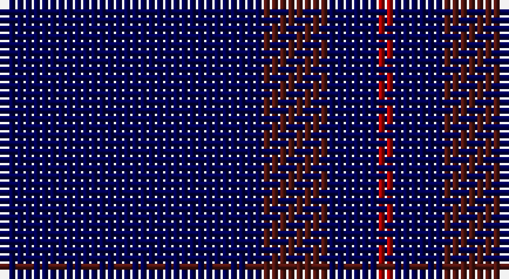

This page is one **sett** — a single exact thread-count. It belongs to the [tartan](/setts/db16dr4db3r1/)
(the same proportion at any scale), whose colour order is pattern [BBBR](/stripes/bbbr/).

Sourced from weddslist.  It is a [4 stripe tartan](/stripes/stripes4/).

Original link http://www.weddslist.com/cgi-bin/tartans/pg.pl?source=tinsel

## Also known as

This cloth is also recorded under:

- Elliot

2 attestations — the source records this cloth was collapsed from (oldest owns this page)

<ul>
<li>undated — Elliott (weddslist, <a href="http://www.weddslist.com/cgi-bin/tartans/pg.pl?source=tinsel">record</a>)</li>
<li>undated — Elliott (weddslist, <a href="http://www.weddslist.com/cgi-bin/tartans/pg.pl?source=x">record</a>)</li>
</ul>

## Thread count
DB/32 DRa8 DB6 DR/2

One full sett is **62 threads**.

## Palette

Palette: <strong>custom</strong>
<table><thead><tr><th>Colour</th><th>Threads</th><th>Shade</th><th>Base</th><th>OKLCh</th></tr></thead><tbody><tr><td>DB/</td><td style="text-align:right;font-variant-numeric:tabular-nums">32</td><td><code style="background-color:#000052;">#000052</code> <small style="color:#888">#000052</small></td><td>B <code style="background-color:#2A418A;">#2A418A</code></td><td><small style="color:#888">oklch(19.8% 0.137 264.1)</small></td></tr><tr><td>DRa</td><td style="text-align:right;font-variant-numeric:tabular-nums">8</td><td><code style="background-color:#521510;">#521510</code> <small style="color:#888">#521510</small></td><td>B <code style="background-color:#2A418A;">#2A418A</code></td><td><small style="color:#888">oklch(29.8% 0.092 28.5)</small></td></tr><tr><td>DB</td><td style="text-align:right;font-variant-numeric:tabular-nums">6</td><td><code style="background-color:#000052;">#000052</code> <small style="color:#888">#000052</small></td><td>B <code style="background-color:#2A418A;">#2A418A</code></td><td><small style="color:#888">oklch(19.8% 0.137 264.1)</small></td></tr><tr><td>DR/</td><td style="text-align:right;font-variant-numeric:tabular-nums">2</td><td><code style="background-color:#AA0000;">#AA0000</code> <small style="color:#888">#AA0000</small></td><td>R <code style="background-color:#CC0000;">#CC0000</code></td><td><small style="color:#888">oklch(46.3% 0.190 29.2)</small></td></tr></tbody></table>

# Sample pattern

## Nearest tartans

The nearest existing variants by ΔTartan distance, with this tartan at the top so the swatches line up against it.

ΔTartan

Tartan

Sett

—

<a href="/ttd/edit/#slug=db16dr4db3r1~x2">Elliott</a> <a class="nn-out" href="/variants/s4/db16dr4db3r1~x2/" title="open its dictionary page">↗</a>

1.61

<a href="/ttd/edit/#slug=db44dy12db9r3~x2&amp;base=db16dr4db3r1~x2">Elliot (Clan)</a> <a class="nn-out" href="/variants/s4/db44dy12db9r3~x2/" title="open its dictionary page">↗</a>

1.73

<a href="/ttd/edit/#slug=db16ri4db3r1~x2&amp;base=db16dr4db3r1~x2">Elliott</a> <a class="nn-out" href="/variants/s4/db16ri4db3r1~x2/" title="open its dictionary page">↗</a>

2.02

<a href="/ttd/edit/#slug=dt68t7dt16k16lo4~x2&amp;base=db16dr4db3r1~x2">Burnetts &amp; Struth</a> <a class="nn-out" href="/variants/s5/dt68t7dt16k16lo4~x2/" title="open its dictionary page">↗</a>

2.07

<a href="/ttd/edit/#slug=db1t1db8r1~x2&amp;base=db16dr4db3r1~x2">Lochaber #3</a> <a class="nn-out" href="/variants/s4/db1t1db8r1~x2/" title="open its dictionary page">↗</a>

2.09

<a href="/ttd/edit/#slug=dt68b7dt16k16lo4~x2&amp;base=db16dr4db3r1~x2">Burnett's &amp; Struth (Corporate)</a> <a class="nn-out" href="/variants/s5/dt68b7dt16k16lo4~x2/" title="open its dictionary page">↗</a>

2.12

<a href="/ttd/edit/#slug=db9dy12db44dy12db9r3~x2&amp;base=db16dr4db3r1~x2">Elliot</a> <a class="nn-out" href="/variants/s6/db9dy12db44dy12db9r3~x2/" title="open its dictionary page">↗</a>

2.17

<a href="/ttd/edit/#slug=r1db9lo2db9lo1~x4&amp;base=db16dr4db3r1~x2">Brooks Brothers Tattersall Blue</a> <a class="nn-out" href="/variants/s5/r1db9lo2db9lo1~x4/" title="open its dictionary page">↗</a>

2.25

<a href="/ttd/edit/#slug=b11db7b3db70lb4db6~x2&amp;base=db16dr4db3r1~x2">Auchairne (Corporate)</a> <a class="nn-out" href="/variants/s6/b11db7b3db70lb4db6~x2/" title="open its dictionary page">↗</a>

2.26

<a href="/ttd/edit/#slug=db1k12db1~x10&amp;base=db16dr4db3r1~x2">Staines (2013)</a> <a class="nn-out" href="/variants/s3/db1k12db1~x10/" title="open its dictionary page">↗</a>

2.29

<a href="/ttd/edit/#slug=r19db6r7db101dg6db7~x2&amp;base=db16dr4db3r1~x2">Lynch</a> <a class="nn-out" href="/variants/s6/r19db6r7db101dg6db7~x2/" title="open its dictionary page">↗</a>

## Neighbour map

Every grey dot is one of 14360 variants placed by the first two principal components of the ΔTartan feature space (44% of its variance). Red is this tartan; blue dots are its nearest — click one to open its page.

<svg viewBox="0 0 640 380" role="img" style="max-width:100%;height:auto;border:1px solid #e0e0e0;border-radius:4px;display:block" xmlns="http://www.w3.org/2000/svg"><image href="/nn/cloud.v1.png" width="640" height="380"/><a href="/variants/s4/db44dy12db9r3~x2/"><circle cx="611.5" cy="290.9" r="4" fill="#3465a4"><title>Elliot (Clan)</title></circle></a><a href="/variants/s4/db16ri4db3r1~x2/"><circle cx="554.0" cy="251.9" r="4" fill="#3465a4"><title>Elliott</title></circle></a><a href="/variants/s5/dt68t7dt16k16lo4~x2/"><circle cx="550.9" cy="245.0" r="4" fill="#3465a4"><title>Burnetts &amp; Struth</title></circle></a><a href="/variants/s4/db1t1db8r1~x2/"><circle cx="590.0" cy="280.1" r="4" fill="#3465a4"><title>Lochaber #3</title></circle></a><a href="/variants/s5/dt68b7dt16k16lo4~x2/"><circle cx="547.6" cy="240.9" r="4" fill="#3465a4"><title>Burnett's &amp; Struth (Corporate)</title></circle></a><a href="/variants/s6/db9dy12db44dy12db9r3~x2/"><circle cx="532.0" cy="267.8" r="4" fill="#3465a4"><title>Elliot</title></circle></a><a href="/variants/s5/r1db9lo2db9lo1~x4/"><circle cx="543.1" cy="269.9" r="4" fill="#3465a4"><title>Brooks Brothers Tattersall Blue</title></circle></a><a href="/variants/s6/b11db7b3db70lb4db6~x2/"><circle cx="612.6" cy="198.8" r="4" fill="#3465a4"><title>Auchairne (Corporate)</title></circle></a><a href="/variants/s3/db1k12db1~x10/"><circle cx="626.0" cy="300.4" r="4" fill="#3465a4"><title>Staines (2013)</title></circle></a><a href="/variants/s6/r19db6r7db101dg6db7~x2/"><circle cx="593.9" cy="211.5" r="4" fill="#3465a4"><title>Lynch</title></circle></a><circle cx="602.7" cy="280.5" r="5" fill="#c00000"/></svg>

ID: /variants/s4/db16dr4db3r1~x2/
