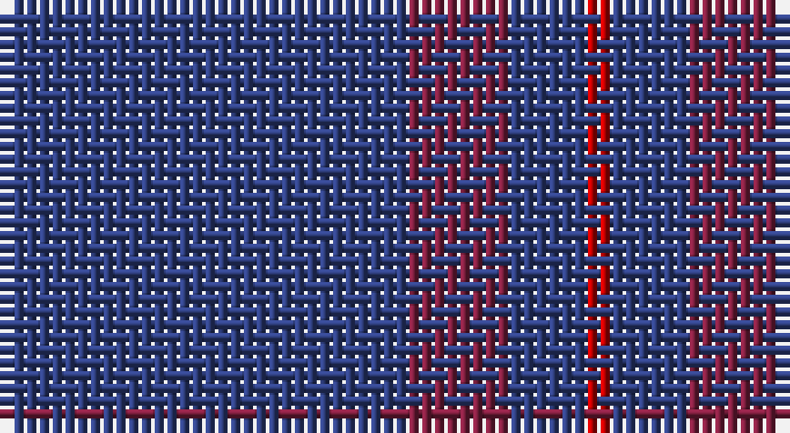

This page is one **sett** — a single exact thread-count. It belongs to the [tartan](/setts/db16m4db3r1/)
(the same proportion at any scale), whose colour order is pattern [BRBR](/stripes/brbr/).

Sourced from weddslist.  It is a [4 stripe tartan](/stripes/stripes4/).

Original link http://www.weddslist.com/cgi-bin/tartans/pg.pl?source=sts

## Thread count
B/32 DR8 B6 R/2

One full sett is **62 threads**.

## Palette

Palette: <strong>custom</strong>
<table><thead><tr><th>Colour</th><th>Threads</th><th>Shade</th><th>Base</th><th>OKLCh</th></tr></thead><tbody><tr><td>B/</td><td style="text-align:right;font-variant-numeric:tabular-nums">32</td><td><code style="background-color:#304080;">#304080</code> <small style="color:#888">#304080</small></td><td>B <code style="background-color:#2A418A;">#2A418A</code></td><td><small style="color:#888">oklch(39.4% 0.109 270.2)</small></td></tr><tr><td>DR</td><td style="text-align:right;font-variant-numeric:tabular-nums">8</td><td><code style="background-color:#802040;">#802040</code> <small style="color:#888">#802040</small></td><td>R <code style="background-color:#CC0000;">#CC0000</code></td><td><small style="color:#888">oklch(40.8% 0.132 5.2)</small></td></tr><tr><td>B</td><td style="text-align:right;font-variant-numeric:tabular-nums">6</td><td><code style="background-color:#304080;">#304080</code> <small style="color:#888">#304080</small></td><td>B <code style="background-color:#2A418A;">#2A418A</code></td><td><small style="color:#888">oklch(39.4% 0.109 270.2)</small></td></tr><tr><td>R/</td><td style="text-align:right;font-variant-numeric:tabular-nums">2</td><td><code style="background-color:#C00000;">#C00000</code> <small style="color:#888">#C00000</small></td><td>R <code style="background-color:#CC0000;">#CC0000</code></td><td><small style="color:#888">oklch(50.7% 0.208 29.2)</small></td></tr></tbody></table>

# Sample pattern

## Nearest tartans

The nearest existing variants by ΔTartan distance, with this tartan at the top so the swatches line up against it.

ΔTartan

Tartan

Sett

—

<a href="/ttd/edit/#slug=db16m4db3r1~x2">Elliot</a> <a class="nn-out" href="/variants/s4/db16m4db3r1~x2/" title="open its dictionary page">↗</a>

0.84

<a href="/ttd/edit/#slug=db44dy12db9r3~x2&amp;base=db16m4db3r1~x2">Elliot (Clan)</a> <a class="nn-out" href="/variants/s4/db44dy12db9r3~x2/" title="open its dictionary page">↗</a>

1.27

<a href="/ttd/edit/#slug=db16dr4db3r1~x6&amp;base=db16m4db3r1~x2">Elliot Clan Tartan</a> <a class="nn-out" href="/variants/s4/db16dr4db3r1~x6/" title="open its dictionary page">↗</a>

1.70

<a href="/ttd/edit/#slug=db45b2db4b15db7~x2&amp;base=db16m4db3r1~x2">Asahi (Corporate)</a> <a class="nn-out" href="/variants/s5/db45b2db4b15db7~x2/" title="open its dictionary page">↗</a>

1.81

<a href="/ttd/edit/#slug=db9dy12db44dy12db9r3~x2&amp;base=db16m4db3r1~x2">Elliot</a> <a class="nn-out" href="/variants/s6/db9dy12db44dy12db9r3~x2/" title="open its dictionary page">↗</a>

2.31

<a href="/ttd/edit/#slug=dt68b7dt16k16lo4~x2&amp;base=db16m4db3r1~x2">Burnett's &amp; Struth (Corporate)</a> <a class="nn-out" href="/variants/s5/dt68b7dt16k16lo4~x2/" title="open its dictionary page">↗</a>

2.35

<a href="/ttd/edit/#slug=db16dr4db3r1~x2&amp;base=db16m4db3r1~x2">Elliott</a> <a class="nn-out" href="/variants/s4/db16dr4db3r1~x2/" title="open its dictionary page">↗</a>

2.38

<a href="/ttd/edit/#slug=db1t1db8r1~x2&amp;base=db16m4db3r1~x2">Lochaber #3</a> <a class="nn-out" href="/variants/s4/db1t1db8r1~x2/" title="open its dictionary page">↗</a>

2.50

<a href="/ttd/edit/#slug=dt40o2dt20g19db2&amp;base=db16m4db3r1~x2">Lloyd (Welsh Name)</a> <a class="nn-out" href="/variants/s5/dt40o2dt20g19db2/" title="open its dictionary page">↗</a>

2.57

<a href="/ttd/edit/#slug=dt68t7dt16k16lo4~x2&amp;base=db16m4db3r1~x2">Burnetts &amp; Struth</a> <a class="nn-out" href="/variants/s5/dt68t7dt16k16lo4~x2/" title="open its dictionary page">↗</a>

2.59

<a href="/ttd/edit/#slug=do14db14do14db40do3db2~x2&amp;base=db16m4db3r1~x2">Atlin</a> <a class="nn-out" href="/variants/s6/do14db14do14db40do3db2~x2/" title="open its dictionary page">↗</a>

## Neighbour map

Every grey dot is one of 14360 variants placed by the first two principal components of the ΔTartan feature space (44% of its variance). Red is this tartan; blue dots are its nearest — click one to open its page.

<svg viewBox="0 0 640 380" role="img" style="max-width:100%;height:auto;border:1px solid #e0e0e0;border-radius:4px;display:block" xmlns="http://www.w3.org/2000/svg"><image href="/nn/cloud.v1.png" width="640" height="380"/><a href="/variants/s4/db44dy12db9r3~x2/"><circle cx="611.5" cy="290.9" r="4" fill="#3465a4"><title>Elliot (Clan)</title></circle></a><a href="/variants/s4/db16dr4db3r1~x6/"><circle cx="626.0" cy="305.6" r="4" fill="#3465a4"><title>Elliot Clan Tartan</title></circle></a><a href="/variants/s5/db45b2db4b15db7~x2/"><circle cx="626.0" cy="283.1" r="4" fill="#3465a4"><title>Asahi (Corporate)</title></circle></a><a href="/variants/s6/db9dy12db44dy12db9r3~x2/"><circle cx="532.0" cy="267.8" r="4" fill="#3465a4"><title>Elliot</title></circle></a><a href="/variants/s5/dt68b7dt16k16lo4~x2/"><circle cx="547.6" cy="240.9" r="4" fill="#3465a4"><title>Burnett's &amp; Struth (Corporate)</title></circle></a><a href="/variants/s4/db16dr4db3r1~x2/"><circle cx="602.7" cy="280.5" r="4" fill="#3465a4"><title>Elliott</title></circle></a><a href="/variants/s4/db1t1db8r1~x2/"><circle cx="590.0" cy="280.1" r="4" fill="#3465a4"><title>Lochaber #3</title></circle></a><a href="/variants/s5/dt40o2dt20g19db2/"><circle cx="542.4" cy="267.8" r="4" fill="#3465a4"><title>Lloyd (Welsh Name)</title></circle></a><a href="/variants/s5/dt68t7dt16k16lo4~x2/"><circle cx="550.9" cy="245.0" r="4" fill="#3465a4"><title>Burnetts &amp; Struth</title></circle></a><a href="/variants/s6/do14db14do14db40do3db2~x2/"><circle cx="552.4" cy="295.0" r="4" fill="#3465a4"><title>Atlin</title></circle></a><circle cx="626.0" cy="291.5" r="5" fill="#c00000"/></svg>

ID: /variants/s4/db16m4db3r1~x2/
