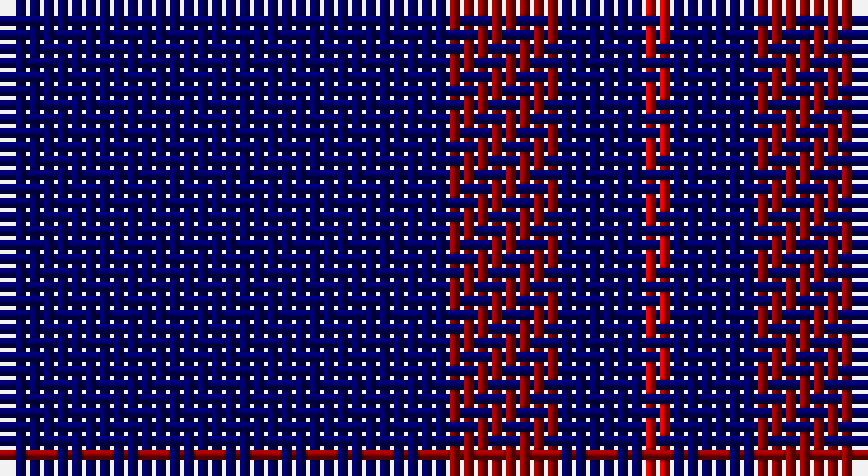

This page is one **sett** — a single exact thread-count. It belongs to the [tartan](/setts/db16ri4db3r1/)
(the same proportion at any scale), whose colour order is pattern [BRBR](/stripes/brbr/).

Sourced from weddslist.  It is a [4 stripe tartan](/stripes/stripes4/).

Original link http://www.weddslist.com/cgi-bin/tartans/pg.pl?source=rb

## Thread count
DB/32 DR8 DB6 R/2

One full sett is **62 threads**.

## Palette

Palette: <strong>Tartan Register</strong> <small style="color:#888">(2 of 3 colours)</small>
<table><thead><tr><th>Colour</th><th>Threads</th><th>Shade</th><th>Base</th><th>OKLCh</th></tr></thead><tbody><tr><td>DB/</td><td style="text-align:right;font-variant-numeric:tabular-nums">32</td><td><code style="background-color:#000064;">#000064</code> <small style="color:#888">#000064</small></td><td>B <code style="background-color:#2A418A;">#2A418A</code></td><td><small style="color:#888">oklch(22.7% 0.158 264.1)</small></td></tr><tr><td>DR</td><td style="text-align:right;font-variant-numeric:tabular-nums">8</td><td><code style="background-color:#900000;">#900000</code> <small style="color:#888">#900000</small></td><td>R <code style="background-color:#CC0000;">#CC0000</code></td><td><small style="color:#888">oklch(41.0% 0.168 29.2)</small></td></tr><tr><td>DB</td><td style="text-align:right;font-variant-numeric:tabular-nums">6</td><td><code style="background-color:#000064;">#000064</code> <small style="color:#888">#000064</small></td><td>B <code style="background-color:#2A418A;">#2A418A</code></td><td><small style="color:#888">oklch(22.7% 0.158 264.1)</small></td></tr><tr><td>R/</td><td style="text-align:right;font-variant-numeric:tabular-nums">2</td><td><code style="background-color:#C80000;">#C80000</code> <small style="color:#888">#C80000</small></td><td>R <code style="background-color:#CC0000;">#CC0000</code></td><td><small style="color:#888">oklch(52.3% 0.215 29.2)</small></td></tr></tbody></table>

# Sample pattern

## Nearest tartans

The nearest existing variants by ΔTartan distance, with this tartan at the top so the swatches line up against it.

ΔTartan

Tartan

Sett

—

<a href="/ttd/edit/#slug=db16ri4db3r1~x2">Elliott</a> <a class="nn-out" href="/variants/s4/db16ri4db3r1~x2/" title="open its dictionary page">↗</a>

1.42

<a href="/ttd/edit/#slug=r1db9lo2db9lo1~x4&amp;base=db16ri4db3r1~x2">Brooks Brothers Tattersall Blue</a> <a class="nn-out" href="/variants/s5/r1db9lo2db9lo1~x4/" title="open its dictionary page">↗</a>

1.53

<a href="/ttd/edit/#slug=r2k6db33w2~x4&amp;base=db16ri4db3r1~x2">McCallie</a> <a class="nn-out" href="/variants/s4/r2k6db33w2~x4/" title="open its dictionary page">↗</a>

1.63

<a href="/ttd/edit/#slug=db24t6db10t6db32ly3~x2&amp;base=db16ri4db3r1~x2">Sultan of Qaboo's Air Force</a> <a class="nn-out" href="/variants/s6/db24t6db10t6db32ly3~x2/" title="open its dictionary page">↗</a>

1.67

<a href="/ttd/edit/#slug=b11db7b3db70lb4db6~x2&amp;base=db16ri4db3r1~x2">Auchairne (Corporate)</a> <a class="nn-out" href="/variants/s6/b11db7b3db70lb4db6~x2/" title="open its dictionary page">↗</a>

1.72

<a href="/ttd/edit/#slug=r3db2r1db18g1db2~x4&amp;base=db16ri4db3r1~x2">Lynch</a> <a class="nn-out" href="/variants/s6/r3db2r1db18g1db2~x4/" title="open its dictionary page">↗</a>

1.73

<a href="/ttd/edit/#slug=db16dr4db3r1~x2&amp;base=db16ri4db3r1~x2">Elliott</a> <a class="nn-out" href="/variants/s4/db16dr4db3r1~x2/" title="open its dictionary page">↗</a>

1.74

<a href="/ttd/edit/#slug=db100t10k5t10r8&amp;base=db16ri4db3r1~x2">Waugh (Name)</a> <a class="nn-out" href="/variants/s5/db100t10k5t10r8/" title="open its dictionary page">↗</a>

1.77

<a href="/ttd/edit/#slug=db9k9db9k9db42lb5~x2&amp;base=db16ri4db3r1~x2">Dollar Academy</a> <a class="nn-out" href="/variants/s6/db9k9db9k9db42lb5~x2/" title="open its dictionary page">↗</a>

1.79

<a href="/ttd/edit/#slug=db72t6db12t17w6~x2&amp;base=db16ri4db3r1~x2">Gulfmark (Corporate)</a> <a class="nn-out" href="/variants/s5/db72t6db12t17w6~x2/" title="open its dictionary page">↗</a>

1.80

<a href="/ttd/edit/#slug=g16db59ly4db59g16dbi9~x2&amp;base=db16ri4db3r1~x2">Oxford University</a> <a class="nn-out" href="/variants/s6/g16db59ly4db59g16dbi9~x2/" title="open its dictionary page">↗</a>

## Neighbour map

Every grey dot is one of 14360 variants placed by the first two principal components of the ΔTartan feature space (44% of its variance). Red is this tartan; blue dots are its nearest — click one to open its page.

<svg viewBox="0 0 640 380" role="img" style="max-width:100%;height:auto;border:1px solid #e0e0e0;border-radius:4px;display:block" xmlns="http://www.w3.org/2000/svg"><image href="/nn/cloud.v1.png" width="640" height="380"/><a href="/variants/s5/r1db9lo2db9lo1~x4/"><circle cx="543.1" cy="269.9" r="4" fill="#3465a4"><title>Brooks Brothers Tattersall Blue</title></circle></a><a href="/variants/s4/r2k6db33w2~x4/"><circle cx="506.8" cy="205.3" r="4" fill="#3465a4"><title>McCallie</title></circle></a><a href="/variants/s6/db24t6db10t6db32ly3~x2/"><circle cx="510.5" cy="253.1" r="4" fill="#3465a4"><title>Sultan of Qaboo's Air Force</title></circle></a><a href="/variants/s6/b11db7b3db70lb4db6~x2/"><circle cx="612.6" cy="198.8" r="4" fill="#3465a4"><title>Auchairne (Corporate)</title></circle></a><a href="/variants/s6/r3db2r1db18g1db2~x4/"><circle cx="601.3" cy="205.3" r="4" fill="#3465a4"><title>Lynch</title></circle></a><a href="/variants/s4/db16dr4db3r1~x2/"><circle cx="602.7" cy="280.5" r="4" fill="#3465a4"><title>Elliott</title></circle></a><a href="/variants/s5/db100t10k5t10r8/"><circle cx="511.7" cy="184.0" r="4" fill="#3465a4"><title>Waugh (Name)</title></circle></a><a href="/variants/s6/db9k9db9k9db42lb5~x2/"><circle cx="463.7" cy="258.6" r="4" fill="#3465a4"><title>Dollar Academy</title></circle></a><a href="/variants/s5/db72t6db12t17w6~x2/"><circle cx="496.0" cy="233.7" r="4" fill="#3465a4"><title>Gulfmark (Corporate)</title></circle></a><a href="/variants/s6/g16db59ly4db59g16dbi9~x2/"><circle cx="454.3" cy="231.7" r="4" fill="#3465a4"><title>Oxford University</title></circle></a><circle cx="554.0" cy="251.9" r="5" fill="#c00000"/></svg>

ID: /variants/s4/db16ri4db3r1~x2/
