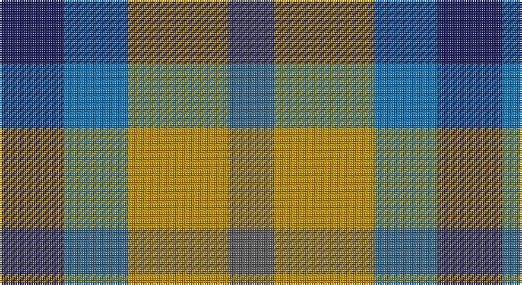

This page is one **sett** — a single exact thread-count. It belongs to the [tartan](/setts/db18b18lo28n13/)
(the same proportion at any scale), whose colour order is pattern [BBYB](/stripes/bbyb/).

Sourced from tartans-authority.  It is a [4 stripe tartan](/stripes/stripes4/).

Original link http://www.tartansauthority.com/tartan-ferret/display/10489/

## Register references

External register numbers recorded for this tartan.

- Scottish Register of Tartans: [10489](https://www.tartanregister.gov.uk/tartanDetails?ref=10489)
- Scottish Tartans Authority (ITI): 10489

## Thread count
DB/36 B36 DY56 N/26

One full sett is **246 threads**.

## Palette

Palette: <strong>Tartan Register</strong> <small style="color:#888">(3 of 4 colours)</small>
<table><thead><tr><th>Colour</th><th>Threads</th><th>Shade</th><th>Base</th><th>OKLCh</th></tr></thead><tbody><tr><td>DB/</td><td style="text-align:right;font-variant-numeric:tabular-nums">36</td><td><code style="background-color:#202060;">#202060</code> <small style="color:#888">#202060</small></td><td>B <code style="background-color:#2A418A;">#2A418A</code></td><td><small style="color:#888">oklch(28.9% 0.111 276.9)</small></td></tr><tr><td>B</td><td style="text-align:right;font-variant-numeric:tabular-nums">36</td><td><code style="background-color:#1474B4;">#1474B4</code> <small style="color:#888">#1474B4</small></td><td>B <code style="background-color:#2A418A;">#2A418A</code></td><td><small style="color:#888">oklch(54.0% 0.129 245.1)</small></td></tr><tr><td>DY</td><td style="text-align:right;font-variant-numeric:tabular-nums">56</td><td><code style="background-color:#BC8C00;">#BC8C00</code> <small style="color:#888">#BC8C00</small></td><td>Y <code style="background-color:#F2BF00;">#F2BF00</code></td><td><small style="color:#888">oklch(66.8% 0.137 84.1)</small></td></tr><tr><td>N/</td><td style="text-align:right;font-variant-numeric:tabular-nums">26</td><td><code style="background-color:#5C5C5C;">#5C5C5C</code> <small style="color:#888">#5C5C5C</small></td><td>B <code style="background-color:#2A418A;">#2A418A</code></td><td><small style="color:#888">oklch(47.5% 0.000 89.9)</small></td></tr></tbody></table>

# Sample pattern

## Nearest tartans

The nearest existing variants by ΔTartan distance, with this tartan at the top so the swatches line up against it.

ΔTartan

Tartan

Sett

—

<a href="/ttd/edit/#slug=db18b18lo28n13~x2">Gold Country (District)</a> <a class="nn-out" href="/variants/s4/db18b18lo28n13~x2/" title="open its dictionary page">↗</a>

0.92

<a href="/ttd/edit/#slug=n2r1k1lr1~x10&amp;base=db18b18lo28n13~x2">Kucher, Gregory (Personal)</a> <a class="nn-out" href="/variants/s4/n2r1k1lr1~x10/" title="open its dictionary page">↗</a>

1.05

<a href="/ttd/edit/#slug=db18t18lo28dt13~x2&amp;base=db18b18lo28n13~x2">Gold Country (California)</a> <a class="nn-out" href="/variants/s4/db18t18lo28dt13~x2/" title="open its dictionary page">↗</a>

1.61

<a href="/ttd/edit/#slug=do12k8t15w8~x2&amp;base=db18b18lo28n13~x2">Equity Vision Ltd</a> <a class="nn-out" href="/variants/s4/do12k8t15w8~x2/" title="open its dictionary page">↗</a>

1.68

<a href="/ttd/edit/#slug=t3o6k4t2~x2&amp;base=db18b18lo28n13~x2">Bedford Check</a> <a class="nn-out" href="/variants/s4/t3o6k4t2~x2/" title="open its dictionary page">↗</a>

1.73

<a href="/ttd/edit/#slug=r5g6ly2g6r5b6r2~x2&amp;base=db18b18lo28n13~x2">Gleneagles Group</a> <a class="nn-out" href="/variants/s7/r5g6ly2g6r5b6r2~x2/" title="open its dictionary page">↗</a>

1.73

<a href="/ttd/edit/#slug=dp3k3dp3dg6ly2~x2&amp;base=db18b18lo28n13~x2">Austin (Wilson's No 173)</a> <a class="nn-out" href="/variants/s5/dp3k3dp3dg6ly2~x2/" title="open its dictionary page">↗</a>

1.78

<a href="/ttd/edit/#slug=t1g3r1p3t1~x4&amp;base=db18b18lo28n13~x2">Wilson's, No 95</a> <a class="nn-out" href="/variants/s5/t1g3r1p3t1~x4/" title="open its dictionary page">↗</a>

1.79

<a href="/ttd/edit/#slug=p5g4t2~x2&amp;base=db18b18lo28n13~x2">Wilson's, No 209</a> <a class="nn-out" href="/variants/s3/p5g4t2~x2/" title="open its dictionary page">↗</a>

1.80

<a href="/ttd/edit/#slug=dr5g6y2g6dr5db6dr2~x2&amp;base=db18b18lo28n13~x2">Gleneagles Group</a> <a class="nn-out" href="/variants/s7/dr5g6y2g6dr5db6dr2~x2/" title="open its dictionary page">↗</a>

1.83

<a href="/ttd/edit/#slug=lr12lo8r5k6lr7g5~x4&amp;base=db18b18lo28n13~x2">Mitchell, Martin (Personal)</a> <a class="nn-out" href="/variants/s6/lr12lo8r5k6lr7g5~x4/" title="open its dictionary page">↗</a>

## Neighbour map

Every grey dot is one of 14360 variants placed by the first two principal components of the ΔTartan feature space (44% of its variance). Red is this tartan; blue dots are its nearest — click one to open its page.

<svg viewBox="0 0 640 380" role="img" style="max-width:100%;height:auto;border:1px solid #e0e0e0;border-radius:4px;display:block" xmlns="http://www.w3.org/2000/svg"><image href="/nn/cloud.v1.png" width="640" height="380"/><a href="/variants/s4/n2r1k1lr1~x10/"><circle cx="104.6" cy="340.7" r="4" fill="#3465a4"><title>Kucher, Gregory (Personal)</title></circle></a><a href="/variants/s4/db18t18lo28dt13~x2/"><circle cx="54.5" cy="331.7" r="4" fill="#3465a4"><title>Gold Country (California)</title></circle></a><a href="/variants/s4/do12k8t15w8~x2/"><circle cx="24.3" cy="334.7" r="4" fill="#3465a4"><title>Equity Vision Ltd</title></circle></a><a href="/variants/s4/t3o6k4t2~x2/"><circle cx="149.3" cy="335.6" r="4" fill="#3465a4"><title>Bedford Check</title></circle></a><a href="/variants/s7/r5g6ly2g6r5b6r2~x2/"><circle cx="138.2" cy="311.5" r="4" fill="#3465a4"><title>Gleneagles Group</title></circle></a><a href="/variants/s5/dp3k3dp3dg6ly2~x2/"><circle cx="93.5" cy="305.8" r="4" fill="#3465a4"><title>Austin (Wilson's No 173)</title></circle></a><a href="/variants/s5/t1g3r1p3t1~x4/"><circle cx="123.8" cy="289.4" r="4" fill="#3465a4"><title>Wilson's, No 95</title></circle></a><a href="/variants/s3/p5g4t2~x2/"><circle cx="185.4" cy="363.1" r="4" fill="#3465a4"><title>Wilson's, No 209</title></circle></a><a href="/variants/s7/dr5g6y2g6dr5db6dr2~x2/"><circle cx="131.6" cy="313.6" r="4" fill="#3465a4"><title>Gleneagles Group</title></circle></a><a href="/variants/s6/lr12lo8r5k6lr7g5~x4/"><circle cx="79.6" cy="288.9" r="4" fill="#3465a4"><title>Mitchell, Martin (Personal)</title></circle></a><circle cx="78.4" cy="348.8" r="5" fill="#c00000"/></svg>

ID: /variants/s4/db18b18lo28n13~x2/
