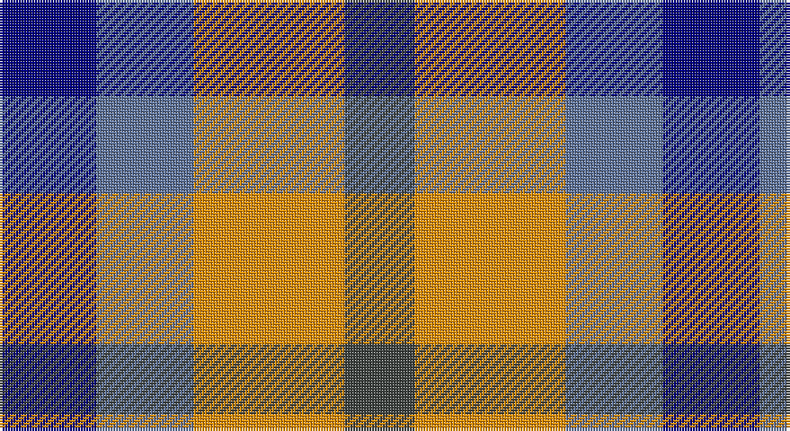

This page is one **sett** — a single exact thread-count. It belongs to the [tartan](/setts/db18t18lo28dt13/)
(the same proportion at any scale), whose colour order is pattern [BBYB](/stripes/bbyb/).

Sourced from register-of-tartans.  It is a [4 stripe tartan](/stripes/stripes4/).

Original link https://www.tartanregister.gov.uk/tartanDetails.aspx?ref=10489

## Register references

External register numbers recorded for this tartan.

- Scottish Register of Tartans: [10489](https://www.tartanregister.gov.uk/tartanDetails.aspx?ref=10489)

## Thread count
DB/36 B36 O56 N/26

One full sett is **246 threads**.

## Palette

Palette: <strong>Tartan Register</strong> <small style="color:#888">(1 of 4 colours)</small>
<table><thead><tr><th>Colour</th><th>Threads</th><th>Shade</th><th>Base</th><th>OKLCh</th></tr></thead><tbody><tr><td>DB/</td><td style="text-align:right;font-variant-numeric:tabular-nums">36</td><td><code style="background-color:#000080;">#000080</code> <small style="color:#888">#000080</small></td><td>B <code style="background-color:#2A418A;">#2A418A</code></td><td><small style="color:#888">oklch(27.1% 0.188 264.1)</small></td></tr><tr><td>B</td><td style="text-align:right;font-variant-numeric:tabular-nums">36</td><td><code style="background-color:#5F749C;">#5F749C</code> <small style="color:#888">#5F749C</small></td><td>B <code style="background-color:#2A418A;">#2A418A</code></td><td><small style="color:#888">oklch(55.8% 0.067 262.9)</small></td></tr><tr><td>O</td><td style="text-align:right;font-variant-numeric:tabular-nums">56</td><td><code style="background-color:#EF8F06;">#EF8F06</code> <small style="color:#888">#EF8F06</small></td><td>Y <code style="background-color:#F2BF00;">#F2BF00</code></td><td><small style="color:#888">oklch(73.5% 0.165 64.2)</small></td></tr><tr><td>N/</td><td style="text-align:right;font-variant-numeric:tabular-nums">26</td><td><code style="background-color:#3F4441;">#3F4441</code> <small style="color:#888">#3F4441</small></td><td>B <code style="background-color:#2A418A;">#2A418A</code></td><td><small style="color:#888">oklch(38.1% 0.008 159.7)</small></td></tr></tbody></table>

# Sample pattern

## Nearest tartans

The nearest existing variants by ΔTartan distance, with this tartan at the top so the swatches line up against it.

ΔTartan

Tartan

Sett

—

<a href="/ttd/edit/#slug=db18t18lo28dt13~x2">Gold Country (California)</a> <a class="nn-out" href="/variants/s4/db18t18lo28dt13~x2/" title="open its dictionary page">↗</a>

0.89

<a href="/ttd/edit/#slug=do12k8t15w8~x2&amp;base=db18t18lo28dt13~x2">Equity Vision Ltd</a> <a class="nn-out" href="/variants/s4/do12k8t15w8~x2/" title="open its dictionary page">↗</a>

1.05

<a href="/ttd/edit/#slug=db18b18lo28n13~x2&amp;base=db18t18lo28dt13~x2">Gold Country (District)</a> <a class="nn-out" href="/variants/s4/db18b18lo28n13~x2/" title="open its dictionary page">↗</a>

1.16

<a href="/ttd/edit/#slug=n2r1k1lr1~x10&amp;base=db18t18lo28dt13~x2">Kucher, Gregory (Personal)</a> <a class="nn-out" href="/variants/s4/n2r1k1lr1~x10/" title="open its dictionary page">↗</a>

1.41

<a href="/ttd/edit/#slug=r10t5lb5dt4~x8&amp;base=db18t18lo28dt13~x2">Haggis Hostels</a> <a class="nn-out" href="/variants/s4/r10t5lb5dt4~x8/" title="open its dictionary page">↗</a>

1.53

<a href="/ttd/edit/#slug=r1g3p3w1~x4&amp;base=db18t18lo28dt13~x2">Wilson's, No 113</a> <a class="nn-out" href="/variants/s4/r1g3p3w1~x4/" title="open its dictionary page">↗</a>

1.58

<a href="/ttd/edit/#slug=p3k3p3g6ly2~x2&amp;base=db18t18lo28dt13~x2">Austin / Wilson's No 173</a> <a class="nn-out" href="/variants/s5/p3k3p3g6ly2~x2/" title="open its dictionary page">↗</a>

1.58

<a href="/ttd/edit/#slug=dp3k3dp3dg6ly2~x2&amp;base=db18t18lo28dt13~x2">Austin (Wilson's No 173)</a> <a class="nn-out" href="/variants/s5/dp3k3dp3dg6ly2~x2/" title="open its dictionary page">↗</a>

1.63

<a href="/ttd/edit/#slug=p3k3p3g6r2~x2&amp;base=db18t18lo28dt13~x2">Austin / Wilson's No 137</a> <a class="nn-out" href="/variants/s5/p3k3p3g6r2~x2/" title="open its dictionary page">↗</a>

1.72

<a href="/ttd/edit/#slug=lr12lo8r5k6lr7g5~x4&amp;base=db18t18lo28dt13~x2">Mitchell, Martin (Personal)</a> <a class="nn-out" href="/variants/s6/lr12lo8r5k6lr7g5~x4/" title="open its dictionary page">↗</a>

1.77

<a href="/ttd/edit/#slug=lo5db5k3~x4&amp;base=db18t18lo28dt13~x2">Kazakhstan Relic (Artefact)</a> <a class="nn-out" href="/variants/s3/lo5db5k3~x4/" title="open its dictionary page">↗</a>

## Neighbour map

Every grey dot is one of 14360 variants placed by the first two principal components of the ΔTartan feature space (44% of its variance). Red is this tartan; blue dots are its nearest — click one to open its page.

<svg viewBox="0 0 640 380" role="img" style="max-width:100%;height:auto;border:1px solid #e0e0e0;border-radius:4px;display:block" xmlns="http://www.w3.org/2000/svg"><image href="/nn/cloud.v1.png" width="640" height="380"/><a href="/variants/s4/do12k8t15w8~x2/"><circle cx="24.3" cy="334.7" r="4" fill="#3465a4"><title>Equity Vision Ltd</title></circle></a><a href="/variants/s4/db18b18lo28n13~x2/"><circle cx="78.4" cy="348.8" r="4" fill="#3465a4"><title>Gold Country (District)</title></circle></a><a href="/variants/s4/n2r1k1lr1~x10/"><circle cx="104.6" cy="340.7" r="4" fill="#3465a4"><title>Kucher, Gregory (Personal)</title></circle></a><a href="/variants/s4/r10t5lb5dt4~x8/"><circle cx="112.6" cy="306.3" r="4" fill="#3465a4"><title>Haggis Hostels</title></circle></a><a href="/variants/s4/r1g3p3w1~x4/"><circle cx="119.1" cy="286.4" r="4" fill="#3465a4"><title>Wilson's, No 113</title></circle></a><a href="/variants/s5/p3k3p3g6ly2~x2/"><circle cx="71.1" cy="290.4" r="4" fill="#3465a4"><title>Austin / Wilson's No 173</title></circle></a><a href="/variants/s5/dp3k3dp3dg6ly2~x2/"><circle cx="93.5" cy="305.8" r="4" fill="#3465a4"><title>Austin (Wilson's No 173)</title></circle></a><a href="/variants/s5/p3k3p3g6r2~x2/"><circle cx="85.0" cy="295.3" r="4" fill="#3465a4"><title>Austin / Wilson's No 137</title></circle></a><a href="/variants/s6/lr12lo8r5k6lr7g5~x4/"><circle cx="79.6" cy="288.9" r="4" fill="#3465a4"><title>Mitchell, Martin (Personal)</title></circle></a><a href="/variants/s3/lo5db5k3~x4/"><circle cx="94.1" cy="366.0" r="4" fill="#3465a4"><title>Kazakhstan Relic (Artefact)</title></circle></a><circle cx="54.5" cy="331.7" r="5" fill="#c00000"/></svg>

ID: /variants/s4/db18t18lo28dt13~x2/
