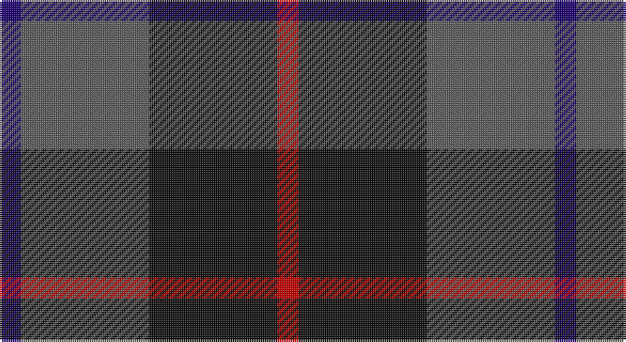

This page is one **sett** — a single exact thread-count. It belongs to the [tartan](/setts/db1n6k6r1/)
(the same proportion at any scale), whose colour order is pattern [BBKR](/stripes/bbkr/).

Part of the [Mayer, Chris](/tartans/mayer-chris/) tartan — the named design grouping this sett with its other cloths.

Sourced from tartans-authority.  It is a [4 stripe tartan](/stripes/stripes4/).

Original link http://www.tartansauthority.com/tartan-ferret/display/10244/

## Register references

External register numbers recorded for this tartan.

- Scottish Register of Tartans: [10244](https://www.tartanregister.gov.uk/tartanDetails?ref=10244)
- Scottish Tartans Authority (ITI): 10244

## Thread count
DB/10 N60 K60 R/10

One full sett is **260 threads**.

## Palette

Palette: <strong>Tartan Register</strong> <small style="color:#888">(3 of 4 colours)</small>
<table><thead><tr><th>Colour</th><th>Threads</th><th>Shade</th><th>Base</th><th>OKLCh</th></tr></thead><tbody><tr><td>DB/</td><td style="text-align:right;font-variant-numeric:tabular-nums">10</td><td><code style="background-color:#1C0070;">#1C0070</code> <small style="color:#888">#1C0070</small></td><td>B <code style="background-color:#2A418A;">#2A418A</code></td><td><small style="color:#888">oklch(26.3% 0.162 277.1)</small></td></tr><tr><td>N</td><td style="text-align:right;font-variant-numeric:tabular-nums">60</td><td><code style="background-color:#5C5C5C;">#5C5C5C</code> <small style="color:#888">#5C5C5C</small></td><td>B <code style="background-color:#2A418A;">#2A418A</code></td><td><small style="color:#888">oklch(47.5% 0.000 89.9)</small></td></tr><tr><td>K</td><td style="text-align:right;font-variant-numeric:tabular-nums">60</td><td><code style="background-color:#101010;">#101010</code> <small style="color:#888">#101010</small></td><td>K <code style="background-color:#000000;">#000000</code></td><td><small style="color:#888">oklch(17.3% 0.000 89.9)</small></td></tr><tr><td>R/</td><td style="text-align:right;font-variant-numeric:tabular-nums">10</td><td><code style="background-color:#C80000;">#C80000</code> <small style="color:#888">#C80000</small></td><td>R <code style="background-color:#CC0000;">#CC0000</code></td><td><small style="color:#888">oklch(52.3% 0.215 29.2)</small></td></tr></tbody></table>

# Sample pattern

## Compared to the master

This cloth is one sett of its design; the master sett (the exemplar the design is anchored on) is below for comparison.

<figure style="margin:0"><figcaption style="color:#888;font-size:smaller">this sett</figcaption></figure>
<figure style="margin:0"><figcaption style="color:#888;font-size:smaller"><a href="/setts/r1k6y6b1/">master sett →</a></figcaption></figure>

## Nearest tartans

The nearest existing variants by ΔTartan distance, with this tartan at the top so the swatches line up against it.

ΔTartan

Tartan

Sett

—

<a href="/ttd/edit/#slug=db1n6k6r1~x10">Mayer, Chris (Personal)</a> <a class="nn-out" href="/variants/s4/db1n6k6r1~x10/" title="open its dictionary page">↗</a>

1.06

<a href="/ttd/edit/#slug=r1k8g2db4r1~x8&amp;base=db1n6k6r1~x10">Nairn</a> <a class="nn-out" href="/variants/s5/r1k8g2db4r1~x8/" title="open its dictionary page">↗</a>

1.18

<a href="/ttd/edit/#slug=g7db1g1k4dp4k1~x4&amp;base=db1n6k6r1~x10">MacArthur of Milton (Clan)</a> <a class="nn-out" href="/variants/s6/g7db1g1k4dp4k1~x4/" title="open its dictionary page">↗</a>

1.20

<a href="/ttd/edit/#slug=dg15r3dp11lb2&amp;base=db1n6k6r1~x10">MacNab WI2</a> <a class="nn-out" href="/variants/s4/dg15r3dp11lb2/" title="open its dictionary page">↗</a>

1.21

<a href="/ttd/edit/#slug=g14db2g2k8dp9k2~x2&amp;base=db1n6k6r1~x10">MacArthur of Milton Hunting Clan Tartan</a> <a class="nn-out" href="/variants/s6/g14db2g2k8dp9k2~x2/" title="open its dictionary page">↗</a>

1.21

<a href="/ttd/edit/#slug=dg15r3db11t2~x2&amp;base=db1n6k6r1~x10">MacNab</a> <a class="nn-out" href="/variants/s4/dg15r3db11t2~x2/" title="open its dictionary page">↗</a>

1.25

<a href="/variants/s4/db13r2g13~x2/">Wilson's No.062</a>

1.32

<a href="/ttd/edit/#slug=k14r4k25db30w4~x2&amp;base=db1n6k6r1~x10">Britannia</a> <a class="nn-out" href="/variants/s5/k14r4k25db30w4~x2/" title="open its dictionary page">↗</a>

1.33

<a href="/ttd/edit/#slug=k3db14r2k14g14k3~x2&amp;base=db1n6k6r1~x10">Gallamore</a> <a class="nn-out" href="/variants/s6/k3db14r2k14g14k3~x2/" title="open its dictionary page">↗</a>

1.43

<a href="/ttd/edit/#slug=k2g10t2k9dp8g2~x2&amp;base=db1n6k6r1~x10">Lennie Family Tartan</a> <a class="nn-out" href="/variants/s6/k2g10t2k9dp8g2~x2/" title="open its dictionary page">↗</a>

1.44

<a href="/ttd/edit/#slug=k3dg17ly2k18dp17dg3~x2&amp;base=db1n6k6r1~x10">Wilson's No.100</a> <a class="nn-out" href="/variants/s6/k3dg17ly2k18dp17dg3~x2/" title="open its dictionary page">↗</a>

## Neighbour map

Every grey dot is one of 14360 variants placed by the first two principal components of the ΔTartan feature space (44% of its variance). Red is this tartan; blue dots are its nearest — click one to open its page.

<svg viewBox="0 0 640 380" role="img" style="max-width:100%;height:auto;border:1px solid #e0e0e0;border-radius:4px;display:block" xmlns="http://www.w3.org/2000/svg"><image href="/nn/cloud.v1.png" width="640" height="380"/><a href="/variants/s5/r1k8g2db4r1~x8/"><circle cx="274.2" cy="245.1" r="4" fill="#3465a4"><title>Nairn</title></circle></a><a href="/variants/s6/g7db1g1k4dp4k1~x4/"><circle cx="233.2" cy="249.7" r="4" fill="#3465a4"><title>MacArthur of Milton (Clan)</title></circle></a><a href="/variants/s4/dg15r3dp11lb2/"><circle cx="252.9" cy="255.8" r="4" fill="#3465a4"><title>MacNab WI2</title></circle></a><a href="/variants/s6/g14db2g2k8dp9k2~x2/"><circle cx="221.2" cy="246.3" r="4" fill="#3465a4"><title>MacArthur of Milton Hunting Clan Tartan</title></circle></a><a href="/variants/s4/dg15r3db11t2~x2/"><circle cx="282.6" cy="278.9" r="4" fill="#3465a4"><title>MacNab</title></circle></a><a href="/variants/s4/db13r2g13~x2/"><circle cx="272.9" cy="285.6" r="4" fill="#3465a4"><title>Wilson's No.062</title></circle></a><a href="/variants/s5/k14r4k25db30w4~x2/"><circle cx="285.4" cy="263.8" r="4" fill="#3465a4"><title>Britannia</title></circle></a><a href="/variants/s6/k3db14r2k14g14k3~x2/"><circle cx="214.3" cy="261.9" r="4" fill="#3465a4"><title>Gallamore</title></circle></a><a href="/variants/s6/k2g10t2k9dp8g2~x2/"><circle cx="165.6" cy="263.1" r="4" fill="#3465a4"><title>Lennie Family Tartan</title></circle></a><a href="/variants/s6/k3dg17ly2k18dp17dg3~x2/"><circle cx="204.3" cy="240.5" r="4" fill="#3465a4"><title>Wilson's No.100</title></circle></a><circle cx="253.6" cy="275.9" r="5" fill="#c00000"/></svg>

ID: /variants/s4/db1n6k6r1~x10/
