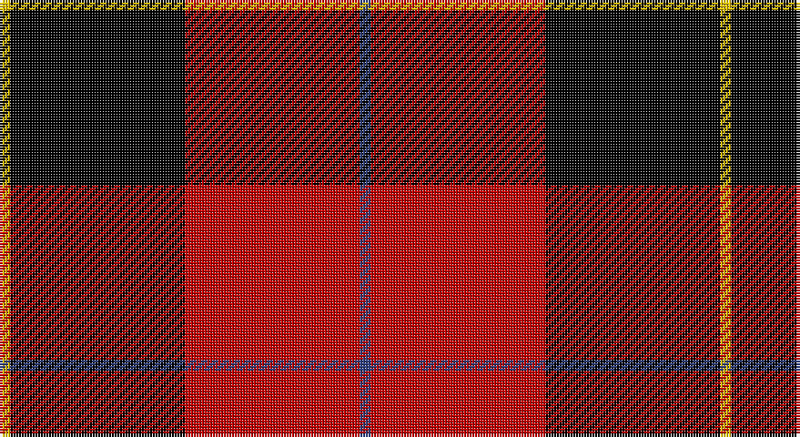

This page is one **sett** — a single exact thread-count. It belongs to the [tartan](/setts/db1r16k16ly1/)
(the same proportion at any scale), whose colour order is pattern [BRKY](/stripes/brky/).

Part of the [Skinner](/tartans/skinner/) tartan — the named design grouping this sett with its other cloths.

Sourced from weddslist.  It is a [4 stripe tartan](/stripes/stripes4/).

Original link http://www.weddslist.com/cgi-bin/tartans/pg.pl?source=sts

## Thread count
Y/4 K64 R64 B/4

One full sett is **264 threads**.

## Palette

Palette: <strong>Ingles Buchan</strong> <small style="color:#888">(1 of 4 colours)</small>
<table><thead><tr><th>Colour</th><th>Threads</th><th>Shade</th><th>Base</th><th>OKLCh</th></tr></thead><tbody><tr><td>Y/</td><td style="text-align:right;font-variant-numeric:tabular-nums">4</td><td><code style="background-color:#F0C000;">#F0C000</code> <small style="color:#888">#F0C000</small></td><td>Y <code style="background-color:#F2BF00;">#F2BF00</code></td><td><small style="color:#888">oklch(82.7% 0.169 90.5)</small></td></tr><tr><td>K</td><td style="text-align:right;font-variant-numeric:tabular-nums">64</td><td><code style="background-color:#000000;">#000000</code> <small style="color:#888">#000000</small></td><td>K <code style="background-color:#000000;">#000000</code></td><td><small style="color:#888">oklch(0.0% 0.000 0.0)</small></td></tr><tr><td>R</td><td style="text-align:right;font-variant-numeric:tabular-nums">64</td><td><code style="background-color:#C00000;">#C00000</code> <small style="color:#888">#C00000</small></td><td>R <code style="background-color:#CC0000;">#CC0000</code></td><td><small style="color:#888">oklch(50.7% 0.208 29.2)</small></td></tr><tr><td>B/</td><td style="text-align:right;font-variant-numeric:tabular-nums">4</td><td><code style="background-color:#304080;">#304080</code> <small style="color:#888">#304080</small></td><td>B <code style="background-color:#2A418A;">#2A418A</code></td><td><small style="color:#888">oklch(39.4% 0.109 270.2)</small></td></tr></tbody></table>

# Sample pattern

## Compared to the master

This cloth is one sett of its design; the master sett (the exemplar the design is anchored on) is below for comparison.

<figure style="margin:0"><figcaption style="color:#888;font-size:smaller">this sett</figcaption></figure>
<figure style="margin:0"><figcaption style="color:#888;font-size:smaller"><a href="/setts/r8k8lo1k8r8db1/">master sett →</a></figcaption></figure>

## Nearest tartans

The nearest existing variants by ΔTartan distance, with this tartan at the top so the swatches line up against it.

ΔTartan

Tartan

Sett

—

<a href="/ttd/edit/#slug=db1r16k16ly1~x4">Skinner</a> <a class="nn-out" href="/variants/s4/db1r16k16ly1~x4/" title="open its dictionary page">↗</a>

1.00

<a href="/ttd/edit/#slug=db3k32r27w2~x2&amp;base=db1r16k16ly1~x4">Templar Grand Priory USA</a> <a class="nn-out" href="/variants/s4/db3k32r27w2~x2/" title="open its dictionary page">↗</a>

1.23

<a href="/ttd/edit/#slug=k2r16k8ly1k8r2~x2&amp;base=db1r16k16ly1~x4">Brodie</a> <a class="nn-out" href="/variants/s6/k2r16k8ly1k8r2~x2/" title="open its dictionary page">↗</a>

1.24

<a href="/ttd/edit/#slug=k2r16k8ly1k8r2&amp;base=db1r16k16ly1~x4">Brodie Dress</a> <a class="nn-out" href="/variants/s6/k2r16k8ly1k8r2/" title="open its dictionary page">↗</a>

1.26

<a href="/ttd/edit/#slug=g1r8k13ly1~x6&amp;base=db1r16k16ly1~x4">Billy Apple</a> <a class="nn-out" href="/variants/s4/g1r8k13ly1~x6/" title="open its dictionary page">↗</a>

1.28

<a href="/ttd/edit/#slug=w1r8k8ly1~x2&amp;base=db1r16k16ly1~x4">Connel</a> <a class="nn-out" href="/variants/s4/w1r8k8ly1~x2/" title="open its dictionary page">↗</a>

1.31

<a href="/ttd/edit/#slug=k18r4k18r32lb3&amp;base=db1r16k16ly1~x4">Munro VS</a> <a class="nn-out" href="/variants/s5/k18r4k18r32lb3/" title="open its dictionary page">↗</a>

1.33

<a href="/ttd/edit/#slug=k18r4k18r32lr3~x2&amp;base=db1r16k16ly1~x4">Munro VS</a> <a class="nn-out" href="/variants/s5/k18r4k18r32lr3~x2/" title="open its dictionary page">↗</a>

1.33

<a href="/ttd/edit/#slug=k18r4k18r32lr3&amp;base=db1r16k16ly1~x4">Munro VS</a> <a class="nn-out" href="/variants/s5/k18r4k18r32lr3/" title="open its dictionary page">↗</a>

1.33

<a href="/ttd/edit/#slug=k70lo16lt3r45&amp;base=db1r16k16ly1~x4">Klymson (Chicago) (Personal)</a> <a class="nn-out" href="/variants/s4/k70lo16lt3r45/" title="open its dictionary page">↗</a>

1.42

<a href="/ttd/edit/#slug=k1r8k8ly1&amp;base=db1r16k16ly1~x4">Wallace</a> <a class="nn-out" href="/variants/s4/k1r8k8ly1/" title="open its dictionary page">↗</a>

## Neighbour map

Every grey dot is one of 14360 variants placed by the first two principal components of the ΔTartan feature space (44% of its variance). Red is this tartan; blue dots are its nearest — click one to open its page.

<svg viewBox="0 0 640 380" role="img" style="max-width:100%;height:auto;border:1px solid #e0e0e0;border-radius:4px;display:block" xmlns="http://www.w3.org/2000/svg"><image href="/nn/cloud.v1.png" width="640" height="380"/><a href="/variants/s4/db3k32r27w2~x2/"><circle cx="314.7" cy="200.5" r="4" fill="#3465a4"><title>Templar Grand Priory USA</title></circle></a><a href="/variants/s6/k2r16k8ly1k8r2~x2/"><circle cx="321.3" cy="195.1" r="4" fill="#3465a4"><title>Brodie</title></circle></a><a href="/variants/s6/k2r16k8ly1k8r2/"><circle cx="319.6" cy="193.3" r="4" fill="#3465a4"><title>Brodie Dress</title></circle></a><a href="/variants/s4/g1r8k13ly1~x6/"><circle cx="331.5" cy="207.9" r="4" fill="#3465a4"><title>Billy Apple</title></circle></a><a href="/variants/s4/w1r8k8ly1~x2/"><circle cx="230.5" cy="219.3" r="4" fill="#3465a4"><title>Connel</title></circle></a><a href="/variants/s5/k18r4k18r32lb3/"><circle cx="288.4" cy="226.4" r="4" fill="#3465a4"><title>Munro VS</title></circle></a><a href="/variants/s5/k18r4k18r32lr3~x2/"><circle cx="296.2" cy="233.6" r="4" fill="#3465a4"><title>Munro VS</title></circle></a><a href="/variants/s5/k18r4k18r32lr3/"><circle cx="296.2" cy="233.6" r="4" fill="#3465a4"><title>Munro VS</title></circle></a><a href="/variants/s4/k70lo16lt3r45/"><circle cx="284.6" cy="180.5" r="4" fill="#3465a4"><title>Klymson (Chicago) (Personal)</title></circle></a><a href="/variants/s4/k1r8k8ly1/"><circle cx="288.5" cy="240.5" r="4" fill="#3465a4"><title>Wallace</title></circle></a><circle cx="298.4" cy="193.3" r="5" fill="#c00000"/></svg>

ID: /variants/s4/db1r16k16ly1~x4/
