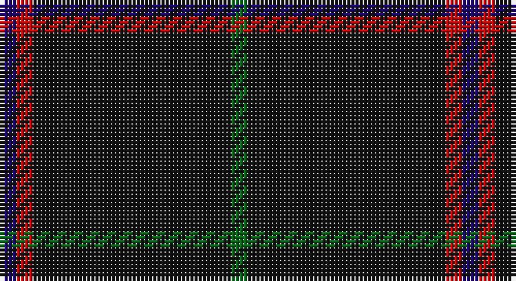

This page is one **sett** — a single exact thread-count. It belongs to the [tartan](/setts/db1r1k12g1/)
(the same proportion at any scale), whose colour order is pattern [BRKG](/stripes/brkg/).

Sourced from tartans-authority.  It is a [4 stripe tartan](/stripes/stripes4/).

Original link http://www.tartansauthority.com/tartan-ferret/display/3497/

2 attestations — the source records this cloth was collapsed from (oldest owns this page)

<ul>
<li>pre 2002 — MacNathair Sgianach (tartans-authority, <a href="http://www.tartansauthority.com/tartan-ferret/display/3497/">record</a>)</li>
<li>undated — MacNathair Sgianach (Personal) (register-of-tartans, <a href="https://www.tartanregister.gov.uk/tartanDetails.aspx?ref=5204">record</a>)</li>
</ul>

## Register references

External register numbers recorded for this tartan.

- Scottish Register of Tartans: [5204](https://www.tartanregister.gov.uk/tartanDetails.aspx?ref=5204)
- Scottish Tartans Authority (ITI): 3497

## Thread count
DB/4 R4 K48 G/4

One full sett is **112 threads**.

## Palette

Palette: <strong>Tartan Register</strong>
<table><thead><tr><th>Colour</th><th>Threads</th><th>Shade</th><th>Base</th><th>OKLCh</th></tr></thead><tbody><tr><td>DB/</td><td style="text-align:right;font-variant-numeric:tabular-nums">4</td><td><code style="background-color:#1C0070;">#1C0070</code> <small style="color:#888">#1C0070</small></td><td>B <code style="background-color:#2A418A;">#2A418A</code></td><td><small style="color:#888">oklch(26.3% 0.162 277.1)</small></td></tr><tr><td>R</td><td style="text-align:right;font-variant-numeric:tabular-nums">4</td><td><code style="background-color:#C80000;">#C80000</code> <small style="color:#888">#C80000</small></td><td>R <code style="background-color:#CC0000;">#CC0000</code></td><td><small style="color:#888">oklch(52.3% 0.215 29.2)</small></td></tr><tr><td>K</td><td style="text-align:right;font-variant-numeric:tabular-nums">48</td><td><code style="background-color:#101010;">#101010</code> <small style="color:#888">#101010</small></td><td>K <code style="background-color:#000000;">#000000</code></td><td><small style="color:#888">oklch(17.3% 0.000 89.9)</small></td></tr><tr><td>G/</td><td style="text-align:right;font-variant-numeric:tabular-nums">4</td><td><code style="background-color:#006818;">#006818</code> <small style="color:#888">#006818</small></td><td>G <code style="background-color:#006100;">#006100</code></td><td><small style="color:#888">oklch(45.0% 0.142 145.0)</small></td></tr></tbody></table>

# Sample pattern

## Nearest tartans

The nearest existing variants by ΔTartan distance, with this tartan at the top so the swatches line up against it.

ΔTartan

Tartan

Sett

—

<a href="/ttd/edit/#slug=db1r1k12g1~x4">MacNathair Sgianach</a> <a class="nn-out" href="/variants/s4/db1r1k12g1~x4/" title="open its dictionary page">↗</a>

1.11

<a href="/ttd/edit/#slug=dt32r3dt4k2lo3~x2&amp;base=db1r1k12g1~x4">MacLaine of Lochbuie Hunting</a> <a class="nn-out" href="/variants/s5/dt32r3dt4k2lo3~x2/" title="open its dictionary page">↗</a>

1.69

<a href="/ttd/edit/#slug=k40dg15k10r2k10lo2k10~x2&amp;base=db1r1k12g1~x4">Langhein, Alex (Personal)</a> <a class="nn-out" href="/variants/s7/k40dg15k10r2k10lo2k10~x2/" title="open its dictionary page">↗</a>

1.78

<a href="/ttd/edit/#slug=dt74m9dt4r5dt4m9dt37db9~x2&amp;base=db1r1k12g1~x4">Rikaco Vintage</a> <a class="nn-out" href="/variants/s8/dt74m9dt4r5dt4m9dt37db9~x2/" title="open its dictionary page">↗</a>

1.80

<a href="/ttd/edit/#slug=k24dg3r3k24r2k2r2&amp;base=db1r1k12g1~x4">Unidentified #45</a> <a class="nn-out" href="/variants/s7/k24dg3r3k24r2k2r2/" title="open its dictionary page">↗</a>

1.81

<a href="/ttd/edit/#slug=k10n2k2n8k40r4k5ri2~x2&amp;base=db1r1k12g1~x4">Laird Abdullah (Personal)</a> <a class="nn-out" href="/variants/s8/k10n2k2n8k40r4k5ri2~x2/" title="open its dictionary page">↗</a>

1.93

<a href="/ttd/edit/#slug=k40dg15k10r2k10lo2k10lo2~x2&amp;base=db1r1k12g1~x4">Langhein, Alex (Personal)</a> <a class="nn-out" href="/variants/s8/k40dg15k10r2k10lo2k10lo2~x2/" title="open its dictionary page">↗</a>

1.94

<a href="/ttd/edit/#slug=k72w3k11db9&amp;base=db1r1k12g1~x4">Dunnotar (School)</a> <a class="nn-out" href="/variants/s4/k72w3k11db9/" title="open its dictionary page">↗</a>

1.98

<a href="/ttd/edit/#slug=k40dg15k10r2k10ly2k10~x2&amp;base=db1r1k12g1~x4">Langhein Family Tartan</a> <a class="nn-out" href="/variants/s7/k40dg15k10r2k10ly2k10~x2/" title="open its dictionary page">↗</a>

2.01

<a href="/ttd/edit/#slug=dt68t7dt16k16lo4~x2&amp;base=db1r1k12g1~x4">Burnetts &amp; Struth</a> <a class="nn-out" href="/variants/s5/dt68t7dt16k16lo4~x2/" title="open its dictionary page">↗</a>

2.02

<a href="/ttd/edit/#slug=k15n7k6n11k50n4~x2&amp;base=db1r1k12g1~x4">Freedom of Scotland</a> <a class="nn-out" href="/variants/s6/k15n7k6n11k50n4~x2/" title="open its dictionary page">↗</a>

## Neighbour map

Every grey dot is one of 14360 variants placed by the first two principal components of the ΔTartan feature space (44% of its variance). Red is this tartan; blue dots are its nearest — click one to open its page.

<svg viewBox="0 0 640 380" role="img" style="max-width:100%;height:auto;border:1px solid #e0e0e0;border-radius:4px;display:block" xmlns="http://www.w3.org/2000/svg"><image href="/nn/cloud.v1.png" width="640" height="380"/><a href="/variants/s5/dt32r3dt4k2lo3~x2/"><circle cx="584.8" cy="213.0" r="4" fill="#3465a4"><title>MacLaine of Lochbuie Hunting</title></circle></a><a href="/variants/s7/k40dg15k10r2k10lo2k10~x2/"><circle cx="547.6" cy="220.6" r="4" fill="#3465a4"><title>Langhein, Alex (Personal)</title></circle></a><a href="/variants/s8/dt74m9dt4r5dt4m9dt37db9~x2/"><circle cx="538.7" cy="182.9" r="4" fill="#3465a4"><title>Rikaco Vintage</title></circle></a><a href="/variants/s7/k24dg3r3k24r2k2r2/"><circle cx="577.4" cy="225.7" r="4" fill="#3465a4"><title>Unidentified #45</title></circle></a><a href="/variants/s8/k10n2k2n8k40r4k5ri2~x2/"><circle cx="537.7" cy="174.3" r="4" fill="#3465a4"><title>Laird Abdullah (Personal)</title></circle></a><a href="/variants/s8/k40dg15k10r2k10lo2k10lo2~x2/"><circle cx="544.0" cy="213.2" r="4" fill="#3465a4"><title>Langhein, Alex (Personal)</title></circle></a><a href="/variants/s4/k72w3k11db9/"><circle cx="626.0" cy="233.5" r="4" fill="#3465a4"><title>Dunnotar (School)</title></circle></a><a href="/variants/s7/k40dg15k10r2k10ly2k10~x2/"><circle cx="568.2" cy="233.5" r="4" fill="#3465a4"><title>Langhein Family Tartan</title></circle></a><a href="/variants/s5/dt68t7dt16k16lo4~x2/"><circle cx="550.9" cy="245.0" r="4" fill="#3465a4"><title>Burnetts &amp; Struth</title></circle></a><a href="/variants/s6/k15n7k6n11k50n4~x2/"><circle cx="564.5" cy="266.5" r="4" fill="#3465a4"><title>Freedom of Scotland</title></circle></a><circle cx="566.7" cy="238.1" r="5" fill="#c00000"/></svg>

ID: /variants/s4/db1r1k12g1~x4/
