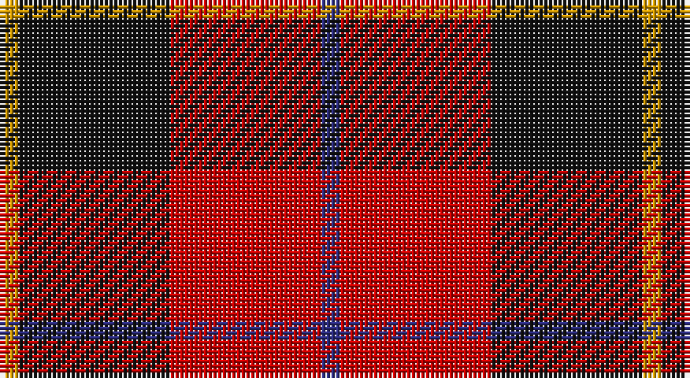

This page is one **sett** — a single exact thread-count. It belongs to the [tartan](/setts/db1r8k8lo1/)
(the same proportion at any scale), whose colour order is pattern [BRKY](/stripes/brky/).

Part of the [Skinner](/tartans/skinner/) tartan — the named design grouping this sett with its other cloths.

Sourced from tartans-authority.  It is a [4 stripe tartan](/stripes/stripes4/).

Original link http://www.tartansauthority.com/tartan-ferret/display/2341/

## Register references

External register numbers recorded for this tartan.

- Scottish Tartans Authority (ITI): 2341

## Thread count
DY/4 K32 R32 DB/4

One full sett is **136 threads**.

## Palette

Palette: <strong>Tartan Register</strong> <small style="color:#888">(3 of 4 colours)</small>
<table><thead><tr><th>Colour</th><th>Threads</th><th>Shade</th><th>Base</th><th>OKLCh</th></tr></thead><tbody><tr><td>DY/</td><td style="text-align:right;font-variant-numeric:tabular-nums">4</td><td><code style="background-color:#D09800;">#D09800</code> <small style="color:#888">#D09800</small></td><td>Y <code style="background-color:#F2BF00;">#F2BF00</code></td><td><small style="color:#888">oklch(71.4% 0.147 82.1)</small></td></tr><tr><td>K</td><td style="text-align:right;font-variant-numeric:tabular-nums">32</td><td><code style="background-color:#101010;">#101010</code> <small style="color:#888">#101010</small></td><td>K <code style="background-color:#000000;">#000000</code></td><td><small style="color:#888">oklch(17.3% 0.000 89.9)</small></td></tr><tr><td>R</td><td style="text-align:right;font-variant-numeric:tabular-nums">32</td><td><code style="background-color:#C80000;">#C80000</code> <small style="color:#888">#C80000</small></td><td>R <code style="background-color:#CC0000;">#CC0000</code></td><td><small style="color:#888">oklch(52.3% 0.215 29.2)</small></td></tr><tr><td>DB/</td><td style="text-align:right;font-variant-numeric:tabular-nums">4</td><td><code style="background-color:#2C2C80;">#2C2C80</code> <small style="color:#888">#2C2C80</small></td><td>B <code style="background-color:#2A418A;">#2A418A</code></td><td><small style="color:#888">oklch(35.0% 0.138 276.6)</small></td></tr></tbody></table>

# Sample pattern

## Compared to the master

This cloth is one sett of its design; the master sett (the exemplar the design is anchored on) is below for comparison.

<figure style="margin:0"><figcaption style="color:#888;font-size:smaller">this sett</figcaption></figure>
<figure style="margin:0"><figcaption style="color:#888;font-size:smaller"><a href="/setts/r8k8lo1k8r8db1/">master sett →</a></figcaption></figure>

## Nearest tartans

The nearest existing variants by ΔTartan distance, with this tartan at the top so the swatches line up against it.

ΔTartan

Tartan

Sett

—

<a href="/ttd/edit/#slug=db1r8k8lo1~x4">Skinner (Name)</a> <a class="nn-out" href="/variants/s4/db1r8k8lo1~x4/" title="open its dictionary page">↗</a>

0.71

<a href="/ttd/edit/#slug=w1r8k8ly1~x4&amp;base=db1r8k8lo1~x4">Connel (Clan)</a> <a class="nn-out" href="/variants/s4/w1r8k8ly1~x4/" title="open its dictionary page">↗</a>

0.96

<a href="/ttd/edit/#slug=r4k25o25w4~x2&amp;base=db1r8k8lo1~x4">Bonhill Primary School</a> <a class="nn-out" href="/variants/s4/r4k25o25w4~x2/" title="open its dictionary page">↗</a>

1.08

<a href="/ttd/edit/#slug=w1r8k8ly1~x2&amp;base=db1r8k8lo1~x4">Connel</a> <a class="nn-out" href="/variants/s4/w1r8k8ly1~x2/" title="open its dictionary page">↗</a>

1.09

<a href="/ttd/edit/#slug=k1r8k8ly1~x6&amp;base=db1r8k8lo1~x4">Wallace</a> <a class="nn-out" href="/variants/s4/k1r8k8ly1~x6/" title="open its dictionary page">↗</a>

1.09

<a href="/ttd/edit/#slug=k1r8k8ly1~x4&amp;base=db1r8k8lo1~x4">Wallace (Clan)</a> <a class="nn-out" href="/variants/s4/k1r8k8ly1~x4/" title="open its dictionary page">↗</a>

1.11

<a href="/ttd/edit/#slug=db1r12k6ly1k6db1~x4&amp;base=db1r8k8lo1~x4">Cetoloni (Personal)</a> <a class="nn-out" href="/variants/s6/db1r12k6ly1k6db1~x4/" title="open its dictionary page">↗</a>

1.17

<a href="/ttd/edit/#slug=w1k10r10w1~x4&amp;base=db1r8k8lo1~x4">Masai Shuka 01 (Artefact)</a> <a class="nn-out" href="/variants/s4/w1k10r10w1~x4/" title="open its dictionary page">↗</a>

1.23

<a href="/ttd/edit/#slug=db3k32r27w2~x2&amp;base=db1r8k8lo1~x4">Templar Grand Priory USA</a> <a class="nn-out" href="/variants/s4/db3k32r27w2~x2/" title="open its dictionary page">↗</a>

1.24

<a href="/ttd/edit/#slug=r8k8lo1k8r8db1~x4&amp;base=db1r8k8lo1~x4">Skinner</a> <a class="nn-out" href="/variants/s6/r8k8lo1k8r8db1~x4/" title="open its dictionary page">↗</a>

1.25

<a href="/ttd/edit/#slug=r80k52w7o12&amp;base=db1r8k8lo1~x4">Oklahoma State University (Corporate</a> <a class="nn-out" href="/variants/s4/r80k52w7o12/" title="open its dictionary page">↗</a>

## Neighbour map

Every grey dot is one of 14360 variants placed by the first two principal components of the ΔTartan feature space (44% of its variance). Red is this tartan; blue dots are its nearest — click one to open its page.

<svg viewBox="0 0 640 380" role="img" style="max-width:100%;height:auto;border:1px solid #e0e0e0;border-radius:4px;display:block" xmlns="http://www.w3.org/2000/svg"><image href="/nn/cloud.v1.png" width="640" height="380"/><a href="/variants/s4/w1r8k8ly1~x4/"><circle cx="238.7" cy="218.8" r="4" fill="#3465a4"><title>Connel (Clan)</title></circle></a><a href="/variants/s4/r4k25o25w4~x2/"><circle cx="213.9" cy="236.2" r="4" fill="#3465a4"><title>Bonhill Primary School</title></circle></a><a href="/variants/s4/w1r8k8ly1~x2/"><circle cx="230.5" cy="219.3" r="4" fill="#3465a4"><title>Connel</title></circle></a><a href="/variants/s4/k1r8k8ly1~x6/"><circle cx="304.9" cy="243.9" r="4" fill="#3465a4"><title>Wallace</title></circle></a><a href="/variants/s4/k1r8k8ly1~x4/"><circle cx="304.9" cy="243.9" r="4" fill="#3465a4"><title>Wallace (Clan)</title></circle></a><a href="/variants/s6/db1r12k6ly1k6db1~x4/"><circle cx="272.6" cy="188.5" r="4" fill="#3465a4"><title>Cetoloni (Personal)</title></circle></a><a href="/variants/s4/w1k10r10w1~x4/"><circle cx="277.6" cy="223.3" r="4" fill="#3465a4"><title>Masai Shuka 01 (Artefact)</title></circle></a><a href="/variants/s4/db3k32r27w2~x2/"><circle cx="314.7" cy="200.5" r="4" fill="#3465a4"><title>Templar Grand Priory USA</title></circle></a><a href="/variants/s6/r8k8lo1k8r8db1~x4/"><circle cx="258.0" cy="234.9" r="4" fill="#3465a4"><title>Skinner</title></circle></a><a href="/variants/s4/r80k52w7o12/"><circle cx="288.5" cy="206.7" r="4" fill="#3465a4"><title>Oklahoma State University (Corporate</title></circle></a><circle cx="257.9" cy="229.8" r="5" fill="#c00000"/></svg>

ID: /variants/s4/db1r8k8lo1~x4/
