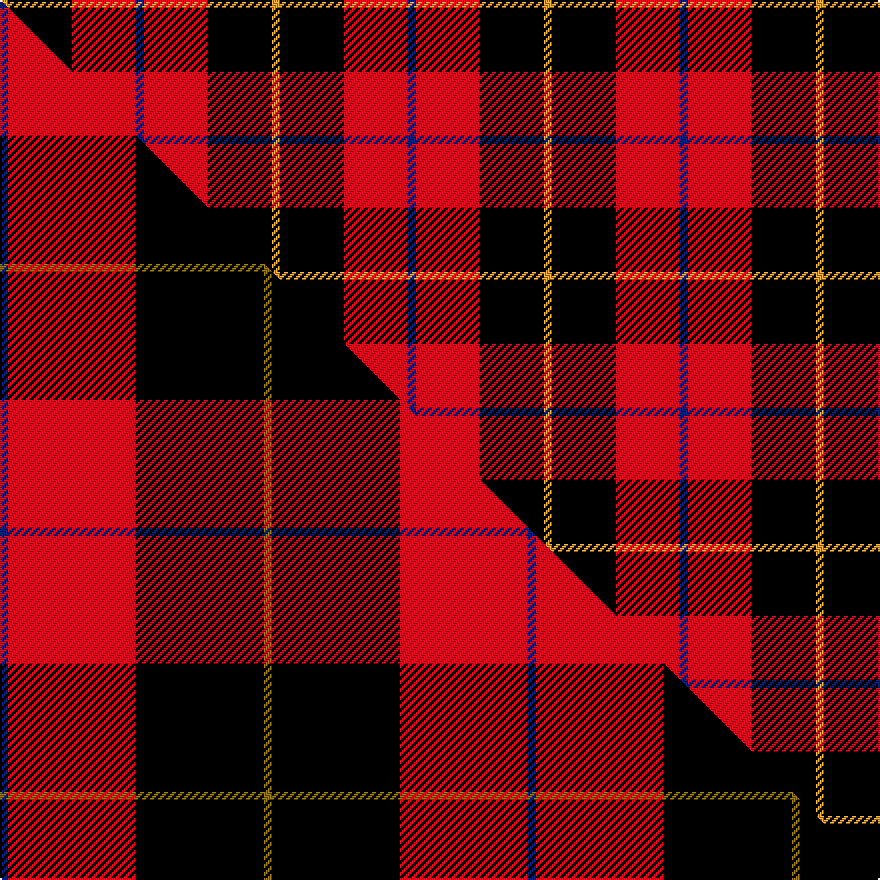

This is one **variant** — a specific cloth: this exact thread count and colourway, with its own
provenance below. It is one weaving of the [sett](/tartans/s/sk/skinner/) (the scale-free proportion — the
same cloth at any scale or shade), whose colour order is pattern [BRKY](/stripes/brky/).

Part of the [Skinner](/tartans/s/sk/skinner/) tartan — the named design grouping this sett with its other cloths.

Sourced from tartans-authority.  It is a [4 stripe tartan](/stripes/stripes4/).

Original link <code>http://www.tartansauthority.com/tartan-ferret/display/2341/</code> — retired · [Internet Archive copy](https://web.archive.org/web/*/http://www.tartansauthority.com/tartan-ferret/display/2341/*)

Dataset <small>— provenance for this record, inherited from the source manifest</small>

<dl class="dataset-prov">
<dt>source</dt><dd><a href="/sources/tartans-authority/">Scottish Tartans Authority</a></dd>
<dt>data captured from</dt><dd><a href="https://github.com/thetartan/tartan-database/blob/master/data/tartans-authority/data.csv">https://github.com/thetartan/tartan-database/blob/master/data/tartans-authority/data.csv</a></dd>
<dt>data date</dt><dd>1880 circa <small>(this record)</small></dd>
<dt>licence</dt><dd><a href="https://creativecommons.org/licenses/by-nc-nd/4.0/">CC BY-NC-ND 4.0</a></dd>
</dl>

Capture chain <small>— the hands this data passed through, oldest first; each capture carries its own licence</small>

<ol class="capture-chain">
<li><a href="https://www.tartansauthority.com/">Scottish Tartans Authority</a> <small>the heritage body’s archive — its tartan-ferret record browser is retired; dead record links are shown unlinked, with an Internet Archive copy (ITI numbers are not SRT references)</small></li>
<li><a href="https://github.com/thetartan/tartan-database">thetartan/tartan-database</a> <small>2016-2017</small> · <a href="https://creativecommons.org/licenses/by-nc-nd/4.0/">CC BY-NC-ND 4.0</a> <small>Levko Kravets's frozen compilation — the capture we vendored, and where its CC licence text came from</small></li>
<li>this dictionary <small>captured 2026-06-10 · commit 5bf86c7566</small> <small>each re-capture is a git commit to data/sources</small></li>
</ol>

## Register references

External register numbers recorded for this tartan.

- Scottish Tartans Authority (ITI): 2341

## Thread count
LO/4 K32 R32 DB/4

One full sett is **136 threads**.

## Palette
<table><thead><tr><th>Colour</th><th>Shade</th><th>OKLCh</th></tr></thead><tbody><tr><td>DB</td><td><code style="background-color:#082077;">#082077</code> <small style="color:#888">#082077</small></td><td><small style="color:#888">oklch(30.0% 0.149 265.1)</small></td></tr><tr><td>LO</td><td><code style="background-color:#FF9C34;">#FF9C34</code> <small style="color:#888">#FF9C34</small></td><td><small style="color:#888">oklch(77.9% 0.161 61.8)</small></td></tr><tr><td>K</td><td><code style="background-color:#000000;">#000000</code> <small style="color:#888">#000000</small></td><td><small style="color:#888">oklch(0.0% 0.000 0.0)</small></td></tr><tr><td>R</td><td><code style="background-color:#D60020;">#D60020</code> <small style="color:#888">#D60020</small></td><td><small style="color:#888">oklch(55.2% 0.224 25.5)</small></td></tr></tbody></table>

# Sample pattern

## Compared to the master

This cloth is one sett of its design; the master sett (the exemplar the design is anchored on) is below for comparison.

Its **ΔTartan distance** from the master is **0.79** — the same measure the nearest-tartans table ranks by (0 is identical; a re-scale of the same cloth is near 0, a recolour or a different proportion further).

<figure class="master-compare" style="margin:0">

this sett
master sett ★

<figcaption style="color:#888;font-size:smaller">One weave of this sett against the <a href="/setts/db1r16k16y1/">master sett ★</a>, split on the diagonal: a shared proportion runs seamlessly across it with only the shades shifting; a different proportion breaks on it.</figcaption>
</figure>

## Nearest tartan variants

The nearest existing variants by ΔTartan distance, with this cloth at the top so the swatches line up against it.

ΔTartan

Threads

Variant

Sett

—

136

<a href="/variants/s4/db1r8k8lo1~x4/">Skinner (Name)</a>

<a href="/ttd/edit/#slug=y1k8r8w1~x4&amp;base=db1r8k8lo1~x4" title="compare in the TTD">0.60</a>

136

<a href="/variants/s4/y1k8r8w1~x4/">Connel (Clan)</a>

<a href="/ttd/edit/#slug=y1k8r8w1~x2&amp;base=db1r8k8lo1~x4" title="compare in the TTD">0.60</a>

68

<a href="/variants/s4/y1k8r8w1~x2/">Connel Clan Tartan</a>

<a href="/ttd/edit/#slug=db1r16k16y1~x4&amp;base=db1r8k8lo1~x4" title="compare in the TTD">0.79</a>

264

<a href="/variants/s4/db1r16k16y1~x4/">Skinner</a>

<a href="/ttd/edit/#slug=w1k10r10w1~x4&amp;base=db1r8k8lo1~x4" title="compare in the TTD">0.86</a>

168

<a href="/variants/s4/w1k10r10w1~x4/">Masai Shuka 01 (Artefact)</a>

<a href="/ttd/edit/#slug=db4y4r33k30w2~x2&amp;base=db1r8k8lo1~x4" title="compare in the TTD">1.14</a>

280

<a href="/variants/s5/db4y4r33k30w2~x2/">Wormeck (2013) Germany</a>

<a href="/ttd/edit/#slug=y1k8r13g1~x6&amp;base=db1r8k8lo1~x4" title="compare in the TTD">1.14</a>

264

<a href="/variants/s4/y1k8r13g1~x6/">Billy Apple® Red</a>

<a href="/ttd/edit/#slug=g1r8k13ly1~x6&amp;base=db1r8k8lo1~x4" title="compare in the TTD">1.14</a>

264

<a href="/variants/s4/g1r8k13ly1~x6/">Billy Apple</a>

<a href="/ttd/edit/#slug=db3k32r27w2~x2&amp;base=db1r8k8lo1~x4" title="compare in the TTD">1.15</a>

246

<a href="/variants/s4/db3k32r27w2~x2/">Templar Grand Priory USA</a>

<a href="/ttd/edit/#slug=w3db12k12r20g2~x2&amp;base=db1r8k8lo1~x4" title="compare in the TTD">1.64</a>

186

<a href="/variants/s5/w3db12k12r20g2~x2/">Baillie of Polkemett</a>

<a href="/ttd/edit/#slug=w3t12k12r20g2~x2&amp;base=db1r8k8lo1~x4" title="compare in the TTD">1.64</a>

186

<a href="/variants/s5/w3t12k12r20g2~x2/">Baillie of Polkemmet Red</a>

## Neighbour map

Every grey dot is one of 13656 variants placed by the first two principal components of the ΔTartan feature space (42% of its variance). Red is this tartan; blue dots are its nearest — click one to open its page. The map is a flat projection of a many-dimensional space — [how to read it](/posts/neighbourhood-maps/).

<svg viewBox="0 0 640 380" role="img" style="max-width:100%;height:auto;border:1px solid #e0e0e0;border-radius:4px;display:block" xmlns="http://www.w3.org/2000/svg"><image href="/nn/cloud.v1.png" width="640" height="380"/><a href="/variants/s4/y1k8r8w1~x4/"><circle cx="209.1" cy="204.9" r="4" fill="#3465a4"><title>Connel (Clan)</title></circle></a><a href="/variants/s4/y1k8r8w1~x2/"><circle cx="209.1" cy="204.9" r="4" fill="#3465a4"><title>Connel Clan Tartan</title></circle></a><a href="/variants/s4/db1r16k16y1~x4/"><circle cx="266.8" cy="170.5" r="4" fill="#3465a4"><title>Skinner</title></circle></a><a href="/variants/s4/w1k10r10w1~x4/"><circle cx="242.6" cy="205.5" r="4" fill="#3465a4"><title>Masai Shuka 01 (Artefact)</title></circle></a><a href="/variants/s5/db4y4r33k30w2~x2/"><circle cx="218.5" cy="142.2" r="4" fill="#3465a4"><title>Wormeck (2013) Germany</title></circle></a><a href="/variants/s4/y1k8r13g1~x6/"><circle cx="290.2" cy="175.2" r="4" fill="#3465a4"><title>Billy Apple® Red</title></circle></a><a href="/variants/s4/g1r8k13ly1~x6/"><circle cx="280.8" cy="176.7" r="4" fill="#3465a4"><title>Billy Apple</title></circle></a><a href="/variants/s4/db3k32r27w2~x2/"><circle cx="264.7" cy="172.7" r="4" fill="#3465a4"><title>Templar Grand Priory USA</title></circle></a><a href="/variants/s5/w3db12k12r20g2~x2/"><circle cx="140.4" cy="188.4" r="4" fill="#3465a4"><title>Baillie of Polkemett</title></circle></a><a href="/variants/s5/w3t12k12r20g2~x2/"><circle cx="138.1" cy="190.3" r="4" fill="#3465a4"><title>Baillie of Polkemmet Red</title></circle></a><circle cx="212.7" cy="205.1" r="5" fill="#c00000"/><text x="320" y="376" text-anchor="middle" font-size="11" fill="#999">ground</text><text x="11" y="190" text-anchor="middle" font-size="11" fill="#999" transform="rotate(-90 11 190)">complexity</text></svg>

ID: /variants/s4/db1r8k8lo1~x4/
