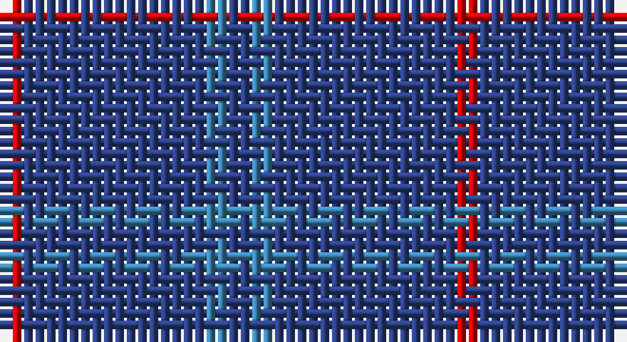

This page is one **sett** — a single exact thread-count. It belongs to the [tartan](/setts/db1t1db8r1/)
(the same proportion at any scale), whose colour order is pattern [BBBR](/stripes/bbbr/).

Part of the [Lochaber](/tartans/lochaber/) tartan — the named design grouping this sett with its other cloths.

Sourced from register-of-tartans.  It is a [4 stripe tartan](/stripes/stripes4/).

Original link https://www.tartanregister.gov.uk/tartanDetails.aspx?ref=2161

## Also known as

This cloth is also recorded under:

- Lochaber #2
- Lochaber #3

2 attestations — the source records this cloth was collapsed from (oldest owns this page)

<ul>
<li>undated — Lochaber #3 (register-of-tartans, <a href="https://www.tartanregister.gov.uk/tartanDetails.aspx?ref=2161">record</a>)</li>
<li>undated — Lochaber (weddslist, <a href="http://www.weddslist.com/cgi-bin/tartans/pg.pl?source=sts">record</a>)</li>
</ul>

## Register references

External register numbers recorded for this tartan.

- Scottish Register of Tartans: [2161](https://www.tartanregister.gov.uk/tartanDetails.aspx?ref=2161)
- Scottish Tartans World Register: 41

## Thread count
R/2 B16 Ba2 B/2

One full sett is **40 threads**.

## Palette

Palette: <strong>Tartan Register</strong>
<table><thead><tr><th>Colour</th><th>Threads</th><th>Shade</th><th>Base</th><th>OKLCh</th></tr></thead><tbody><tr><td>R/</td><td style="text-align:right;font-variant-numeric:tabular-nums">2</td><td><code style="background-color:#DC0000;">#DC0000</code> <small style="color:#888">#DC0000</small></td><td>R <code style="background-color:#CC0000;">#CC0000</code></td><td><small style="color:#888">oklch(56.2% 0.230 29.2)</small></td></tr><tr><td>B</td><td style="text-align:right;font-variant-numeric:tabular-nums">16</td><td><code style="background-color:#2C4084;">#2C4084</code> <small style="color:#888">#2C4084</small></td><td>B <code style="background-color:#2A418A;">#2A418A</code></td><td><small style="color:#888">oklch(39.4% 0.117 268.3)</small></td></tr><tr><td>Ba</td><td style="text-align:right;font-variant-numeric:tabular-nums">2</td><td><code style="background-color:#3C82AF;">#3C82AF</code> <small style="color:#888">#3C82AF</small></td><td>B <code style="background-color:#2A418A;">#2A418A</code></td><td><small style="color:#888">oklch(58.1% 0.099 239.8)</small></td></tr><tr><td>B/</td><td style="text-align:right;font-variant-numeric:tabular-nums">2</td><td><code style="background-color:#2C4084;">#2C4084</code> <small style="color:#888">#2C4084</small></td><td>B <code style="background-color:#2A418A;">#2A418A</code></td><td><small style="color:#888">oklch(39.4% 0.117 268.3)</small></td></tr></tbody></table>

# Sample pattern

## Compared to the master

This cloth is one sett of its design; the master sett (the exemplar the design is anchored on) is below for comparison.

<figure style="margin:0"><figcaption style="color:#888;font-size:smaller">this sett</figcaption></figure>
<figure style="margin:0"><figcaption style="color:#888;font-size:smaller"><a href="/setts/g4t2db33r2k35g33k1r2k1g4/">master sett →</a></figcaption></figure>

## Nearest tartans

The nearest existing variants by ΔTartan distance, with this tartan at the top so the swatches line up against it.

ΔTartan

Tartan

Sett

—

<a href="/ttd/edit/#slug=db1t1db8r1~x2">Lochaber #3</a> <a class="nn-out" href="/variants/s4/db1t1db8r1~x2/" title="open its dictionary page">↗</a>

1.56

<a href="/ttd/edit/#slug=db10r1db10r2db10r1g2~x2&amp;base=db1t1db8r1~x2">Hebridean, (Old..)</a> <a class="nn-out" href="/variants/s7/db10r1db10r2db10r1g2~x2/" title="open its dictionary page">↗</a>

1.73

<a href="/ttd/edit/#slug=r1db9lo2db9lo1~x4&amp;base=db1t1db8r1~x2">Brooks Brothers Tattersall Blue</a> <a class="nn-out" href="/variants/s5/r1db9lo2db9lo1~x4/" title="open its dictionary page">↗</a>

1.80

<a href="/ttd/edit/#slug=r19db6r7db101dg6db7~x2&amp;base=db1t1db8r1~x2">Lynch</a> <a class="nn-out" href="/variants/s6/r19db6r7db101dg6db7~x2/" title="open its dictionary page">↗</a>

1.85

<a href="/ttd/edit/#slug=db44dy12db9r3~x2&amp;base=db1t1db8r1~x2">Elliot (Clan)</a> <a class="nn-out" href="/variants/s4/db44dy12db9r3~x2/" title="open its dictionary page">↗</a>

1.86

<a href="/ttd/edit/#slug=dt72b6dt12b17w6~x2&amp;base=db1t1db8r1~x2">GulfMark</a> <a class="nn-out" href="/variants/s5/dt72b6dt12b17w6~x2/" title="open its dictionary page">↗</a>

1.95

<a href="/ttd/edit/#slug=db32r3db4ly3~x2&amp;base=db1t1db8r1~x2">MacLaine of Lochbuie</a> <a class="nn-out" href="/variants/s4/db32r3db4ly3~x2/" title="open its dictionary page">↗</a>

1.99

<a href="/ttd/edit/#slug=r3db2r1db18g1db2~x4&amp;base=db1t1db8r1~x2">Lynch</a> <a class="nn-out" href="/variants/s6/r3db2r1db18g1db2~x4/" title="open its dictionary page">↗</a>

2.07

<a href="/ttd/edit/#slug=db16dr4db3r1~x2&amp;base=db1t1db8r1~x2">Elliott</a> <a class="nn-out" href="/variants/s4/db16dr4db3r1~x2/" title="open its dictionary page">↗</a>

2.10

<a href="/ttd/edit/#slug=db72t6db12t17w6~x2&amp;base=db1t1db8r1~x2">Gulfmark (Corporate)</a> <a class="nn-out" href="/variants/s5/db72t6db12t17w6~x2/" title="open its dictionary page">↗</a>

2.19

<a href="/ttd/edit/#slug=dt68b7dt16k16lo4~x2&amp;base=db1t1db8r1~x2">Burnett's &amp; Struth (Corporate)</a> <a class="nn-out" href="/variants/s5/dt68b7dt16k16lo4~x2/" title="open its dictionary page">↗</a>

## Neighbour map

Every grey dot is one of 14360 variants placed by the first two principal components of the ΔTartan feature space (44% of its variance). Red is this tartan; blue dots are its nearest — click one to open its page.

<svg viewBox="0 0 640 380" role="img" style="max-width:100%;height:auto;border:1px solid #e0e0e0;border-radius:4px;display:block" xmlns="http://www.w3.org/2000/svg"><image href="/nn/cloud.v1.png" width="640" height="380"/><a href="/variants/s7/db10r1db10r2db10r1g2~x2/"><circle cx="577.9" cy="267.6" r="4" fill="#3465a4"><title>Hebridean, (Old..)</title></circle></a><a href="/variants/s5/r1db9lo2db9lo1~x4/"><circle cx="543.1" cy="269.9" r="4" fill="#3465a4"><title>Brooks Brothers Tattersall Blue</title></circle></a><a href="/variants/s6/r19db6r7db101dg6db7~x2/"><circle cx="593.9" cy="211.5" r="4" fill="#3465a4"><title>Lynch</title></circle></a><a href="/variants/s4/db44dy12db9r3~x2/"><circle cx="611.5" cy="290.9" r="4" fill="#3465a4"><title>Elliot (Clan)</title></circle></a><a href="/variants/s5/dt72b6dt12b17w6~x2/"><circle cx="511.4" cy="237.4" r="4" fill="#3465a4"><title>GulfMark</title></circle></a><a href="/variants/s4/db32r3db4ly3~x2/"><circle cx="589.6" cy="240.0" r="4" fill="#3465a4"><title>MacLaine of Lochbuie</title></circle></a><a href="/variants/s6/r3db2r1db18g1db2~x4/"><circle cx="601.3" cy="205.3" r="4" fill="#3465a4"><title>Lynch</title></circle></a><a href="/variants/s4/db16dr4db3r1~x2/"><circle cx="602.7" cy="280.5" r="4" fill="#3465a4"><title>Elliott</title></circle></a><a href="/variants/s5/db72t6db12t17w6~x2/"><circle cx="496.0" cy="233.7" r="4" fill="#3465a4"><title>Gulfmark (Corporate)</title></circle></a><a href="/variants/s5/dt68b7dt16k16lo4~x2/"><circle cx="547.6" cy="240.9" r="4" fill="#3465a4"><title>Burnett's &amp; Struth (Corporate)</title></circle></a><circle cx="590.0" cy="280.1" r="5" fill="#c00000"/></svg>

ID: /variants/s4/db1t1db8r1~x2/
