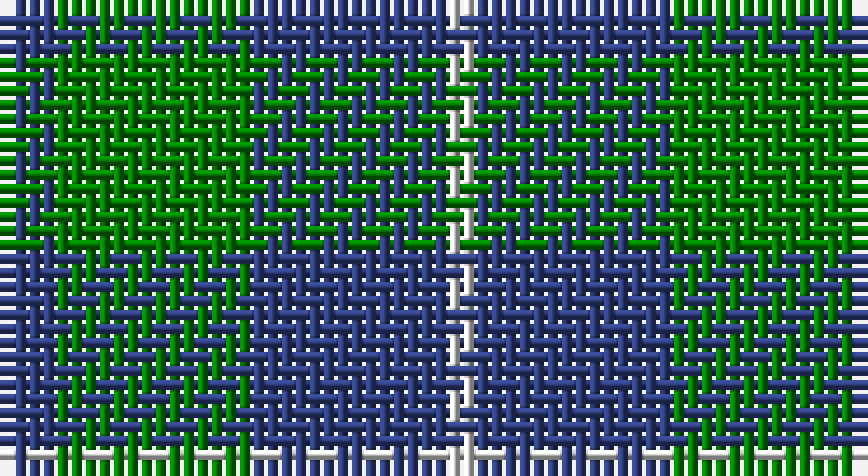

This page is one **sett** — a single exact thread-count. It belongs to the [tartan](/setts/db2g7db7w1/)
(the same proportion at any scale), whose colour order is pattern [BGBW](/stripes/bgbw/).

Sourced from weddslist.  It is a [4 stripe tartan](/stripes/stripes4/).

Original link http://www.weddslist.com/cgi-bin/tartans/pg.pl?source=sts

## Thread count
B/4 G14 B14 LN/2

One full sett is **62 threads**.

## Palette

Palette: <strong>Tartan Dictionary</strong> <small style="color:#888">(1 of 3 colours)</small>
<table><thead><tr><th>Colour</th><th>Threads</th><th>Shade</th><th>Base</th><th>OKLCh</th></tr></thead><tbody><tr><td>B/</td><td style="text-align:right;font-variant-numeric:tabular-nums">4</td><td><code style="background-color:#304080;">#304080</code> <small style="color:#888">#304080</small></td><td>B <code style="background-color:#2A418A;">#2A418A</code></td><td><small style="color:#888">oklch(39.4% 0.109 270.2)</small></td></tr><tr><td>G</td><td style="text-align:right;font-variant-numeric:tabular-nums">14</td><td><code style="background-color:#008000;">#008000</code> <small style="color:#888">#008000</small></td><td>G <code style="background-color:#006100;">#006100</code></td><td><small style="color:#888">oklch(52.0% 0.177 142.5)</small></td></tr><tr><td>B</td><td style="text-align:right;font-variant-numeric:tabular-nums">14</td><td><code style="background-color:#304080;">#304080</code> <small style="color:#888">#304080</small></td><td>B <code style="background-color:#2A418A;">#2A418A</code></td><td><small style="color:#888">oklch(39.4% 0.109 270.2)</small></td></tr><tr><td>LN/</td><td style="text-align:right;font-variant-numeric:tabular-nums">2</td><td><code style="background-color:#E0E0E0;">#E0E0E0</code> <small style="color:#888">#E0E0E0</small></td><td>W <code style="background-color:#F7F7F7;">#F7F7F7</code></td><td><small style="color:#888">oklch(90.7% 0.000 89.9)</small></td></tr></tbody></table>

# Sample pattern

## Nearest tartans

The nearest existing variants by ΔTartan distance, with this tartan at the top so the swatches line up against it.

ΔTartan

Tartan

Sett

—

<a href="/ttd/edit/#slug=db2g7db7w1~x2">Unnamed No 78</a> <a class="nn-out" href="/variants/s4/db2g7db7w1~x2/" title="open its dictionary page">↗</a>

0.67

<a href="/ttd/edit/#slug=db11g2db15g18w2~x2&amp;base=db2g7db7w1~x2">Hamilton, hunting</a> <a class="nn-out" href="/variants/s5/db11g2db15g18w2~x2/" title="open its dictionary page">↗</a>

0.78

<a href="/ttd/edit/#slug=db5g2db5g8w1~x8&amp;base=db2g7db7w1~x2">Hamilton, hunting</a> <a class="nn-out" href="/variants/s5/db5g2db5g8w1~x8/" title="open its dictionary page">↗</a>

1.12

<a href="/ttd/edit/#slug=db6g5r1~x4&amp;base=db2g7db7w1~x2">Ferguson</a> <a class="nn-out" href="/variants/s3/db6g5r1~x4/" title="open its dictionary page">↗</a>

1.17

<a href="/ttd/edit/#slug=db8g2db8g15lb2~x4&amp;base=db2g7db7w1~x2">Hamilton Green Hunting</a> <a class="nn-out" href="/variants/s5/db8g2db8g15lb2~x4/" title="open its dictionary page">↗</a>

1.17

<a href="/ttd/edit/#slug=db13r2g13~x2&amp;base=db2g7db7w1~x2">Wilson's No 62, (Ferguson)</a> <a class="nn-out" href="/variants/s3/db13r2g13~x2/" title="open its dictionary page">↗</a>

1.20

<a href="/ttd/edit/#slug=db5g6r1~x4&amp;base=db2g7db7w1~x2">Wilson's No 84, Ferguson</a> <a class="nn-out" href="/variants/s3/db5g6r1~x4/" title="open its dictionary page">↗</a>

1.28

<a href="/ttd/edit/#slug=g17r2db15~x2&amp;base=db2g7db7w1~x2">Ferguson - 1930 (Old)</a> <a class="nn-out" href="/variants/s3/g17r2db15~x2/" title="open its dictionary page">↗</a>

1.28

<a href="/ttd/edit/#slug=db2dg7db7w1~x2&amp;base=db2g7db7w1~x2">Unidentified No 78</a> <a class="nn-out" href="/variants/s4/db2dg7db7w1~x2/" title="open its dictionary page">↗</a>

1.43

<a href="/ttd/edit/#slug=db4w1db12g12db1g4~x2&amp;base=db2g7db7w1~x2">Unidentified, Tweed</a> <a class="nn-out" href="/variants/s6/db4w1db12g12db1g4~x2/" title="open its dictionary page">↗</a>

1.45

<a href="/ttd/edit/#slug=b3k1g4k1b4g9k2~x4&amp;base=db2g7db7w1~x2">Outdoorsmen (Fashion)</a> <a class="nn-out" href="/variants/s7/b3k1g4k1b4g9k2~x4/" title="open its dictionary page">↗</a>

## Neighbour map

Every grey dot is one of 14360 variants placed by the first two principal components of the ΔTartan feature space (44% of its variance). Red is this tartan; blue dots are its nearest — click one to open its page.

<svg viewBox="0 0 640 380" role="img" style="max-width:100%;height:auto;border:1px solid #e0e0e0;border-radius:4px;display:block" xmlns="http://www.w3.org/2000/svg"><image href="/nn/cloud.v1.png" width="640" height="380"/><a href="/variants/s5/db11g2db15g18w2~x2/"><circle cx="328.2" cy="271.2" r="4" fill="#3465a4"><title>Hamilton, hunting</title></circle></a><a href="/variants/s5/db5g2db5g8w1~x8/"><circle cx="285.1" cy="283.9" r="4" fill="#3465a4"><title>Hamilton, hunting</title></circle></a><a href="/variants/s3/db6g5r1~x4/"><circle cx="293.2" cy="325.0" r="4" fill="#3465a4"><title>Ferguson</title></circle></a><a href="/variants/s5/db8g2db8g15lb2~x4/"><circle cx="282.4" cy="272.2" r="4" fill="#3465a4"><title>Hamilton Green Hunting</title></circle></a><a href="/variants/s3/db13r2g13~x2/"><circle cx="288.4" cy="321.5" r="4" fill="#3465a4"><title>Wilson's No 62, (Ferguson)</title></circle></a><a href="/variants/s3/db5g6r1~x4/"><circle cx="291.3" cy="324.9" r="4" fill="#3465a4"><title>Wilson's No 84, Ferguson</title></circle></a><a href="/variants/s3/g17r2db15~x2/"><circle cx="326.6" cy="314.4" r="4" fill="#3465a4"><title>Ferguson - 1930 (Old)</title></circle></a><a href="/variants/s4/db2dg7db7w1~x2/"><circle cx="332.9" cy="305.1" r="4" fill="#3465a4"><title>Unidentified No 78</title></circle></a><a href="/variants/s6/db4w1db12g12db1g4~x2/"><circle cx="339.4" cy="244.4" r="4" fill="#3465a4"><title>Unidentified, Tweed</title></circle></a><a href="/variants/s7/b3k1g4k1b4g9k2~x4/"><circle cx="298.0" cy="246.4" r="4" fill="#3465a4"><title>Outdoorsmen (Fashion)</title></circle></a><circle cx="303.9" cy="288.5" r="5" fill="#c00000"/></svg>

ID: /variants/s4/db2g7db7w1~x2/
