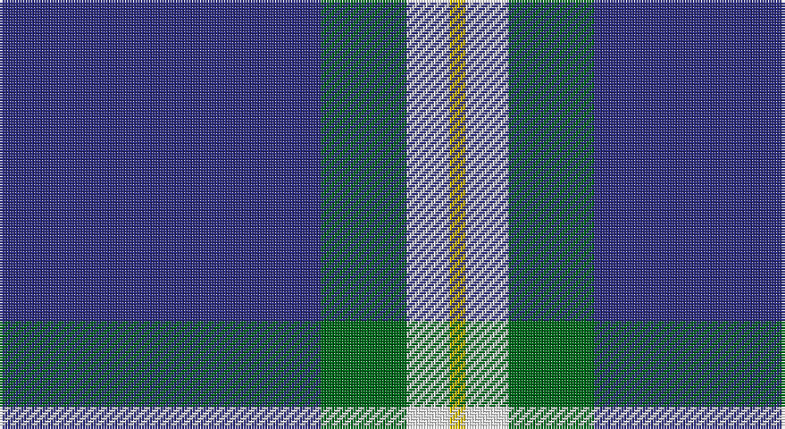

This page is one **sett** — a single exact thread-count. It belongs to the [tartan](/setts/db60g16w8ly3/)
(the same proportion at any scale), whose colour order is pattern [BGWY](/stripes/bgwy/).

Sourced from tartans-authority.  It is a [4 stripe tartan](/stripes/stripes4/).

Original link http://www.tartansauthority.com/tartan-ferret/display/10496/

## Register references

External register numbers recorded for this tartan.

- Scottish Register of Tartans: [10496](https://www.tartanregister.gov.uk/tartanDetails?ref=10496)
- Scottish Tartans Authority (ITI): 10496

## Thread count
DB/120 G32 W16 Y/6

One full sett is **222 threads**.

## Palette

Palette: <strong>Tartan Register</strong>
<table><thead><tr><th>Colour</th><th>Threads</th><th>Shade</th><th>Base</th><th>OKLCh</th></tr></thead><tbody><tr><td>DB/</td><td style="text-align:right;font-variant-numeric:tabular-nums">120</td><td><code style="background-color:#2C2C80;">#2C2C80</code> <small style="color:#888">#2C2C80</small></td><td>B <code style="background-color:#2A418A;">#2A418A</code></td><td><small style="color:#888">oklch(35.0% 0.138 276.6)</small></td></tr><tr><td>G</td><td style="text-align:right;font-variant-numeric:tabular-nums">32</td><td><code style="background-color:#006818;">#006818</code> <small style="color:#888">#006818</small></td><td>G <code style="background-color:#006100;">#006100</code></td><td><small style="color:#888">oklch(45.0% 0.142 145.0)</small></td></tr><tr><td>W</td><td style="text-align:right;font-variant-numeric:tabular-nums">16</td><td><code style="background-color:#FCFCFC;">#FCFCFC</code> <small style="color:#888">#FCFCFC</small></td><td>W <code style="background-color:#F7F7F7;">#F7F7F7</code></td><td><small style="color:#888">oklch(99.1% 0.000 89.9)</small></td></tr><tr><td>Y/</td><td style="text-align:right;font-variant-numeric:tabular-nums">6</td><td><code style="background-color:#E8C000;">#E8C000</code> <small style="color:#888">#E8C000</small></td><td>Y <code style="background-color:#F2BF00;">#F2BF00</code></td><td><small style="color:#888">oklch(81.9% 0.168 93.7)</small></td></tr></tbody></table>

# Sample pattern

## Nearest tartans

The nearest existing variants by ΔTartan distance, with this tartan at the top so the swatches line up against it.

ΔTartan

Tartan

Sett

—

<a href="/ttd/edit/#slug=db60g16w8ly3~x2">Hsu (Personal)</a> <a class="nn-out" href="/variants/s4/db60g16w8ly3~x2/" title="open its dictionary page">↗</a>

0.77

<a href="/ttd/edit/#slug=db60dg16w8lo3~x2&amp;base=db60g16w8ly3~x2">MaleHsuHK (Hong Kong) (Personal)</a> <a class="nn-out" href="/variants/s4/db60dg16w8lo3~x2/" title="open its dictionary page">↗</a>

1.27

<a href="/ttd/edit/#slug=w4t28db49ly3~x2&amp;base=db60g16w8ly3~x2">McKerrell of Hillhouse</a> <a class="nn-out" href="/variants/s4/w4t28db49ly3~x2/" title="open its dictionary page">↗</a>

1.30

<a href="/ttd/edit/#slug=k30b40ly3b5w2b6~x2&amp;base=db60g16w8ly3~x2">Micron</a> <a class="nn-out" href="/variants/s6/k30b40ly3b5w2b6~x2/" title="open its dictionary page">↗</a>

1.39

<a href="/ttd/edit/#slug=db40g7ly3g7db15r5~x2&amp;base=db60g16w8ly3~x2">Wheadon (Name)</a> <a class="nn-out" href="/variants/s6/db40g7ly3g7db15r5~x2/" title="open its dictionary page">↗</a>

1.43

<a href="/ttd/edit/#slug=w4t34db60ly3~x2&amp;base=db60g16w8ly3~x2">MacKerral Family Tartan</a> <a class="nn-out" href="/variants/s4/w4t34db60ly3~x2/" title="open its dictionary page">↗</a>

1.47

<a href="/ttd/edit/#slug=k2db36g12w3r2~x2&amp;base=db60g16w8ly3~x2">Cleland</a> <a class="nn-out" href="/variants/s5/k2db36g12w3r2~x2/" title="open its dictionary page">↗</a>

1.48

<a href="/ttd/edit/#slug=db26lb6g1r1w2~x2&amp;base=db60g16w8ly3~x2">Special Air Service</a> <a class="nn-out" href="/variants/s5/db26lb6g1r1w2~x2/" title="open its dictionary page">↗</a>

1.57

<a href="/ttd/edit/#slug=db26t6dg1o1w2~x2&amp;base=db60g16w8ly3~x2">Special Air Service</a> <a class="nn-out" href="/variants/s5/db26t6dg1o1w2~x2/" title="open its dictionary page">↗</a>

1.59

<a href="/ttd/edit/#slug=w6db2w3db2g2db20r1~x2&amp;base=db60g16w8ly3~x2">Gonzaga University’s True Blue and White</a> <a class="nn-out" href="/variants/s7/w6db2w3db2g2db20r1~x2/" title="open its dictionary page">↗</a>

1.59

<a href="/ttd/edit/#slug=g20r7db40w2~x2&amp;base=db60g16w8ly3~x2">McNiff, Kevin (Personal)</a> <a class="nn-out" href="/variants/s4/g20r7db40w2~x2/" title="open its dictionary page">↗</a>

## Neighbour map

Every grey dot is one of 14360 variants placed by the first two principal components of the ΔTartan feature space (44% of its variance). Red is this tartan; blue dots are its nearest — click one to open its page.

<svg viewBox="0 0 640 380" role="img" style="max-width:100%;height:auto;border:1px solid #e0e0e0;border-radius:4px;display:block" xmlns="http://www.w3.org/2000/svg"><image href="/nn/cloud.v1.png" width="640" height="380"/><a href="/variants/s4/db60dg16w8lo3~x2/"><circle cx="420.9" cy="199.1" r="4" fill="#3465a4"><title>MaleHsuHK (Hong Kong) (Personal)</title></circle></a><a href="/variants/s4/w4t28db49ly3~x2/"><circle cx="345.4" cy="211.7" r="4" fill="#3465a4"><title>McKerrell of Hillhouse</title></circle></a><a href="/variants/s6/k30b40ly3b5w2b6~x2/"><circle cx="354.9" cy="175.7" r="4" fill="#3465a4"><title>Micron</title></circle></a><a href="/variants/s6/db40g7ly3g7db15r5~x2/"><circle cx="427.3" cy="202.5" r="4" fill="#3465a4"><title>Wheadon (Name)</title></circle></a><a href="/variants/s4/w4t34db60ly3~x2/"><circle cx="380.2" cy="207.9" r="4" fill="#3465a4"><title>MacKerral Family Tartan</title></circle></a><a href="/variants/s5/k2db36g12w3r2~x2/"><circle cx="387.2" cy="169.2" r="4" fill="#3465a4"><title>Cleland</title></circle></a><a href="/variants/s5/db26lb6g1r1w2~x2/"><circle cx="438.9" cy="137.6" r="4" fill="#3465a4"><title>Special Air Service</title></circle></a><a href="/variants/s5/db26t6dg1o1w2~x2/"><circle cx="452.7" cy="149.5" r="4" fill="#3465a4"><title>Special Air Service</title></circle></a><a href="/variants/s7/w6db2w3db2g2db20r1~x2/"><circle cx="376.0" cy="139.3" r="4" fill="#3465a4"><title>Gonzaga University’s True Blue and White</title></circle></a><a href="/variants/s4/g20r7db40w2~x2/"><circle cx="345.8" cy="212.4" r="4" fill="#3465a4"><title>McNiff, Kevin (Personal)</title></circle></a><circle cx="410.3" cy="190.7" r="5" fill="#c00000"/></svg>

ID: /variants/s4/db60g16w8ly3~x2/
