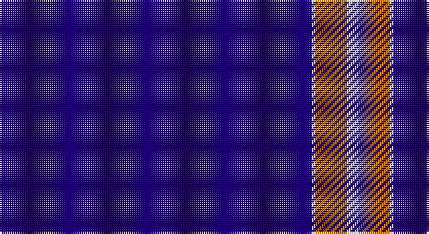

This page is one **sett** — a single exact thread-count. It belongs to the [tartan](/setts/db80w1lo8w3/)
(the same proportion at any scale), whose colour order is pattern [BWYW](/stripes/bwyw/).

Sourced from tartans-authority.  It is a [4 stripe tartan](/stripes/stripes4/).

Original link http://www.tartansauthority.com/tartan-ferret/display/7613/

2 attestations — the source records this cloth was collapsed from (oldest owns this page)

<ul>
<li>pre 2008 — Weir Minerals (Corporate) (tartans-authority, <a href="http://www.tartansauthority.com/tartan-ferret/display/7613/">record</a>)</li>
<li>undated — Weir Minerals (register-of-tartans, <a href="https://www.tartanregister.gov.uk/tartanDetails.aspx?ref=5635">record</a>)</li>
</ul>

## Register references

External register numbers recorded for this tartan.

- Scottish Register of Tartans: [5635](https://www.tartanregister.gov.uk/tartanDetails.aspx?ref=5635)
- Scottish Tartans Authority (ITI): 7613

## Thread count
DB/160 LN2 O16 LN/6

One full sett is **202 threads**.

## Palette

Palette: <strong>Tartan Register</strong>
<table><thead><tr><th>Colour</th><th>Threads</th><th>Shade</th><th>Base</th><th>OKLCh</th></tr></thead><tbody><tr><td>DB/</td><td style="text-align:right;font-variant-numeric:tabular-nums">160</td><td><code style="background-color:#1C0070;">#1C0070</code> <small style="color:#888">#1C0070</small></td><td>B <code style="background-color:#2A418A;">#2A418A</code></td><td><small style="color:#888">oklch(26.3% 0.162 277.1)</small></td></tr><tr><td>LN</td><td style="text-align:right;font-variant-numeric:tabular-nums">2</td><td><code style="background-color:#E0E0E0;">#E0E0E0</code> <small style="color:#888">#E0E0E0</small></td><td>W <code style="background-color:#F7F7F7;">#F7F7F7</code></td><td><small style="color:#888">oklch(90.7% 0.000 89.9)</small></td></tr><tr><td>O</td><td style="text-align:right;font-variant-numeric:tabular-nums">16</td><td><code style="background-color:#D87C00;">#D87C00</code> <small style="color:#888">#D87C00</small></td><td>Y <code style="background-color:#F2BF00;">#F2BF00</code></td><td><small style="color:#888">oklch(67.3% 0.155 61.8)</small></td></tr><tr><td>LN/</td><td style="text-align:right;font-variant-numeric:tabular-nums">6</td><td><code style="background-color:#E0E0E0;">#E0E0E0</code> <small style="color:#888">#E0E0E0</small></td><td>W <code style="background-color:#F7F7F7;">#F7F7F7</code></td><td><small style="color:#888">oklch(90.7% 0.000 89.9)</small></td></tr></tbody></table>

# Sample pattern

## Nearest tartans

The nearest existing variants by ΔTartan distance, with this tartan at the top so the swatches line up against it.

ΔTartan

Tartan

Sett

—

<a href="/ttd/edit/#slug=db80w1lo8w3~x2">Weir Minerals (Corporate)</a> <a class="nn-out" href="/variants/s4/db80w1lo8w3~x2/" title="open its dictionary page">↗</a>

1.50

<a href="/ttd/edit/#slug=db32r3db4k1ly3&amp;base=db80w1lo8w3~x2">MacLaine of Lochbuie Hunting</a> <a class="nn-out" href="/variants/s5/db32r3db4k1ly3/" title="open its dictionary page">↗</a>

1.59

<a href="/ttd/edit/#slug=db19w6db105ly4db5&amp;base=db80w1lo8w3~x2">Greenock Morton F. C. (Corporate)</a> <a class="nn-out" href="/variants/s5/db19w6db105ly4db5/" title="open its dictionary page">↗</a>

1.91

<a href="/ttd/edit/#slug=db80r1db2r1db6r10db1r7~x2&amp;base=db80w1lo8w3~x2">Mack of Stoneywood Dress (Personal)</a> <a class="nn-out" href="/variants/s8/db80r1db2r1db6r10db1r7~x2/" title="open its dictionary page">↗</a>

1.98

<a href="/ttd/edit/#slug=b10db6b3db62w4db5~x2&amp;base=db80w1lo8w3~x2">Auchairne</a> <a class="nn-out" href="/variants/s6/b10db6b3db62w4db5~x2/" title="open its dictionary page">↗</a>

2.05

<a href="/ttd/edit/#slug=db32r3db4k1ly3~x2&amp;base=db80w1lo8w3~x2">MacLaine of Lochbuie, hunting</a> <a class="nn-out" href="/variants/s5/db32r3db4k1ly3~x2/" title="open its dictionary page">↗</a>

2.21

<a href="/ttd/edit/#slug=r5w4k4db80w4~x2&amp;base=db80w1lo8w3~x2">Volunteer Lifesaving Corps (Corp.)</a> <a class="nn-out" href="/variants/s5/r5w4k4db80w4~x2/" title="open its dictionary page">↗</a>

2.22

<a href="/ttd/edit/#slug=db61r6w2r8lo2db3lo2db15~x2&amp;base=db80w1lo8w3~x2">Duke of York (Royal)</a> <a class="nn-out" href="/variants/s8/db61r6w2r8lo2db3lo2db15~x2/" title="open its dictionary page">↗</a>

2.22

<a href="/ttd/edit/#slug=w2db4r2db90w2db4r1~x2&amp;base=db80w1lo8w3~x2">Spirit of Ulster</a> <a class="nn-out" href="/variants/s7/w2db4r2db90w2db4r1~x2/" title="open its dictionary page">↗</a>

2.25

<a href="/ttd/edit/#slug=ly6db28do2db28y1~x2&amp;base=db80w1lo8w3~x2">Pearson</a> <a class="nn-out" href="/variants/s5/ly6db28do2db28y1~x2/" title="open its dictionary page">↗</a>

2.27

<a href="/ttd/edit/#slug=b11db7b3db70lb4db6~x2&amp;base=db80w1lo8w3~x2">Auchairne (Corporate)</a> <a class="nn-out" href="/variants/s6/b11db7b3db70lb4db6~x2/" title="open its dictionary page">↗</a>

## Neighbour map

Every grey dot is one of 14360 variants placed by the first two principal components of the ΔTartan feature space (44% of its variance). Red is this tartan; blue dots are its nearest — click one to open its page.

<svg viewBox="0 0 640 380" role="img" style="max-width:100%;height:auto;border:1px solid #e0e0e0;border-radius:4px;display:block" xmlns="http://www.w3.org/2000/svg"><image href="/nn/cloud.v1.png" width="640" height="380"/><a href="/variants/s5/db32r3db4k1ly3/"><circle cx="574.8" cy="166.1" r="4" fill="#3465a4"><title>MacLaine of Lochbuie Hunting</title></circle></a><a href="/variants/s5/db19w6db105ly4db5/"><circle cx="626.0" cy="195.4" r="4" fill="#3465a4"><title>Greenock Morton F. C. (Corporate)</title></circle></a><a href="/variants/s8/db80r1db2r1db6r10db1r7~x2/"><circle cx="626.0" cy="139.1" r="4" fill="#3465a4"><title>Mack of Stoneywood Dress (Personal)</title></circle></a><a href="/variants/s6/b10db6b3db62w4db5~x2/"><circle cx="552.3" cy="185.8" r="4" fill="#3465a4"><title>Auchairne</title></circle></a><a href="/variants/s5/db32r3db4k1ly3~x2/"><circle cx="596.1" cy="164.5" r="4" fill="#3465a4"><title>MacLaine of Lochbuie, hunting</title></circle></a><a href="/variants/s5/r5w4k4db80w4~x2/"><circle cx="560.8" cy="163.3" r="4" fill="#3465a4"><title>Volunteer Lifesaving Corps (Corp.)</title></circle></a><a href="/variants/s8/db61r6w2r8lo2db3lo2db15~x2/"><circle cx="550.3" cy="141.9" r="4" fill="#3465a4"><title>Duke of York (Royal)</title></circle></a><a href="/variants/s7/w2db4r2db90w2db4r1~x2/"><circle cx="626.0" cy="142.7" r="4" fill="#3465a4"><title>Spirit of Ulster</title></circle></a><a href="/variants/s5/ly6db28do2db28y1~x2/"><circle cx="589.8" cy="196.9" r="4" fill="#3465a4"><title>Pearson</title></circle></a><a href="/variants/s6/b11db7b3db70lb4db6~x2/"><circle cx="612.6" cy="198.8" r="4" fill="#3465a4"><title>Auchairne (Corporate)</title></circle></a><circle cx="626.0" cy="169.7" r="5" fill="#c00000"/></svg>

ID: /variants/s4/db80w1lo8w3~x2/
