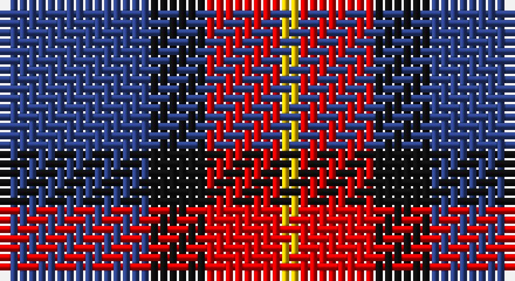

This page is one **sett** — a single exact thread-count. It belongs to the [tartan](/setts/db8k3r4ly1/)
(the same proportion at any scale), whose colour order is pattern [BKRY](/stripes/bkry/).

Sourced from register-of-tartans.  It is a [4 stripe tartan](/stripes/stripes4/).

Original link https://www.tartanregister.gov.uk/tartanDetails.aspx?ref=4218

## Also known as

This cloth is also recorded under:

- Unidentified #17

2 attestations — the source records this cloth was collapsed from (oldest owns this page)

<ul>
<li>undated — Unidentified #17 (register-of-tartans, <a href="https://www.tartanregister.gov.uk/tartanDetails.aspx?ref=4218">record</a>)</li>
<li>undated — Unidentified 27 (weddslist, <a href="http://www.weddslist.com/cgi-bin/tartans/pg.pl?source=sts">record</a>)</li>
</ul>

## Register references

External register numbers recorded for this tartan.

- Scottish Register of Tartans: [4218](https://www.tartanregister.gov.uk/tartanDetails.aspx?ref=4218)
- Scottish Tartans World Register: 364

## Thread count
B/16 K6 R8 Y/2

One full sett is **46 threads**.

## Palette

Palette: <strong>Logan (The Scottish Gael, 1831)</strong>
<table><thead><tr><th>Colour</th><th>Threads</th><th>Shade</th><th>Base</th><th>OKLCh</th></tr></thead><tbody><tr><td>B/</td><td style="text-align:right;font-variant-numeric:tabular-nums">16</td><td><code style="background-color:#2C4084;">#2C4084</code> <small style="color:#888">#2C4084</small></td><td>B <code style="background-color:#2A418A;">#2A418A</code></td><td><small style="color:#888">oklch(39.4% 0.117 268.3)</small></td></tr><tr><td>K</td><td style="text-align:right;font-variant-numeric:tabular-nums">6</td><td><code style="background-color:#101010;">#101010</code> <small style="color:#888">#101010</small></td><td>K <code style="background-color:#000000;">#000000</code></td><td><small style="color:#888">oklch(17.3% 0.000 89.9)</small></td></tr><tr><td>R</td><td style="text-align:right;font-variant-numeric:tabular-nums">8</td><td><code style="background-color:#DC0000;">#DC0000</code> <small style="color:#888">#DC0000</small></td><td>R <code style="background-color:#CC0000;">#CC0000</code></td><td><small style="color:#888">oklch(56.2% 0.230 29.2)</small></td></tr><tr><td>Y/</td><td style="text-align:right;font-variant-numeric:tabular-nums">2</td><td><code style="background-color:#E8C000;">#E8C000</code> <small style="color:#888">#E8C000</small></td><td>Y <code style="background-color:#F2BF00;">#F2BF00</code></td><td><small style="color:#888">oklch(81.9% 0.168 93.7)</small></td></tr></tbody></table>

# Sample pattern

## Nearest tartans

The nearest existing variants by ΔTartan distance, with this tartan at the top so the swatches line up against it.

ΔTartan

Tartan

Sett

—

<a href="/ttd/edit/#slug=db8k3r4ly1~x2">Unidentified #17</a> <a class="nn-out" href="/variants/s4/db8k3r4ly1~x2/" title="open its dictionary page">↗</a>

1.12

<a href="/ttd/edit/#slug=g5dp2db5dp10ly2~x2&amp;base=db8k3r4ly1~x2">Bryson (2000)</a> <a class="nn-out" href="/variants/s5/g5dp2db5dp10ly2~x2/" title="open its dictionary page">↗</a>

1.17

<a href="/ttd/edit/#slug=db3r2g5r8db12w3~x2&amp;base=db8k3r4ly1~x2">Edinburgh Bus Company (Corporate)</a> <a class="nn-out" href="/variants/s6/db3r2g5r8db12w3~x2/" title="open its dictionary page">↗</a>

1.20

<a href="/ttd/edit/#slug=db13k13db13r29ly4~x2&amp;base=db8k3r4ly1~x2">Highland Pub Company</a> <a class="nn-out" href="/variants/s5/db13k13db13r29ly4~x2/" title="open its dictionary page">↗</a>

1.21

<a href="/ttd/edit/#slug=o24r11k6db4~x4&amp;base=db8k3r4ly1~x2">Nebar (Corporate)</a> <a class="nn-out" href="/variants/s4/o24r11k6db4~x4/" title="open its dictionary page">↗</a>

1.22

<a href="/ttd/edit/#slug=db13r5g5w3~x8&amp;base=db8k3r4ly1~x2">International Highland Games Fed.</a> <a class="nn-out" href="/variants/s4/db13r5g5w3~x8/" title="open its dictionary page">↗</a>

1.23

<a href="/ttd/edit/#slug=g21db34r14w6~x2&amp;base=db8k3r4ly1~x2">Harbison (2015)</a> <a class="nn-out" href="/variants/s4/g21db34r14w6~x2/" title="open its dictionary page">↗</a>

1.24

<a href="/ttd/edit/#slug=r5db35k25db8ly10r5~x2&amp;base=db8k3r4ly1~x2">University of Notre Dame</a> <a class="nn-out" href="/variants/s6/r5db35k25db8ly10r5~x2/" title="open its dictionary page">↗</a>

1.30

<a href="/ttd/edit/#slug=r12db3g5db16ly2g2~x2&amp;base=db8k3r4ly1~x2">Dunbog Primary (School)</a> <a class="nn-out" href="/variants/s6/r12db3g5db16ly2g2~x2/" title="open its dictionary page">↗</a>

1.31

<a href="/ttd/edit/#slug=dg15r3dp11lb2&amp;base=db8k3r4ly1~x2">MacNab WI2</a> <a class="nn-out" href="/variants/s4/dg15r3dp11lb2/" title="open its dictionary page">↗</a>

1.33

<a href="/ttd/edit/#slug=k60w8lo15dp74k14&amp;base=db8k3r4ly1~x2">Gingles (Personal)</a> <a class="nn-out" href="/variants/s5/k60w8lo15dp74k14/" title="open its dictionary page">↗</a>

## Neighbour map

Every grey dot is one of 14360 variants placed by the first two principal components of the ΔTartan feature space (44% of its variance). Red is this tartan; blue dots are its nearest — click one to open its page.

<svg viewBox="0 0 640 380" role="img" style="max-width:100%;height:auto;border:1px solid #e0e0e0;border-radius:4px;display:block" xmlns="http://www.w3.org/2000/svg"><image href="/nn/cloud.v1.png" width="640" height="380"/><a href="/variants/s5/g5dp2db5dp10ly2~x2/"><circle cx="217.9" cy="263.0" r="4" fill="#3465a4"><title>Bryson (2000)</title></circle></a><a href="/variants/s6/db3r2g5r8db12w3~x2/"><circle cx="181.6" cy="231.2" r="4" fill="#3465a4"><title>Edinburgh Bus Company (Corporate)</title></circle></a><a href="/variants/s5/db13k13db13r29ly4~x2/"><circle cx="184.1" cy="249.7" r="4" fill="#3465a4"><title>Highland Pub Company</title></circle></a><a href="/variants/s4/o24r11k6db4~x4/"><circle cx="267.9" cy="259.5" r="4" fill="#3465a4"><title>Nebar (Corporate)</title></circle></a><a href="/variants/s4/db13r5g5w3~x8/"><circle cx="193.9" cy="271.4" r="4" fill="#3465a4"><title>International Highland Games Fed.</title></circle></a><a href="/variants/s4/g21db34r14w6~x2/"><circle cx="175.6" cy="267.1" r="4" fill="#3465a4"><title>Harbison (2015)</title></circle></a><a href="/variants/s6/r5db35k25db8ly10r5~x2/"><circle cx="220.4" cy="222.4" r="4" fill="#3465a4"><title>University of Notre Dame</title></circle></a><a href="/variants/s6/r12db3g5db16ly2g2~x2/"><circle cx="223.3" cy="210.7" r="4" fill="#3465a4"><title>Dunbog Primary (School)</title></circle></a><a href="/variants/s4/dg15r3dp11lb2/"><circle cx="252.9" cy="255.8" r="4" fill="#3465a4"><title>MacNab WI2</title></circle></a><a href="/variants/s5/k60w8lo15dp74k14/"><circle cx="247.5" cy="218.8" r="4" fill="#3465a4"><title>Gingles (Personal)</title></circle></a><circle cx="237.3" cy="247.0" r="5" fill="#c00000"/></svg>

ID: /variants/s4/db8k3r4ly1~x2/
