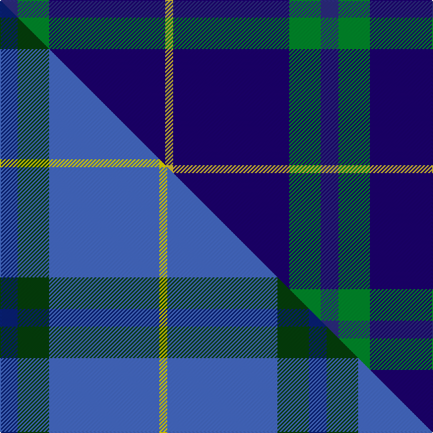

This page is one **sett** — a single exact thread-count. It belongs to the [tartan](/setts/dbi9g16db59ly4/)
(the same proportion at any scale), whose colour order is pattern [BGBY](/stripes/bgby/).

Part of the [Oxford University](/tartans/oxford-university/) tartan — the named design grouping this sett with its other cloths.

Sourced from tartans-authority.  It is a [4 stripe tartan](/stripes/stripes4/).

Original link http://www.tartansauthority.com/tartan-ferret/display/2652/

## Register references

External register numbers recorded for this tartan.

- Scottish Tartans Authority (ITI): 2652

## Thread count
DBi/18 G32 DB118 LY/8

One full sett is **326 threads**.

## Palette
<table><thead><tr><th>Colour</th><th>Shade</th><th>OKLCh</th></tr></thead><tbody><tr><td>DB</td><td><code style="background-color:#2C2C80;">#2C2C80</code> <small style="color:#888">#2C2C80</small></td><td><small style="color:#888">oklch(35.0% 0.138 276.6)</small></td></tr><tr><td>DB</td><td><code style="background-color:#1C0070;">#1C0070</code> <small style="color:#888">#1C0070</small></td><td><small style="color:#888">oklch(26.3% 0.162 277.1)</small></td></tr><tr><td>G</td><td><code style="background-color:#008B2A;">#008B2A</code> <small style="color:#888">#008B2A</small></td><td><small style="color:#888">oklch(55.4% 0.170 145.9)</small></td></tr><tr><td>LY</td><td><code style="background-color:#DCBC32;">#DCBC32</code> <small style="color:#888">#DCBC32</small></td><td><small style="color:#888">oklch(80.0% 0.150 95.2)</small></td></tr></tbody></table>

# Sample pattern

## Compared to the master

This cloth is one sett of its design; the master sett (the exemplar the design is anchored on) is below for comparison.

Its **ΔTartan distance** from the master is **0.99** — the same measure the nearest-tartans table ranks by (0 is identical; a re-scale of the same cloth is near 0, a recolour or a different proportion further).

<figure class="master-compare" style="margin:0">

this sett
master sett ★

<figcaption style="color:#888;font-size:smaller">One weave of this sett against the <a href="/setts/db9dg16b56ly4/">master sett ★</a>, split on the diagonal: a shared proportion runs seamlessly across it with only the shades shifting; a different proportion breaks on it.</figcaption>
</figure>

## Nearest tartan variants

The nearest existing variants by ΔTartan distance, with this cloth at the top so the swatches line up against it.

ΔTartan

Threads

Variant

Sett

—

326

<a href="/variants/s4/dbi9g16db59ly4~x2~dbi1406275-db1106275/">Oxford University (Corporate)</a>

<a href="/ttd/edit/#slug=db60g16w8y3~x2&amp;base=dbi9g16db59ly4~x2~dbi1406275-db1106275" title="compare in the TTD">0.65</a>

222

<a href="/variants/s4/db60g16w8y3~x2/">MaleHsuHK (Hong Kong) (Personal)</a>

<a href="/ttd/edit/#slug=db60g16w8dy3~x2&amp;base=dbi9g16db59ly4~x2~dbi1406275-db1106275" title="compare in the TTD">0.66</a>

222

<a href="/variants/s4/db60g16w8dy3~x2/">Hsu (Personal)</a>

<a href="/ttd/edit/#slug=db9dg16b56ly4~x2~dg1304144-ly3608101&amp;base=dbi9g16db59ly4~x2~dbi1406275-db1106275" title="compare in the TTD">0.99</a>

314

<a href="/variants/s4/db9dg16b56ly4~x2~dg1304144-ly3608101/">Oxford University</a>

<a href="/ttd/edit/#slug=db62ly4dy10do3g21~x2&amp;base=dbi9g16db59ly4~x2~dbi1406275-db1106275" title="compare in the TTD">1.12</a>

234

<a href="/variants/s5/db62ly4dy10do3g21~x2/">McGovern (2016)</a>

<a href="/ttd/edit/#slug=g20r7db40w2~x2&amp;base=dbi9g16db59ly4~x2~dbi1406275-db1106275" title="compare in the TTD">1.62</a>

232

<a href="/variants/s4/g20r7db40w2~x2/">McNiff, Kevin (Personal)</a>

<a href="/ttd/edit/#slug=db26lb6g1r1w2~x2&amp;base=dbi9g16db59ly4~x2~dbi1406275-db1106275" title="compare in the TTD">1.70</a>

88

<a href="/variants/s5/db26lb6g1r1w2~x2/">Special Air Service</a>

<a href="/ttd/edit/#slug=w4lb28db49y3~x2&amp;base=dbi9g16db59ly4~x2~dbi1406275-db1106275" title="compare in the TTD">1.83</a>

322

<a href="/variants/s4/w4lb28db49y3~x2/">McKerrell of Hillhouse Htg (Clan)</a>

<a href="/ttd/edit/#slug=w4lb28dt49y3~x2~dt1204274&amp;base=dbi9g16db59ly4~x2~dbi1406275-db1106275" title="compare in the TTD">1.83</a>

322

<a href="/variants/s4/w4lb28db49y3~x2~db1204274/">McKerrell of Hillhouse</a>

<a href="/ttd/edit/#slug=db14k3dr3w1~x2&amp;base=dbi9g16db59ly4~x2~dbi1406275-db1106275" title="compare in the TTD">1.87</a>

54

<a href="/variants/s4/db14k3dr3w1~x2/">Bacon, Blue</a>

<a href="/ttd/edit/#slug=lb20dp3db7dy1~x4&amp;base=dbi9g16db59ly4~x2~dbi1406275-db1106275" title="compare in the TTD">1.96</a>

164

<a href="/variants/s4/lb20dp3db7dy1~x4/">Peacock (Samantha)</a>

## Neighbour map

Every grey dot is one of 13620 variants placed by the first two principal components of the ΔTartan feature space (42% of its variance). Red is this tartan; blue dots are its nearest — click one to open its page.

<svg viewBox="0 0 640 380" role="img" style="max-width:100%;height:auto;border:1px solid #e0e0e0;border-radius:4px;display:block" xmlns="http://www.w3.org/2000/svg"><image href="/nn/cloud.v1.png" width="640" height="380"/><a href="/variants/s4/db60g16w8y3~x2/"><circle cx="429.9" cy="197.7" r="4" fill="#3465a4"><title>MaleHsuHK (Hong Kong) (Personal)</title></circle></a><a href="/variants/s4/db60g16w8dy3~x2/"><circle cx="431.2" cy="198.0" r="4" fill="#3465a4"><title>Hsu (Personal)</title></circle></a><a href="/variants/s4/db9dg16b56ly4~x2~dg1304144-ly3608101/"><circle cx="441.5" cy="233.0" r="4" fill="#3465a4"><title>Oxford University</title></circle></a><a href="/variants/s5/db62ly4dy10do3g21~x2/"><circle cx="402.6" cy="184.3" r="4" fill="#3465a4"><title>McGovern (2016)</title></circle></a><a href="/variants/s4/g20r7db40w2~x2/"><circle cx="344.8" cy="202.7" r="4" fill="#3465a4"><title>McNiff, Kevin (Personal)</title></circle></a><a href="/variants/s5/db26lb6g1r1w2~x2/"><circle cx="428.8" cy="129.3" r="4" fill="#3465a4"><title>Special Air Service</title></circle></a><a href="/variants/s4/w4lb28db49y3~x2/"><circle cx="356.0" cy="213.7" r="4" fill="#3465a4"><title>McKerrell of Hillhouse Htg (Clan)</title></circle></a><a href="/variants/s4/w4lb28db49y3~x2~db1204274/"><circle cx="356.7" cy="211.9" r="4" fill="#3465a4"><title>McKerrell of Hillhouse</title></circle></a><a href="/variants/s4/db14k3dr3w1~x2/"><circle cx="384.2" cy="192.8" r="4" fill="#3465a4"><title>Bacon, Blue</title></circle></a><a href="/variants/s4/lb20dp3db7dy1~x4/"><circle cx="397.6" cy="201.6" r="4" fill="#3465a4"><title>Peacock (Samantha)</title></circle></a><circle cx="437.0" cy="220.7" r="5" fill="#c00000"/><text x="320" y="376" text-anchor="middle" font-size="11" fill="#999">ground</text><text x="11" y="190" text-anchor="middle" font-size="11" fill="#999" transform="rotate(-90 11 190)">complexity</text></svg>

ID: /variants/s4/dbi9g16db59ly4~x2~dbi1406275-db1106275/
