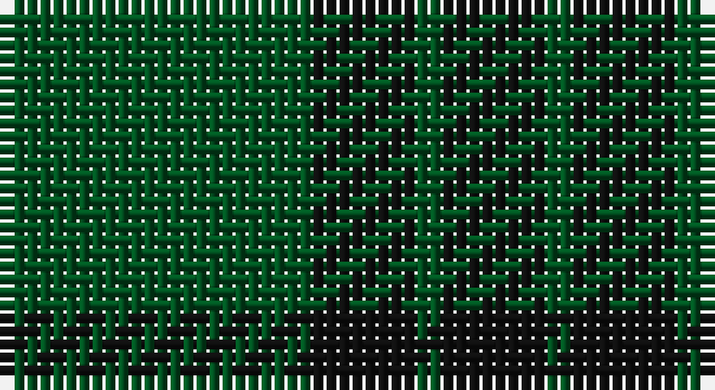

This page is one **sett** — a single exact thread-count. It belongs to the [tartan](/setts/dg12k4dg1/)
(the same proportion at any scale), whose colour order is pattern [GKGK](/stripes/gkgk/).

Part of the [Graham](/tartans/graham/) tartan — the named design grouping this sett with its other cloths.

Sourced from register-of-tartans.  It is a [4 stripe tartan](/stripes/stripes4/).

Original link https://www.tartanregister.gov.uk/tartanDetails.aspx?ref=1479

## Also known as

This cloth is also recorded under:

- Graham Grey
- Graham Red

## Register references

External register numbers recorded for this tartan.

- Scottish Register of Tartans: [1479](https://www.tartanregister.gov.uk/tartanDetails.aspx?ref=1479)
- Scottish Tartans World Register: 786

## Thread count
G/24 K8 G2 K/8

One full sett is **52 threads**.

## Palette

Palette: <strong>Tartan Register</strong>
<table><thead><tr><th>Colour</th><th>Threads</th><th>Shade</th><th>Base</th><th>OKLCh</th></tr></thead><tbody><tr><td>G/</td><td style="text-align:right;font-variant-numeric:tabular-nums">24</td><td><code style="background-color:#005020;">#005020</code> <small style="color:#888">#005020</small></td><td>G <code style="background-color:#006100;">#006100</code></td><td><small style="color:#888">oklch(37.7% 0.105 149.6)</small></td></tr><tr><td>K</td><td style="text-align:right;font-variant-numeric:tabular-nums">8</td><td><code style="background-color:#101010;">#101010</code> <small style="color:#888">#101010</small></td><td>K <code style="background-color:#000000;">#000000</code></td><td><small style="color:#888">oklch(17.3% 0.000 89.9)</small></td></tr><tr><td>G</td><td style="text-align:right;font-variant-numeric:tabular-nums">2</td><td><code style="background-color:#005020;">#005020</code> <small style="color:#888">#005020</small></td><td>G <code style="background-color:#006100;">#006100</code></td><td><small style="color:#888">oklch(37.7% 0.105 149.6)</small></td></tr><tr><td>K/</td><td style="text-align:right;font-variant-numeric:tabular-nums">8</td><td><code style="background-color:#101010;">#101010</code> <small style="color:#888">#101010</small></td><td>K <code style="background-color:#000000;">#000000</code></td><td><small style="color:#888">oklch(17.3% 0.000 89.9)</small></td></tr></tbody></table>

# Sample pattern

## Nearest tartans

The nearest existing variants by ΔTartan distance, with this tartan at the top so the swatches line up against it.

ΔTartan

Tartan

Sett

—

<a href="/ttd/edit/#slug=dg12k4dg1~x2">Graham</a> <a class="nn-out" href="/variants/s4/dg12k4dg1~x2/" title="open its dictionary page">↗</a>

1.48

<a href="/ttd/edit/#slug=k6dg3k3dg11k1dg2~x4&amp;base=dg12k4dg1~x2">Carnet (Fashion)</a> <a class="nn-out" href="/variants/s6/k6dg3k3dg11k1dg2~x4/" title="open its dictionary page">↗</a>

1.81

<a href="/ttd/edit/#slug=dg37dy9dg3r9dy3~x2&amp;base=dg12k4dg1~x2">Glen Trool District Tartan</a> <a class="nn-out" href="/variants/s5/dg37dy9dg3r9dy3~x2/" title="open its dictionary page">↗</a>

1.86

<a href="/ttd/edit/#slug=g37o9g3dr9o3~x2&amp;base=dg12k4dg1~x2">Glen Boig</a> <a class="nn-out" href="/variants/s5/g37o9g3dr9o3~x2/" title="open its dictionary page">↗</a>

1.88

<a href="/ttd/edit/#slug=r6dg2db2dg17r2~x4&amp;base=dg12k4dg1~x2">Loton (Personal)</a> <a class="nn-out" href="/variants/s5/r6dg2db2dg17r2~x4/" title="open its dictionary page">↗</a>

1.90

<a href="/ttd/edit/#slug=dg2k12dg1k12dg12r2~x2&amp;base=dg12k4dg1~x2">Gunn (Logan)</a> <a class="nn-out" href="/variants/s6/dg2k12dg1k12dg12r2~x2/" title="open its dictionary page">↗</a>

1.96

<a href="/variants/s4/g6db2g1~x4/">Montgomery</a>

1.96

<a href="/variants/s4/g6db2g1~x8/">Montgomery - 1842 (VS</a>

1.99

<a href="/ttd/edit/#slug=dg30dgi13dg7dgi30dg2ly4~x2&amp;base=dg12k4dg1~x2">MacSporran Rejected design</a> <a class="nn-out" href="/variants/s6/dg30dgi13dg7dgi30dg2ly4~x2/" title="open its dictionary page">↗</a>

2.00

<a href="/ttd/edit/#slug=db2dg15do3db7dg7db2~x4&amp;base=dg12k4dg1~x2">Green Highland, The (Fashion)</a> <a class="nn-out" href="/variants/s6/db2dg15do3db7dg7db2~x4/" title="open its dictionary page">↗</a>

2.03

<a href="/ttd/edit/#slug=n6k16n6k16n45k4~x2&amp;base=dg12k4dg1~x2">Grey Spirit Fashion Tartan</a> <a class="nn-out" href="/variants/s6/n6k16n6k16n45k4~x2/" title="open its dictionary page">↗</a>

## Neighbour map

Every grey dot is one of 14360 variants placed by the first two principal components of the ΔTartan feature space (44% of its variance). Red is this tartan; blue dots are its nearest — click one to open its page.

<svg viewBox="0 0 640 380" role="img" style="max-width:100%;height:auto;border:1px solid #e0e0e0;border-radius:4px;display:block" xmlns="http://www.w3.org/2000/svg"><image href="/nn/cloud.v1.png" width="640" height="380"/><a href="/variants/s6/k6dg3k3dg11k1dg2~x4/"><circle cx="505.1" cy="321.5" r="4" fill="#3465a4"><title>Carnet (Fashion)</title></circle></a><a href="/variants/s5/dg37dy9dg3r9dy3~x2/"><circle cx="476.5" cy="258.8" r="4" fill="#3465a4"><title>Glen Trool District Tartan</title></circle></a><a href="/variants/s5/g37o9g3dr9o3~x2/"><circle cx="492.4" cy="271.6" r="4" fill="#3465a4"><title>Glen Boig</title></circle></a><a href="/variants/s5/r6dg2db2dg17r2~x4/"><circle cx="452.6" cy="267.9" r="4" fill="#3465a4"><title>Loton (Personal)</title></circle></a><a href="/variants/s6/dg2k12dg1k12dg12r2~x2/"><circle cx="403.1" cy="269.8" r="4" fill="#3465a4"><title>Gunn (Logan)</title></circle></a><a href="/variants/s4/g6db2g1~x4/"><circle cx="426.2" cy="331.6" r="4" fill="#3465a4"><title>Montgomery</title></circle></a><a href="/variants/s4/g6db2g1~x8/"><circle cx="426.2" cy="331.6" r="4" fill="#3465a4"><title>Montgomery - 1842 (VS</title></circle></a><a href="/variants/s6/dg30dgi13dg7dgi30dg2ly4~x2/"><circle cx="396.3" cy="273.1" r="4" fill="#3465a4"><title>MacSporran Rejected design</title></circle></a><a href="/variants/s6/db2dg15do3db7dg7db2~x4/"><circle cx="389.1" cy="291.2" r="4" fill="#3465a4"><title>Green Highland, The (Fashion)</title></circle></a><a href="/variants/s6/n6k16n6k16n45k4~x2/"><circle cx="460.0" cy="269.0" r="4" fill="#3465a4"><title>Grey Spirit Fashion Tartan</title></circle></a><circle cx="487.9" cy="320.6" r="5" fill="#c00000"/></svg>

ID: /variants/s4/dg12k4dg1~x2/
