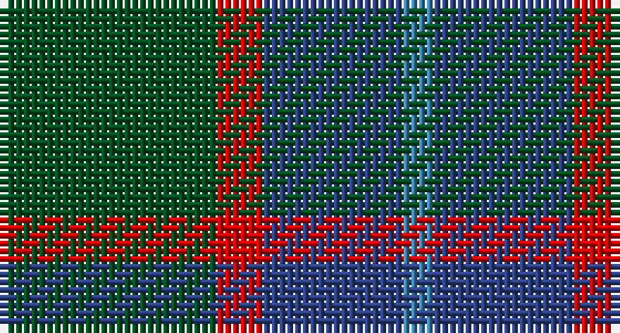

This page is one **sett** — a single exact thread-count. It belongs to the [tartan](/setts/dg14r3db9t2/)
(the same proportion at any scale), whose colour order is pattern [BBRG](/stripes/bbrg/).

Sourced from register-of-tartans.  It is a [4 stripe tartan](/stripes/stripes4/).

Original link https://www.tartanregister.gov.uk/tartanDetails.aspx?ref=4205

## Also known as

This cloth is also recorded under:

- Unidentified #4

## Register references

External register numbers recorded for this tartan.

- Scottish Register of Tartans: [4205](https://www.tartanregister.gov.uk/tartanDetails.aspx?ref=4205)
- Scottish Tartans World Register: 70

## Thread count
G/28 R6 Ba18 B/4

One full sett is **80 threads**.

## Palette

Palette: <strong>Tartan Register</strong>
<table><thead><tr><th>Colour</th><th>Threads</th><th>Shade</th><th>Base</th><th>OKLCh</th></tr></thead><tbody><tr><td>G/</td><td style="text-align:right;font-variant-numeric:tabular-nums">28</td><td><code style="background-color:#005020;">#005020</code> <small style="color:#888">#005020</small></td><td>G <code style="background-color:#006100;">#006100</code></td><td><small style="color:#888">oklch(37.7% 0.105 149.6)</small></td></tr><tr><td>R</td><td style="text-align:right;font-variant-numeric:tabular-nums">6</td><td><code style="background-color:#DC0000;">#DC0000</code> <small style="color:#888">#DC0000</small></td><td>R <code style="background-color:#CC0000;">#CC0000</code></td><td><small style="color:#888">oklch(56.2% 0.230 29.2)</small></td></tr><tr><td>Ba</td><td style="text-align:right;font-variant-numeric:tabular-nums">18</td><td><code style="background-color:#2C4084;">#2C4084</code> <small style="color:#888">#2C4084</small></td><td>B <code style="background-color:#2A418A;">#2A418A</code></td><td><small style="color:#888">oklch(39.4% 0.117 268.3)</small></td></tr><tr><td>B/</td><td style="text-align:right;font-variant-numeric:tabular-nums">4</td><td><code style="background-color:#3C82AF;">#3C82AF</code> <small style="color:#888">#3C82AF</small></td><td>B <code style="background-color:#2A418A;">#2A418A</code></td><td><small style="color:#888">oklch(58.1% 0.099 239.8)</small></td></tr></tbody></table>

# Sample pattern

## Nearest tartans

The nearest existing variants by ΔTartan distance, with this tartan at the top so the swatches line up against it.

ΔTartan

Tartan

Sett

—

<a href="/ttd/edit/#slug=dg14r3db9t2~x2">Unidentified #4</a> <a class="nn-out" href="/variants/s4/dg14r3db9t2~x2/" title="open its dictionary page">↗</a>

0.67

<a href="/ttd/edit/#slug=dg15r3db11t2~x2&amp;base=dg14r3db9t2~x2">MacNab</a> <a class="nn-out" href="/variants/s4/dg15r3db11t2~x2/" title="open its dictionary page">↗</a>

1.06

<a href="/ttd/edit/#slug=dt3g11dt3dr11dt18lo3~x2&amp;base=dg14r3db9t2~x2">Harbour Town Hilton Head, The</a> <a class="nn-out" href="/variants/s6/dt3g11dt3dr11dt18lo3~x2/" title="open its dictionary page">↗</a>

1.13

<a href="/ttd/edit/#slug=db3o10g9r1g3~x4&amp;base=dg14r3db9t2~x2">Bethlehem, City of (District)</a> <a class="nn-out" href="/variants/s5/db3o10g9r1g3~x4/" title="open its dictionary page">↗</a>

1.21

<a href="/ttd/edit/#slug=g14r3db9t2~x2&amp;base=dg14r3db9t2~x2">Unidentified 10</a> <a class="nn-out" href="/variants/s4/g14r3db9t2~x2/" title="open its dictionary page">↗</a>

1.25

<a href="/ttd/edit/#slug=o1b7k4b1g7b1~x4&amp;base=dg14r3db9t2~x2">Flower of Scotland Commemorative Tartan</a> <a class="nn-out" href="/variants/s6/o1b7k4b1g7b1~x4/" title="open its dictionary page">↗</a>

1.25

<a href="/ttd/edit/#slug=o1b7k4b1g7b1~x2&amp;base=dg14r3db9t2~x2">Flower of Scotland MINI Tartan</a> <a class="nn-out" href="/variants/s6/o1b7k4b1g7b1~x2/" title="open its dictionary page">↗</a>

1.35

<a href="/ttd/edit/#slug=t4dy28dg6t12k12t3~x2&amp;base=dg14r3db9t2~x2">Thompson/Thomson/MacTavish Hunting</a> <a class="nn-out" href="/variants/s6/t4dy28dg6t12k12t3~x2/" title="open its dictionary page">↗</a>

1.38

<a href="/ttd/edit/#slug=g3t1db7t1g3k1~x8&amp;base=dg14r3db9t2~x2">Scott Green (Sir Walter)</a> <a class="nn-out" href="/variants/s6/g3t1db7t1g3k1~x8/" title="open its dictionary page">↗</a>

1.43

<a href="/ttd/edit/#slug=n4g18n3k17n18p4~x2&amp;base=dg14r3db9t2~x2">Scottish Airports</a> <a class="nn-out" href="/variants/s6/n4g18n3k17n18p4~x2/" title="open its dictionary page">↗</a>

1.45

<a href="/ttd/edit/#slug=dt6r15g41r15dt20g41db6&amp;base=dg14r3db9t2~x2">Bean of Freeport Htg (Corporate)</a> <a class="nn-out" href="/variants/s7/dt6r15g41r15dt20g41db6/" title="open its dictionary page">↗</a>

## Neighbour map

Every grey dot is one of 14360 variants placed by the first two principal components of the ΔTartan feature space (44% of its variance). Red is this tartan; blue dots are its nearest — click one to open its page.

<svg viewBox="0 0 640 380" role="img" style="max-width:100%;height:auto;border:1px solid #e0e0e0;border-radius:4px;display:block" xmlns="http://www.w3.org/2000/svg"><image href="/nn/cloud.v1.png" width="640" height="380"/><a href="/variants/s4/dg15r3db11t2~x2/"><circle cx="282.6" cy="278.9" r="4" fill="#3465a4"><title>MacNab</title></circle></a><a href="/variants/s6/dt3g11dt3dr11dt18lo3~x2/"><circle cx="278.0" cy="278.7" r="4" fill="#3465a4"><title>Harbour Town Hilton Head, The</title></circle></a><a href="/variants/s5/db3o10g9r1g3~x4/"><circle cx="279.3" cy="256.1" r="4" fill="#3465a4"><title>Bethlehem, City of (District)</title></circle></a><a href="/variants/s4/g14r3db9t2~x2/"><circle cx="267.3" cy="272.4" r="4" fill="#3465a4"><title>Unidentified 10</title></circle></a><a href="/variants/s6/o1b7k4b1g7b1~x4/"><circle cx="238.7" cy="253.6" r="4" fill="#3465a4"><title>Flower of Scotland Commemorative Tartan</title></circle></a><a href="/variants/s6/o1b7k4b1g7b1~x2/"><circle cx="238.7" cy="253.6" r="4" fill="#3465a4"><title>Flower of Scotland MINI Tartan</title></circle></a><a href="/variants/s6/t4dy28dg6t12k12t3~x2/"><circle cx="249.8" cy="242.4" r="4" fill="#3465a4"><title>Thompson/Thomson/MacTavish Hunting</title></circle></a><a href="/variants/s6/g3t1db7t1g3k1~x8/"><circle cx="249.7" cy="253.0" r="4" fill="#3465a4"><title>Scott Green (Sir Walter)</title></circle></a><a href="/variants/s6/n4g18n3k17n18p4~x2/"><circle cx="211.5" cy="276.1" r="4" fill="#3465a4"><title>Scottish Airports</title></circle></a><a href="/variants/s7/dt6r15g41r15dt20g41db6/"><circle cx="304.7" cy="259.1" r="4" fill="#3465a4"><title>Bean of Freeport Htg (Corporate)</title></circle></a><circle cx="292.0" cy="285.5" r="5" fill="#c00000"/></svg>

ID: /variants/s4/dg14r3db9t2~x2/
