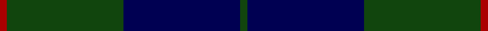
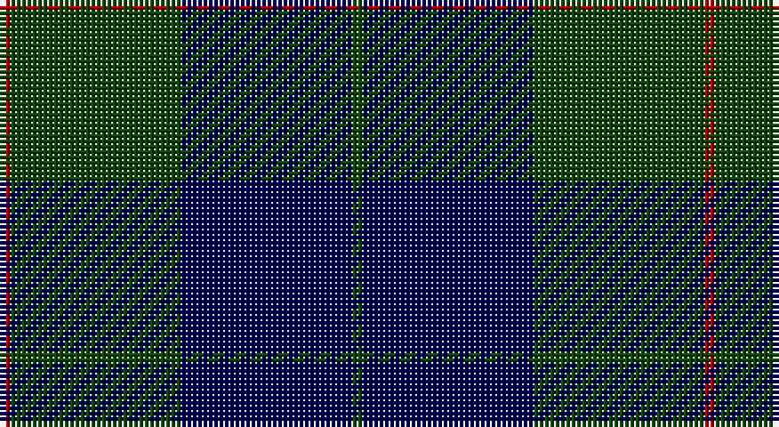

This page is one **sett** — a single exact thread-count. It belongs to the [tartan](/setts/dg1db16dg16r1/)
(the same proportion at any scale), whose colour order is pattern [GBGR](/stripes/gbgr/).

Sourced from weddslist.  It is a [4 stripe tartan](/stripes/stripes4/).

Original link http://www.weddslist.com/cgi-bin/tartans/pg.pl?source=tinsel

## Thread count
DR/2 DG32 DB32 DG/2

One full sett is **132 threads**.

## Palette

Palette: <strong>custom</strong>
<table><thead><tr><th>Colour</th><th>Threads</th><th>Shade</th><th>Base</th><th>OKLCh</th></tr></thead><tbody><tr><td>DR/</td><td style="text-align:right;font-variant-numeric:tabular-nums">2</td><td><code style="background-color:#AA0000;">#AA0000</code> <small style="color:#888">#AA0000</small></td><td>R <code style="background-color:#CC0000;">#CC0000</code></td><td><small style="color:#888">oklch(46.3% 0.190 29.2)</small></td></tr><tr><td>DG</td><td style="text-align:right;font-variant-numeric:tabular-nums">32</td><td><code style="background-color:#11450D;">#11450D</code> <small style="color:#888">#11450D</small></td><td>G <code style="background-color:#006100;">#006100</code></td><td><small style="color:#888">oklch(34.4% 0.101 142.1)</small></td></tr><tr><td>DB</td><td style="text-align:right;font-variant-numeric:tabular-nums">32</td><td><code style="background-color:#000052;">#000052</code> <small style="color:#888">#000052</small></td><td>B <code style="background-color:#2A418A;">#2A418A</code></td><td><small style="color:#888">oklch(19.8% 0.137 264.1)</small></td></tr><tr><td>DG/</td><td style="text-align:right;font-variant-numeric:tabular-nums">2</td><td><code style="background-color:#11450D;">#11450D</code> <small style="color:#888">#11450D</small></td><td>G <code style="background-color:#006100;">#006100</code></td><td><small style="color:#888">oklch(34.4% 0.101 142.1)</small></td></tr></tbody></table>

# Sample pattern

## Nearest tartans

The nearest existing variants by ΔTartan distance, with this tartan at the top so the swatches line up against it.

ΔTartan

Tartan

Sett

—

<a href="/ttd/edit/#slug=dg1db16dg16r1~x2">Barclay Hunting</a> <a class="nn-out" href="/variants/s4/dg1db16dg16r1~x2/" title="open its dictionary page">↗</a>

0.65

<a href="/ttd/edit/#slug=dg1db16dg16r1&amp;base=dg1db16dg16r1~x2">Barclay Hunting</a> <a class="nn-out" href="/variants/s4/dg1db16dg16r1/" title="open its dictionary page">↗</a>

1.14

<a href="/ttd/edit/#slug=r1g16db16g1~x2&amp;base=dg1db16dg16r1~x2">Barclay</a> <a class="nn-out" href="/variants/s4/r1g16db16g1~x2/" title="open its dictionary page">↗</a>

1.14

<a href="/ttd/edit/#slug=r1g16db16g1~x4&amp;base=dg1db16dg16r1~x2">Barclay Htg (Clan)</a> <a class="nn-out" href="/variants/s4/r1g16db16g1~x4/" title="open its dictionary page">↗</a>

1.26

<a href="/ttd/edit/#slug=db4dbi1dg14db14r1~x4&amp;base=dg1db16dg16r1~x2">Wcwm 1255-1</a> <a class="nn-out" href="/variants/s5/db4dbi1dg14db14r1~x4/" title="open its dictionary page">↗</a>

1.34

<a href="/ttd/edit/#slug=k2dg7db2dg7db16r1~x6&amp;base=dg1db16dg16r1~x2">Hutton</a> <a class="nn-out" href="/variants/s6/k2dg7db2dg7db16r1~x6/" title="open its dictionary page">↗</a>

1.35

<a href="/ttd/edit/#slug=k15db4k15db28r2~x2&amp;base=dg1db16dg16r1~x2">MacKay (Blue) #2</a> <a class="nn-out" href="/variants/s5/k15db4k15db28r2~x2/" title="open its dictionary page">↗</a>

1.46

<a href="/ttd/edit/#slug=db37r10dg22db11dg3r3~x2&amp;base=dg1db16dg16r1~x2">Perthshire, New /Tourist Board</a> <a class="nn-out" href="/variants/s6/db37r10dg22db11dg3r3~x2/" title="open its dictionary page">↗</a>

1.58

<a href="/ttd/edit/#slug=dg4db1dg12db12w1db4~x2&amp;base=dg1db16dg16r1~x2">Unidentified Tweed</a> <a class="nn-out" href="/variants/s6/dg4db1dg12db12w1db4~x2/" title="open its dictionary page">↗</a>

1.59

<a href="/ttd/edit/#slug=k3db23k17r2~x2&amp;base=dg1db16dg16r1~x2">Wellington Variation</a> <a class="nn-out" href="/variants/s4/k3db23k17r2~x2/" title="open its dictionary page">↗</a>

1.72

<a href="/ttd/edit/#slug=dg43k14dt14r2~x2&amp;base=dg1db16dg16r1~x2">St. Andrews International Golf Club</a> <a class="nn-out" href="/variants/s4/dg43k14dt14r2~x2/" title="open its dictionary page">↗</a>

## Neighbour map

Every grey dot is one of 14360 variants placed by the first two principal components of the ΔTartan feature space (44% of its variance). Red is this tartan; blue dots are its nearest — click one to open its page.

<svg viewBox="0 0 640 380" role="img" style="max-width:100%;height:auto;border:1px solid #e0e0e0;border-radius:4px;display:block" xmlns="http://www.w3.org/2000/svg"><image href="/nn/cloud.v1.png" width="640" height="380"/><a href="/variants/s4/dg1db16dg16r1/"><circle cx="381.8" cy="261.2" r="4" fill="#3465a4"><title>Barclay Hunting</title></circle></a><a href="/variants/s4/r1g16db16g1~x2/"><circle cx="385.3" cy="256.9" r="4" fill="#3465a4"><title>Barclay</title></circle></a><a href="/variants/s4/r1g16db16g1~x4/"><circle cx="385.3" cy="256.9" r="4" fill="#3465a4"><title>Barclay Htg (Clan)</title></circle></a><a href="/variants/s5/db4dbi1dg14db14r1~x4/"><circle cx="360.1" cy="243.3" r="4" fill="#3465a4"><title>Wcwm 1255-1</title></circle></a><a href="/variants/s6/k2dg7db2dg7db16r1~x6/"><circle cx="360.6" cy="235.5" r="4" fill="#3465a4"><title>Hutton</title></circle></a><a href="/variants/s5/k15db4k15db28r2~x2/"><circle cx="378.2" cy="271.0" r="4" fill="#3465a4"><title>MacKay (Blue) #2</title></circle></a><a href="/variants/s6/db37r10dg22db11dg3r3~x2/"><circle cx="387.9" cy="266.5" r="4" fill="#3465a4"><title>Perthshire, New /Tourist Board</title></circle></a><a href="/variants/s6/dg4db1dg12db12w1db4~x2/"><circle cx="385.7" cy="270.2" r="4" fill="#3465a4"><title>Unidentified Tweed</title></circle></a><a href="/variants/s4/k3db23k17r2~x2/"><circle cx="394.4" cy="286.2" r="4" fill="#3465a4"><title>Wellington Variation</title></circle></a><a href="/variants/s4/dg43k14dt14r2~x2/"><circle cx="398.9" cy="247.5" r="4" fill="#3465a4"><title>St. Andrews International Golf Club</title></circle></a><circle cx="400.4" cy="270.1" r="5" fill="#c00000"/></svg>

ID: /variants/s4/dg1db16dg16r1~x2/
