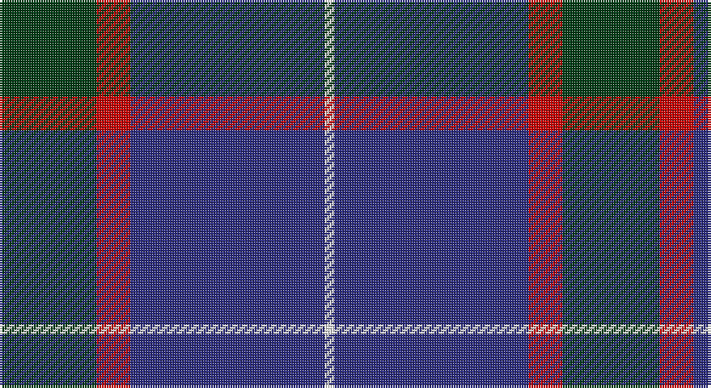

This page is one **sett** — a single exact thread-count. It belongs to the [tartan](/setts/dg20r7db40w2/)
(the same proportion at any scale), whose colour order is pattern [GRBW](/stripes/grbw/).

Sourced from register-of-tartans.  It is a [4 stripe tartan](/stripes/stripes4/).

Original link https://www.tartanregister.gov.uk/tartanDetails.aspx?ref=11140

## Register references

External register numbers recorded for this tartan.

- Scottish Register of Tartans: [11140](https://www.tartanregister.gov.uk/tartanDetails.aspx?ref=11140)

## Thread count
DG/40 R14 DB80 W/4

One full sett is **232 threads**.

## Palette

Palette: <strong>Tartan Register</strong>
<table><thead><tr><th>Colour</th><th>Threads</th><th>Shade</th><th>Base</th><th>OKLCh</th></tr></thead><tbody><tr><td>DG/</td><td style="text-align:right;font-variant-numeric:tabular-nums">40</td><td><code style="background-color:#003C14;">#003C14</code> <small style="color:#888">#003C14</small></td><td>G <code style="background-color:#006100;">#006100</code></td><td><small style="color:#888">oklch(31.1% 0.089 148.5)</small></td></tr><tr><td>R</td><td style="text-align:right;font-variant-numeric:tabular-nums">14</td><td><code style="background-color:#C80000;">#C80000</code> <small style="color:#888">#C80000</small></td><td>R <code style="background-color:#CC0000;">#CC0000</code></td><td><small style="color:#888">oklch(52.3% 0.215 29.2)</small></td></tr><tr><td>DB</td><td style="text-align:right;font-variant-numeric:tabular-nums">80</td><td><code style="background-color:#2C2C80;">#2C2C80</code> <small style="color:#888">#2C2C80</small></td><td>B <code style="background-color:#2A418A;">#2A418A</code></td><td><small style="color:#888">oklch(35.0% 0.138 276.6)</small></td></tr><tr><td>W/</td><td style="text-align:right;font-variant-numeric:tabular-nums">4</td><td><code style="background-color:#F8F8F8;">#F8F8F8</code> <small style="color:#888">#F8F8F8</small></td><td>W <code style="background-color:#F7F7F7;">#F7F7F7</code></td><td><small style="color:#888">oklch(97.9% 0.000 89.9)</small></td></tr></tbody></table>

# Sample pattern

## Nearest tartans

The nearest existing variants by ΔTartan distance, with this tartan at the top so the swatches line up against it.

ΔTartan

Tartan

Sett

—

<a href="/ttd/edit/#slug=dg20r7db40w2~x2">McNiff, Kevin (Personal)</a> <a class="nn-out" href="/variants/s4/dg20r7db40w2~x2/" title="open its dictionary page">↗</a>

0.91

<a href="/ttd/edit/#slug=g20r7db40w2~x2&amp;base=dg20r7db40w2~x2">McNiff, Kevin (Personal)</a> <a class="nn-out" href="/variants/s4/g20r7db40w2~x2/" title="open its dictionary page">↗</a>

1.16

<a href="/ttd/edit/#slug=r5db26k12w2~x4&amp;base=dg20r7db40w2~x2">Mirror (Corporate)</a> <a class="nn-out" href="/variants/s4/r5db26k12w2~x4/" title="open its dictionary page">↗</a>

1.30

<a href="/ttd/edit/#slug=r1db12y5db2y4lb1~x2&amp;base=dg20r7db40w2~x2">Connaught Green</a> <a class="nn-out" href="/variants/s6/r1db12y5db2y4lb1~x2/" title="open its dictionary page">↗</a>

1.34

<a href="/ttd/edit/#slug=w4t34db60ly3~x2&amp;base=dg20r7db40w2~x2">MacKerral Family Tartan</a> <a class="nn-out" href="/variants/s4/w4t34db60ly3~x2/" title="open its dictionary page">↗</a>

1.39

<a href="/ttd/edit/#slug=dp6ly1dp20db6g19dp2~x4&amp;base=dg20r7db40w2~x2">Discover Islay (District)</a> <a class="nn-out" href="/variants/s6/dp6ly1dp20db6g19dp2~x4/" title="open its dictionary page">↗</a>

1.39

<a href="/ttd/edit/#slug=n42db2n2db17lo8db4~x2&amp;base=dg20r7db40w2~x2">Connecticut State Police PB (Cor.)</a> <a class="nn-out" href="/variants/s6/n42db2n2db17lo8db4~x2/" title="open its dictionary page">↗</a>

1.39

<a href="/ttd/edit/#slug=r1db9k4lb1~x4&amp;base=dg20r7db40w2~x2">Scottish Nuclear (Corporate)</a> <a class="nn-out" href="/variants/s4/r1db9k4lb1~x4/" title="open its dictionary page">↗</a>

1.41

<a href="/ttd/edit/#slug=b18k2b4k6dp12lo1~x2&amp;base=dg20r7db40w2~x2">Joker, The</a> <a class="nn-out" href="/variants/s6/b18k2b4k6dp12lo1~x2/" title="open its dictionary page">↗</a>

1.46

<a href="/ttd/edit/#slug=k9n3k28n25w2~x2&amp;base=dg20r7db40w2~x2">Press &amp; Journal</a> <a class="nn-out" href="/variants/s5/k9n3k28n25w2~x2/" title="open its dictionary page">↗</a>

1.47

<a href="/ttd/edit/#slug=w4t28db49ly3~x2&amp;base=dg20r7db40w2~x2">McKerrell of Hillhouse</a> <a class="nn-out" href="/variants/s4/w4t28db49ly3~x2/" title="open its dictionary page">↗</a>

## Neighbour map

Every grey dot is one of 14360 variants placed by the first two principal components of the ΔTartan feature space (44% of its variance). Red is this tartan; blue dots are its nearest — click one to open its page.

<svg viewBox="0 0 640 380" role="img" style="max-width:100%;height:auto;border:1px solid #e0e0e0;border-radius:4px;display:block" xmlns="http://www.w3.org/2000/svg"><image href="/nn/cloud.v1.png" width="640" height="380"/><a href="/variants/s4/g20r7db40w2~x2/"><circle cx="345.8" cy="212.4" r="4" fill="#3465a4"><title>McNiff, Kevin (Personal)</title></circle></a><a href="/variants/s4/r5db26k12w2~x4/"><circle cx="329.8" cy="227.5" r="4" fill="#3465a4"><title>Mirror (Corporate)</title></circle></a><a href="/variants/s6/r1db12y5db2y4lb1~x2/"><circle cx="353.3" cy="220.4" r="4" fill="#3465a4"><title>Connaught Green</title></circle></a><a href="/variants/s4/w4t34db60ly3~x2/"><circle cx="380.2" cy="207.9" r="4" fill="#3465a4"><title>MacKerral Family Tartan</title></circle></a><a href="/variants/s6/dp6ly1dp20db6g19dp2~x4/"><circle cx="336.7" cy="196.1" r="4" fill="#3465a4"><title>Discover Islay (District)</title></circle></a><a href="/variants/s6/n42db2n2db17lo8db4~x2/"><circle cx="380.8" cy="179.7" r="4" fill="#3465a4"><title>Connecticut State Police PB (Cor.)</title></circle></a><a href="/variants/s4/r1db9k4lb1~x4/"><circle cx="346.3" cy="244.6" r="4" fill="#3465a4"><title>Scottish Nuclear (Corporate)</title></circle></a><a href="/variants/s6/b18k2b4k6dp12lo1~x2/"><circle cx="306.2" cy="200.1" r="4" fill="#3465a4"><title>Joker, The</title></circle></a><a href="/variants/s5/k9n3k28n25w2~x2/"><circle cx="370.4" cy="242.7" r="4" fill="#3465a4"><title>Press &amp; Journal</title></circle></a><a href="/variants/s4/w4t28db49ly3~x2/"><circle cx="345.4" cy="211.7" r="4" fill="#3465a4"><title>McKerrell of Hillhouse</title></circle></a><circle cx="370.3" cy="222.1" r="5" fill="#c00000"/></svg>

ID: /variants/s4/dg20r7db40w2~x2/
