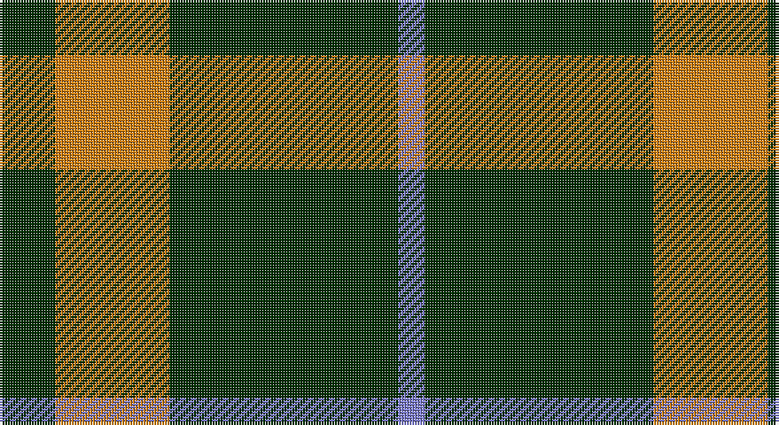

This page is one **sett** — a single exact thread-count. It belongs to the [tartan](/setts/dg21lo43dg86b10/)
(the same proportion at any scale), whose colour order is pattern [BGYG](/stripes/bgyg/).

Part of the [Special Saffron](/tartans/special-saffron/) tartan — the named design grouping this sett with its other cloths.

Sourced from weddslist.  It is a [4 stripe tartan](/stripes/stripes4/).

Original link http://www.weddslist.com/cgi-bin/tartans/pg.pl?source=sts

## Also known as

This cloth is also recorded under:

- Special, Saffron

## Thread count
DG/21 O43 DG86 B/10

One full sett is **289 threads**.

## Palette

Palette: <strong>custom</strong>
<table><thead><tr><th>Colour</th><th>Threads</th><th>Shade</th><th>Base</th><th>OKLCh</th></tr></thead><tbody><tr><td>DG/</td><td style="text-align:right;font-variant-numeric:tabular-nums">21</td><td><code style="background-color:#003000;">#003000</code> <small style="color:#888">#003000</small></td><td>G <code style="background-color:#006100;">#006100</code></td><td><small style="color:#888">oklch(26.8% 0.091 142.5)</small></td></tr><tr><td>O</td><td style="text-align:right;font-variant-numeric:tabular-nums">43</td><td><code style="background-color:#D08010;">#D08010</code> <small style="color:#888">#D08010</small></td><td>Y <code style="background-color:#F2BF00;">#F2BF00</code></td><td><small style="color:#888">oklch(67.0% 0.145 66.1)</small></td></tr><tr><td>DG</td><td style="text-align:right;font-variant-numeric:tabular-nums">86</td><td><code style="background-color:#003000;">#003000</code> <small style="color:#888">#003000</small></td><td>G <code style="background-color:#006100;">#006100</code></td><td><small style="color:#888">oklch(26.8% 0.091 142.5)</small></td></tr><tr><td>B/</td><td style="text-align:right;font-variant-numeric:tabular-nums">10</td><td><code style="background-color:#8080D0;">#8080D0</code> <small style="color:#888">#8080D0</small></td><td>B <code style="background-color:#2A418A;">#2A418A</code></td><td><small style="color:#888">oklch(63.4% 0.119 282.5)</small></td></tr></tbody></table>

# Sample pattern

## Compared to the master

This cloth is one sett of its design; the master sett (the exemplar the design is anchored on) is below for comparison.

<figure style="margin:0"><figcaption style="color:#888;font-size:smaller">this sett</figcaption></figure>
<figure style="margin:0"><figcaption style="color:#888;font-size:smaller"><a href="/setts/dg86lo44dg21lo44dg86t10/">master sett →</a></figcaption></figure>

## Nearest tartans

The nearest existing variants by ΔTartan distance, with this tartan at the top so the swatches line up against it.

ΔTartan

Tartan

Sett

—

<a href="/ttd/edit/#slug=dg21lo43dg86b10">Special, Saffron</a> <a class="nn-out" href="/variants/s4/dg21lo43dg86b10/" title="open its dictionary page">↗</a>

0.54

<a href="/ttd/edit/#slug=dg21lo44dg86t10&amp;base=dg21lo43dg86b10">Special Saffron (Fashion)</a> <a class="nn-out" href="/variants/s4/dg21lo44dg86t10/" title="open its dictionary page">↗</a>

0.88

<a href="/ttd/edit/#slug=dg21ly43dg86t10&amp;base=dg21lo43dg86b10">Special Saffron Tartan</a> <a class="nn-out" href="/variants/s4/dg21ly43dg86t10/" title="open its dictionary page">↗</a>

1.09

<a href="/ttd/edit/#slug=dg86lo44dg21lo44dg86t10&amp;base=dg21lo43dg86b10">Special Saffron</a> <a class="nn-out" href="/variants/s6/dg86lo44dg21lo44dg86t10/" title="open its dictionary page">↗</a>

1.15

<a href="/ttd/edit/#slug=g9k18r2~x4&amp;base=dg21lo43dg86b10">Cowie, Justine (Personal)</a> <a class="nn-out" href="/variants/s3/g9k18r2~x4/" title="open its dictionary page">↗</a>

1.33

<a href="/ttd/edit/#slug=dg20w5r3~x2&amp;base=dg21lo43dg86b10">Juchter (Personal)</a> <a class="nn-out" href="/variants/s3/dg20w5r3~x2/" title="open its dictionary page">↗</a>

1.36

<a href="/ttd/edit/#slug=g10k2dp5g1~x8&amp;base=dg21lo43dg86b10">Bumbee #1 (Fashion)</a> <a class="nn-out" href="/variants/s4/g10k2dp5g1~x8/" title="open its dictionary page">↗</a>

1.43

<a href="/ttd/edit/#slug=k3g15k20ly3~x2&amp;base=dg21lo43dg86b10">Scotch Tape 2 (Corporate)</a> <a class="nn-out" href="/variants/s4/k3g15k20ly3~x2/" title="open its dictionary page">↗</a>

1.44

<a href="/ttd/edit/#slug=dp4g10r1ly1~x2&amp;base=dg21lo43dg86b10">Wilson's No.192</a> <a class="nn-out" href="/variants/s4/dp4g10r1ly1~x2/" title="open its dictionary page">↗</a>

1.44

<a href="/ttd/edit/#slug=dp4g10r1w1~x2&amp;base=dg21lo43dg86b10">Wilson's No.189</a> <a class="nn-out" href="/variants/s4/dp4g10r1w1~x2/" title="open its dictionary page">↗</a>

1.55

<a href="/ttd/edit/#slug=g8p4g1p2~x4&amp;base=dg21lo43dg86b10">Wilson's, No 211</a> <a class="nn-out" href="/variants/s4/g8p4g1p2~x4/" title="open its dictionary page">↗</a>

## Neighbour map

Every grey dot is one of 14360 variants placed by the first two principal components of the ΔTartan feature space (44% of its variance). Red is this tartan; blue dots are its nearest — click one to open its page.

<svg viewBox="0 0 640 380" role="img" style="max-width:100%;height:auto;border:1px solid #e0e0e0;border-radius:4px;display:block" xmlns="http://www.w3.org/2000/svg"><image href="/nn/cloud.v1.png" width="640" height="380"/><a href="/variants/s4/dg21lo44dg86t10/"><circle cx="371.8" cy="263.0" r="4" fill="#3465a4"><title>Special Saffron (Fashion)</title></circle></a><a href="/variants/s4/dg21ly43dg86t10/"><circle cx="356.7" cy="255.8" r="4" fill="#3465a4"><title>Special Saffron Tartan</title></circle></a><a href="/variants/s6/dg86lo44dg21lo44dg86t10/"><circle cx="354.3" cy="257.4" r="4" fill="#3465a4"><title>Special Saffron</title></circle></a><a href="/variants/s3/g9k18r2~x4/"><circle cx="342.6" cy="278.7" r="4" fill="#3465a4"><title>Cowie, Justine (Personal)</title></circle></a><a href="/variants/s3/dg20w5r3~x2/"><circle cx="389.3" cy="269.3" r="4" fill="#3465a4"><title>Juchter (Personal)</title></circle></a><a href="/variants/s4/g10k2dp5g1~x8/"><circle cx="355.3" cy="264.8" r="4" fill="#3465a4"><title>Bumbee #1 (Fashion)</title></circle></a><a href="/variants/s4/k3g15k20ly3~x2/"><circle cx="311.5" cy="279.8" r="4" fill="#3465a4"><title>Scotch Tape 2 (Corporate)</title></circle></a><a href="/variants/s4/dp4g10r1ly1~x2/"><circle cx="356.7" cy="231.4" r="4" fill="#3465a4"><title>Wilson's No.192</title></circle></a><a href="/variants/s4/dp4g10r1w1~x2/"><circle cx="342.5" cy="224.4" r="4" fill="#3465a4"><title>Wilson's No.189</title></circle></a><a href="/variants/s4/g8p4g1p2~x4/"><circle cx="374.6" cy="282.6" r="4" fill="#3465a4"><title>Wilson's, No 211</title></circle></a><circle cx="378.3" cy="264.5" r="5" fill="#c00000"/></svg>

ID: /variants/s4/dg21lo43dg86b10/
