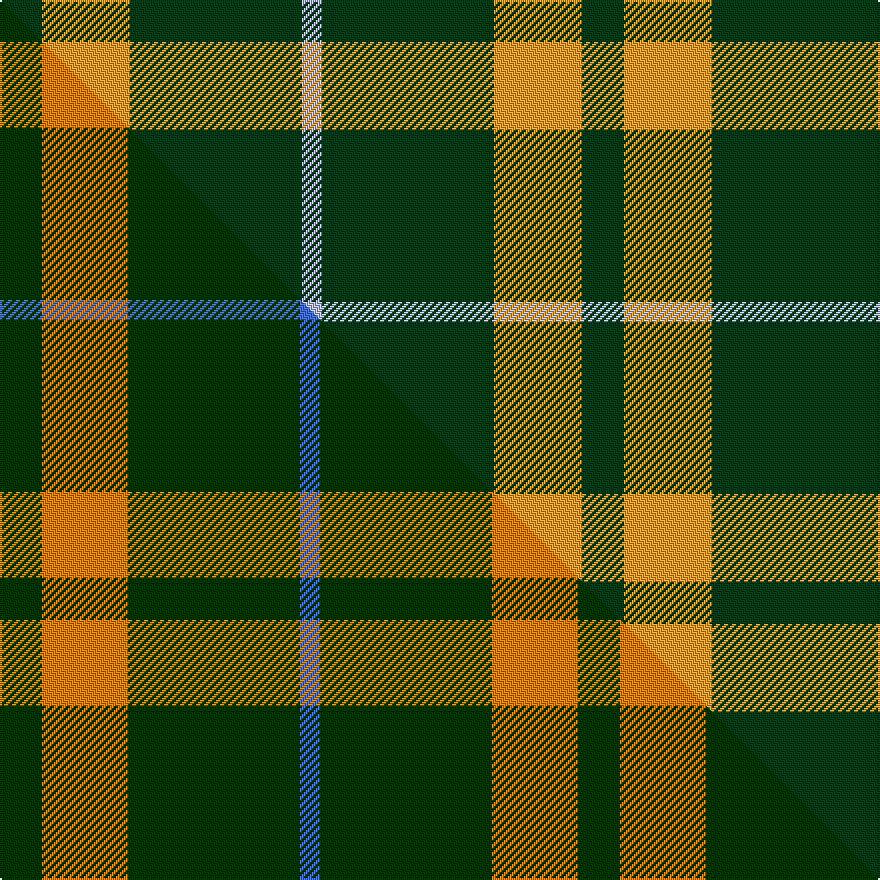

This page is one **sett** — a single exact thread-count. It belongs to the [tartan](/setts/dg21lo44dg86lb10/)
(the same proportion at any scale), whose colour order is pattern [GYGW](/stripes/gygw/).

Part of the [Special, Saffron](/tartans/special-saffron/) tartan — the named design grouping this sett with its other cloths.

Sourced from tartans-authority.  It is a [4 stripe tartan](/stripes/stripes4/).

Original link http://www.tartansauthority.com/tartan-ferret/display/201/

## Register references

External register numbers recorded for this tartan.

- Scottish Tartans Authority (ITI): 201

## Thread count
DG/21 LO44 DG86 LB/10

One full sett is **291 threads**.

## Palette
<table><thead><tr><th>Colour</th><th>Shade</th><th>OKLCh</th></tr></thead><tbody><tr><td>LB</td><td><code style="background-color:#B5BBDE;">#B5BBDE</code> <small style="color:#888">#B5BBDE</small></td><td><small style="color:#888">oklch(79.9% 0.050 277.6)</small></td></tr><tr><td>DG</td><td><code style="background-color:#053819;">#053819</code> <small style="color:#888">#053819</small></td><td><small style="color:#888">oklch(30.0% 0.075 151.3)</small></td></tr><tr><td>LO</td><td><code style="background-color:#FF9C34;">#FF9C34</code> <small style="color:#888">#FF9C34</small></td><td><small style="color:#888">oklch(77.9% 0.161 61.8)</small></td></tr></tbody></table>

# Sample pattern

## Compared to the master

This cloth is one sett of its design; the master sett (the exemplar the design is anchored on) is below for comparison.

Its **ΔTartan distance** from the master is **0.91** — the same measure the nearest-tartans table ranks by (0 is identical; a re-scale of the same cloth is near 0, a recolour or a different proportion further).

<figure class="master-compare" style="margin:0">

this sett
master sett ★

<figcaption style="color:#888;font-size:smaller">One weave of this sett against the <a href="/setts/dg21lo43dg86b10/">master sett ★</a>, split on the diagonal: a shared proportion runs seamlessly across it with only the shades shifting; a different proportion breaks on it.</figcaption>
</figure>

## Nearest tartan variants

The nearest existing variants by ΔTartan distance, with this cloth at the top so the swatches line up against it.

ΔTartan

Threads

Variant

Sett

—

291

<a href="/variants/s4/dg21lo44dg86lb10/">Special Saffron (Fashion)</a>

<a href="/ttd/edit/#slug=dg21lo43dg86b10~dg1104144-lo2706066&amp;base=dg21lo44dg86lb10" title="compare in the TTD">0.02</a>

289

<a href="/variants/s4/dg21lo43dg86b10~dg1104144-lo2706066/">Special, Saffron</a>

<a href="/ttd/edit/#slug=dg21y43dg86lb10&amp;base=dg21lo44dg86lb10" title="compare in the TTD">1.40</a>

289

<a href="/variants/s4/dg21y43dg86lb10/">Special Saffron Tartan</a>

<a href="/ttd/edit/#slug=g9dy20g40w5~x2&amp;base=dg21lo44dg86lb10" title="compare in the TTD">1.82</a>

268

<a href="/variants/s4/g9dy20g40w5~x2/">O'Neill Irish Family Tartan</a>

<a href="/ttd/edit/#slug=g6db2g1~x4&amp;base=dg21lo44dg86lb10" title="compare in the TTD">1.99</a>

44

<a href="/variants/s3/g6db2g1~x4/">Montgomery</a>

<a href="/ttd/edit/#slug=lb8dg1dr2~x20&amp;base=dg21lo44dg86lb10" title="compare in the TTD">1.99</a>

240

<a href="/variants/s3/lb8dg1dr2~x20/">Gyle</a>

<a href="/ttd/edit/#slug=dg86lo44dg21lo44dg86lb10&amp;base=dg21lo44dg86lb10" title="compare in the TTD">2.05</a>

486

<a href="/variants/s6/dg86lo44dg21lo44dg86lb10/">Special Saffron</a>

<a href="/ttd/edit/#slug=lb9dt3lb1dt12y1~x4&amp;base=dg21lo44dg86lb10" title="compare in the TTD">2.13</a>

168

<a href="/variants/s5/lb9dt3lb1dt12y1~x4/">North Sea Commission</a>

<a href="/ttd/edit/#slug=dr3g22db16g14dr2g6lo2~x2&amp;base=dg21lo44dg86lb10" title="compare in the TTD">2.50</a>

250

<a href="/variants/s7/dr3g22db16g14dr2g6lo2~x2/">Scottish Scouts (1957) (Corporate)</a>

<a href="/ttd/edit/#slug=g10db2dr8lo2g5~x4&amp;base=dg21lo44dg86lb10" title="compare in the TTD">2.57</a>

156

<a href="/variants/s5/g10db2dr8lo2g5~x4/">Cub Scouts of America</a>

<a href="/ttd/edit/#slug=dy21g28db24g72w16g20&amp;base=dg21lo44dg86lb10" title="compare in the TTD">2.58</a>

321

<a href="/variants/s6/dy21g28db24g72w16g20/">Meath County, Crest Range</a>

## Neighbour map

Every grey dot is one of 13620 variants placed by the first two principal components of the ΔTartan feature space (42% of its variance). Red is this tartan; blue dots are its nearest — click one to open its page.

<svg viewBox="0 0 640 380" role="img" style="max-width:100%;height:auto;border:1px solid #e0e0e0;border-radius:4px;display:block" xmlns="http://www.w3.org/2000/svg"><image href="/nn/cloud.v1.png" width="640" height="380"/><a href="/variants/s4/dg21lo43dg86b10~dg1104144-lo2706066/"><circle cx="414.4" cy="272.7" r="4" fill="#3465a4"><title>Special, Saffron</title></circle></a><a href="/variants/s4/dg21y43dg86lb10/"><circle cx="450.9" cy="285.4" r="4" fill="#3465a4"><title>Special Saffron Tartan</title></circle></a><a href="/variants/s4/g9dy20g40w5~x2/"><circle cx="415.3" cy="284.6" r="4" fill="#3465a4"><title>O'Neill Irish Family Tartan</title></circle></a><a href="/variants/s3/g6db2g1~x4/"><circle cx="423.1" cy="314.7" r="4" fill="#3465a4"><title>Montgomery</title></circle></a><a href="/variants/s3/lb8dg1dr2~x20/"><circle cx="400.0" cy="246.4" r="4" fill="#3465a4"><title>Gyle</title></circle></a><a href="/variants/s6/dg86lo44dg21lo44dg86lb10/"><circle cx="376.3" cy="264.7" r="4" fill="#3465a4"><title>Special Saffron</title></circle></a><a href="/variants/s5/lb9dt3lb1dt12y1~x4/"><circle cx="366.5" cy="236.5" r="4" fill="#3465a4"><title>North Sea Commission</title></circle></a><a href="/variants/s7/dr3g22db16g14dr2g6lo2~x2/"><circle cx="387.1" cy="233.1" r="4" fill="#3465a4"><title>Scottish Scouts (1957) (Corporate)</title></circle></a><a href="/variants/s5/g10db2dr8lo2g5~x4/"><circle cx="296.5" cy="291.3" r="4" fill="#3465a4"><title>Cub Scouts of America</title></circle></a><a href="/variants/s6/dy21g28db24g72w16g20/"><circle cx="333.0" cy="281.8" r="4" fill="#3465a4"><title>Meath County, Crest Range</title></circle></a><circle cx="392.3" cy="267.7" r="5" fill="#c00000"/><text x="320" y="376" text-anchor="middle" font-size="11" fill="#999">ground</text><text x="11" y="190" text-anchor="middle" font-size="11" fill="#999" transform="rotate(-90 11 190)">complexity</text></svg>

ID: /variants/s4/dg21lo44dg86lb10/
