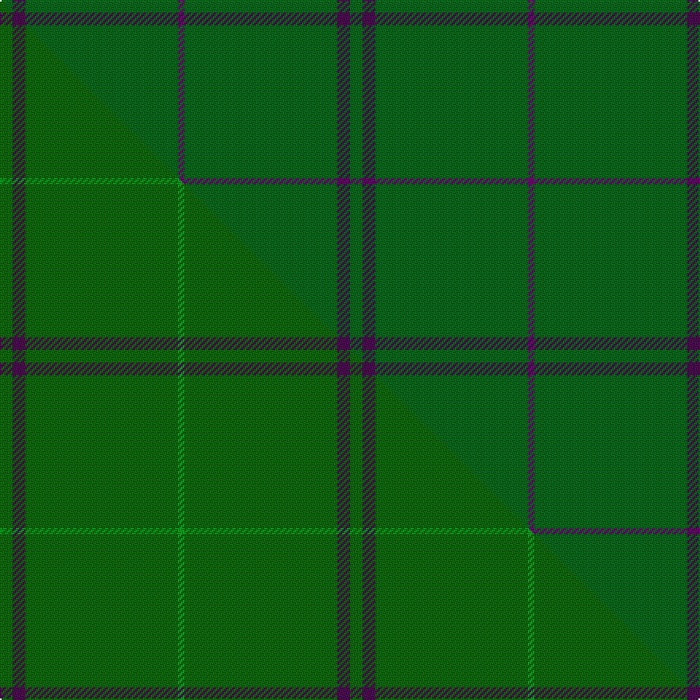

This is one **variant** — a specific cloth: this exact thread count and colourway, with its own
provenance below. It is one weaving of the [sett](/setts/dg2dp2dg24dpi1/) (the scale-free proportion — the
same cloth at any scale or shade), whose colour order is pattern [BGBG](/stripes/bgbg/).

Part of the [Walters](/tartans/walters/) tartan — the named design grouping this sett with its other cloths.

Sourced from tartans-authority.  It is a [4 stripe tartan](/stripes/stripes4/).

Original link [https://www.tartanregister.gov.uk/tartanDetails.aspx?ref=4160](https://www.tartanregister.gov.uk/tartanDetails.aspx?ref=4160)

Dataset <small>— provenance for this record, inherited from the source manifest</small>

<dl class="dataset-prov">
<dt>source</dt><dd><a href="/sources/tartans-authority/">Scottish Tartans Authority</a></dd>
<dt>data captured from</dt><dd><a href="https://github.com/thetartan/tartan-database/blob/master/data/tartans-authority/data.csv">https://github.com/thetartan/tartan-database/blob/master/data/tartans-authority/data.csv</a></dd>
<dt>data date</dt><dd>1996 <small>(this record)</small></dd>
<dt>licence</dt><dd><a href="https://creativecommons.org/licenses/by-nc-nd/4.0/">CC BY-NC-ND 4.0</a></dd>
</dl>

Capture chain <small>— the hands this data passed through, oldest first; each capture carries its own licence</small>

<ol class="capture-chain">
<li><a href="https://www.tartansauthority.com/">Scottish Tartans Authority</a> <small>the heritage body's archive — its tartan-ferret record browser is retired (links repaired to the SRT, above)</small></li>
<li><a href="https://github.com/thetartan/tartan-database">thetartan/tartan-database</a> <small>2016-2017</small> · <a href="https://creativecommons.org/licenses/by-nc-nd/4.0/">CC BY-NC-ND 4.0</a> <small>Levko Kravets's frozen compilation — the capture we vendored, and where its CC licence text came from</small></li>
<li>this dictionary <small>captured 2026-06-10 · commit 5bf86c7566</small> <small>each re-capture is a git commit to data/sources</small></li>
</ol>

## Register references

External register numbers recorded for this tartan.

- Scottish Tartans Authority (ITI): 4160

## Thread count
DG/8 DP8 DG96 DPi/4

One full sett is **220 threads**.

## Palette
<table><thead><tr><th>Colour</th><th>Shade</th><th>OKLCh</th></tr></thead><tbody><tr><td>DG</td><td><code style="background-color:#006818;">#006818</code> <small style="color:#888">#006818</small></td><td><small style="color:#888">oklch(45.0% 0.142 145.0)</small></td></tr><tr><td>DP</td><td><code style="background-color:#6C0070;">#6C0070</code> <small style="color:#888">#6C0070</small></td><td><small style="color:#888">oklch(37.6% 0.174 326.5)</small></td></tr><tr><td>DP</td><td><code style="background-color:#4B0B4F;">#4B0B4F</code> <small style="color:#888">#4B0B4F</small></td><td><small style="color:#888">oklch(30.1% 0.125 325.4)</small></td></tr></tbody></table>

# Sample pattern

## Compared to the master

This cloth is one sett of its design; the master sett (the exemplar the design is anchored on) is below for comparison.

Its **ΔTartan distance** from the master is **0.32** — the same measure the nearest-tartans table ranks by (0 is identical; a re-scale of the same cloth is near 0, a recolour or a different proportion further).

<figure class="master-compare" style="margin:0">

this sett
master sett ★

<figcaption style="color:#888;font-size:smaller">One weave of this sett against the <a href="/setts/dg2dp2dg24g1/">master sett ★</a>, split on the diagonal: a shared proportion runs seamlessly across it with only the shades shifting; a different proportion breaks on it.</figcaption>
</figure>

## Nearest tartan variants

The nearest existing variants by ΔTartan distance, with this cloth at the top so the swatches line up against it.

ΔTartan

Threads

Variant

Sett

—

220

<a href="/variants/s4/dg2dp2dg24dpi1~x4~dg1806142-dpi1507327/">Walters (Personal)</a>

<a href="/ttd/edit/#slug=dg2dp2dg24g1~x4~dg1806142-g2408144&amp;base=dg2dp2dg24dpi1~x4~dg1806142-dpi1507327" title="compare in the TTD">0.30</a>

220

<a href="/variants/s4/dg2dp2dg24g1~x4~dg1806142-g2408144/">Walters (Personal)</a>

<a href="/ttd/edit/#slug=dp7g23r3g7~x2&amp;base=dg2dp2dg24dpi1~x4~dg1806142-dpi1507327" title="compare in the TTD">1.04</a>

132

<a href="/variants/s4/dp7g23r3g7~x2/">Highland Spring (1997) (Corporate)</a>

<a href="/ttd/edit/#slug=g16dy3g2~x10&amp;base=dg2dp2dg24dpi1~x4~dg1806142-dpi1507327" title="compare in the TTD">1.19</a>

240

<a href="/variants/s3/g16dy3g2~x10/">Hallstatt (Artefact)</a>

<a href="/ttd/edit/#slug=dg20o1dg4~x3&amp;base=dg2dp2dg24dpi1~x4~dg1806142-dpi1507327" title="compare in the TTD">1.20</a>

78

<a href="/variants/s3/dg20o1dg4~x3/">Castle Fraser Check</a>

<a href="/ttd/edit/#slug=dt32dr3dt4k2lo3~x2&amp;base=dg2dp2dg24dpi1~x4~dg1806142-dpi1507327" title="compare in the TTD">1.50</a>

106

<a href="/variants/s5/dt32dr3dt4k2lo3~x2/">MacLaine of Lochbuie Hunting</a>

<a href="/ttd/edit/#slug=dg100o4dg2ly3lyi6~x2~o2503076-ly2705081-lyi3104101&amp;base=dg2dp2dg24dpi1~x4~dg1806142-dpi1507327" title="compare in the TTD">1.50</a>

248

<a href="/variants/s5/dg100ly4dg2lyi3lyii6~x2~ly2503076-lyi2705081-lyii3104101/">Lagrande</a>

<a href="/ttd/edit/#slug=g62r7k4r4g62~x2&amp;base=dg2dp2dg24dpi1~x4~dg1806142-dpi1507327" title="compare in the TTD">1.71</a>

308

<a href="/variants/s5/g62r7k4r4g62~x2/">MacNab, Ancient</a>

<a href="/ttd/edit/#slug=dr1g22lo1~x4&amp;base=dg2dp2dg24dpi1~x4~dg1806142-dpi1507327" title="compare in the TTD">1.72</a>

184

<a href="/variants/s3/dr1g22lo1~x4/">Kenmore Hunting</a>

<a href="/ttd/edit/#slug=k1g22dr1~x4&amp;base=dg2dp2dg24dpi1~x4~dg1806142-dpi1507327" title="compare in the TTD">1.72</a>

184

<a href="/variants/s3/k1g22dr1~x4/">Kenmore Hunting (Fashion)</a>

<a href="/ttd/edit/#slug=o81dg6ly8dg8~x2~o2503076-ly2705081&amp;base=dg2dp2dg24dpi1~x4~dg1806142-dpi1507327" title="compare in the TTD">1.89</a>

234

<a href="/variants/s4/ly81dg6lyi8dg8~x2~ly2503076-lyi2705081/">Young in Australia (Name)</a>

## Neighbour map

Every grey dot is one of 13621 variants placed by the first two principal components of the ΔTartan feature space (42% of its variance). Red is this tartan; blue dots are its nearest — click one to open its page.

<svg viewBox="0 0 640 380" role="img" style="max-width:100%;height:auto;border:1px solid #e0e0e0;border-radius:4px;display:block" xmlns="http://www.w3.org/2000/svg"><image href="/nn/cloud.v1.png" width="640" height="380"/><a href="/variants/s4/dg2dp2dg24g1~x4~dg1806142-g2408144/"><circle cx="626.0" cy="231.5" r="4" fill="#3465a4"><title>Walters (Personal)</title></circle></a><a href="/variants/s4/dp7g23r3g7~x2/"><circle cx="463.4" cy="269.2" r="4" fill="#3465a4"><title>Highland Spring (1997) (Corporate)</title></circle></a><a href="/variants/s3/g16dy3g2~x10/"><circle cx="626.0" cy="320.0" r="4" fill="#3465a4"><title>Hallstatt (Artefact)</title></circle></a><a href="/variants/s3/dg20o1dg4~x3/"><circle cx="626.0" cy="282.3" r="4" fill="#3465a4"><title>Castle Fraser Check</title></circle></a><a href="/variants/s5/dt32dr3dt4k2lo3~x2/"><circle cx="549.3" cy="168.5" r="4" fill="#3465a4"><title>MacLaine of Lochbuie Hunting</title></circle></a><a href="/variants/s5/dg100ly4dg2lyi3lyii6~x2~ly2503076-lyi2705081-lyii3104101/"><circle cx="626.0" cy="141.0" r="4" fill="#3465a4"><title>Lagrande</title></circle></a><a href="/variants/s5/g62r7k4r4g62~x2/"><circle cx="607.9" cy="207.0" r="4" fill="#3465a4"><title>MacNab, Ancient</title></circle></a><a href="/variants/s3/dr1g22lo1~x4/"><circle cx="626.0" cy="250.6" r="4" fill="#3465a4"><title>Kenmore Hunting</title></circle></a><a href="/variants/s3/k1g22dr1~x4/"><circle cx="626.0" cy="201.0" r="4" fill="#3465a4"><title>Kenmore Hunting (Fashion)</title></circle></a><a href="/variants/s4/ly81dg6lyi8dg8~x2~ly2503076-lyi2705081/"><circle cx="626.0" cy="249.7" r="4" fill="#3465a4"><title>Young in Australia (Name)</title></circle></a><circle cx="626.0" cy="228.8" r="5" fill="#c00000"/><text x="320" y="376" text-anchor="middle" font-size="11" fill="#999">ground</text><text x="11" y="190" text-anchor="middle" font-size="11" fill="#999" transform="rotate(-90 11 190)">complexity</text></svg>

ID: /variants/s4/dg2dp2dg24dpi1~x4~dg1806142-dpi1507327/
