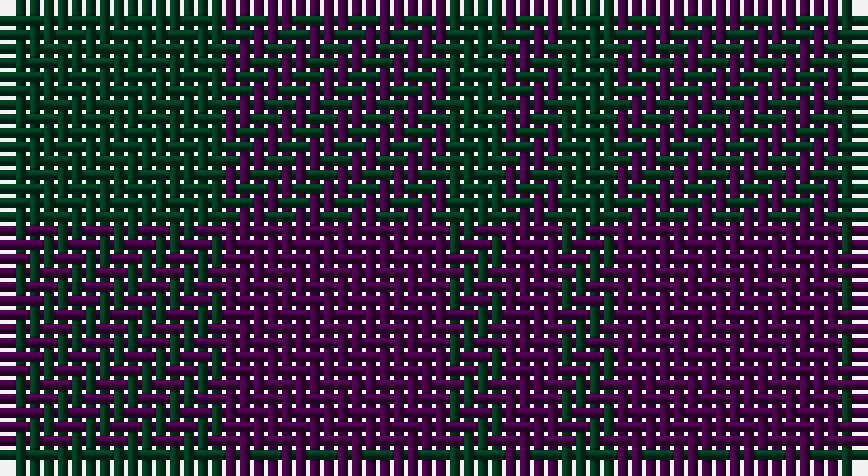

This page is one **sett** — a single exact thread-count. It belongs to the [tartan](/setts/dg4dp4dg1dp1/)
(the same proportion at any scale), whose colour order is pattern [BGBG](/stripes/bgbg/).

Part of the [Wilson's No 211](/tartans/wilson-s-no-211/) tartan — the named design grouping this sett with its other cloths.

Sourced from register-of-tartans.  It is a [4 stripe tartan](/stripes/stripes4/).

Original link https://www.tartanregister.gov.uk/tartanDetails.aspx?ref=4681

## Also known as

This cloth is also recorded under:

- Wilson's No.116
- Wilson's No.211
- Wilson's, No 211

3 attestations — the source records this cloth was collapsed from (oldest owns this page)

<ul>
<li>01/01/1819 — Wilson's No.116 (register-of-tartans, <a href="https://www.tartanregister.gov.uk/tartanDetails.aspx?ref=4681">record</a>)</li>
<li>01/01/2002 — Wilson's No.211 (register-of-tartans, <a href="https://www.tartanregister.gov.uk/tartanDetails.aspx?ref=4742">record</a>)</li>
<li>undated — Wilson's No 211 (register-of-tartans, <a href="https://www.tartanregister.gov.uk/tartanDetails.aspx?ref=4639">record</a>)</li>
</ul>

## Register references

External register numbers recorded for this tartan.

- Scottish Register of Tartans: [4742](https://www.tartanregister.gov.uk/tartanDetails.aspx?ref=4742)
- Scottish Tartans Authority (ITI): 116
- Scottish Tartans World Register: 116

## Thread count
DG/16 DP16 DG4 DP/4

One full sett is **60 threads**.

## Palette

Palette: <strong>Tartan Register</strong>
<table><thead><tr><th>Colour</th><th>Threads</th><th>Shade</th><th>Base</th><th>OKLCh</th></tr></thead><tbody><tr><td>DG/</td><td style="text-align:right;font-variant-numeric:tabular-nums">16</td><td><code style="background-color:#003820;">#003820</code> <small style="color:#888">#003820</small></td><td>G <code style="background-color:#006100;">#006100</code></td><td><small style="color:#888">oklch(30.0% 0.070 158.3)</small></td></tr><tr><td>DP</td><td style="text-align:right;font-variant-numeric:tabular-nums">16</td><td><code style="background-color:#440044;">#440044</code> <small style="color:#888">#440044</small></td><td>B <code style="background-color:#2A418A;">#2A418A</code></td><td><small style="color:#888">oklch(27.1% 0.125 328.4)</small></td></tr><tr><td>DG</td><td style="text-align:right;font-variant-numeric:tabular-nums">4</td><td><code style="background-color:#003820;">#003820</code> <small style="color:#888">#003820</small></td><td>G <code style="background-color:#006100;">#006100</code></td><td><small style="color:#888">oklch(30.0% 0.070 158.3)</small></td></tr><tr><td>DP/</td><td style="text-align:right;font-variant-numeric:tabular-nums">4</td><td><code style="background-color:#440044;">#440044</code> <small style="color:#888">#440044</small></td><td>B <code style="background-color:#2A418A;">#2A418A</code></td><td><small style="color:#888">oklch(27.1% 0.125 328.4)</small></td></tr></tbody></table>

# Sample pattern

## Nearest tartans

The nearest existing variants by ΔTartan distance, with this tartan at the top so the swatches line up against it.

ΔTartan

Tartan

Sett

—

<a href="/ttd/edit/#slug=dg4dp4dg1dp1~x4">Wilson's No.116</a> <a class="nn-out" href="/variants/s4/dg4dp4dg1dp1~x4/" title="open its dictionary page">↗</a>

1.54

<a href="/ttd/edit/#slug=k34db13k7db14~x2&amp;base=dg4dp4dg1dp1~x4">Auchincloss (Personal)</a> <a class="nn-out" href="/variants/s4/k34db13k7db14~x2/" title="open its dictionary page">↗</a>

1.59

<a href="/ttd/edit/#slug=dg1db3dg3r1~x4&amp;base=dg4dp4dg1dp1~x4">Barwell</a> <a class="nn-out" href="/variants/s4/dg1db3dg3r1~x4/" title="open its dictionary page">↗</a>

2.20

<a href="/ttd/edit/#slug=db16dy2db16dy19r4~x3&amp;base=dg4dp4dg1dp1~x4">Unidentified #24</a> <a class="nn-out" href="/variants/s5/db16dy2db16dy19r4~x3/" title="open its dictionary page">↗</a>

2.33

<a href="/ttd/edit/#slug=db16o2db16o19r4~x3&amp;base=dg4dp4dg1dp1~x4">Unidentified 17</a> <a class="nn-out" href="/variants/s5/db16o2db16o19r4~x3/" title="open its dictionary page">↗</a>

2.43

<a href="/ttd/edit/#slug=n16r2n10r14t5~x2&amp;base=dg4dp4dg1dp1~x4">Mowbray (Personal)</a> <a class="nn-out" href="/variants/s5/n16r2n10r14t5~x2/" title="open its dictionary page">↗</a>

2.45

<a href="/ttd/edit/#slug=db5k2db14k14db2k2r2~x2&amp;base=dg4dp4dg1dp1~x4">Royal Scotsman Train</a> <a class="nn-out" href="/variants/s7/db5k2db14k14db2k2r2~x2/" title="open its dictionary page">↗</a>

2.46

<a href="/ttd/edit/#slug=k5dg14k16db12dg4~x2&amp;base=dg4dp4dg1dp1~x4">Unidentified #29</a> <a class="nn-out" href="/variants/s5/k5dg14k16db12dg4~x2/" title="open its dictionary page">↗</a>

2.46

<a href="/ttd/edit/#slug=db2dg6db6dp5db1dp2~x2&amp;base=dg4dp4dg1dp1~x4">Unidentified no. 54</a> <a class="nn-out" href="/variants/s6/db2dg6db6dp5db1dp2~x2/" title="open its dictionary page">↗</a>

2.47

<a href="/ttd/edit/#slug=k20dp3k20dp20~x2&amp;base=dg4dp4dg1dp1~x4">Wcwm 9275-1333-1</a> <a class="nn-out" href="/variants/s4/k20dp3k20dp20~x2/" title="open its dictionary page">↗</a>

2.51

<a href="/ttd/edit/#slug=dr30db10dr3db30m3~x2&amp;base=dg4dp4dg1dp1~x4">Feniston (Personal)</a> <a class="nn-out" href="/variants/s5/dr30db10dr3db30m3~x2/" title="open its dictionary page">↗</a>

## Neighbour map

Every grey dot is one of 14360 variants placed by the first two principal components of the ΔTartan feature space (44% of its variance). Red is this tartan; blue dots are its nearest — click one to open its page.

<svg viewBox="0 0 640 380" role="img" style="max-width:100%;height:auto;border:1px solid #e0e0e0;border-radius:4px;display:block" xmlns="http://www.w3.org/2000/svg"><image href="/nn/cloud.v1.png" width="640" height="380"/><a href="/variants/s4/k34db13k7db14~x2/"><circle cx="440.9" cy="366.0" r="4" fill="#3465a4"><title>Auchincloss (Personal)</title></circle></a><a href="/variants/s4/dg1db3dg3r1~x4/"><circle cx="334.5" cy="366.0" r="4" fill="#3465a4"><title>Barwell</title></circle></a><a href="/variants/s5/db16dy2db16dy19r4~x3/"><circle cx="399.2" cy="307.0" r="4" fill="#3465a4"><title>Unidentified #24</title></circle></a><a href="/variants/s5/db16o2db16o19r4~x3/"><circle cx="408.0" cy="307.9" r="4" fill="#3465a4"><title>Unidentified 17</title></circle></a><a href="/variants/s5/n16r2n10r14t5~x2/"><circle cx="397.5" cy="318.7" r="4" fill="#3465a4"><title>Mowbray (Personal)</title></circle></a><a href="/variants/s7/db5k2db14k14db2k2r2~x2/"><circle cx="431.6" cy="310.4" r="4" fill="#3465a4"><title>Royal Scotsman Train</title></circle></a><a href="/variants/s5/k5dg14k16db12dg4~x2/"><circle cx="265.0" cy="365.6" r="4" fill="#3465a4"><title>Unidentified #29</title></circle></a><a href="/variants/s6/db2dg6db6dp5db1dp2~x2/"><circle cx="290.3" cy="334.0" r="4" fill="#3465a4"><title>Unidentified no. 54</title></circle></a><a href="/variants/s4/k20dp3k20dp20~x2/"><circle cx="531.9" cy="366.0" r="4" fill="#3465a4"><title>Wcwm 9275-1333-1</title></circle></a><a href="/variants/s5/dr30db10dr3db30m3~x2/"><circle cx="424.9" cy="285.5" r="4" fill="#3465a4"><title>Feniston (Personal)</title></circle></a><circle cx="418.3" cy="366.0" r="5" fill="#c00000"/></svg>

ID: /variants/s4/dg4dp4dg1dp1~x4/
