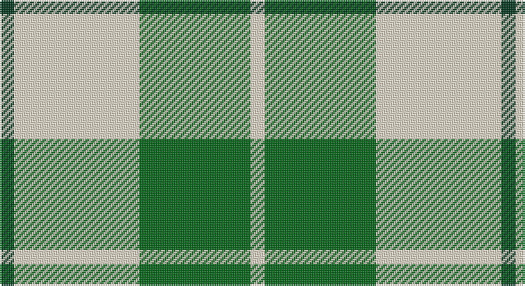

This page is one **sett** — a single exact thread-count. It belongs to the [tartan](/setts/dg4w35g31w4/)
(the same proportion at any scale), whose colour order is pattern [GWGW](/stripes/gwgw/).

Part of the [Lewis](/tartans/lewis/) tartan — the named design grouping this sett with its other cloths.

Sourced from tartans-authority.  It is a [4 stripe tartan](/stripes/stripes4/).

Original link http://www.tartansauthority.com/tartan-ferret/display/7600/

## Also known as

This cloth is also recorded under:

- Lewis Green
- Lewis, Green

2 attestations — the source records this cloth was collapsed from (oldest owns this page)

<ul>
<li>March 2008 — Lewis, Green (Dance) (tartans-authority, <a href="http://www.tartansauthority.com/tartan-ferret/display/7600/">record</a>)</li>
<li>undated — Lewis Green (register-of-tartans, <a href="https://www.tartanregister.gov.uk/tartanDetails.aspx?ref=5624">record</a>)</li>
</ul>

## Register references

External register numbers recorded for this tartan.

- Scottish Register of Tartans: [5624](https://www.tartanregister.gov.uk/tartanDetails.aspx?ref=5624)
- Scottish Tartans Authority (ITI): 7600

## Thread count
DG/8 W70 G62 W/8

One full sett is **280 threads**.

## Palette

Palette: <strong>Tartan Register</strong>
<table><thead><tr><th>Colour</th><th>Threads</th><th>Shade</th><th>Base</th><th>OKLCh</th></tr></thead><tbody><tr><td>DG/</td><td style="text-align:right;font-variant-numeric:tabular-nums">8</td><td><code style="background-color:#003820;">#003820</code> <small style="color:#888">#003820</small></td><td>G <code style="background-color:#006100;">#006100</code></td><td><small style="color:#888">oklch(30.0% 0.070 158.3)</small></td></tr><tr><td>W</td><td style="text-align:right;font-variant-numeric:tabular-nums">70</td><td><code style="background-color:#F0E0C8;">#F0E0C8</code> <small style="color:#888">#F0E0C8</small></td><td>W <code style="background-color:#F7F7F7;">#F7F7F7</code></td><td><small style="color:#888">oklch(91.3% 0.036 78.1)</small></td></tr><tr><td>G</td><td style="text-align:right;font-variant-numeric:tabular-nums">62</td><td><code style="background-color:#006818;">#006818</code> <small style="color:#888">#006818</small></td><td>G <code style="background-color:#006100;">#006100</code></td><td><small style="color:#888">oklch(45.0% 0.142 145.0)</small></td></tr><tr><td>W/</td><td style="text-align:right;font-variant-numeric:tabular-nums">8</td><td><code style="background-color:#F0E0C8;">#F0E0C8</code> <small style="color:#888">#F0E0C8</small></td><td>W <code style="background-color:#F7F7F7;">#F7F7F7</code></td><td><small style="color:#888">oklch(91.3% 0.036 78.1)</small></td></tr></tbody></table>

# Sample pattern

## Nearest tartans

The nearest existing variants by ΔTartan distance, with this tartan at the top so the swatches line up against it.

ΔTartan

Tartan

Sett

—

<a href="/ttd/edit/#slug=dg4w35g31w4~x2">Lewis, Green (Dance)</a> <a class="nn-out" href="/variants/s4/dg4w35g31w4~x2/" title="open its dictionary page">↗</a>

1.25

<a href="/ttd/edit/#slug=w12g12w1g12w12lo1~x4&amp;base=dg4w35g31w4~x2">Wallace Green Dress Fashion Tartan</a> <a class="nn-out" href="/variants/s6/w12g12w1g12w12lo1~x4/" title="open its dictionary page">↗</a>

1.51

<a href="/ttd/edit/#slug=g22w14r7ly2~x2&amp;base=dg4w35g31w4~x2">Loch Lomond #3</a> <a class="nn-out" href="/variants/s4/g22w14r7ly2~x2/" title="open its dictionary page">↗</a>

1.54

<a href="/ttd/edit/#slug=w5r3w26g20w3g8ly3~x2&amp;base=dg4w35g31w4~x2">MacPherson Dress Green (Dance)</a> <a class="nn-out" href="/variants/s7/w5r3w26g20w3g8ly3~x2/" title="open its dictionary page">↗</a>

1.64

<a href="/ttd/edit/#slug=w1ly8dg3ly1db3ly1~x4&amp;base=dg4w35g31w4~x2">Fraser Yellow #2</a> <a class="nn-out" href="/variants/s6/w1ly8dg3ly1db3ly1~x4/" title="open its dictionary page">↗</a>

1.66

<a href="/ttd/edit/#slug=w5ly32dt32ly5~x2&amp;base=dg4w35g31w4~x2">Barclay Dress</a> <a class="nn-out" href="/variants/s4/w5ly32dt32ly5~x2/" title="open its dictionary page">↗</a>

1.67

<a href="/ttd/edit/#slug=g6w2g29w29g2w6~x2&amp;base=dg4w35g31w4~x2">Erskine, Green (Dance)</a> <a class="nn-out" href="/variants/s6/g6w2g29w29g2w6~x2/" title="open its dictionary page">↗</a>

1.73

<a href="/ttd/edit/#slug=db4ly9w4db9ly18w1~x2&amp;base=dg4w35g31w4~x2">WVU Mountaineer Tartan</a> <a class="nn-out" href="/variants/s6/db4ly9w4db9ly18w1~x2/" title="open its dictionary page">↗</a>

1.74

<a href="/ttd/edit/#slug=dg6w2dg29w29dg2w6~x2&amp;base=dg4w35g31w4~x2">Erskine Green</a> <a class="nn-out" href="/variants/s6/dg6w2dg29w29dg2w6~x2/" title="open its dictionary page">↗</a>

1.74

<a href="/ttd/edit/#slug=ly20db10k3~x2&amp;base=dg4w35g31w4~x2">Masai Shuka 04 (Artefact)</a> <a class="nn-out" href="/variants/s3/ly20db10k3~x2/" title="open its dictionary page">↗</a>

1.79

<a href="/ttd/edit/#slug=w1ly8g3ly1db3ly1~x4&amp;base=dg4w35g31w4~x2">Fraser, Yellow</a> <a class="nn-out" href="/variants/s6/w1ly8g3ly1db3ly1~x4/" title="open its dictionary page">↗</a>

## Neighbour map

Every grey dot is one of 14360 variants placed by the first two principal components of the ΔTartan feature space (44% of its variance). Red is this tartan; blue dots are its nearest — click one to open its page.

<svg viewBox="0 0 640 380" role="img" style="max-width:100%;height:auto;border:1px solid #e0e0e0;border-radius:4px;display:block" xmlns="http://www.w3.org/2000/svg"><image href="/nn/cloud.v1.png" width="640" height="380"/><a href="/variants/s6/w12g12w1g12w12lo1~x4/"><circle cx="272.4" cy="224.4" r="4" fill="#3465a4"><title>Wallace Green Dress Fashion Tartan</title></circle></a><a href="/variants/s4/g22w14r7ly2~x2/"><circle cx="213.9" cy="214.1" r="4" fill="#3465a4"><title>Loch Lomond #3</title></circle></a><a href="/variants/s7/w5r3w26g20w3g8ly3~x2/"><circle cx="244.8" cy="183.7" r="4" fill="#3465a4"><title>MacPherson Dress Green (Dance)</title></circle></a><a href="/variants/s6/w1ly8dg3ly1db3ly1~x4/"><circle cx="271.1" cy="192.3" r="4" fill="#3465a4"><title>Fraser Yellow #2</title></circle></a><a href="/variants/s4/w5ly32dt32ly5~x2/"><circle cx="248.2" cy="242.4" r="4" fill="#3465a4"><title>Barclay Dress</title></circle></a><a href="/variants/s6/g6w2g29w29g2w6~x2/"><circle cx="318.9" cy="195.3" r="4" fill="#3465a4"><title>Erskine, Green (Dance)</title></circle></a><a href="/variants/s6/db4ly9w4db9ly18w1~x2/"><circle cx="299.4" cy="179.9" r="4" fill="#3465a4"><title>WVU Mountaineer Tartan</title></circle></a><a href="/variants/s6/dg6w2dg29w29dg2w6~x2/"><circle cx="326.0" cy="200.4" r="4" fill="#3465a4"><title>Erskine Green</title></circle></a><a href="/variants/s3/ly20db10k3~x2/"><circle cx="286.9" cy="261.2" r="4" fill="#3465a4"><title>Masai Shuka 04 (Artefact)</title></circle></a><a href="/variants/s6/w1ly8g3ly1db3ly1~x4/"><circle cx="278.2" cy="194.4" r="4" fill="#3465a4"><title>Fraser, Yellow</title></circle></a><circle cx="280.9" cy="231.6" r="5" fill="#c00000"/></svg>

ID: /variants/s4/dg4w35g31w4~x2/
