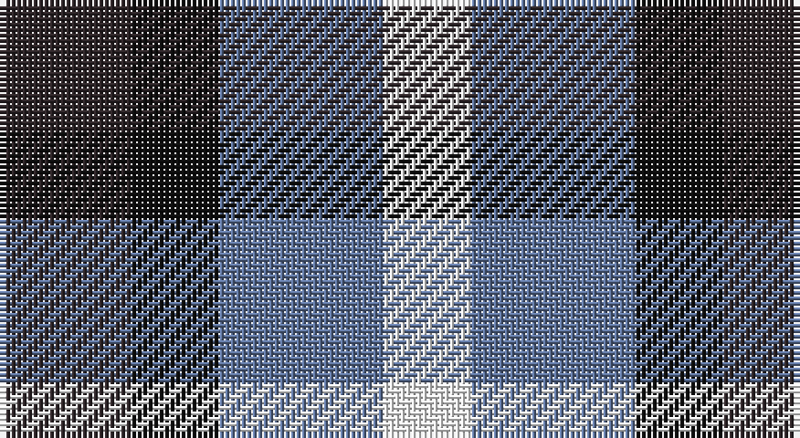

This page is one **sett** — a single exact thread-count. It belongs to the [tartan](/setts/do12k8t15w8/)
(the same proportion at any scale), whose colour order is pattern [BKBW](/stripes/bkbw/).

Sourced from register-of-tartans.  It is a [4 stripe tartan](/stripes/stripes4/).

Original link https://www.tartanregister.gov.uk/tartanDetails.aspx?ref=11397

## Register references

External register numbers recorded for this tartan.

- Scottish Register of Tartans: [11397](https://www.tartanregister.gov.uk/tartanDetails.aspx?ref=11397)

## Thread count
K/24 Ka16 B30 W/16

One full sett is **132 threads**.

## Palette

Palette: <strong>Tartan Register</strong> <small style="color:#888">(3 of 4 colours)</small>
<table><thead><tr><th>Colour</th><th>Threads</th><th>Shade</th><th>Base</th><th>OKLCh</th></tr></thead><tbody><tr><td>K/</td><td style="text-align:right;font-variant-numeric:tabular-nums">24</td><td><code style="background-color:#2E2528;">#2E2528</code> <small style="color:#888">#2E2528</small></td><td>B <code style="background-color:#2A418A;">#2A418A</code></td><td><small style="color:#888">oklch(27.6% 0.014 356.1)</small></td></tr><tr><td>Ka</td><td style="text-align:right;font-variant-numeric:tabular-nums">16</td><td><code style="background-color:#101010;">#101010</code> <small style="color:#888">#101010</small></td><td>K <code style="background-color:#000000;">#000000</code></td><td><small style="color:#888">oklch(17.3% 0.000 89.9)</small></td></tr><tr><td>B</td><td style="text-align:right;font-variant-numeric:tabular-nums">30</td><td><code style="background-color:#5F749C;">#5F749C</code> <small style="color:#888">#5F749C</small></td><td>B <code style="background-color:#2A418A;">#2A418A</code></td><td><small style="color:#888">oklch(55.8% 0.067 262.9)</small></td></tr><tr><td>W/</td><td style="text-align:right;font-variant-numeric:tabular-nums">16</td><td><code style="background-color:#FFFFFF;">#FFFFFF</code> <small style="color:#888">#FFFFFF</small></td><td>W <code style="background-color:#F7F7F7;">#F7F7F7</code></td><td><small style="color:#888">oklch(100.0% 0.000 89.9)</small></td></tr></tbody></table>

# Sample pattern

## Nearest tartans

The nearest existing variants by ΔTartan distance, with this tartan at the top so the swatches line up against it.

ΔTartan

Tartan

Sett

—

<a href="/ttd/edit/#slug=do12k8t15w8~x2">Equity Vision Ltd</a> <a class="nn-out" href="/variants/s4/do12k8t15w8~x2/" title="open its dictionary page">↗</a>

0.89

<a href="/ttd/edit/#slug=db18t18lo28dt13~x2&amp;base=do12k8t15w8~x2">Gold Country (California)</a> <a class="nn-out" href="/variants/s4/db18t18lo28dt13~x2/" title="open its dictionary page">↗</a>

1.58

<a href="/ttd/edit/#slug=lb2k2g2lb1k1~x20&amp;base=do12k8t15w8~x2">Shepherd, Derek (Wandering)</a> <a class="nn-out" href="/variants/s5/lb2k2g2lb1k1~x20/" title="open its dictionary page">↗</a>

1.61

<a href="/ttd/edit/#slug=db18b18lo28n13~x2&amp;base=do12k8t15w8~x2">Gold Country (District)</a> <a class="nn-out" href="/variants/s4/db18b18lo28n13~x2/" title="open its dictionary page">↗</a>

1.61

<a href="/ttd/edit/#slug=p3k3p3g6ly2~x2&amp;base=do12k8t15w8~x2">Austin / Wilson's No 173</a> <a class="nn-out" href="/variants/s5/p3k3p3g6ly2~x2/" title="open its dictionary page">↗</a>

1.63

<a href="/ttd/edit/#slug=dp3k3dp3dg6ly2~x2&amp;base=do12k8t15w8~x2">Austin (Wilson's No 173)</a> <a class="nn-out" href="/variants/s5/dp3k3dp3dg6ly2~x2/" title="open its dictionary page">↗</a>

1.72

<a href="/ttd/edit/#slug=n2r1k1lr1~x10&amp;base=do12k8t15w8~x2">Kucher, Gregory (Personal)</a> <a class="nn-out" href="/variants/s4/n2r1k1lr1~x10/" title="open its dictionary page">↗</a>

1.77

<a href="/ttd/edit/#slug=lo5db5k3~x4&amp;base=do12k8t15w8~x2">Kazakhstan Relic (Artefact)</a> <a class="nn-out" href="/variants/s3/lo5db5k3~x4/" title="open its dictionary page">↗</a>

1.78

<a href="/ttd/edit/#slug=p3k3p3g6r2~x2&amp;base=do12k8t15w8~x2">Austin / Wilson's No 137</a> <a class="nn-out" href="/variants/s5/p3k3p3g6r2~x2/" title="open its dictionary page">↗</a>

1.80

<a href="/ttd/edit/#slug=g3db3dp4w1~x4&amp;base=do12k8t15w8~x2">Pride of the Glen</a> <a class="nn-out" href="/variants/s4/g3db3dp4w1~x4/" title="open its dictionary page">↗</a>

1.97

<a href="/ttd/edit/#slug=t3o6k4t2~x2&amp;base=do12k8t15w8~x2">Bedford Check</a> <a class="nn-out" href="/variants/s4/t3o6k4t2~x2/" title="open its dictionary page">↗</a>

## Neighbour map

Every grey dot is one of 14360 variants placed by the first two principal components of the ΔTartan feature space (44% of its variance). Red is this tartan; blue dots are its nearest — click one to open its page.

<svg viewBox="0 0 640 380" role="img" style="max-width:100%;height:auto;border:1px solid #e0e0e0;border-radius:4px;display:block" xmlns="http://www.w3.org/2000/svg"><image href="/nn/cloud.v1.png" width="640" height="380"/><a href="/variants/s4/db18t18lo28dt13~x2/"><circle cx="54.5" cy="331.7" r="4" fill="#3465a4"><title>Gold Country (California)</title></circle></a><a href="/variants/s5/lb2k2g2lb1k1~x20/"><circle cx="81.4" cy="344.4" r="4" fill="#3465a4"><title>Shepherd, Derek (Wandering)</title></circle></a><a href="/variants/s4/db18b18lo28n13~x2/"><circle cx="78.4" cy="348.8" r="4" fill="#3465a4"><title>Gold Country (District)</title></circle></a><a href="/variants/s5/p3k3p3g6ly2~x2/"><circle cx="71.1" cy="290.4" r="4" fill="#3465a4"><title>Austin / Wilson's No 173</title></circle></a><a href="/variants/s5/dp3k3dp3dg6ly2~x2/"><circle cx="93.5" cy="305.8" r="4" fill="#3465a4"><title>Austin (Wilson's No 173)</title></circle></a><a href="/variants/s4/n2r1k1lr1~x10/"><circle cx="104.6" cy="340.7" r="4" fill="#3465a4"><title>Kucher, Gregory (Personal)</title></circle></a><a href="/variants/s3/lo5db5k3~x4/"><circle cx="94.1" cy="366.0" r="4" fill="#3465a4"><title>Kazakhstan Relic (Artefact)</title></circle></a><a href="/variants/s5/p3k3p3g6r2~x2/"><circle cx="85.0" cy="295.3" r="4" fill="#3465a4"><title>Austin / Wilson's No 137</title></circle></a><a href="/variants/s4/g3db3dp4w1~x4/"><circle cx="99.7" cy="298.2" r="4" fill="#3465a4"><title>Pride of the Glen</title></circle></a><a href="/variants/s4/t3o6k4t2~x2/"><circle cx="149.3" cy="335.6" r="4" fill="#3465a4"><title>Bedford Check</title></circle></a><circle cx="24.3" cy="334.7" r="5" fill="#c00000"/></svg>

ID: /variants/s4/do12k8t15w8~x2/
