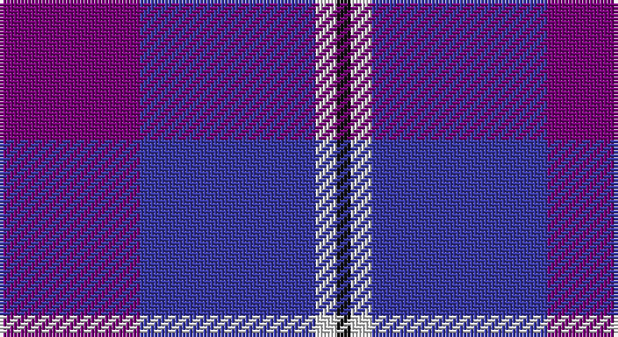

This page is one **sett** — a single exact thread-count. It belongs to the [tartan](/setts/dp20db25w3k2/)
(the same proportion at any scale), whose colour order is pattern [BBWK](/stripes/bbwk/).

Sourced from tartans-authority.  It is a [4 stripe tartan](/stripes/stripes4/).

Original link http://www.tartansauthority.com/tartan-ferret/display/7386/

## Register references

External register numbers recorded for this tartan.

- Scottish Tartans Authority (ITI): 7386

## Thread count
P/40 B50 LN6 K/4

One full sett is **156 threads**.

## Palette

Palette: <strong>Tartan Register</strong> <small style="color:#888">(3 of 4 colours)</small>
<table><thead><tr><th>Colour</th><th>Threads</th><th>Shade</th><th>Base</th><th>OKLCh</th></tr></thead><tbody><tr><td>P/</td><td style="text-align:right;font-variant-numeric:tabular-nums">40</td><td><code style="background-color:#780078;">#780078</code> <small style="color:#888">#780078</small></td><td>B <code style="background-color:#2A418A;">#2A418A</code></td><td><small style="color:#888">oklch(40.2% 0.185 328.4)</small></td></tr><tr><td>B</td><td style="text-align:right;font-variant-numeric:tabular-nums">50</td><td><code style="background-color:#3838A4;">#3838A4</code> <small style="color:#888">#3838A4</small></td><td>B <code style="background-color:#2A418A;">#2A418A</code></td><td><small style="color:#888">oklch(41.3% 0.169 276.1)</small></td></tr><tr><td>LN</td><td style="text-align:right;font-variant-numeric:tabular-nums">6</td><td><code style="background-color:#E0E0E0;">#E0E0E0</code> <small style="color:#888">#E0E0E0</small></td><td>W <code style="background-color:#F7F7F7;">#F7F7F7</code></td><td><small style="color:#888">oklch(90.7% 0.000 89.9)</small></td></tr><tr><td>K/</td><td style="text-align:right;font-variant-numeric:tabular-nums">4</td><td><code style="background-color:#101010;">#101010</code> <small style="color:#888">#101010</small></td><td>K <code style="background-color:#000000;">#000000</code></td><td><small style="color:#888">oklch(17.3% 0.000 89.9)</small></td></tr></tbody></table>

# Sample pattern

## Nearest tartans

The nearest existing variants by ΔTartan distance, with this tartan at the top so the swatches line up against it.

ΔTartan

Tartan

Sett

—

<a href="/ttd/edit/#slug=dp20db25w3k2~x2">Murdoch, Ellis (Personal)</a> <a class="nn-out" href="/variants/s4/dp20db25w3k2~x2/" title="open its dictionary page">↗</a>

0.87

<a href="/ttd/edit/#slug=p20db25w3k2~x2&amp;base=dp20db25w3k2~x2">Murdoch, Ellis (Personal)</a> <a class="nn-out" href="/variants/s4/p20db25w3k2~x2/" title="open its dictionary page">↗</a>

1.36

<a href="/ttd/edit/#slug=dp9db6w1dg4dp2~x4&amp;base=dp20db25w3k2~x2">Cathro</a> <a class="nn-out" href="/variants/s5/dp9db6w1dg4dp2~x4/" title="open its dictionary page">↗</a>

1.89

<a href="/ttd/edit/#slug=dp10ly3dp8db42g5o5~x2&amp;base=dp20db25w3k2~x2">Cheadle (Personal)</a> <a class="nn-out" href="/variants/s6/dp10ly3dp8db42g5o5~x2/" title="open its dictionary page">↗</a>

1.98

<a href="/ttd/edit/#slug=p9b6w1g4p2~x8&amp;base=dp20db25w3k2~x2">Cathro (Name)</a> <a class="nn-out" href="/variants/s5/p9b6w1g4p2~x8/" title="open its dictionary page">↗</a>

2.02

<a href="/ttd/edit/#slug=r21db43dt86lb10&amp;base=dp20db25w3k2~x2">Fong (Personal)</a> <a class="nn-out" href="/variants/s4/r21db43dt86lb10/" title="open its dictionary page">↗</a>

2.04

<a href="/ttd/edit/#slug=db4g5dp3g5db46dp42w4dp4&amp;base=dp20db25w3k2~x2">Clans of Caledonia</a> <a class="nn-out" href="/variants/s8/db4g5dp3g5db46dp42w4dp4/" title="open its dictionary page">↗</a>

2.04

<a href="/ttd/edit/#slug=b18k2b4k6dp12lo1~x2&amp;base=dp20db25w3k2~x2">Joker, The</a> <a class="nn-out" href="/variants/s6/b18k2b4k6dp12lo1~x2/" title="open its dictionary page">↗</a>

2.04

<a href="/ttd/edit/#slug=db23dp2g11dp24lb3~x2&amp;base=dp20db25w3k2~x2">Scottish Open Squash (Corporate)</a> <a class="nn-out" href="/variants/s5/db23dp2g11dp24lb3~x2/" title="open its dictionary page">↗</a>

2.06

<a href="/ttd/edit/#slug=dp15k5dp15k21w2~x2&amp;base=dp20db25w3k2~x2">Highland Spirit (Fashion)</a> <a class="nn-out" href="/variants/s5/dp15k5dp15k21w2~x2/" title="open its dictionary page">↗</a>

2.14

<a href="/ttd/edit/#slug=dp2lp1dp10db1y10k1y2~x4&amp;base=dp20db25w3k2~x2">Lennox Primary School</a> <a class="nn-out" href="/variants/s7/dp2lp1dp10db1y10k1y2~x4/" title="open its dictionary page">↗</a>

## Neighbour map

Every grey dot is one of 14360 variants placed by the first two principal components of the ΔTartan feature space (44% of its variance). Red is this tartan; blue dots are its nearest — click one to open its page.

<svg viewBox="0 0 640 380" role="img" style="max-width:100%;height:auto;border:1px solid #e0e0e0;border-radius:4px;display:block" xmlns="http://www.w3.org/2000/svg"><image href="/nn/cloud.v1.png" width="640" height="380"/><a href="/variants/s4/p20db25w3k2~x2/"><circle cx="326.2" cy="239.2" r="4" fill="#3465a4"><title>Murdoch, Ellis (Personal)</title></circle></a><a href="/variants/s5/dp9db6w1dg4dp2~x4/"><circle cx="288.0" cy="264.7" r="4" fill="#3465a4"><title>Cathro</title></circle></a><a href="/variants/s6/dp10ly3dp8db42g5o5~x2/"><circle cx="356.2" cy="186.5" r="4" fill="#3465a4"><title>Cheadle (Personal)</title></circle></a><a href="/variants/s5/p9b6w1g4p2~x8/"><circle cx="270.3" cy="251.9" r="4" fill="#3465a4"><title>Cathro (Name)</title></circle></a><a href="/variants/s4/r21db43dt86lb10/"><circle cx="291.7" cy="258.7" r="4" fill="#3465a4"><title>Fong (Personal)</title></circle></a><a href="/variants/s8/db4g5dp3g5db46dp42w4dp4/"><circle cx="345.8" cy="183.5" r="4" fill="#3465a4"><title>Clans of Caledonia</title></circle></a><a href="/variants/s6/b18k2b4k6dp12lo1~x2/"><circle cx="306.2" cy="200.1" r="4" fill="#3465a4"><title>Joker, The</title></circle></a><a href="/variants/s5/db23dp2g11dp24lb3~x2/"><circle cx="258.6" cy="240.6" r="4" fill="#3465a4"><title>Scottish Open Squash (Corporate)</title></circle></a><a href="/variants/s5/dp15k5dp15k21w2~x2/"><circle cx="336.3" cy="268.5" r="4" fill="#3465a4"><title>Highland Spirit (Fashion)</title></circle></a><a href="/variants/s7/dp2lp1dp10db1y10k1y2~x4/"><circle cx="278.0" cy="182.8" r="4" fill="#3465a4"><title>Lennox Primary School</title></circle></a><circle cx="341.7" cy="243.3" r="5" fill="#c00000"/></svg>

ID: /variants/s4/dp20db25w3k2~x2/
