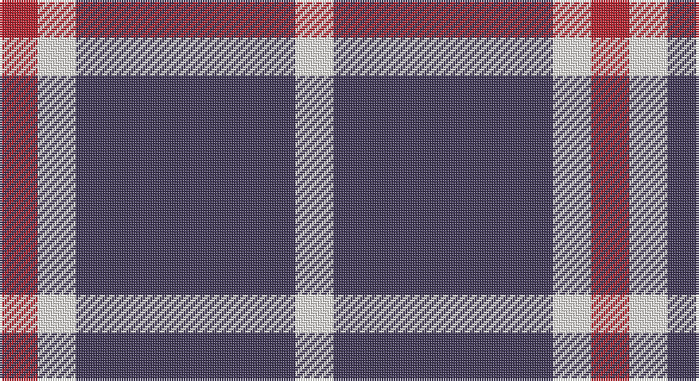

This page is one **sett** — a single exact thread-count. It belongs to the [tartan](/setts/dp23w4r4/)
(the same proportion at any scale), whose colour order is pattern [RWBW](/stripes/rwbw/).

Part of the [Auchmaliddie Samkoma](/tartans/auchmaliddie-samkoma/) tartan — the named design grouping this sett with its other cloths.

Sourced from register-of-tartans.  It is a [4 stripe tartan](/stripes/stripes4/).

Original link https://www.tartanregister.gov.uk/tartanDetails.aspx?ref=10348

## Register references

External register numbers recorded for this tartan.

- Scottish Register of Tartans: [10348](https://www.tartanregister.gov.uk/tartanDetails.aspx?ref=10348)

## Thread count
R/16 W16 N92 W/16

One full sett is **248 threads**.

## Palette

Palette: <strong>Tartan Dictionary</strong> <small style="color:#888">(1 of 3 colours)</small>
<table><thead><tr><th>Colour</th><th>Threads</th><th>Shade</th><th>Base</th><th>OKLCh</th></tr></thead><tbody><tr><td>R/</td><td style="text-align:right;font-variant-numeric:tabular-nums">16</td><td><code style="background-color:#B62531;">#B62531</code> <small style="color:#888">#B62531</small></td><td>R <code style="background-color:#CC0000;">#CC0000</code></td><td><small style="color:#888">oklch(50.8% 0.180 22.7)</small></td></tr><tr><td>W</td><td style="text-align:right;font-variant-numeric:tabular-nums">16</td><td><code style="background-color:#F9F5EF;">#F9F5EF</code> <small style="color:#888">#F9F5EF</small></td><td>W <code style="background-color:#F7F7F7;">#F7F7F7</code></td><td><small style="color:#888">oklch(97.2% 0.009 78.3)</small></td></tr><tr><td>N</td><td style="text-align:right;font-variant-numeric:tabular-nums">92</td><td><code style="background-color:#433A5A;">#433A5A</code> <small style="color:#888">#433A5A</small></td><td>B <code style="background-color:#2A418A;">#2A418A</code></td><td><small style="color:#888">oklch(37.2% 0.055 296.6)</small></td></tr><tr><td>W/</td><td style="text-align:right;font-variant-numeric:tabular-nums">16</td><td><code style="background-color:#F9F5EF;">#F9F5EF</code> <small style="color:#888">#F9F5EF</small></td><td>W <code style="background-color:#F7F7F7;">#F7F7F7</code></td><td><small style="color:#888">oklch(97.2% 0.009 78.3)</small></td></tr></tbody></table>

# Sample pattern

## Nearest tartans

The nearest existing variants by ΔTartan distance, with this tartan at the top so the swatches line up against it.

ΔTartan

Tartan

Sett

—

<a href="/ttd/edit/#slug=dp23w4r4~x4">Auchmaliddie Samkoma</a> <a class="nn-out" href="/variants/s4/dp23w4r4~x4/" title="open its dictionary page">↗</a>

0.94

<a href="/variants/s4/dt23w4r4~x4/">Auchmaliddie Samkoma (Personal)</a>

1.50

<a href="/variants/s6/b30ly5b4r12~x4/">UEFA (Glasgow)</a>

1.56

<a href="/ttd/edit/#slug=db3lo9db3lo9db20r3~x2&amp;base=dp23w4r4~x4">Latin</a> <a class="nn-out" href="/variants/s6/db3lo9db3lo9db20r3~x2/" title="open its dictionary page">↗</a>

1.64

<a href="/ttd/edit/#slug=b30ly5b4r12~x4&amp;base=dp23w4r4~x4">UEFA (Corporate)</a> <a class="nn-out" href="/variants/s4/b30ly5b4r12~x4/" title="open its dictionary page">↗</a>

1.66

<a href="/ttd/edit/#slug=lr2dr4lr2dr4lr9k1~x2&amp;base=dp23w4r4~x4">Buchanan VS</a> <a class="nn-out" href="/variants/s6/lr2dr4lr2dr4lr9k1~x2/" title="open its dictionary page">↗</a>

1.67

<a href="/ttd/edit/#slug=m13w3m1k3w1~x6&amp;base=dp23w4r4~x4">Glen App</a> <a class="nn-out" href="/variants/s5/m13w3m1k3w1~x6/" title="open its dictionary page">↗</a>

1.68

<a href="/ttd/edit/#slug=k46dy7k8w20~x2&amp;base=dp23w4r4~x4">Lords of Skye (Fashion?)</a> <a class="nn-out" href="/variants/s4/k46dy7k8w20~x2/" title="open its dictionary page">↗</a>

1.69

<a href="/ttd/edit/#slug=k5w25r6k45w4~x2&amp;base=dp23w4r4~x4">Shembe Zulu Church</a> <a class="nn-out" href="/variants/s5/k5w25r6k45w4~x2/" title="open its dictionary page">↗</a>

1.71

<a href="/ttd/edit/#slug=db10g4w27db40r4~x2&amp;base=dp23w4r4~x4">Turnbull Dress, Bruce (Personal)</a> <a class="nn-out" href="/variants/s5/db10g4w27db40r4~x2/" title="open its dictionary page">↗</a>

1.74

<a href="/variants/s4/dg20w5r3~x2/">Juchter (Personal)</a>

## Neighbour map

Every grey dot is one of 14360 variants placed by the first two principal components of the ΔTartan feature space (44% of its variance). Red is this tartan; blue dots are its nearest — click one to open its page.

<svg viewBox="0 0 640 380" role="img" style="max-width:100%;height:auto;border:1px solid #e0e0e0;border-radius:4px;display:block" xmlns="http://www.w3.org/2000/svg"><image href="/nn/cloud.v1.png" width="640" height="380"/><a href="/variants/s4/dt23w4r4~x4/"><circle cx="337.2" cy="240.6" r="4" fill="#3465a4"><title>Auchmaliddie Samkoma (Personal)</title></circle></a><a href="/variants/s6/b30ly5b4r12~x4/"><circle cx="346.0" cy="218.8" r="4" fill="#3465a4"><title>UEFA (Glasgow)</title></circle></a><a href="/variants/s6/db3lo9db3lo9db20r3~x2/"><circle cx="305.0" cy="240.8" r="4" fill="#3465a4"><title>Latin</title></circle></a><a href="/variants/s4/b30ly5b4r12~x4/"><circle cx="381.0" cy="251.8" r="4" fill="#3465a4"><title>UEFA (Corporate)</title></circle></a><a href="/variants/s6/lr2dr4lr2dr4lr9k1~x2/"><circle cx="316.3" cy="222.8" r="4" fill="#3465a4"><title>Buchanan VS</title></circle></a><a href="/variants/s5/m13w3m1k3w1~x6/"><circle cx="390.8" cy="185.7" r="4" fill="#3465a4"><title>Glen App</title></circle></a><a href="/variants/s4/k46dy7k8w20~x2/"><circle cx="334.9" cy="250.9" r="4" fill="#3465a4"><title>Lords of Skye (Fashion?)</title></circle></a><a href="/variants/s5/k5w25r6k45w4~x2/"><circle cx="315.9" cy="199.2" r="4" fill="#3465a4"><title>Shembe Zulu Church</title></circle></a><a href="/variants/s5/db10g4w27db40r4~x2/"><circle cx="287.5" cy="201.3" r="4" fill="#3465a4"><title>Turnbull Dress, Bruce (Personal)</title></circle></a><a href="/variants/s4/dg20w5r3~x2/"><circle cx="305.6" cy="243.6" r="4" fill="#3465a4"><title>Juchter (Personal)</title></circle></a><circle cx="349.2" cy="237.8" r="5" fill="#c00000"/></svg>

ID: /variants/s4/dp23w4r4~x4/
