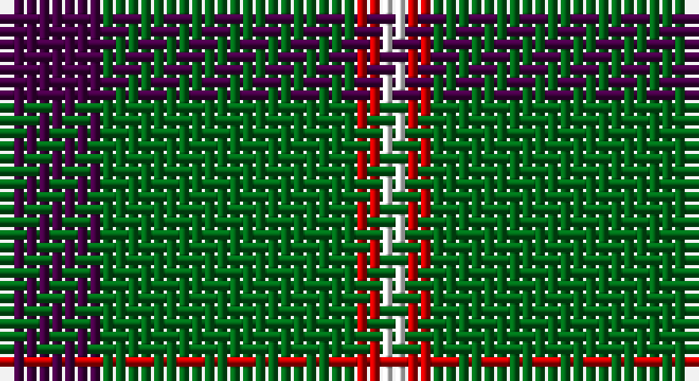

This page is one **sett** — a single exact thread-count. It belongs to the [tartan](/setts/dp4g10r1w1/)
(the same proportion at any scale), whose colour order is pattern [BGRW](/stripes/bgrw/).

Sourced from register-of-tartans.  It is a [4 stripe tartan](/stripes/stripes4/).

Original link https://www.tartanregister.gov.uk/tartanDetails.aspx?ref=4722

## Register references

External register numbers recorded for this tartan.

- Scottish Register of Tartans: [4722](https://www.tartanregister.gov.uk/tartanDetails.aspx?ref=4722)
- Scottish Tartans Authority (ITI): 1933
- Scottish Tartans World Register: 1933

## Thread count
DP/8 G20 R2 W/2

One full sett is **54 threads**.

## Palette

Palette: <strong>Tartan Register</strong>
<table><thead><tr><th>Colour</th><th>Threads</th><th>Shade</th><th>Base</th><th>OKLCh</th></tr></thead><tbody><tr><td>DP/</td><td style="text-align:right;font-variant-numeric:tabular-nums">8</td><td><code style="background-color:#440044;">#440044</code> <small style="color:#888">#440044</small></td><td>B <code style="background-color:#2A418A;">#2A418A</code></td><td><small style="color:#888">oklch(27.1% 0.125 328.4)</small></td></tr><tr><td>G</td><td style="text-align:right;font-variant-numeric:tabular-nums">20</td><td><code style="background-color:#006818;">#006818</code> <small style="color:#888">#006818</small></td><td>G <code style="background-color:#006100;">#006100</code></td><td><small style="color:#888">oklch(45.0% 0.142 145.0)</small></td></tr><tr><td>R</td><td style="text-align:right;font-variant-numeric:tabular-nums">2</td><td><code style="background-color:#C80000;">#C80000</code> <small style="color:#888">#C80000</small></td><td>R <code style="background-color:#CC0000;">#CC0000</code></td><td><small style="color:#888">oklch(52.3% 0.215 29.2)</small></td></tr><tr><td>W/</td><td style="text-align:right;font-variant-numeric:tabular-nums">2</td><td><code style="background-color:#FCFCFC;">#FCFCFC</code> <small style="color:#888">#FCFCFC</small></td><td>W <code style="background-color:#F7F7F7;">#F7F7F7</code></td><td><small style="color:#888">oklch(99.1% 0.000 89.9)</small></td></tr></tbody></table>

# Sample pattern

## Nearest tartans

The nearest existing variants by ΔTartan distance, with this tartan at the top so the swatches line up against it.

ΔTartan

Tartan

Sett

—

<a href="/ttd/edit/#slug=dp4g10r1w1~x2">Wilson's No.189</a> <a class="nn-out" href="/variants/s4/dp4g10r1w1~x2/" title="open its dictionary page">↗</a>

0.52

<a href="/ttd/edit/#slug=dp4g10r1ly1~x2&amp;base=dp4g10r1w1~x2">Wilson's No.192</a> <a class="nn-out" href="/variants/s4/dp4g10r1ly1~x2/" title="open its dictionary page">↗</a>

0.66

<a href="/ttd/edit/#slug=p4g10w1r1~x2&amp;base=dp4g10r1w1~x2">Wilson's, No 189</a> <a class="nn-out" href="/variants/s4/p4g10w1r1~x2/" title="open its dictionary page">↗</a>

0.74

<a href="/ttd/edit/#slug=p4g10r1ly1~x2&amp;base=dp4g10r1w1~x2">Wilson's, No 192</a> <a class="nn-out" href="/variants/s4/p4g10r1ly1~x2/" title="open its dictionary page">↗</a>

1.12

<a href="/ttd/edit/#slug=g14k3r3lr2~x2&amp;base=dp4g10r1w1~x2">Bacon, Green (Fashion)</a> <a class="nn-out" href="/variants/s4/g14k3r3lr2~x2/" title="open its dictionary page">↗</a>

1.16

<a href="/ttd/edit/#slug=w1dg10dp4lt1~x2&amp;base=dp4g10r1w1~x2">Wilson's No.205</a> <a class="nn-out" href="/variants/s4/w1dg10dp4lt1~x2/" title="open its dictionary page">↗</a>

1.24

<a href="/ttd/edit/#slug=t1db4g10ly1~x2&amp;base=dp4g10r1w1~x2">Wilson's No.174</a> <a class="nn-out" href="/variants/s4/t1db4g10ly1~x2/" title="open its dictionary page">↗</a>

1.26

<a href="/ttd/edit/#slug=k2ly1g7t1~x2&amp;base=dp4g10r1w1~x2">Wilson's No.140</a> <a class="nn-out" href="/variants/s4/k2ly1g7t1~x2/" title="open its dictionary page">↗</a>

1.29

<a href="/ttd/edit/#slug=dg21lo44dg86t10&amp;base=dp4g10r1w1~x2">Special Saffron (Fashion)</a> <a class="nn-out" href="/variants/s4/dg21lo44dg86t10/" title="open its dictionary page">↗</a>

1.29

<a href="/ttd/edit/#slug=dt62w11k4t17~x2&amp;base=dp4g10r1w1~x2">Thunderlord (Celtic Group, USA)</a> <a class="nn-out" href="/variants/s4/dt62w11k4t17~x2/" title="open its dictionary page">↗</a>

1.29

<a href="/ttd/edit/#slug=k61gi10g20w4~x2&amp;base=dp4g10r1w1~x2">Wesley Owen 2010 (Personal)</a> <a class="nn-out" href="/variants/s4/k61gi10g20w4~x2/" title="open its dictionary page">↗</a>

## Neighbour map

Every grey dot is one of 14360 variants placed by the first two principal components of the ΔTartan feature space (44% of its variance). Red is this tartan; blue dots are its nearest — click one to open its page.

<svg viewBox="0 0 640 380" role="img" style="max-width:100%;height:auto;border:1px solid #e0e0e0;border-radius:4px;display:block" xmlns="http://www.w3.org/2000/svg"><image href="/nn/cloud.v1.png" width="640" height="380"/><a href="/variants/s4/dp4g10r1ly1~x2/"><circle cx="356.7" cy="231.4" r="4" fill="#3465a4"><title>Wilson's No.192</title></circle></a><a href="/variants/s4/p4g10w1r1~x2/"><circle cx="342.5" cy="220.7" r="4" fill="#3465a4"><title>Wilson's, No 189</title></circle></a><a href="/variants/s4/p4g10r1ly1~x2/"><circle cx="347.2" cy="222.8" r="4" fill="#3465a4"><title>Wilson's, No 192</title></circle></a><a href="/variants/s4/g14k3r3lr2~x2/"><circle cx="346.9" cy="251.3" r="4" fill="#3465a4"><title>Bacon, Green (Fashion)</title></circle></a><a href="/variants/s4/w1dg10dp4lt1~x2/"><circle cx="334.0" cy="225.8" r="4" fill="#3465a4"><title>Wilson's No.205</title></circle></a><a href="/variants/s4/t1db4g10ly1~x2/"><circle cx="362.1" cy="242.5" r="4" fill="#3465a4"><title>Wilson's No.174</title></circle></a><a href="/variants/s4/k2ly1g7t1~x2/"><circle cx="336.9" cy="248.5" r="4" fill="#3465a4"><title>Wilson's No.140</title></circle></a><a href="/variants/s4/dg21lo44dg86t10/"><circle cx="371.8" cy="263.0" r="4" fill="#3465a4"><title>Special Saffron (Fashion)</title></circle></a><a href="/variants/s4/dt62w11k4t17~x2/"><circle cx="387.2" cy="206.4" r="4" fill="#3465a4"><title>Thunderlord (Celtic Group, USA)</title></circle></a><a href="/variants/s4/k61gi10g20w4~x2/"><circle cx="360.4" cy="212.1" r="4" fill="#3465a4"><title>Wesley Owen 2010 (Personal)</title></circle></a><circle cx="342.5" cy="224.4" r="5" fill="#c00000"/></svg>

ID: /variants/s4/dp4g10r1w1~x2/
