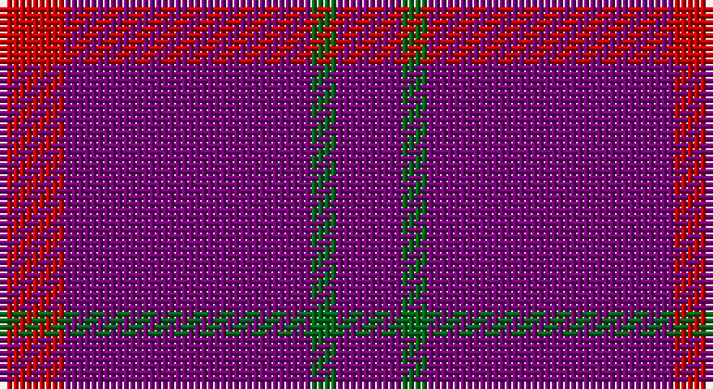

This page is one **sett** — a single exact thread-count. It belongs to the [tartan](/setts/dp5g2dp19r5/)
(the same proportion at any scale), whose colour order is pattern [BGBR](/stripes/bgbr/).

Part of the [Highland Spring](/tartans/highland-spring/) tartan — the named design grouping this sett with its other cloths.

Sourced from house-of-tartan.  It is a [4 stripe tartan](/stripes/stripes4/).

Original link http://www.house-of-tartan.scotland.net/house/TartanViewjs.asp?colr=Def&tnam=130

## Provenance

Earliest known date: 1987 Highland Spring manufacture bottled drinking water at Blackford in Perthshire, Scotland.

## Also known as

This cloth is also recorded under:

- Highland Spring Corporate Prom

## Thread count
R/10 P38 G4 P/10

One full sett is **104 threads**.

## Palette

Palette: <strong>Tartan Register</strong>
<table><thead><tr><th>Colour</th><th>Threads</th><th>Shade</th><th>Base</th><th>OKLCh</th></tr></thead><tbody><tr><td>R/</td><td style="text-align:right;font-variant-numeric:tabular-nums">10</td><td><code style="background-color:#C80000;">#C80000</code> <small style="color:#888">#C80000</small></td><td>R <code style="background-color:#CC0000;">#CC0000</code></td><td><small style="color:#888">oklch(52.3% 0.215 29.2)</small></td></tr><tr><td>P</td><td style="text-align:right;font-variant-numeric:tabular-nums">38</td><td><code style="background-color:#780078;">#780078</code> <small style="color:#888">#780078</small></td><td>B <code style="background-color:#2A418A;">#2A418A</code></td><td><small style="color:#888">oklch(40.2% 0.185 328.4)</small></td></tr><tr><td>G</td><td style="text-align:right;font-variant-numeric:tabular-nums">4</td><td><code style="background-color:#006818;">#006818</code> <small style="color:#888">#006818</small></td><td>G <code style="background-color:#006100;">#006100</code></td><td><small style="color:#888">oklch(45.0% 0.142 145.0)</small></td></tr><tr><td>P/</td><td style="text-align:right;font-variant-numeric:tabular-nums">10</td><td><code style="background-color:#780078;">#780078</code> <small style="color:#888">#780078</small></td><td>B <code style="background-color:#2A418A;">#2A418A</code></td><td><small style="color:#888">oklch(40.2% 0.185 328.4)</small></td></tr></tbody></table>

# Sample pattern

## Compared to the master

This cloth is one sett of its design; the master sett (the exemplar the design is anchored on) is below for comparison.

<figure style="margin:0"><figcaption style="color:#888;font-size:smaller">this sett</figcaption></figure>
<figure style="margin:0"><figcaption style="color:#888;font-size:smaller"><a href="/setts/dp3g1dp9r3/">master sett →</a></figcaption></figure>

## Nearest tartans

The nearest existing variants by ΔTartan distance, with this tartan at the top so the swatches line up against it.

ΔTartan

Tartan

Sett

—

<a href="/ttd/edit/#slug=dp5g2dp19r5~x2">Highland Spring Corporate Tartan</a> <a class="nn-out" href="/variants/s4/dp5g2dp19r5~x2/" title="open its dictionary page">↗</a>

1.00

<a href="/ttd/edit/#slug=r5p19g3p5~x2&amp;base=dp5g2dp19r5~x2">Highland Spring</a> <a class="nn-out" href="/variants/s4/r5p19g3p5~x2/" title="open its dictionary page">↗</a>

1.72

<a href="/ttd/edit/#slug=dp3g1dp9r3~x4&amp;base=dp5g2dp19r5~x2">Highland Spring (1988) (Corporate)</a> <a class="nn-out" href="/variants/s4/dp3g1dp9r3~x4/" title="open its dictionary page">↗</a>

1.80

<a href="/ttd/edit/#slug=r2p20db9p20g2~x2&amp;base=dp5g2dp19r5~x2">Scottish Netball Association</a> <a class="nn-out" href="/variants/s5/r2p20db9p20g2~x2/" title="open its dictionary page">↗</a>

1.88

<a href="/variants/s6/dp3g1dp9r3~x4/">Highland Spring (1988)</a>

2.14

<a href="/ttd/edit/#slug=r2dp20db9dp20g2~x2&amp;base=dp5g2dp19r5~x2">Scottish Netball (1987) (Corporate)</a> <a class="nn-out" href="/variants/s5/r2dp20db9dp20g2~x2/" title="open its dictionary page">↗</a>

2.34

<a href="/ttd/edit/#slug=r12dp3r7dp52dg4dp4~x2&amp;base=dp5g2dp19r5~x2">Lynch Variant</a> <a class="nn-out" href="/variants/s6/r12dp3r7dp52dg4dp4~x2/" title="open its dictionary page">↗</a>

2.46

<a href="/ttd/edit/#slug=db1r9db2r9lo1~x4&amp;base=dp5g2dp19r5~x2">Brooks Brothers Tattersall Red</a> <a class="nn-out" href="/variants/s5/db1r9db2r9lo1~x4/" title="open its dictionary page">↗</a>

2.73

<a href="/ttd/edit/#slug=m18dg1k5dg1k1dg1m9~x2&amp;base=dp5g2dp19r5~x2">Inverness Augustus</a> <a class="nn-out" href="/variants/s7/m18dg1k5dg1k1dg1m9~x2/" title="open its dictionary page">↗</a>

2.84

<a href="/ttd/edit/#slug=r40db2r6db15~x2&amp;base=dp5g2dp19r5~x2">Masai Shuka 21 (Artefact)</a> <a class="nn-out" href="/variants/s4/r40db2r6db15~x2/" title="open its dictionary page">↗</a>

2.86

<a href="/ttd/edit/#slug=m37dy9m3g9dy3~x2&amp;base=dp5g2dp19r5~x2">Glen Shee Trade Tartan</a> <a class="nn-out" href="/variants/s5/m37dy9m3g9dy3~x2/" title="open its dictionary page">↗</a>

## Neighbour map

Every grey dot is one of 14360 variants placed by the first two principal components of the ΔTartan feature space (44% of its variance). Red is this tartan; blue dots are its nearest — click one to open its page.

<svg viewBox="0 0 640 380" role="img" style="max-width:100%;height:auto;border:1px solid #e0e0e0;border-radius:4px;display:block" xmlns="http://www.w3.org/2000/svg"><image href="/nn/cloud.v1.png" width="640" height="380"/><a href="/variants/s4/r5p19g3p5~x2/"><circle cx="500.4" cy="279.9" r="4" fill="#3465a4"><title>Highland Spring</title></circle></a><a href="/variants/s4/dp3g1dp9r3~x4/"><circle cx="501.3" cy="276.3" r="4" fill="#3465a4"><title>Highland Spring (1988) (Corporate)</title></circle></a><a href="/variants/s5/r2p20db9p20g2~x2/"><circle cx="542.8" cy="273.5" r="4" fill="#3465a4"><title>Scottish Netball Association</title></circle></a><a href="/variants/s6/dp3g1dp9r3~x4/"><circle cx="550.9" cy="265.9" r="4" fill="#3465a4"><title>Highland Spring (1988)</title></circle></a><a href="/variants/s5/r2dp20db9dp20g2~x2/"><circle cx="555.3" cy="281.7" r="4" fill="#3465a4"><title>Scottish Netball (1987) (Corporate)</title></circle></a><a href="/variants/s6/r12dp3r7dp52dg4dp4~x2/"><circle cx="528.9" cy="190.8" r="4" fill="#3465a4"><title>Lynch Variant</title></circle></a><a href="/variants/s5/db1r9db2r9lo1~x4/"><circle cx="605.6" cy="274.2" r="4" fill="#3465a4"><title>Brooks Brothers Tattersall Red</title></circle></a><a href="/variants/s7/m18dg1k5dg1k1dg1m9~x2/"><circle cx="587.3" cy="221.7" r="4" fill="#3465a4"><title>Inverness Augustus</title></circle></a><a href="/variants/s4/r40db2r6db15~x2/"><circle cx="546.2" cy="226.0" r="4" fill="#3465a4"><title>Masai Shuka 21 (Artefact)</title></circle></a><a href="/variants/s5/m37dy9m3g9dy3~x2/"><circle cx="494.1" cy="241.8" r="4" fill="#3465a4"><title>Glen Shee Trade Tartan</title></circle></a><circle cx="560.6" cy="272.3" r="5" fill="#c00000"/></svg>

ID: /variants/s4/dp5g2dp19r5~x2/
