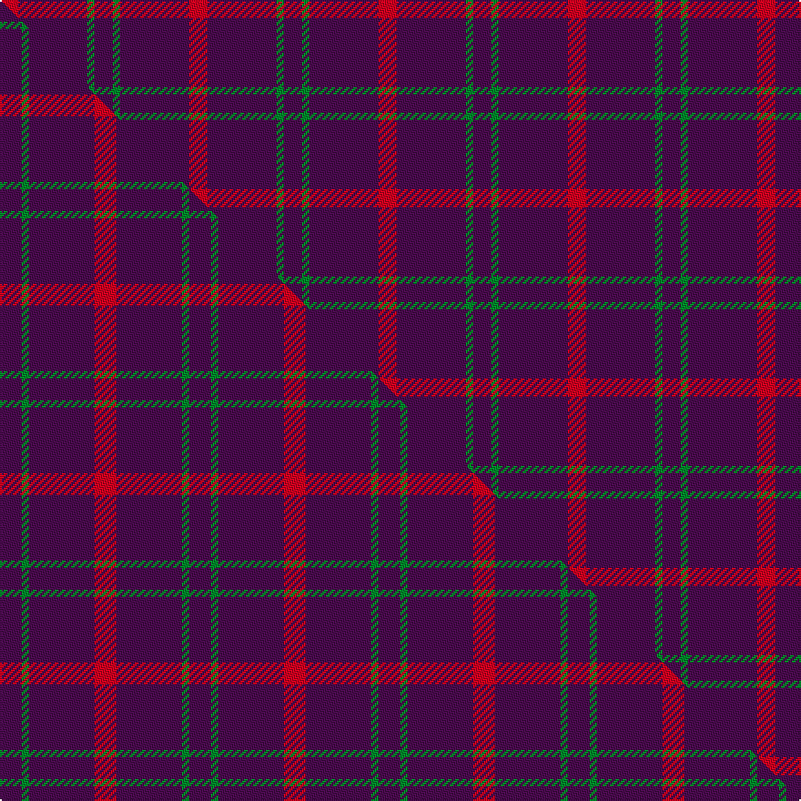

This page is one **sett** — a single exact thread-count. It belongs to the [tartan](/setts/dp5g2dp19r5/)
(the same proportion at any scale), whose colour order is pattern [BGBR](/stripes/bgbr/).

Part of the [Highland Spring](/tartans/highland-spring/) tartan — the named design grouping this sett with its other cloths.

Sourced from house-of-tartan.  It is a [4 stripe tartan](/stripes/stripes4/).

Original link http://www.house-of-tartan.scotland.net/house/TartanViewjs.asp?colr=Def&tnam=130

## Provenance

Earliest known date: 1987 Highland Spring manufacture bottled drinking water at Blackford in Perthshire, Scotland.

## Thread count
R/10 DP38 G4 DP/10

One full sett is **104 threads**.

## Palette
<table><thead><tr><th>Colour</th><th>Shade</th><th>OKLCh</th></tr></thead><tbody><tr><td>G</td><td><code style="background-color:#008B2A;">#008B2A</code> <small style="color:#888">#008B2A</small></td><td><small style="color:#888">oklch(55.4% 0.170 145.9)</small></td></tr><tr><td>DP</td><td><code style="background-color:#4B0B4F;">#4B0B4F</code> <small style="color:#888">#4B0B4F</small></td><td><small style="color:#888">oklch(30.1% 0.125 325.4)</small></td></tr><tr><td>R</td><td><code style="background-color:#D60020;">#D60020</code> <small style="color:#888">#D60020</small></td><td><small style="color:#888">oklch(55.2% 0.224 25.5)</small></td></tr></tbody></table>

# Sample pattern

## Compared to the master

This cloth is one sett of its design; the master sett (the exemplar the design is anchored on) is below for comparison.

Its **ΔTartan distance** from the master is **0.52** — the same measure the nearest-tartans table ranks by (0 is identical; a re-scale of the same cloth is near 0, a recolour or a different proportion further).

<figure class="master-compare" style="margin:0">

this sett
master sett ★

<figcaption style="color:#888;font-size:smaller">One weave of this sett against the <a href="/setts/dp3g1dp9r3/">master sett ★</a>, split on the diagonal: a shared proportion runs seamlessly across it with only the shades shifting; a different proportion breaks on it.</figcaption>
</figure>

## Nearest tartan variants

The nearest existing variants by ΔTartan distance, with this cloth at the top so the swatches line up against it.

ΔTartan

Threads

Variant

Sett

—

104

<a href="/variants/s4/dp5g2dp19r5~x2/">Highland Spring Corporate Tartan</a>

<a href="/ttd/edit/#slug=dp5g3dp19r5~x2&amp;base=dp5g2dp19r5~x2" title="compare in the TTD">0.37</a>

108

<a href="/variants/s4/dp5g3dp19r5~x2/">Highland Spring</a>

<a href="/ttd/edit/#slug=dp20lb8g8db8dp33r3~x2&amp;base=dp5g2dp19r5~x2" title="compare in the TTD">1.49</a>

274

<a href="/variants/s6/dp20lb8g8db8dp33r3~x2/">McIntosh, Stuart (Personal)</a>

<a href="/ttd/edit/#slug=dp3g1dp9r3~x4&amp;base=dp5g2dp19r5~x2" title="compare in the TTD">1.61</a>

104

<a href="/variants/s4/dp3g1dp9r3~x4/">Highland Spring (1988)</a>

<a href="/ttd/edit/#slug=r2dp20db9dp20g2~x2&amp;base=dp5g2dp19r5~x2" title="compare in the TTD">2.10</a>

204

<a href="/variants/s5/r2dp20db9dp20g2~x2/">Scottish Netball (1987) (Corporate)</a>

<a href="/ttd/edit/#slug=dp30m5dp5lb4dp4g12~x2~dp1507303-m2510349&amp;base=dp5g2dp19r5~x2" title="compare in the TTD">2.14</a>

156

<a href="/variants/s6/dp30m5dp5lb4dp4g12~x2~dp1507303-m2510349/">International Festival of Authors</a>

<a href="/ttd/edit/#slug=dp30m5dp5b4dp4g12~x2~m2609322-b2306275&amp;base=dp5g2dp19r5~x2" title="compare in the TTD">2.60</a>

156

<a href="/variants/s6/dp30m5dp5b4dp4g12~x2~m2609322-b2306275/">International Festival of Authors (C</a>

<a href="/ttd/edit/#slug=db62r24y5g3~x2&amp;base=dp5g2dp19r5~x2" title="compare in the TTD">2.92</a>

246

<a href="/variants/s4/db62r24y5g3~x2/">Meaux, Luc G (Personal)</a>

<a href="/ttd/edit/#slug=r27w3r6w2dg3~x4~r1506028&amp;base=dp5g2dp19r5~x2" title="compare in the TTD">2.98</a>

208

<a href="/variants/s5/r27w3r6w2dg3~x4~r1506028/">Martin Family, Robert N Personal Tartan</a>

## Neighbour map

Every grey dot is one of 13620 variants placed by the first two principal components of the ΔTartan feature space (42% of its variance). Red is this tartan; blue dots are its nearest — click one to open its page.

<svg viewBox="0 0 640 380" role="img" style="max-width:100%;height:auto;border:1px solid #e0e0e0;border-radius:4px;display:block" xmlns="http://www.w3.org/2000/svg"><image href="/nn/cloud.v1.png" width="640" height="380"/><a href="/variants/s4/dp5g3dp19r5~x2/"><circle cx="490.9" cy="262.9" r="4" fill="#3465a4"><title>Highland Spring</title></circle></a><a href="/variants/s6/dp20lb8g8db8dp33r3~x2/"><circle cx="361.9" cy="200.8" r="4" fill="#3465a4"><title>McIntosh, Stuart (Personal)</title></circle></a><a href="/variants/s4/dp3g1dp9r3~x4/"><circle cx="548.3" cy="238.4" r="4" fill="#3465a4"><title>Highland Spring (1988)</title></circle></a><a href="/variants/s5/r2dp20db9dp20g2~x2/"><circle cx="572.3" cy="260.4" r="4" fill="#3465a4"><title>Scottish Netball (1987) (Corporate)</title></circle></a><a href="/variants/s6/dp30m5dp5lb4dp4g12~x2~dp1507303-m2510349/"><circle cx="374.3" cy="214.4" r="4" fill="#3465a4"><title>International Festival of Authors</title></circle></a><a href="/variants/s6/dp30m5dp5b4dp4g12~x2~m2609322-b2306275/"><circle cx="378.7" cy="215.3" r="4" fill="#3465a4"><title>International Festival of Authors (C</title></circle></a><a href="/variants/s4/db62r24y5g3~x2/"><circle cx="423.2" cy="184.4" r="4" fill="#3465a4"><title>Meaux, Luc G (Personal)</title></circle></a><a href="/variants/s5/r27w3r6w2dg3~x4~r1506028/"><circle cx="521.0" cy="181.2" r="4" fill="#3465a4"><title>Martin Family, Robert N Personal Tartan</title></circle></a><circle cx="536.2" cy="245.1" r="5" fill="#c00000"/><text x="320" y="376" text-anchor="middle" font-size="11" fill="#999">ground</text><text x="11" y="190" text-anchor="middle" font-size="11" fill="#999" transform="rotate(-90 11 190)">complexity</text></svg>

ID: /variants/s4/dp5g2dp19r5~x2/
