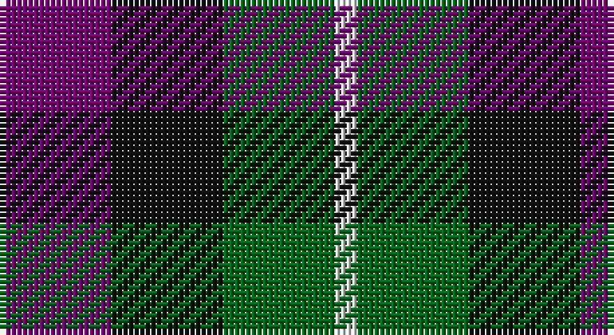

This page is one **sett** — a single exact thread-count. It belongs to the [tartan](/setts/dp5k5g5w1/)
(the same proportion at any scale), whose colour order is pattern [BKGW](/stripes/bkgw/).

Sourced from register-of-tartans.  It is a [4 stripe tartan](/stripes/stripes4/).

Original link https://www.tartanregister.gov.uk/tartanDetails.aspx?ref=4748

## Register references

External register numbers recorded for this tartan.

- Scottish Register of Tartans: [4748](https://www.tartanregister.gov.uk/tartanDetails.aspx?ref=4748)
- Scottish Tartans Authority (ITI): 1941
- Scottish Tartans World Register: 1941

## Thread count
P/20 K20 G20 LN/4

One full sett is **104 threads**.

## Palette

Palette: <strong>Tartan Register</strong> <small style="color:#888">(4 of 6 colours)</small>
<table><thead><tr><th>Colour</th><th>Threads</th><th>Shade</th><th>Base</th><th>OKLCh</th></tr></thead><tbody><tr><td>P/</td><td style="text-align:right;font-variant-numeric:tabular-nums">20</td><td><code style="background-color:#740074;">#740074</code> <small style="color:#888">#740074</small></td><td>B <code style="background-color:#2A418A;">#2A418A</code></td><td><small style="color:#888">oklch(39.2% 0.180 328.4)</small></td></tr><tr><td>K</td><td style="text-align:right;font-variant-numeric:tabular-nums">20</td><td><code style="background-color:#101010;">#101010</code> <small style="color:#888">#101010</small></td><td>K <code style="background-color:#000000;">#000000</code></td><td><small style="color:#888">oklch(17.3% 0.000 89.9)</small></td></tr><tr><td>G</td><td style="text-align:right;font-variant-numeric:tabular-nums">20</td><td><code style="background-color:#006818;">#006818</code> <small style="color:#888">#006818</small></td><td>G <code style="background-color:#006100;">#006100</code></td><td><small style="color:#888">oklch(45.0% 0.142 145.0)</small></td></tr><tr><td>LN/</td><td style="text-align:right;font-variant-numeric:tabular-nums">4</td><td><code style="background-color:#E0E0E0;">#E0E0E0</code> <small style="color:#888">#E0E0E0</small></td><td>W <code style="background-color:#F7F7F7;">#F7F7F7</code></td><td><small style="color:#888">oklch(90.7% 0.000 89.9)</small></td></tr></tbody></table>

# Sample pattern

## Nearest tartans

The nearest existing variants by ΔTartan distance, with this tartan at the top so the swatches line up against it.

ΔTartan

Tartan

Sett

—

<a href="/ttd/edit/#slug=dp5k5g5w1~x4">Wilson's No.220</a> <a class="nn-out" href="/variants/s4/dp5k5g5w1~x4/" title="open its dictionary page">↗</a>

0.77

<a href="/ttd/edit/#slug=dp8k11dg9w2~x2&amp;base=dp5k5g5w1~x4">Wilson's No 220</a> <a class="nn-out" href="/variants/s4/dp8k11dg9w2~x2/" title="open its dictionary page">↗</a>

0.87

<a href="/ttd/edit/#slug=dp8k11g9r2~x2&amp;base=dp5k5g5w1~x4">Norwich Collection No. 60</a> <a class="nn-out" href="/variants/s4/dp8k11g9r2~x2/" title="open its dictionary page">↗</a>

0.93

<a href="/ttd/edit/#slug=p6k5g5r1~x2&amp;base=dp5k5g5w1~x4">Unnamed, No 60</a> <a class="nn-out" href="/variants/s4/p6k5g5r1~x2/" title="open its dictionary page">↗</a>

1.01

<a href="/ttd/edit/#slug=dp3k3dp3dg6ly2~x2&amp;base=dp5k5g5w1~x4">Austin (Wilson's No 173)</a> <a class="nn-out" href="/variants/s5/dp3k3dp3dg6ly2~x2/" title="open its dictionary page">↗</a>

1.10

<a href="/ttd/edit/#slug=p8k11g9r2~x2&amp;base=dp5k5g5w1~x4">Wilson's, No 159</a> <a class="nn-out" href="/variants/s4/p8k11g9r2~x2/" title="open its dictionary page">↗</a>

1.13

<a href="/ttd/edit/#slug=r9g9k10t2~x2&amp;base=dp5k5g5w1~x4">Wilson's No.196</a> <a class="nn-out" href="/variants/s4/r9g9k10t2~x2/" title="open its dictionary page">↗</a>

1.15

<a href="/ttd/edit/#slug=p8k11g9w2~x2&amp;base=dp5k5g5w1~x4">Wilson's, No 220</a> <a class="nn-out" href="/variants/s4/p8k11g9w2~x2/" title="open its dictionary page">↗</a>

1.20

<a href="/ttd/edit/#slug=dp11t2k10g10ly3~x2&amp;base=dp5k5g5w1~x4">Nobiliary Fraternity</a> <a class="nn-out" href="/variants/s5/dp11t2k10g10ly3~x2/" title="open its dictionary page">↗</a>

1.21

<a href="/ttd/edit/#slug=p3k3p3g6r2~x2&amp;base=dp5k5g5w1~x4">Austin / Wilson's No 137</a> <a class="nn-out" href="/variants/s5/p3k3p3g6r2~x2/" title="open its dictionary page">↗</a>

1.25

<a href="/ttd/edit/#slug=db4k5g4r1~x4&amp;base=dp5k5g5w1~x4">Unidentified, pattern</a> <a class="nn-out" href="/variants/s4/db4k5g4r1~x4/" title="open its dictionary page">↗</a>

## Neighbour map

Every grey dot is one of 14360 variants placed by the first two principal components of the ΔTartan feature space (44% of its variance). Red is this tartan; blue dots are its nearest — click one to open its page.

<svg viewBox="0 0 640 380" role="img" style="max-width:100%;height:auto;border:1px solid #e0e0e0;border-radius:4px;display:block" xmlns="http://www.w3.org/2000/svg"><image href="/nn/cloud.v1.png" width="640" height="380"/><a href="/variants/s4/dp8k11dg9w2~x2/"><circle cx="142.2" cy="295.5" r="4" fill="#3465a4"><title>Wilson's No 220</title></circle></a><a href="/variants/s4/dp8k11g9r2~x2/"><circle cx="157.2" cy="297.7" r="4" fill="#3465a4"><title>Norwich Collection No. 60</title></circle></a><a href="/variants/s4/p6k5g5r1~x2/"><circle cx="121.5" cy="275.2" r="4" fill="#3465a4"><title>Unnamed, No 60</title></circle></a><a href="/variants/s5/dp3k3dp3dg6ly2~x2/"><circle cx="93.5" cy="305.8" r="4" fill="#3465a4"><title>Austin (Wilson's No 173)</title></circle></a><a href="/variants/s4/p8k11g9r2~x2/"><circle cx="119.1" cy="280.8" r="4" fill="#3465a4"><title>Wilson's, No 159</title></circle></a><a href="/variants/s4/r9g9k10t2~x2/"><circle cx="124.3" cy="292.4" r="4" fill="#3465a4"><title>Wilson's No.196</title></circle></a><a href="/variants/s4/p8k11g9w2~x2/"><circle cx="109.5" cy="277.7" r="4" fill="#3465a4"><title>Wilson's, No 220</title></circle></a><a href="/variants/s5/dp11t2k10g10ly3~x2/"><circle cx="87.8" cy="247.3" r="4" fill="#3465a4"><title>Nobiliary Fraternity</title></circle></a><a href="/variants/s5/p3k3p3g6r2~x2/"><circle cx="85.0" cy="295.3" r="4" fill="#3465a4"><title>Austin / Wilson's No 137</title></circle></a><a href="/variants/s4/db4k5g4r1~x4/"><circle cx="108.8" cy="294.9" r="4" fill="#3465a4"><title>Unidentified, pattern</title></circle></a><circle cx="112.4" cy="293.0" r="5" fill="#c00000"/></svg>

ID: /variants/s4/dp5k5g5w1~x4/
