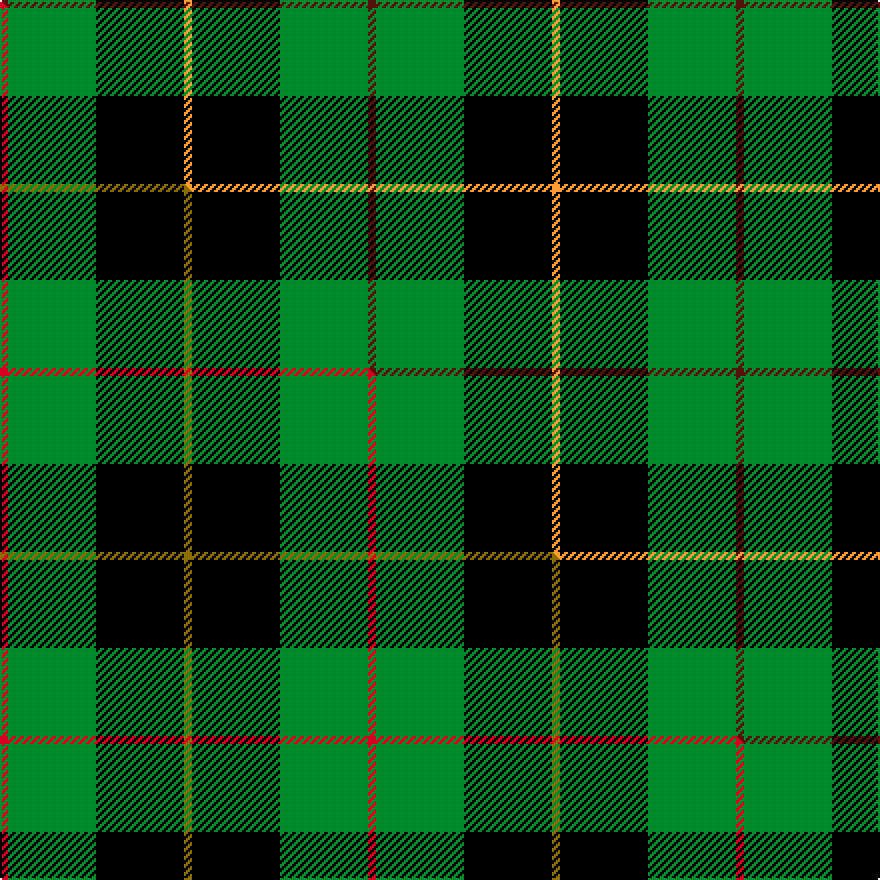

This is one **variant** — a specific cloth: this exact thread count and colourway, with its own
provenance below. It is one weaving of the [sett](/setts/dr1g11k11lo1/) (the scale-free proportion — the
same cloth at any scale or shade), whose colour order is pattern [BGKY](/stripes/bgky/).

Part of the [Brooks Brothers](/tartans/b/br/brooks-brothers-2/) tartan — the named design grouping this sett with its other cloths.

Sourced from tartans-authority.  It is a [4 stripe tartan](/stripes/stripes4/).

Original link [https://www.tartanregister.gov.uk/tartanDetails.aspx?ref=3736](https://www.tartanregister.gov.uk/tartanDetails.aspx?ref=3736)

Dataset <small>— provenance for this record, inherited from the source manifest</small>

<dl class="dataset-prov">
<dt>source</dt><dd><a href="/sources/tartans-authority/">Scottish Tartans Authority</a></dd>
<dt>data captured from</dt><dd><a href="https://github.com/thetartan/tartan-database/blob/master/data/tartans-authority/data.csv">https://github.com/thetartan/tartan-database/blob/master/data/tartans-authority/data.csv</a></dd>
<dt>data date</dt><dd>pre 2002 <small>(this record)</small></dd>
<dt>licence</dt><dd><a href="https://creativecommons.org/licenses/by-nc-nd/4.0/">CC BY-NC-ND 4.0</a></dd>
</dl>

Capture chain <small>— the hands this data passed through, oldest first; each capture carries its own licence</small>

<ol class="capture-chain">
<li><a href="https://www.tartansauthority.com/">Scottish Tartans Authority</a> <small>the heritage body's archive — its tartan-ferret record browser is retired (links repaired to the SRT, above)</small></li>
<li><a href="https://github.com/thetartan/tartan-database">thetartan/tartan-database</a> <small>2016-2017</small> · <a href="https://creativecommons.org/licenses/by-nc-nd/4.0/">CC BY-NC-ND 4.0</a> <small>Levko Kravets's frozen compilation — the capture we vendored, and where its CC licence text came from</small></li>
<li>this dictionary <small>captured 2026-06-10 · commit 5bf86c7566</small> <small>each re-capture is a git commit to data/sources</small></li>
</ol>

## Register references

External register numbers recorded for this tartan.

- Scottish Tartans Authority (ITI): 3736

## Thread count
DR/4 G44 K44 LO/4

One full sett is **184 threads**.

## Palette
<table><thead><tr><th>Colour</th><th>Shade</th><th>OKLCh</th></tr></thead><tbody><tr><td>DR</td><td><code style="background-color:#55120C;">#55120C</code> <small style="color:#888">#55120C</small></td><td><small style="color:#888">oklch(30.0% 0.099 29.3)</small></td></tr><tr><td>LO</td><td><code style="background-color:#FF9C34;">#FF9C34</code> <small style="color:#888">#FF9C34</small></td><td><small style="color:#888">oklch(77.9% 0.161 61.8)</small></td></tr><tr><td>G</td><td><code style="background-color:#008B2A;">#008B2A</code> <small style="color:#888">#008B2A</small></td><td><small style="color:#888">oklch(55.4% 0.170 145.9)</small></td></tr><tr><td>K</td><td><code style="background-color:#000000;">#000000</code> <small style="color:#888">#000000</small></td><td><small style="color:#888">oklch(0.0% 0.000 0.0)</small></td></tr></tbody></table>

# Sample pattern

## Compared to the master

This cloth is one sett of its design; the master sett (the exemplar the design is anchored on) is below for comparison.

Its **ΔTartan distance** from the master is **0.32** — the same measure the nearest-tartans table ranks by (0 is identical; a re-scale of the same cloth is near 0, a recolour or a different proportion further).

<figure class="master-compare" style="margin:0">

this sett
master sett ★

<figcaption style="color:#888;font-size:smaller">One weave of this sett against the <a href="/setts/r1g11k11y1/">master sett ★</a>, split on the diagonal: a shared proportion runs seamlessly across it with only the shades shifting; a different proportion breaks on it.</figcaption>
</figure>

## Nearest tartan variants

The nearest existing variants by ΔTartan distance, with this cloth at the top so the swatches line up against it.

ΔTartan

Threads

Variant

Sett

—

184

<a href="/variants/s4/dr1g11k11lo1~x4/">Brooks Brothers (Corporate)</a>

<a href="/ttd/edit/#slug=r1g11k11y1~x4&amp;base=dr1g11k11lo1~x4" title="compare in the TTD">0.32</a>

184

<a href="/variants/s4/r1g11k11y1~x4/">Brooks Brothers</a>

<a href="/ttd/edit/#slug=k11g16dr2~x4&amp;base=dr1g11k11lo1~x4" title="compare in the TTD">0.90</a>

180

<a href="/variants/s3/k11g16dr2~x4/">Kincaid of Kincaid (Clan)</a>

<a href="/ttd/edit/#slug=k6y1g6~x4&amp;base=dr1g11k11lo1~x4" title="compare in the TTD">1.07</a>

56

<a href="/variants/s3/k6y1g6~x4/">Wilson's No.197</a>

<a href="/ttd/edit/#slug=g5k6lb1~x4&amp;base=dr1g11k11lo1~x4" title="compare in the TTD">1.19</a>

72

<a href="/variants/s3/g5k6lb1~x4/">Wilson's, No 50</a>

<a href="/ttd/edit/#slug=g37k22w4r15y3~x2&amp;base=dr1g11k11lo1~x4" title="compare in the TTD">1.24</a>

244

<a href="/variants/s5/g37k22w4r15y3~x2/">Oakley (2015)</a>

<a href="/ttd/edit/#slug=k7y1g7lb1~x2&amp;base=dr1g11k11lo1~x4" title="compare in the TTD">1.31</a>

48

<a href="/variants/s4/k7y1g7lb1~x2/">Wilson's, No 140</a>

<a href="/ttd/edit/#slug=k7w1g7lb1~x2&amp;base=dr1g11k11lo1~x4" title="compare in the TTD">1.31</a>

48

<a href="/variants/s4/k7w1g7lb1~x2/">Wilson's No.079</a>

<a href="/ttd/edit/#slug=k11dp4lb1g9~x4&amp;base=dr1g11k11lo1~x4" title="compare in the TTD">1.53</a>

120

<a href="/variants/s4/k11dp4lb1g9~x4/">Wilson's, No 228</a>

<a href="/ttd/edit/#slug=k4g33k33y4~x2&amp;base=dr1g11k11lo1~x4" title="compare in the TTD">1.66</a>

280

<a href="/variants/s4/k4g33k33y4~x2/">Wallace Hunting Clan Tartan</a>

<a href="/ttd/edit/#slug=k6db4g44k41w4~x2&amp;base=dr1g11k11lo1~x4" title="compare in the TTD">1.68</a>

376

<a href="/variants/s5/k6db4g44k41w4~x2/">Douglas (alternative threadcount)</a>

## Neighbour map

Every grey dot is one of 13621 variants placed by the first two principal components of the ΔTartan feature space (42% of its variance). Red is this tartan; blue dots are its nearest — click one to open its page.

<svg viewBox="0 0 640 380" role="img" style="max-width:100%;height:auto;border:1px solid #e0e0e0;border-radius:4px;display:block" xmlns="http://www.w3.org/2000/svg"><image href="/nn/cloud.v1.png" width="640" height="380"/><a href="/variants/s4/r1g11k11y1~x4/"><circle cx="230.4" cy="205.5" r="4" fill="#3465a4"><title>Brooks Brothers</title></circle></a><a href="/variants/s3/k11g16dr2~x4/"><circle cx="266.6" cy="266.2" r="4" fill="#3465a4"><title>Kincaid of Kincaid (Clan)</title></circle></a><a href="/variants/s3/k6y1g6~x4/"><circle cx="201.0" cy="254.7" r="4" fill="#3465a4"><title>Wilson's No.197</title></circle></a><a href="/variants/s3/g5k6lb1~x4/"><circle cx="222.5" cy="281.6" r="4" fill="#3465a4"><title>Wilson's, No 50</title></circle></a><a href="/variants/s5/g37k22w4r15y3~x2/"><circle cx="172.3" cy="182.2" r="4" fill="#3465a4"><title>Oakley (2015)</title></circle></a><a href="/variants/s4/k7y1g7lb1~x2/"><circle cx="190.4" cy="230.6" r="4" fill="#3465a4"><title>Wilson's, No 140</title></circle></a><a href="/variants/s4/k7w1g7lb1~x2/"><circle cx="193.8" cy="235.5" r="4" fill="#3465a4"><title>Wilson's No.079</title></circle></a><a href="/variants/s4/k11dp4lb1g9~x4/"><circle cx="190.5" cy="225.3" r="4" fill="#3465a4"><title>Wilson's, No 228</title></circle></a><a href="/variants/s4/k4g33k33y4~x2/"><circle cx="256.3" cy="233.2" r="4" fill="#3465a4"><title>Wallace Hunting Clan Tartan</title></circle></a><a href="/variants/s5/k6db4g44k41w4~x2/"><circle cx="233.3" cy="187.8" r="4" fill="#3465a4"><title>Douglas (alternative threadcount)</title></circle></a><circle cx="230.3" cy="206.1" r="5" fill="#c00000"/><text x="320" y="376" text-anchor="middle" font-size="11" fill="#999">ground</text><text x="11" y="190" text-anchor="middle" font-size="11" fill="#999" transform="rotate(-90 11 190)">complexity</text></svg>

ID: /variants/s4/dr1g11k11lo1~x4/
