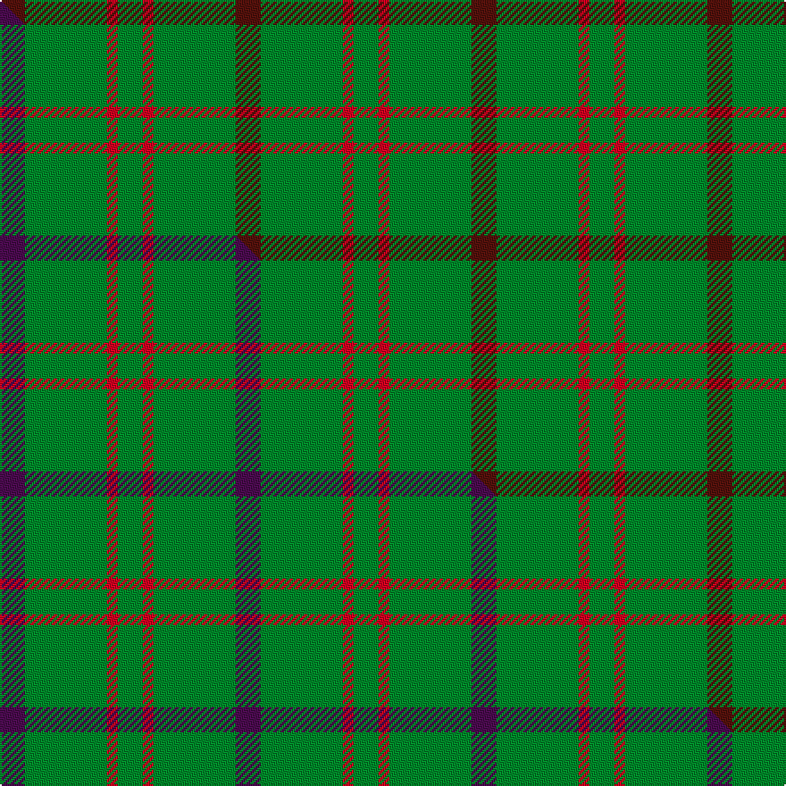

This is one **variant** — a specific cloth: this exact thread count and colourway, with its own
provenance below. It is one weaving of the [sett](/tartans/h/hi/highland-spring-2/) (the scale-free proportion — the
same cloth at any scale or shade), whose colour order is pattern [BGRG](/stripes/bgrg/).

Part of the [Highland Spring](/tartans/h/hi/highland-spring-2/) tartan — the named design grouping this sett with its other cloths.

Sourced from weddslist.  It is a [4 stripe tartan](/stripes/stripes4/).

Original link [http://www.weddslist.com/cgi-bin/tartans/pg.pl?source=sts](http://www.weddslist.com/cgi-bin/tartans/pg.pl?source=sts)

Dataset <small>— provenance for this record, inherited from the source manifest</small>

<dl class="dataset-prov">
<dt>source</dt><dd><a href="/sources/weddslist/">Weddslist</a></dd>
<dt>data captured from</dt><dd><a href="https://github.com/thetartan/tartan-database/blob/master/data/weddslist/data.csv">https://github.com/thetartan/tartan-database/blob/master/data/weddslist/data.csv</a></dd>
<dt>data date</dt><dd>2016-11-17 <small>(dataset default)</small></dd>
<dt>licence</dt><dd><a href="https://creativecommons.org/licenses/by-nc-nd/4.0/">CC BY-NC-ND 4.0</a></dd>
</dl>

Capture chain <small>— the hands this data passed through, oldest first; each capture carries its own licence</small>

<ol class="capture-chain">
<li><a href="https://www.weddslist.com/tartans/">Weddslist</a> <small>the living privately compiled reference</small></li>
<li><a href="https://github.com/thetartan/tartan-database">thetartan/tartan-database</a> <small>2016-2017</small> · <a href="https://creativecommons.org/licenses/by-nc-nd/4.0/">CC BY-NC-ND 4.0</a> <small>Levko Kravets's frozen compilation — the capture we vendored, and where its CC licence text came from</small></li>
<li>this dictionary <small>captured 2026-06-10 · commit 5bf86c7566</small> <small>each re-capture is a git commit to data/sources</small></li>
</ol>

## Thread count
DR/14 G46 R6 G/14

One full sett is **132 threads**.

## Palette
<table><thead><tr><th>Colour</th><th>Shade</th><th>OKLCh</th></tr></thead><tbody><tr><td>DR</td><td><code style="background-color:#55120C;">#55120C</code> <small style="color:#888">#55120C</small></td><td><small style="color:#888">oklch(30.0% 0.099 29.3)</small></td></tr><tr><td>G</td><td><code style="background-color:#008B2A;">#008B2A</code> <small style="color:#888">#008B2A</small></td><td><small style="color:#888">oklch(55.4% 0.170 145.9)</small></td></tr><tr><td>R</td><td><code style="background-color:#D60020;">#D60020</code> <small style="color:#888">#D60020</small></td><td><small style="color:#888">oklch(55.2% 0.224 25.5)</small></td></tr></tbody></table>

# Sample pattern

## Compared to the master

This cloth is one sett of its design; the master sett (the exemplar the design is anchored on) is below for comparison.

Its **ΔTartan distance** from the master is **1.97** — the same measure the nearest-tartans table ranks by (0 is identical; a re-scale of the same cloth is near 0, a recolour or a different proportion further).

<figure class="master-compare" style="margin:0">

this sett
master sett ★

<figcaption style="color:#888;font-size:smaller">One weave of this sett against the <a href="/setts/dp7g23r3g7/">master sett ★</a>, split on the diagonal: a shared proportion runs seamlessly across it with only the shades shifting; a different proportion breaks on it.</figcaption>
</figure>

## Nearest tartan variants

The nearest existing variants by ΔTartan distance, with this cloth at the top so the swatches line up against it.

ΔTartan

Threads

Variant

Sett

—

132

<a href="/variants/s4/dr7g23r3g7~x2/">Highland Spring (Green)</a>

<a href="/ttd/edit/#slug=g9o20g40w5~x2&amp;base=dr7g23r3g7~x2" title="compare in the TTD">1.82</a>

268

<a href="/variants/s4/g9o20g40w5~x2/">O'Neill (Australia) (Name)</a>

<a href="/ttd/edit/#slug=g9dy20g40w5~x2&amp;base=dr7g23r3g7~x2" title="compare in the TTD">1.82</a>

268

<a href="/variants/s4/g9dy20g40w5~x2/">O'Neill Irish Family Tartan</a>

<a href="/ttd/edit/#slug=g9b20g40w5~x2&amp;base=dr7g23r3g7~x2" title="compare in the TTD">1.82</a>

268

<a href="/variants/s4/g9b20g40w5~x2/">O'Neill</a>

<a href="/ttd/edit/#slug=g9r2lb2~x4&amp;base=dr7g23r3g7~x2" title="compare in the TTD">1.83</a>

60

<a href="/variants/s3/g9r2lb2~x4/">Wilson's, No 212</a>

<a href="/ttd/edit/#slug=g30w2dr5~x4&amp;base=dr7g23r3g7~x2" title="compare in the TTD">1.84</a>

156

<a href="/variants/s3/g30w2dr5~x4/">S3</a>

<a href="/ttd/edit/#slug=g16k11g16dr2~x4&amp;base=dr7g23r3g7~x2" title="compare in the TTD">1.84</a>

288

<a href="/variants/s4/g16k11g16dr2~x4/">Kincaid of Kincaid</a>

<a href="/ttd/edit/#slug=dg21y43dg86lb10&amp;base=dr7g23r3g7~x2" title="compare in the TTD">1.85</a>

289

<a href="/variants/s4/dg21y43dg86lb10/">Special Saffron Tartan</a>

<a href="/ttd/edit/#slug=dg21lo43dg86b10~dg1104144-lo2706066&amp;base=dr7g23r3g7~x2" title="compare in the TTD">1.85</a>

289

<a href="/variants/s4/dg21lo43dg86b10~dg1104144-lo2706066/">Special, Saffron</a>

<a href="/ttd/edit/#slug=dg20w5r3~x2&amp;base=dr7g23r3g7~x2" title="compare in the TTD">1.90</a>

66

<a href="/variants/s3/dg20w5r3~x2/">Juchter (Personal)</a>

<a href="/ttd/edit/#slug=dg18r2dg7r18~x2~dg1806142-r2109032&amp;base=dr7g23r3g7~x2" title="compare in the TTD">1.92</a>

108

<a href="/variants/s4/dg18r2dg7r18~x2~dg1806142-r2109032/">Applecross</a>

## Neighbour map

Every grey dot is one of 13657 variants placed by the first two principal components of the ΔTartan feature space (42% of its variance). Red is this tartan; blue dots are its nearest — click one to open its page. The map is a flat projection of a many-dimensional space — [how to read it](/posts/neighbourhood-maps/).

<svg viewBox="0 0 640 380" role="img" style="max-width:100%;height:auto;border:1px solid #e0e0e0;border-radius:4px;display:block" xmlns="http://www.w3.org/2000/svg"><image href="/nn/cloud.v1.png" width="640" height="380"/><a href="/variants/s4/g9o20g40w5~x2/"><circle cx="449.2" cy="288.8" r="4" fill="#3465a4"><title>O'Neill (Australia) (Name)</title></circle></a><a href="/variants/s4/g9dy20g40w5~x2/"><circle cx="415.3" cy="284.2" r="4" fill="#3465a4"><title>O'Neill Irish Family Tartan</title></circle></a><a href="/variants/s4/g9b20g40w5~x2/"><circle cx="438.8" cy="295.0" r="4" fill="#3465a4"><title>O'Neill</title></circle></a><a href="/variants/s3/g9r2lb2~x4/"><circle cx="421.1" cy="304.6" r="4" fill="#3465a4"><title>Wilson's, No 212</title></circle></a><a href="/variants/s3/g30w2dr5~x4/"><circle cx="578.2" cy="253.2" r="4" fill="#3465a4"><title>S3</title></circle></a><a href="/variants/s4/g16k11g16dr2~x4/"><circle cx="343.3" cy="266.4" r="4" fill="#3465a4"><title>Kincaid of Kincaid</title></circle></a><a href="/variants/s4/dg21y43dg86lb10/"><circle cx="450.9" cy="285.1" r="4" fill="#3465a4"><title>Special Saffron Tartan</title></circle></a><a href="/variants/s4/dg21lo43dg86b10~dg1104144-lo2706066/"><circle cx="414.4" cy="272.2" r="4" fill="#3465a4"><title>Special, Saffron</title></circle></a><a href="/variants/s3/dg20w5r3~x2/"><circle cx="387.3" cy="257.8" r="4" fill="#3465a4"><title>Juchter (Personal)</title></circle></a><a href="/variants/s4/dg18r2dg7r18~x2~dg1806142-r2109032/"><circle cx="408.9" cy="292.5" r="4" fill="#3465a4"><title>Applecross</title></circle></a><circle cx="479.2" cy="273.6" r="5" fill="#c00000"/><text x="320" y="376" text-anchor="middle" font-size="11" fill="#999">ground</text><text x="11" y="190" text-anchor="middle" font-size="11" fill="#999" transform="rotate(-90 11 190)">complexity</text></svg>

ID: /variants/s4/dr7g23r3g7~x2/
