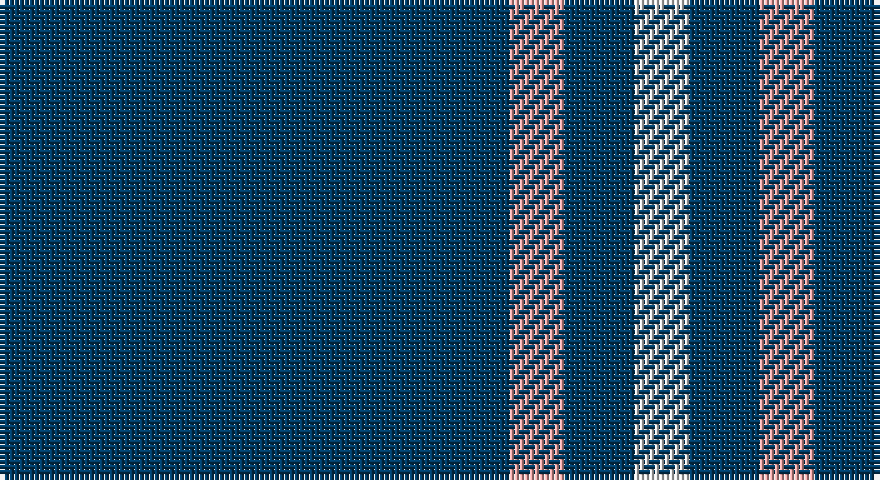

This page is one **sett** — a single exact thread-count. It belongs to the [tartan](/setts/dt102lr11dt14w11/)
(the same proportion at any scale), whose colour order is pattern [BYBW](/stripes/bybw/).

Sourced from tartans-authority.  It is a [4 stripe tartan](/stripes/stripes4/).

Original link http://www.tartansauthority.com/tartan-ferret/display/8161/

## Register references

External register numbers recorded for this tartan.

- Scottish Register of Tartans: [8161](https://www.tartanregister.gov.uk/tartanDetails?ref=8161)
- Scottish Tartans Authority (ITI): 8161

## Thread count
DB/102 LR11 DB14 LN/11

One full sett is **163 threads**.

## Palette

Palette: <strong>Tartan Register</strong> <small style="color:#888">(2 of 3 colours)</small>
<table><thead><tr><th>Colour</th><th>Threads</th><th>Shade</th><th>Base</th><th>OKLCh</th></tr></thead><tbody><tr><td>DB/</td><td style="text-align:right;font-variant-numeric:tabular-nums">102</td><td><code style="background-color:#003C64;">#003C64</code> <small style="color:#888">#003C64</small></td><td>B <code style="background-color:#2A418A;">#2A418A</code></td><td><small style="color:#888">oklch(34.5% 0.089 246.0)</small></td></tr><tr><td>LR</td><td style="text-align:right;font-variant-numeric:tabular-nums">11</td><td><code style="background-color:#ECA4A4;">#ECA4A4</code> <small style="color:#888">#ECA4A4</small></td><td>Y <code style="background-color:#F2BF00;">#F2BF00</code></td><td><small style="color:#888">oklch(78.8% 0.086 19.2)</small></td></tr><tr><td>DB</td><td style="text-align:right;font-variant-numeric:tabular-nums">14</td><td><code style="background-color:#003C64;">#003C64</code> <small style="color:#888">#003C64</small></td><td>B <code style="background-color:#2A418A;">#2A418A</code></td><td><small style="color:#888">oklch(34.5% 0.089 246.0)</small></td></tr><tr><td>LN/</td><td style="text-align:right;font-variant-numeric:tabular-nums">11</td><td><code style="background-color:#E0E0E0;">#E0E0E0</code> <small style="color:#888">#E0E0E0</small></td><td>W <code style="background-color:#F7F7F7;">#F7F7F7</code></td><td><small style="color:#888">oklch(90.7% 0.000 89.9)</small></td></tr></tbody></table>

# Sample pattern

## Nearest tartans

The nearest existing variants by ΔTartan distance, with this tartan at the top so the swatches line up against it.

ΔTartan

Tartan

Sett

—

<a href="/ttd/edit/#slug=dt102lr11dt14w11">Westfield (Corporate?)</a> <a class="nn-out" href="/variants/s4/dt102lr11dt14w11/" title="open its dictionary page">↗</a>

1.20

<a href="/ttd/edit/#slug=db32r3db4ly3~x2&amp;base=dt102lr11dt14w11">MacLaine of Lochbuie</a> <a class="nn-out" href="/variants/s4/db32r3db4ly3~x2/" title="open its dictionary page">↗</a>

1.46

<a href="/ttd/edit/#slug=dt50k12dt21w5~x2&amp;base=dt102lr11dt14w11">Coinean Dubh</a> <a class="nn-out" href="/variants/s4/dt50k12dt21w5~x2/" title="open its dictionary page">↗</a>

1.61

<a href="/ttd/edit/#slug=db140r11db14ly11&amp;base=dt102lr11dt14w11">Gem</a> <a class="nn-out" href="/variants/s4/db140r11db14ly11/" title="open its dictionary page">↗</a>

1.95

<a href="/ttd/edit/#slug=ly6t38k3~x2&amp;base=dt102lr11dt14w11">Poulain League (Corporate)</a> <a class="nn-out" href="/variants/s3/ly6t38k3~x2/" title="open its dictionary page">↗</a>

1.99

<a href="/ttd/edit/#slug=r1db9lo2db9lo1~x4&amp;base=dt102lr11dt14w11">Brooks Brothers Tattersall Blue</a> <a class="nn-out" href="/variants/s5/r1db9lo2db9lo1~x4/" title="open its dictionary page">↗</a>

2.03

<a href="/ttd/edit/#slug=db36lo5db8lb3db8lb10db3~x2&amp;base=dt102lr11dt14w11">Scottish Qualifications Auth. (Corp)</a> <a class="nn-out" href="/variants/s7/db36lo5db8lb3db8lb10db3~x2/" title="open its dictionary page">↗</a>

2.18

<a href="/ttd/edit/#slug=b35k10b4w2b3r2~x2&amp;base=dt102lr11dt14w11">Laidlaw's Highland Drovers</a> <a class="nn-out" href="/variants/s6/b35k10b4w2b3r2~x2/" title="open its dictionary page">↗</a>

2.20

<a href="/ttd/edit/#slug=r2k6db33w2~x4&amp;base=dt102lr11dt14w11">McCallie</a> <a class="nn-out" href="/variants/s4/r2k6db33w2~x4/" title="open its dictionary page">↗</a>

2.24

<a href="/ttd/edit/#slug=db72t6db12t17w6~x2&amp;base=dt102lr11dt14w11">Gulfmark (Corporate)</a> <a class="nn-out" href="/variants/s5/db72t6db12t17w6~x2/" title="open its dictionary page">↗</a>

2.25

<a href="/ttd/edit/#slug=dt40ly10dt8r20dt100w5&amp;base=dt102lr11dt14w11">East of Scotland Tartan Army</a> <a class="nn-out" href="/variants/s6/dt40ly10dt8r20dt100w5/" title="open its dictionary page">↗</a>

## Neighbour map

Every grey dot is one of 14360 variants placed by the first two principal components of the ΔTartan feature space (44% of its variance). Red is this tartan; blue dots are its nearest — click one to open its page.

<svg viewBox="0 0 640 380" role="img" style="max-width:100%;height:auto;border:1px solid #e0e0e0;border-radius:4px;display:block" xmlns="http://www.w3.org/2000/svg"><image href="/nn/cloud.v1.png" width="640" height="380"/><a href="/variants/s4/db32r3db4ly3~x2/"><circle cx="589.6" cy="240.0" r="4" fill="#3465a4"><title>MacLaine of Lochbuie</title></circle></a><a href="/variants/s4/dt50k12dt21w5~x2/"><circle cx="507.8" cy="277.4" r="4" fill="#3465a4"><title>Coinean Dubh</title></circle></a><a href="/variants/s4/db140r11db14ly11/"><circle cx="614.9" cy="231.6" r="4" fill="#3465a4"><title>Gem</title></circle></a><a href="/variants/s3/ly6t38k3~x2/"><circle cx="528.7" cy="248.9" r="4" fill="#3465a4"><title>Poulain League (Corporate)</title></circle></a><a href="/variants/s5/r1db9lo2db9lo1~x4/"><circle cx="543.1" cy="269.9" r="4" fill="#3465a4"><title>Brooks Brothers Tattersall Blue</title></circle></a><a href="/variants/s7/db36lo5db8lb3db8lb10db3~x2/"><circle cx="453.2" cy="202.5" r="4" fill="#3465a4"><title>Scottish Qualifications Auth. (Corp)</title></circle></a><a href="/variants/s6/b35k10b4w2b3r2~x2/"><circle cx="471.7" cy="175.5" r="4" fill="#3465a4"><title>Laidlaw's Highland Drovers</title></circle></a><a href="/variants/s4/r2k6db33w2~x4/"><circle cx="506.8" cy="205.3" r="4" fill="#3465a4"><title>McCallie</title></circle></a><a href="/variants/s5/db72t6db12t17w6~x2/"><circle cx="496.0" cy="233.7" r="4" fill="#3465a4"><title>Gulfmark (Corporate)</title></circle></a><a href="/variants/s6/dt40ly10dt8r20dt100w5/"><circle cx="517.3" cy="181.3" r="4" fill="#3465a4"><title>East of Scotland Tartan Army</title></circle></a><circle cx="539.7" cy="241.2" r="5" fill="#c00000"/></svg>

ID: /variants/s4/dt102lr11dt14w11/
