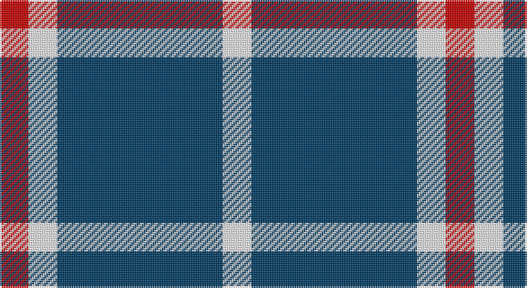

This page is one **sett** — a single exact thread-count. It belongs to the [tartan](/setts/dt23w4r4/)
(the same proportion at any scale), whose colour order is pattern [RWBW](/stripes/rwbw/).

Part of the [Auchmaliddie Samkoma](/tartans/auchmaliddie-samkoma/) tartan — the named design grouping this sett with its other cloths.

Sourced from tartans-authority.  It is a [4 stripe tartan](/stripes/stripes4/).

Original link http://www.tartansauthority.com/tartan-ferret/display/10348/

## Register references

External register numbers recorded for this tartan.

- Scottish Register of Tartans: [10348](https://www.tartanregister.gov.uk/tartanDetails?ref=10348)
- Scottish Tartans Authority (ITI): 10348

## Thread count
R/16 W16 DB92 W/16

One full sett is **248 threads**.

## Palette

Palette: <strong>Tartan Register</strong>
<table><thead><tr><th>Colour</th><th>Threads</th><th>Shade</th><th>Base</th><th>OKLCh</th></tr></thead><tbody><tr><td>R/</td><td style="text-align:right;font-variant-numeric:tabular-nums">16</td><td><code style="background-color:#C80000;">#C80000</code> <small style="color:#888">#C80000</small></td><td>R <code style="background-color:#CC0000;">#CC0000</code></td><td><small style="color:#888">oklch(52.3% 0.215 29.2)</small></td></tr><tr><td>W</td><td style="text-align:right;font-variant-numeric:tabular-nums">16</td><td><code style="background-color:#FCFCFC;">#FCFCFC</code> <small style="color:#888">#FCFCFC</small></td><td>W <code style="background-color:#F7F7F7;">#F7F7F7</code></td><td><small style="color:#888">oklch(99.1% 0.000 89.9)</small></td></tr><tr><td>DB</td><td style="text-align:right;font-variant-numeric:tabular-nums">92</td><td><code style="background-color:#003C64;">#003C64</code> <small style="color:#888">#003C64</small></td><td>B <code style="background-color:#2A418A;">#2A418A</code></td><td><small style="color:#888">oklch(34.5% 0.089 246.0)</small></td></tr><tr><td>W/</td><td style="text-align:right;font-variant-numeric:tabular-nums">16</td><td><code style="background-color:#FCFCFC;">#FCFCFC</code> <small style="color:#888">#FCFCFC</small></td><td>W <code style="background-color:#F7F7F7;">#F7F7F7</code></td><td><small style="color:#888">oklch(99.1% 0.000 89.9)</small></td></tr></tbody></table>

# Sample pattern

## Compared to the master

This cloth is one sett of its design; the master sett (the exemplar the design is anchored on) is below for comparison.

<figure style="margin:0"><figcaption style="color:#888;font-size:smaller">this sett</figcaption></figure>
<figure style="margin:0"><figcaption style="color:#888;font-size:smaller"><a href="/setts/dp23w4r4/">master sett →</a></figcaption></figure>

## Nearest tartans

The nearest existing variants by ΔTartan distance, with this tartan at the top so the swatches line up against it.

ΔTartan

Tartan

Sett

—

<a href="/ttd/edit/#slug=dt23w4r4~x4">Auchmaliddie Samkoma (Personal)</a> <a class="nn-out" href="/variants/s4/dt23w4r4~x4/" title="open its dictionary page">↗</a>

0.94

<a href="/variants/s4/dp23w4r4~x4/">Auchmaliddie Samkoma</a>

1.52

<a href="/ttd/edit/#slug=db10g4w27db40r4~x2&amp;base=dt23w4r4~x4">Turnbull Dress, Bruce (Personal)</a> <a class="nn-out" href="/variants/s5/db10g4w27db40r4~x2/" title="open its dictionary page">↗</a>

1.57

<a href="/variants/s4/dg20w5r3~x2/">Juchter (Personal)</a>

1.58

<a href="/ttd/edit/#slug=k46dy7k8w20~x2&amp;base=dt23w4r4~x4">Lords of Skye (Fashion?)</a> <a class="nn-out" href="/variants/s4/k46dy7k8w20~x2/" title="open its dictionary page">↗</a>

1.63

<a href="/variants/s6/b30ly5b4r12~x4/">UEFA (Glasgow)</a>

1.66

<a href="/variants/s6/w20dt20w3dt3~x2/">Barbie's Moss Plaid (Blue &amp; White)</a>

1.71

<a href="/ttd/edit/#slug=k2w1k8w8k1~x8&amp;base=dt23w4r4~x4">Cairn (Marton Mills)</a> <a class="nn-out" href="/variants/s5/k2w1k8w8k1~x8/" title="open its dictionary page">↗</a>

1.74

<a href="/ttd/edit/#slug=k5w25r6k45w4~x2&amp;base=dt23w4r4~x4">Shembe Zulu Church</a> <a class="nn-out" href="/variants/s5/k5w25r6k45w4~x2/" title="open its dictionary page">↗</a>

1.77

<a href="/ttd/edit/#slug=t12ly2t1k5t4k2~x4&amp;base=dt23w4r4~x4">Rea</a> <a class="nn-out" href="/variants/s6/t12ly2t1k5t4k2~x4/" title="open its dictionary page">↗</a>

1.79

<a href="/ttd/edit/#slug=dt30w7dt18w11dt6ly3~x2&amp;base=dt23w4r4~x4">Ochterlonie</a> <a class="nn-out" href="/variants/s6/dt30w7dt18w11dt6ly3~x2/" title="open its dictionary page">↗</a>

## Neighbour map

Every grey dot is one of 14360 variants placed by the first two principal components of the ΔTartan feature space (44% of its variance). Red is this tartan; blue dots are its nearest — click one to open its page.

<svg viewBox="0 0 640 380" role="img" style="max-width:100%;height:auto;border:1px solid #e0e0e0;border-radius:4px;display:block" xmlns="http://www.w3.org/2000/svg"><image href="/nn/cloud.v1.png" width="640" height="380"/><a href="/variants/s4/dp23w4r4~x4/"><circle cx="349.2" cy="237.8" r="4" fill="#3465a4"><title>Auchmaliddie Samkoma</title></circle></a><a href="/variants/s5/db10g4w27db40r4~x2/"><circle cx="287.5" cy="201.3" r="4" fill="#3465a4"><title>Turnbull Dress, Bruce (Personal)</title></circle></a><a href="/variants/s4/dg20w5r3~x2/"><circle cx="305.6" cy="243.6" r="4" fill="#3465a4"><title>Juchter (Personal)</title></circle></a><a href="/variants/s4/k46dy7k8w20~x2/"><circle cx="334.9" cy="250.9" r="4" fill="#3465a4"><title>Lords of Skye (Fashion?)</title></circle></a><a href="/variants/s6/b30ly5b4r12~x4/"><circle cx="346.0" cy="218.8" r="4" fill="#3465a4"><title>UEFA (Glasgow)</title></circle></a><a href="/variants/s6/w20dt20w3dt3~x2/"><circle cx="324.3" cy="247.0" r="4" fill="#3465a4"><title>Barbie's Moss Plaid (Blue &amp; White)</title></circle></a><a href="/variants/s5/k2w1k8w8k1~x8/"><circle cx="311.7" cy="238.5" r="4" fill="#3465a4"><title>Cairn (Marton Mills)</title></circle></a><a href="/variants/s5/k5w25r6k45w4~x2/"><circle cx="315.9" cy="199.2" r="4" fill="#3465a4"><title>Shembe Zulu Church</title></circle></a><a href="/variants/s6/t12ly2t1k5t4k2~x4/"><circle cx="363.3" cy="219.2" r="4" fill="#3465a4"><title>Rea</title></circle></a><a href="/variants/s6/dt30w7dt18w11dt6ly3~x2/"><circle cx="383.1" cy="229.4" r="4" fill="#3465a4"><title>Ochterlonie</title></circle></a><circle cx="337.2" cy="240.6" r="5" fill="#c00000"/></svg>

ID: /variants/s4/dt23w4r4~x4/
