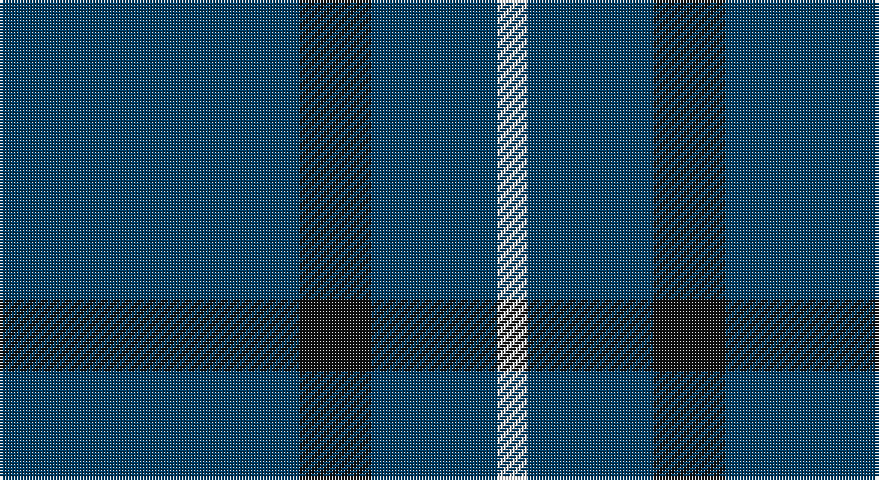

This page is one **sett** — a single exact thread-count. It belongs to the [tartan](/setts/dt50k12dt21w5/)
(the same proportion at any scale), whose colour order is pattern [BKBW](/stripes/bkbw/).

Sourced from register-of-tartans.  It is a [4 stripe tartan](/stripes/stripes4/).

Original link https://www.tartanregister.gov.uk/tartanDetails.aspx?ref=11506

## Register references

External register numbers recorded for this tartan.

- Scottish Register of Tartans: [11506](https://www.tartanregister.gov.uk/tartanDetails.aspx?ref=11506)

## Thread count
DB/100 K24 DB42 W/10

One full sett is **242 threads**.

## Palette

Palette: <strong>Tartan Register</strong>
<table><thead><tr><th>Colour</th><th>Threads</th><th>Shade</th><th>Base</th><th>OKLCh</th></tr></thead><tbody><tr><td>DB/</td><td style="text-align:right;font-variant-numeric:tabular-nums">100</td><td><code style="background-color:#003C64;">#003C64</code> <small style="color:#888">#003C64</small></td><td>B <code style="background-color:#2A418A;">#2A418A</code></td><td><small style="color:#888">oklch(34.5% 0.089 246.0)</small></td></tr><tr><td>K</td><td style="text-align:right;font-variant-numeric:tabular-nums">24</td><td><code style="background-color:#101010;">#101010</code> <small style="color:#888">#101010</small></td><td>K <code style="background-color:#000000;">#000000</code></td><td><small style="color:#888">oklch(17.3% 0.000 89.9)</small></td></tr><tr><td>DB</td><td style="text-align:right;font-variant-numeric:tabular-nums">42</td><td><code style="background-color:#003C64;">#003C64</code> <small style="color:#888">#003C64</small></td><td>B <code style="background-color:#2A418A;">#2A418A</code></td><td><small style="color:#888">oklch(34.5% 0.089 246.0)</small></td></tr><tr><td>W/</td><td style="text-align:right;font-variant-numeric:tabular-nums">10</td><td><code style="background-color:#FFFFFF;">#FFFFFF</code> <small style="color:#888">#FFFFFF</small></td><td>W <code style="background-color:#F7F7F7;">#F7F7F7</code></td><td><small style="color:#888">oklch(100.0% 0.000 89.9)</small></td></tr></tbody></table>

# Sample pattern

## Nearest tartans

The nearest existing variants by ΔTartan distance, with this tartan at the top so the swatches line up against it.

ΔTartan

Tartan

Sett

—

<a href="/ttd/edit/#slug=dt50k12dt21w5~x2">Coinean Dubh</a> <a class="nn-out" href="/variants/s4/dt50k12dt21w5~x2/" title="open its dictionary page">↗</a>

1.44

<a href="/ttd/edit/#slug=r1db9lo2db9lo1~x4&amp;base=dt50k12dt21w5~x2">Brooks Brothers Tattersall Blue</a> <a class="nn-out" href="/variants/s5/r1db9lo2db9lo1~x4/" title="open its dictionary page">↗</a>

1.46

<a href="/ttd/edit/#slug=dt102lr11dt14w11&amp;base=dt50k12dt21w5~x2">Westfield (Corporate?)</a> <a class="nn-out" href="/variants/s4/dt102lr11dt14w11/" title="open its dictionary page">↗</a>

1.79

<a href="/ttd/edit/#slug=n25k9n10w2~x4&amp;base=dt50k12dt21w5~x2">Graham Grey - 1820 (Fashion?)</a> <a class="nn-out" href="/variants/s4/n25k9n10w2~x4/" title="open its dictionary page">↗</a>

1.88

<a href="/ttd/edit/#slug=db24t6db10t6db32ly3~x2&amp;base=dt50k12dt21w5~x2">Sultan of Qaboo's Air Force</a> <a class="nn-out" href="/variants/s6/db24t6db10t6db32ly3~x2/" title="open its dictionary page">↗</a>

1.89

<a href="/ttd/edit/#slug=db9k9db9k9db42w5~x2&amp;base=dt50k12dt21w5~x2">Dollar Academy (1930s) (Corporate)</a> <a class="nn-out" href="/variants/s6/db9k9db9k9db42w5~x2/" title="open its dictionary page">↗</a>

1.89

<a href="/ttd/edit/#slug=db32r3db4ly3~x2&amp;base=dt50k12dt21w5~x2">MacLaine of Lochbuie</a> <a class="nn-out" href="/variants/s4/db32r3db4ly3~x2/" title="open its dictionary page">↗</a>

1.91

<a href="/ttd/edit/#slug=db16ri4db3r1~x2&amp;base=dt50k12dt21w5~x2">Elliott</a> <a class="nn-out" href="/variants/s4/db16ri4db3r1~x2/" title="open its dictionary page">↗</a>

1.96

<a href="/ttd/edit/#slug=k4k12k3o7k26o3~x2&amp;base=dt50k12dt21w5~x2">Crombie House Check</a> <a class="nn-out" href="/variants/s6/k4k12k3o7k26o3~x2/" title="open its dictionary page">↗</a>

1.99

<a href="/ttd/edit/#slug=db9k9db9k9db42lb5~x2&amp;base=dt50k12dt21w5~x2">Dollar Academy</a> <a class="nn-out" href="/variants/s6/db9k9db9k9db42lb5~x2/" title="open its dictionary page">↗</a>

2.06

<a href="/ttd/edit/#slug=t8dg1r2~x20&amp;base=dt50k12dt21w5~x2">Gyle (Corporate)</a> <a class="nn-out" href="/variants/s3/t8dg1r2~x20/" title="open its dictionary page">↗</a>

## Neighbour map

Every grey dot is one of 14360 variants placed by the first two principal components of the ΔTartan feature space (44% of its variance). Red is this tartan; blue dots are its nearest — click one to open its page.

<svg viewBox="0 0 640 380" role="img" style="max-width:100%;height:auto;border:1px solid #e0e0e0;border-radius:4px;display:block" xmlns="http://www.w3.org/2000/svg"><image href="/nn/cloud.v1.png" width="640" height="380"/><a href="/variants/s5/r1db9lo2db9lo1~x4/"><circle cx="543.1" cy="269.9" r="4" fill="#3465a4"><title>Brooks Brothers Tattersall Blue</title></circle></a><a href="/variants/s4/dt102lr11dt14w11/"><circle cx="539.7" cy="241.2" r="4" fill="#3465a4"><title>Westfield (Corporate?)</title></circle></a><a href="/variants/s4/n25k9n10w2~x4/"><circle cx="480.1" cy="261.3" r="4" fill="#3465a4"><title>Graham Grey - 1820 (Fashion?)</title></circle></a><a href="/variants/s6/db24t6db10t6db32ly3~x2/"><circle cx="510.5" cy="253.1" r="4" fill="#3465a4"><title>Sultan of Qaboo's Air Force</title></circle></a><a href="/variants/s6/db9k9db9k9db42w5~x2/"><circle cx="447.9" cy="250.6" r="4" fill="#3465a4"><title>Dollar Academy (1930s) (Corporate)</title></circle></a><a href="/variants/s4/db32r3db4ly3~x2/"><circle cx="589.6" cy="240.0" r="4" fill="#3465a4"><title>MacLaine of Lochbuie</title></circle></a><a href="/variants/s4/db16ri4db3r1~x2/"><circle cx="554.0" cy="251.9" r="4" fill="#3465a4"><title>Elliott</title></circle></a><a href="/variants/s6/k4k12k3o7k26o3~x2/"><circle cx="552.3" cy="281.2" r="4" fill="#3465a4"><title>Crombie House Check</title></circle></a><a href="/variants/s6/db9k9db9k9db42lb5~x2/"><circle cx="463.7" cy="258.6" r="4" fill="#3465a4"><title>Dollar Academy</title></circle></a><a href="/variants/s3/t8dg1r2~x20/"><circle cx="452.4" cy="281.5" r="4" fill="#3465a4"><title>Gyle (Corporate)</title></circle></a><circle cx="507.8" cy="277.4" r="5" fill="#c00000"/></svg>

ID: /variants/s4/dt50k12dt21w5~x2/
