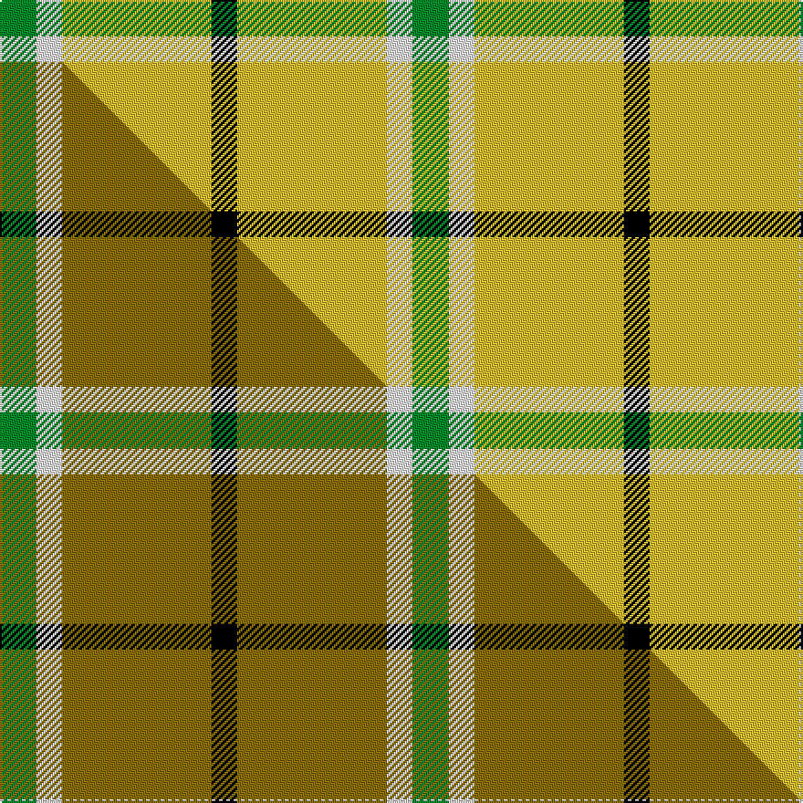

This page is one **sett** — a single exact thread-count. It belongs to the [tartan](/setts/g10w7ly41k7/)
(the same proportion at any scale), whose colour order is pattern [GWYK](/stripes/gwyk/).

Part of the [Hogan](/tartans/hogan/) tartan — the named design grouping this sett with its other cloths.

Sourced from tartans-authority.  It is a [4 stripe tartan](/stripes/stripes4/).

Original link http://www.tartansauthority.com/tartan-ferret/display/11107/

## Register references

External register numbers recorded for this tartan.

- Scottish Register of Tartans: [11107](https://www.tartanregister.gov.uk/tartanDetails?ref=11107)
- Scottish Tartans Authority (ITI): 11107

## Thread count
G/20 W14 LY82 K/14

One full sett is **226 threads**.

## Palette
<table><thead><tr><th>Colour</th><th>Shade</th><th>OKLCh</th></tr></thead><tbody><tr><td>G</td><td><code style="background-color:#008B2A;">#008B2A</code> <small style="color:#888">#008B2A</small></td><td><small style="color:#888">oklch(55.4% 0.170 145.9)</small></td></tr><tr><td>K</td><td><code style="background-color:#000000;">#000000</code> <small style="color:#888">#000000</small></td><td><small style="color:#888">oklch(0.0% 0.000 0.0)</small></td></tr><tr><td>LY</td><td><code style="background-color:#DCBC32;">#DCBC32</code> <small style="color:#888">#DCBC32</small></td><td><small style="color:#888">oklch(80.0% 0.150 95.2)</small></td></tr><tr><td>W</td><td><code style="background-color:#F7F7F7;">#F7F7F7</code> <small style="color:#888">#F7F7F7</small></td><td><small style="color:#888">oklch(97.6% 0.000 89.9)</small></td></tr></tbody></table>

# Sample pattern

## Compared to the master

This cloth is one sett of its design; the master sett (the exemplar the design is anchored on) is below for comparison.

Its **ΔTartan distance** from the master is **1.34** — the same measure the nearest-tartans table ranks by (0 is identical; a re-scale of the same cloth is near 0, a recolour or a different proportion further).

<figure class="master-compare" style="margin:0">

this sett
master sett ★

<figcaption style="color:#888;font-size:smaller">One weave of this sett against the <a href="/setts/g10w7y41k7/">master sett ★</a>, split on the diagonal: a shared proportion runs seamlessly across it with only the shades shifting; a different proportion breaks on it.</figcaption>
</figure>

## Nearest variants

The nearest existing variants by ΔTartan distance, with this cloth at the top so the swatches line up against it.

ΔTartan

Threads

Variant

Sett

—

226

<a href="/variants/s4/g10w7ly41k7~x2/">Hogan</a>

<a href="/ttd/edit/#slug=g10w7y41k7~x2&amp;base=g10w7ly41k7~x2" title="compare in the TTD">0.00</a>

226

<a href="/variants/s4/g10w7y41k7~x2/">Hogan (2014)</a>

<a href="/ttd/edit/#slug=r1ly13k8g1~x6&amp;base=g10w7ly41k7~x2" title="compare in the TTD">1.23</a>

264

<a href="/variants/s4/r1ly13k8g1~x6/">Billy Apple - Yellow</a>

<a href="/ttd/edit/#slug=k2ly1g7lb1~x2~ly3307090&amp;base=g10w7ly41k7~x2" title="compare in the TTD">1.59</a>

38

<a href="/variants/s4/k2ly1g7lb1~x2~ly3307090/">Wilson's No.140</a>

<a href="/ttd/edit/#slug=ly12w1k2ly1k1~x8&amp;base=g10w7ly41k7~x2" title="compare in the TTD">2.17</a>

168

<a href="/variants/s5/ly12w1k2ly1k1~x8/">Lochcarron, Camel (Fashion)</a>

<a href="/ttd/edit/#slug=g14k3dr3lr2~x2&amp;base=g10w7ly41k7~x2" title="compare in the TTD">2.26</a>

56

<a href="/variants/s4/g14k3dr3lr2~x2/">Bacon, Green (Fashion)</a>

<a href="/ttd/edit/#slug=g22w14r7ly2~x2&amp;base=g10w7ly41k7~x2" title="compare in the TTD">2.30</a>

132

<a href="/variants/s4/g22w14r7ly2~x2/">Loch Lomond #3</a>

<a href="/ttd/edit/#slug=k6w6k6ly21r2~x4&amp;base=g10w7ly41k7~x2" title="compare in the TTD">2.48</a>

296

<a href="/variants/s5/k6w6k6ly21r2~x4/">Burberry Check Corporate Tartan</a>

<a href="/ttd/edit/#slug=r17db7ly8g58k6~x2&amp;base=g10w7ly41k7~x2" title="compare in the TTD">2.56</a>

338

<a href="/variants/s5/r17db7ly8g58k6~x2/">St Johns County Sheriff Office (Cor)</a>

<a href="/ttd/edit/#slug=dp4g10r1w1~x2~r2109032&amp;base=g10w7ly41k7~x2" title="compare in the TTD">2.57</a>

54

<a href="/variants/s4/dp4g10r1w1~x2~r2109032/">Wilson's No.189</a>

<a href="/ttd/edit/#slug=dp4g10w1r1~x2&amp;base=g10w7ly41k7~x2" title="compare in the TTD">2.57</a>

54

<a href="/variants/s4/dp4g10w1r1~x2/">Wilson's, No 189</a>

## Neighbour map

Every grey dot is one of 13620 variants placed by the first two principal components of the ΔTartan feature space (42% of its variance). Red is this tartan; blue dots are its nearest — click one to open its page.

<svg viewBox="0 0 640 380" role="img" style="max-width:100%;height:auto;border:1px solid #e0e0e0;border-radius:4px;display:block" xmlns="http://www.w3.org/2000/svg"><image href="/nn/cloud.v1.png" width="640" height="380"/><a href="/variants/s4/g10w7y41k7~x2/"><circle cx="299.7" cy="227.7" r="4" fill="#3465a4"><title>Hogan (2014)</title></circle></a><a href="/variants/s4/r1ly13k8g1~x6/"><circle cx="266.5" cy="184.8" r="4" fill="#3465a4"><title>Billy Apple - Yellow</title></circle></a><a href="/variants/s4/k2ly1g7lb1~x2~ly3307090/"><circle cx="295.3" cy="223.3" r="4" fill="#3465a4"><title>Wilson's No.140</title></circle></a><a href="/variants/s5/ly12w1k2ly1k1~x8/"><circle cx="408.6" cy="157.0" r="4" fill="#3465a4"><title>Lochcarron, Camel (Fashion)</title></circle></a><a href="/variants/s4/g14k3dr3lr2~x2/"><circle cx="299.6" cy="221.0" r="4" fill="#3465a4"><title>Bacon, Green (Fashion)</title></circle></a><a href="/variants/s4/g22w14r7ly2~x2/"><circle cx="256.7" cy="247.6" r="4" fill="#3465a4"><title>Loch Lomond #3</title></circle></a><a href="/variants/s5/k6w6k6ly21r2~x4/"><circle cx="206.0" cy="190.4" r="4" fill="#3465a4"><title>Burberry Check Corporate Tartan</title></circle></a><a href="/variants/s5/r17db7ly8g58k6~x2/"><circle cx="283.1" cy="178.3" r="4" fill="#3465a4"><title>St Johns County Sheriff Office (Cor)</title></circle></a><a href="/variants/s4/dp4g10r1w1~x2~r2109032/"><circle cx="349.5" cy="223.6" r="4" fill="#3465a4"><title>Wilson's No.189</title></circle></a><a href="/variants/s4/dp4g10w1r1~x2/"><circle cx="351.6" cy="225.2" r="4" fill="#3465a4"><title>Wilson's, No 189</title></circle></a><circle cx="282.0" cy="224.5" r="5" fill="#c00000"/><text x="320" y="376" text-anchor="middle" font-size="11" fill="#999">ground</text><text x="11" y="190" text-anchor="middle" font-size="11" fill="#999" transform="rotate(-90 11 190)">complexity</text></svg>

ID: /variants/s4/g10w7ly41k7~x2/
