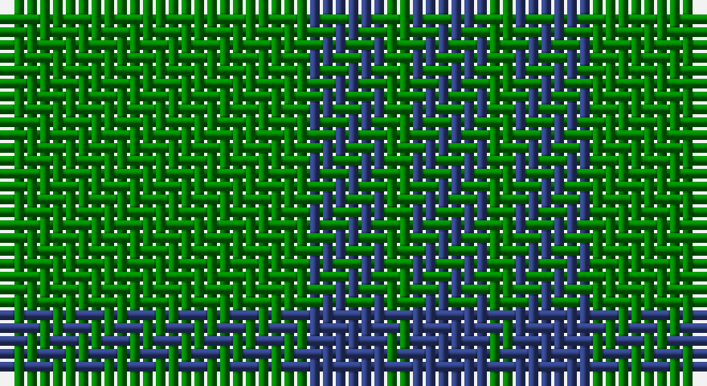

This page is one **sett** — a single exact thread-count. It belongs to the [tartan](/setts/g12db3g1/)
(the same proportion at any scale), whose colour order is pattern [BGBG](/stripes/bgbg/).

Part of the [Montgomerie](/tartans/montgomerie/) tartan — the named design grouping this sett with its other cloths.

Sourced from weddslist.  It is a [4 stripe tartan](/stripes/stripes4/).

Original link http://www.weddslist.com/cgi-bin/tartans/pg.pl?source=sts

## Also known as

This cloth is also recorded under:

- Montgomerie Artifact
- Montgomerie/Montgomery

## Thread count
G/24 B6 G2 B/6

One full sett is **46 threads**.

## Palette

Palette: <strong>custom</strong>
<table><thead><tr><th>Colour</th><th>Threads</th><th>Shade</th><th>Base</th><th>OKLCh</th></tr></thead><tbody><tr><td>G/</td><td style="text-align:right;font-variant-numeric:tabular-nums">24</td><td><code style="background-color:#008000;">#008000</code> <small style="color:#888">#008000</small></td><td>G <code style="background-color:#006100;">#006100</code></td><td><small style="color:#888">oklch(52.0% 0.177 142.5)</small></td></tr><tr><td>B</td><td style="text-align:right;font-variant-numeric:tabular-nums">6</td><td><code style="background-color:#304080;">#304080</code> <small style="color:#888">#304080</small></td><td>B <code style="background-color:#2A418A;">#2A418A</code></td><td><small style="color:#888">oklch(39.4% 0.109 270.2)</small></td></tr><tr><td>G</td><td style="text-align:right;font-variant-numeric:tabular-nums">2</td><td><code style="background-color:#008000;">#008000</code> <small style="color:#888">#008000</small></td><td>G <code style="background-color:#006100;">#006100</code></td><td><small style="color:#888">oklch(52.0% 0.177 142.5)</small></td></tr><tr><td>B/</td><td style="text-align:right;font-variant-numeric:tabular-nums">6</td><td><code style="background-color:#304080;">#304080</code> <small style="color:#888">#304080</small></td><td>B <code style="background-color:#2A418A;">#2A418A</code></td><td><small style="color:#888">oklch(39.4% 0.109 270.2)</small></td></tr></tbody></table>

# Sample pattern

## Compared to the master

This cloth is one sett of its design; the master sett (the exemplar the design is anchored on) is below for comparison.

<figure style="margin:0"><figcaption style="color:#888;font-size:smaller">this sett</figcaption></figure>
<figure style="margin:0"><figcaption style="color:#888;font-size:smaller"><a href="/setts/dg27g39db3g3db4g3db3g39db3g3db4g3/">master sett →</a></figcaption></figure>

## Nearest tartans

The nearest existing variants by ΔTartan distance, with this tartan at the top so the swatches line up against it.

ΔTartan

Tartan

Sett

—

<a href="/ttd/edit/#slug=g12db3g1~x2">Montgomerie</a> <a class="nn-out" href="/variants/s4/g12db3g1~x2/" title="open its dictionary page">↗</a>

1.46

<a href="/ttd/edit/#slug=g12db3ly1~x4&amp;base=g12db3g1~x2">Unidentified, pattern</a> <a class="nn-out" href="/variants/s3/g12db3ly1~x4/" title="open its dictionary page">↗</a>

1.49

<a href="/ttd/edit/#slug=dg12db3ly1~x4&amp;base=g12db3g1~x2">Unidentified pattern #2</a> <a class="nn-out" href="/variants/s3/dg12db3ly1~x4/" title="open its dictionary page">↗</a>

1.69

<a href="/ttd/edit/#slug=g9o20g46lg5~x2&amp;base=g12db3g1~x2">O'Neill, Red (Corporate?)</a> <a class="nn-out" href="/variants/s4/g9o20g46lg5~x2/" title="open its dictionary page">↗</a>

1.72

<a href="/ttd/edit/#slug=g9n1g2k4g2~x4&amp;base=g12db3g1~x2">Peterhead (Personal)</a> <a class="nn-out" href="/variants/s5/g9n1g2k4g2~x4/" title="open its dictionary page">↗</a>

1.73

<a href="/ttd/edit/#slug=g9o4ly1~x4&amp;base=g12db3g1~x2">Ledford Family Tartan</a> <a class="nn-out" href="/variants/s3/g9o4ly1~x4/" title="open its dictionary page">↗</a>

1.75

<a href="/ttd/edit/#slug=dp7g23r3g7~x2&amp;base=g12db3g1~x2">Highland Spring (1997) (Corporate)</a> <a class="nn-out" href="/variants/s4/dp7g23r3g7~x2/" title="open its dictionary page">↗</a>

1.76

<a href="/ttd/edit/#slug=dg9y4lo1~x8&amp;base=g12db3g1~x2">Ledford</a> <a class="nn-out" href="/variants/s3/dg9y4lo1~x8/" title="open its dictionary page">↗</a>

1.76

<a href="/ttd/edit/#slug=g44db9r2db9g2~x2&amp;base=g12db3g1~x2">Tyrconnell (Personal)</a> <a class="nn-out" href="/variants/s5/g44db9r2db9g2~x2/" title="open its dictionary page">↗</a>

1.77

<a href="/variants/s4/g6db2g1~x4/">Montgomery</a>

1.77

<a href="/variants/s4/g6db2g1~x8/">Montgomery - 1842 (VS</a>

## Neighbour map

Every grey dot is one of 14360 variants placed by the first two principal components of the ΔTartan feature space (44% of its variance). Red is this tartan; blue dots are its nearest — click one to open its page.

<svg viewBox="0 0 640 380" role="img" style="max-width:100%;height:auto;border:1px solid #e0e0e0;border-radius:4px;display:block" xmlns="http://www.w3.org/2000/svg"><image href="/nn/cloud.v1.png" width="640" height="380"/><a href="/variants/s3/g12db3ly1~x4/"><circle cx="495.0" cy="275.6" r="4" fill="#3465a4"><title>Unidentified, pattern</title></circle></a><a href="/variants/s3/dg12db3ly1~x4/"><circle cx="515.7" cy="287.1" r="4" fill="#3465a4"><title>Unidentified pattern #2</title></circle></a><a href="/variants/s4/g9o20g46lg5~x2/"><circle cx="463.0" cy="289.0" r="4" fill="#3465a4"><title>O'Neill, Red (Corporate?)</title></circle></a><a href="/variants/s5/g9n1g2k4g2~x4/"><circle cx="461.0" cy="275.1" r="4" fill="#3465a4"><title>Peterhead (Personal)</title></circle></a><a href="/variants/s3/g9o4ly1~x4/"><circle cx="415.3" cy="304.2" r="4" fill="#3465a4"><title>Ledford Family Tartan</title></circle></a><a href="/variants/s4/dp7g23r3g7~x2/"><circle cx="471.0" cy="290.0" r="4" fill="#3465a4"><title>Highland Spring (1997) (Corporate)</title></circle></a><a href="/variants/s3/dg9y4lo1~x8/"><circle cx="421.0" cy="307.3" r="4" fill="#3465a4"><title>Ledford</title></circle></a><a href="/variants/s5/g44db9r2db9g2~x2/"><circle cx="512.3" cy="221.4" r="4" fill="#3465a4"><title>Tyrconnell (Personal)</title></circle></a><a href="/variants/s4/g6db2g1~x4/"><circle cx="426.2" cy="331.6" r="4" fill="#3465a4"><title>Montgomery</title></circle></a><a href="/variants/s4/g6db2g1~x8/"><circle cx="426.2" cy="331.6" r="4" fill="#3465a4"><title>Montgomery - 1842 (VS</title></circle></a><circle cx="485.4" cy="285.8" r="5" fill="#c00000"/></svg>

ID: /variants/s4/g12db3g1~x2/
