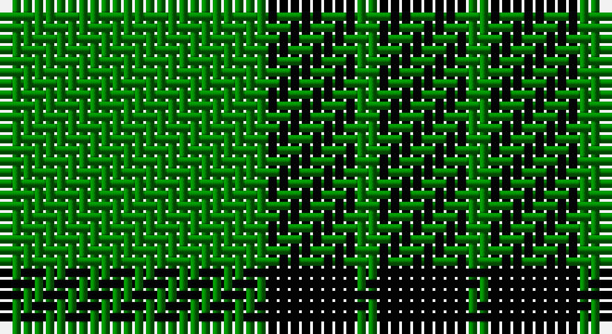

This page is one **sett** — a single exact thread-count. It belongs to the [tartan](/setts/g12k4g1/)
(the same proportion at any scale), whose colour order is pattern [GKGK](/stripes/gkgk/).

Part of the [Graham](/tartans/graham/) tartan — the named design grouping this sett with its other cloths.

Sourced from weddslist.  It is a [4 stripe tartan](/stripes/stripes4/).

Original link http://www.weddslist.com/cgi-bin/tartans/pg.pl?source=sts

## Also known as

This cloth is also recorded under:

- Graham Grey
- Graham Red

## Thread count
G/24 K8 G2 K/8

One full sett is **52 threads**.

## Palette

Palette: <strong>Ingles Buchan</strong> <small style="color:#888">(1 of 2 colours)</small>
<table><thead><tr><th>Colour</th><th>Threads</th><th>Shade</th><th>Base</th><th>OKLCh</th></tr></thead><tbody><tr><td>G/</td><td style="text-align:right;font-variant-numeric:tabular-nums">24</td><td><code style="background-color:#008000;">#008000</code> <small style="color:#888">#008000</small></td><td>G <code style="background-color:#006100;">#006100</code></td><td><small style="color:#888">oklch(52.0% 0.177 142.5)</small></td></tr><tr><td>K</td><td style="text-align:right;font-variant-numeric:tabular-nums">8</td><td><code style="background-color:#000000;">#000000</code> <small style="color:#888">#000000</small></td><td>K <code style="background-color:#000000;">#000000</code></td><td><small style="color:#888">oklch(0.0% 0.000 0.0)</small></td></tr><tr><td>G</td><td style="text-align:right;font-variant-numeric:tabular-nums">2</td><td><code style="background-color:#008000;">#008000</code> <small style="color:#888">#008000</small></td><td>G <code style="background-color:#006100;">#006100</code></td><td><small style="color:#888">oklch(52.0% 0.177 142.5)</small></td></tr><tr><td>K/</td><td style="text-align:right;font-variant-numeric:tabular-nums">8</td><td><code style="background-color:#000000;">#000000</code> <small style="color:#888">#000000</small></td><td>K <code style="background-color:#000000;">#000000</code></td><td><small style="color:#888">oklch(0.0% 0.000 0.0)</small></td></tr></tbody></table>

# Sample pattern

## Compared to the master

This cloth is one sett of its design; the master sett (the exemplar the design is anchored on) is below for comparison.

<figure style="margin:0"><figcaption style="color:#888;font-size:smaller">this sett</figcaption></figure>
<figure style="margin:0"><figcaption style="color:#888;font-size:smaller"><a href="/setts/dg12k4dg1/">master sett →</a></figcaption></figure>

## Nearest tartans

The nearest existing variants by ΔTartan distance, with this tartan at the top so the swatches line up against it.

ΔTartan

Tartan

Sett

—

<a href="/ttd/edit/#slug=g12k4g1~x2">Graham</a> <a class="nn-out" href="/variants/s4/g12k4g1~x2/" title="open its dictionary page">↗</a>

1.35

<a href="/ttd/edit/#slug=k19g8k10g31r3&amp;base=g12k4g1~x2">MacArthur-Fox</a> <a class="nn-out" href="/variants/s5/k19g8k10g31r3/" title="open its dictionary page">↗</a>

1.39

<a href="/ttd/edit/#slug=g30k12g6k6db2k5~x2&amp;base=g12k4g1~x2">Fife, Duchess of..</a> <a class="nn-out" href="/variants/s6/g30k12g6k6db2k5~x2/" title="open its dictionary page">↗</a>

1.58

<a href="/ttd/edit/#slug=k32g6k12g30ly3&amp;base=g12k4g1~x2">MacArthur</a> <a class="nn-out" href="/variants/s5/k32g6k12g30ly3/" title="open its dictionary page">↗</a>

1.59

<a href="/ttd/edit/#slug=g7k1g7t1k6t1~x2&amp;base=g12k4g1~x2">Innes</a> <a class="nn-out" href="/variants/s6/g7k1g7t1k6t1~x2/" title="open its dictionary page">↗</a>

1.67

<a href="/ttd/edit/#slug=dg40k4dg12k21dg17w4~x2&amp;base=g12k4g1~x2">Granger</a> <a class="nn-out" href="/variants/s6/dg40k4dg12k21dg17w4~x2/" title="open its dictionary page">↗</a>

1.67

<a href="/ttd/edit/#slug=g7k1g7t1k6t1~x4&amp;base=g12k4g1~x2">Innes, Georgina (Portrait)</a> <a class="nn-out" href="/variants/s6/g7k1g7t1k6t1~x4/" title="open its dictionary page">↗</a>

1.71

<a href="/ttd/edit/#slug=k4g33k33ly4~x2&amp;base=g12k4g1~x2">Wallace, hunting</a> <a class="nn-out" href="/variants/s4/k4g33k33ly4~x2/" title="open its dictionary page">↗</a>

1.71

<a href="/ttd/edit/#slug=g70k26g12k14b3k16~x2&amp;base=g12k4g1~x2">Duchess of Fife</a> <a class="nn-out" href="/variants/s6/g70k26g12k14b3k16~x2/" title="open its dictionary page">↗</a>

1.80

<a href="/ttd/edit/#slug=dg21ly43dg86t10&amp;base=g12k4g1~x2">Special Saffron Tartan</a> <a class="nn-out" href="/variants/s4/dg21ly43dg86t10/" title="open its dictionary page">↗</a>

1.81

<a href="/ttd/edit/#slug=g9k18r2~x4&amp;base=g12k4g1~x2">Cowie, Justine (Personal)</a> <a class="nn-out" href="/variants/s3/g9k18r2~x4/" title="open its dictionary page">↗</a>

## Neighbour map

Every grey dot is one of 14360 variants placed by the first two principal components of the ΔTartan feature space (44% of its variance). Red is this tartan; blue dots are its nearest — click one to open its page.

<svg viewBox="0 0 640 380" role="img" style="max-width:100%;height:auto;border:1px solid #e0e0e0;border-radius:4px;display:block" xmlns="http://www.w3.org/2000/svg"><image href="/nn/cloud.v1.png" width="640" height="380"/><a href="/variants/s5/k19g8k10g31r3/"><circle cx="294.1" cy="249.5" r="4" fill="#3465a4"><title>MacArthur-Fox</title></circle></a><a href="/variants/s6/g30k12g6k6db2k5~x2/"><circle cx="343.6" cy="211.8" r="4" fill="#3465a4"><title>Fife, Duchess of..</title></circle></a><a href="/variants/s5/k32g6k12g30ly3/"><circle cx="292.2" cy="246.1" r="4" fill="#3465a4"><title>MacArthur</title></circle></a><a href="/variants/s6/g7k1g7t1k6t1~x2/"><circle cx="297.9" cy="251.0" r="4" fill="#3465a4"><title>Innes</title></circle></a><a href="/variants/s6/dg40k4dg12k21dg17w4~x2/"><circle cx="390.8" cy="246.4" r="4" fill="#3465a4"><title>Granger</title></circle></a><a href="/variants/s6/g7k1g7t1k6t1~x4/"><circle cx="310.5" cy="256.8" r="4" fill="#3465a4"><title>Innes, Georgina (Portrait)</title></circle></a><a href="/variants/s4/k4g33k33ly4~x2/"><circle cx="273.0" cy="256.9" r="4" fill="#3465a4"><title>Wallace, hunting</title></circle></a><a href="/variants/s6/g70k26g12k14b3k16~x2/"><circle cx="363.0" cy="197.5" r="4" fill="#3465a4"><title>Duchess of Fife</title></circle></a><a href="/variants/s4/dg21ly43dg86t10/"><circle cx="356.7" cy="255.8" r="4" fill="#3465a4"><title>Special Saffron Tartan</title></circle></a><a href="/variants/s3/g9k18r2~x4/"><circle cx="342.6" cy="278.7" r="4" fill="#3465a4"><title>Cowie, Justine (Personal)</title></circle></a><circle cx="371.3" cy="264.7" r="5" fill="#c00000"/></svg>

ID: /variants/s4/g12k4g1~x2/
