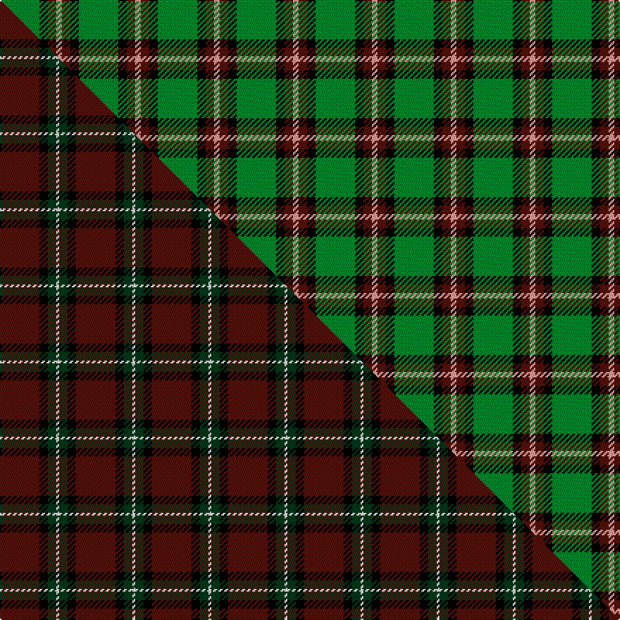

This page is one **sett** — a single exact thread-count. It belongs to the [tartan](/setts/g14k3dr3lr2/)
(the same proportion at any scale), whose colour order is pattern [GKBY](/stripes/gkby/).

Part of the [Bacon](/tartans/bacon/) tartan — the named design grouping this sett with its other cloths.

Sourced from tartans-authority.  It is a [4 stripe tartan](/stripes/stripes4/).

Original link http://www.tartansauthority.com/tartan-ferret/display/3625/

2 attestations — the source records this cloth was collapsed from (oldest owns this page)

<ul>
<li>pre 2002 — Bacon, Green (Fashion) (tartans-authority, <a href="http://www.tartansauthority.com/tartan-ferret/display/3625/">record</a>) </li>
<li>undated — Bacon, Green (register-of-tartans, <a href="https://www.tartanregister.gov.uk/tartanDetails.aspx?ref=5175">record</a>)  <em>No Details.</em></li>
</ul>

## Register references

External register numbers recorded for this tartan.

- Scottish Register of Tartans: [5175](https://www.tartanregister.gov.uk/tartanDetails.aspx?ref=5175)
- Scottish Tartans Authority (ITI): 3625

## Thread count
G/28 K6 DR6 LR/4

One full sett is **56 threads**.

## Palette
<table><thead><tr><th>Colour</th><th>Shade</th><th>OKLCh</th></tr></thead><tbody><tr><td>DR</td><td><code style="background-color:#55120C;">#55120C</code> <small style="color:#888">#55120C</small></td><td><small style="color:#888">oklch(30.0% 0.099 29.3)</small></td></tr><tr><td>G</td><td><code style="background-color:#008B2A;">#008B2A</code> <small style="color:#888">#008B2A</small></td><td><small style="color:#888">oklch(55.4% 0.170 145.9)</small></td></tr><tr><td>K</td><td><code style="background-color:#000000;">#000000</code> <small style="color:#888">#000000</small></td><td><small style="color:#888">oklch(0.0% 0.000 0.0)</small></td></tr><tr><td>LR</td><td><code style="background-color:#FF9C97;">#FF9C97</code> <small style="color:#888">#FF9C97</small></td><td><small style="color:#888">oklch(79.3% 0.119 23.2)</small></td></tr></tbody></table>

# Sample pattern

## Compared to the master

This cloth is one sett of its design; the master sett (the exemplar the design is anchored on) is below for comparison.

Its **ΔTartan distance** from the master is **0.89** — the same measure the nearest-tartans table ranks by (0 is identical; a re-scale of the same cloth is near 0, a recolour or a different proportion further).

<figure class="master-compare" style="margin:0">

this sett
master sett ★

<figcaption style="color:#888;font-size:smaller">One weave of this sett against the <a href="/setts/dr14k3dg3w1/">master sett ★</a>, split on the diagonal: a shared proportion runs seamlessly across it with only the shades shifting; a different proportion breaks on it.</figcaption>
</figure>

## Nearest tartan variants

The nearest existing variants by ΔTartan distance, with this cloth at the top so the swatches line up against it.

ΔTartan

Threads

Variant

Sett

—

56

<a href="/variants/s4/g14k3dr3lr2~x2/">Bacon, Green (Fashion)</a>

<a href="/ttd/edit/#slug=k4g6r1~x10&amp;base=g14k3dr3lr2~x2" title="compare in the TTD">0.89</a>

170

<a href="/variants/s3/k4g6r1~x10/">Kincaid, of Kincaid</a>

<a href="/ttd/edit/#slug=k11g17r3&amp;base=g14k3dr3lr2~x2" title="compare in the TTD">0.90</a>

48

<a href="/variants/s3/k11g17r3/">Kincaid</a>

<a href="/ttd/edit/#slug=k11g17r3~x2&amp;base=g14k3dr3lr2~x2" title="compare in the TTD">0.90</a>

96

<a href="/variants/s3/k11g17r3~x2/">Kincaid</a>

<a href="/ttd/edit/#slug=k11g16dr2~x4&amp;base=g14k3dr3lr2~x2" title="compare in the TTD">0.91</a>

180

<a href="/variants/s3/k11g16dr2~x4/">Kincaid of Kincaid (Clan)</a>

<a href="/ttd/edit/#slug=k2ly1g7lb1~x2~ly3307090&amp;base=g14k3dr3lr2~x2" title="compare in the TTD">1.05</a>

38

<a href="/variants/s4/k2ly1g7lb1~x2~ly3307090/">Wilson's No.140</a>

<a href="/ttd/edit/#slug=r17db7ly8g58k6~x2&amp;base=g14k3dr3lr2~x2" title="compare in the TTD">1.05</a>

338

<a href="/variants/s5/r17db7ly8g58k6~x2/">St Johns County Sheriff Office (Cor)</a>

<a href="/ttd/edit/#slug=g4lb1k2~x4&amp;base=g14k3dr3lr2~x2" title="compare in the TTD">1.22</a>

32

<a href="/variants/s3/g4lb1k2~x4/">Wilson's, No 45</a>

<a href="/ttd/edit/#slug=r1g11k11y1~x4&amp;base=g14k3dr3lr2~x2" title="compare in the TTD">1.34</a>

184

<a href="/variants/s4/r1g11k11y1~x4/">Brooks Brothers</a>

<a href="/ttd/edit/#slug=dr1g11k11lo1~x4&amp;base=g14k3dr3lr2~x2" title="compare in the TTD">1.34</a>

184

<a href="/variants/s4/dr1g11k11lo1~x4/">Brooks Brothers (Corporate)</a>

<a href="/ttd/edit/#slug=k7y1g7lb1~x2&amp;base=g14k3dr3lr2~x2" title="compare in the TTD">1.50</a>

48

<a href="/variants/s4/k7y1g7lb1~x2/">Wilson's, No 140</a>

## Neighbour map

Every grey dot is one of 13620 variants placed by the first two principal components of the ΔTartan feature space (42% of its variance). Red is this tartan; blue dots are its nearest — click one to open its page.

<svg viewBox="0 0 640 380" role="img" style="max-width:100%;height:auto;border:1px solid #e0e0e0;border-radius:4px;display:block" xmlns="http://www.w3.org/2000/svg"><image href="/nn/cloud.v1.png" width="640" height="380"/><a href="/variants/s3/k4g6r1~x10/"><circle cx="240.7" cy="276.0" r="4" fill="#3465a4"><title>Kincaid, of Kincaid</title></circle></a><a href="/variants/s3/k11g17r3/"><circle cx="238.8" cy="278.7" r="4" fill="#3465a4"><title>Kincaid</title></circle></a><a href="/variants/s3/k11g17r3~x2/"><circle cx="238.8" cy="278.7" r="4" fill="#3465a4"><title>Kincaid</title></circle></a><a href="/variants/s3/k11g16dr2~x4/"><circle cx="266.4" cy="265.5" r="4" fill="#3465a4"><title>Kincaid of Kincaid (Clan)</title></circle></a><a href="/variants/s4/k2ly1g7lb1~x2~ly3307090/"><circle cx="295.3" cy="223.3" r="4" fill="#3465a4"><title>Wilson's No.140</title></circle></a><a href="/variants/s5/r17db7ly8g58k6~x2/"><circle cx="283.1" cy="178.3" r="4" fill="#3465a4"><title>St Johns County Sheriff Office (Cor)</title></circle></a><a href="/variants/s3/g4lb1k2~x4/"><circle cx="231.2" cy="298.8" r="4" fill="#3465a4"><title>Wilson's, No 45</title></circle></a><a href="/variants/s4/r1g11k11y1~x4/"><circle cx="230.3" cy="205.0" r="4" fill="#3465a4"><title>Brooks Brothers</title></circle></a><a href="/variants/s4/dr1g11k11lo1~x4/"><circle cx="230.2" cy="205.6" r="4" fill="#3465a4"><title>Brooks Brothers (Corporate)</title></circle></a><a href="/variants/s4/k7y1g7lb1~x2/"><circle cx="190.3" cy="230.0" r="4" fill="#3465a4"><title>Wilson's, No 140</title></circle></a><circle cx="299.6" cy="221.0" r="5" fill="#c00000"/><text x="320" y="376" text-anchor="middle" font-size="11" fill="#999">ground</text><text x="11" y="190" text-anchor="middle" font-size="11" fill="#999" transform="rotate(-90 11 190)">complexity</text></svg>

ID: /variants/s4/g14k3dr3lr2~x2/
