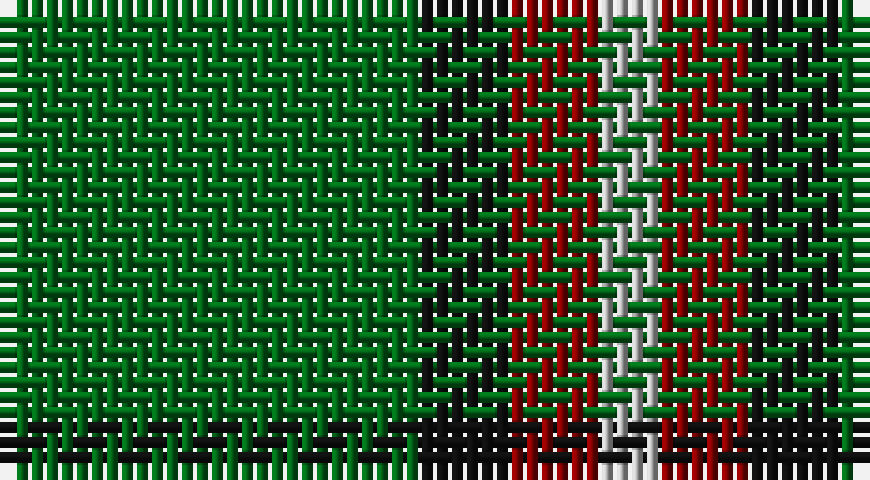

This page is one **sett** — a single exact thread-count. It belongs to the [tartan](/setts/g14k3r3lr2/)
(the same proportion at any scale), whose colour order is pattern [GKRY](/stripes/gkry/).

Part of the [Bacon,](/tartans/bacon/) tartan — the named design grouping this sett with its other cloths.

Sourced from tartans-authority.  It is a [4 stripe tartan](/stripes/stripes4/).

Original link http://www.tartansauthority.com/tartan-ferret/display/3625/

## Also known as

This cloth is also recorded under:

- Bacon, Blue
- Bacon, Green
- Bacon, Red

2 attestations — the source records this cloth was collapsed from (oldest owns this page)

<ul>
<li>pre 2002 — Bacon, Green (Fashion) (tartans-authority, <a href="http://www.tartansauthority.com/tartan-ferret/display/3625/">record</a>)</li>
<li>undated — Bacon, Green (register-of-tartans, <a href="https://www.tartanregister.gov.uk/tartanDetails.aspx?ref=5175">record</a>)</li>
</ul>

## Register references

External register numbers recorded for this tartan.

- Scottish Register of Tartans: [5175](https://www.tartanregister.gov.uk/tartanDetails.aspx?ref=5175)
- Scottish Tartans Authority (ITI): 3625

## Thread count
G/28 K6 DR6 N/4

One full sett is **56 threads**.

## Palette

Palette: <strong>Tartan Register</strong> <small style="color:#888">(3 of 4 colours)</small>
<table><thead><tr><th>Colour</th><th>Threads</th><th>Shade</th><th>Base</th><th>OKLCh</th></tr></thead><tbody><tr><td>G/</td><td style="text-align:right;font-variant-numeric:tabular-nums">28</td><td><code style="background-color:#006818;">#006818</code> <small style="color:#888">#006818</small></td><td>G <code style="background-color:#006100;">#006100</code></td><td><small style="color:#888">oklch(45.0% 0.142 145.0)</small></td></tr><tr><td>K</td><td style="text-align:right;font-variant-numeric:tabular-nums">6</td><td><code style="background-color:#101010;">#101010</code> <small style="color:#888">#101010</small></td><td>K <code style="background-color:#000000;">#000000</code></td><td><small style="color:#888">oklch(17.3% 0.000 89.9)</small></td></tr><tr><td>DR</td><td style="text-align:right;font-variant-numeric:tabular-nums">6</td><td><code style="background-color:#880000;">#880000</code> <small style="color:#888">#880000</small></td><td>R <code style="background-color:#CC0000;">#CC0000</code></td><td><small style="color:#888">oklch(39.4% 0.162 29.2)</small></td></tr><tr><td>N/</td><td style="text-align:right;font-variant-numeric:tabular-nums">4</td><td><code style="background-color:#B8B8B8;">#B8B8B8</code> <small style="color:#888">#B8B8B8</small></td><td>Y <code style="background-color:#F2BF00;">#F2BF00</code></td><td><small style="color:#888">oklch(78.3% 0.000 89.9)</small></td></tr></tbody></table>

# Sample pattern

## Compared to the master

This cloth is one sett of its design; the master sett (the exemplar the design is anchored on) is below for comparison.

<figure style="margin:0"><figcaption style="color:#888;font-size:smaller">this sett</figcaption></figure>
<figure style="margin:0"><figcaption style="color:#888;font-size:smaller"><a href="/setts/db14k3r3w1/">master sett →</a></figcaption></figure>

## Nearest tartans

The nearest existing variants by ΔTartan distance, with this tartan at the top so the swatches line up against it.

ΔTartan

Tartan

Sett

—

<a href="/ttd/edit/#slug=g14k3r3lr2~x2">Bacon, Green (Fashion)</a> <a class="nn-out" href="/variants/s4/g14k3r3lr2~x2/" title="open its dictionary page">↗</a>

0.60

<a href="/ttd/edit/#slug=k2ly1g7t1~x2&amp;base=g14k3r3lr2~x2">Wilson's No.140</a> <a class="nn-out" href="/variants/s4/k2ly1g7t1~x2/" title="open its dictionary page">↗</a>

0.79

<a href="/ttd/edit/#slug=dp4g10r1ly1~x2&amp;base=g14k3r3lr2~x2">Wilson's No.192</a> <a class="nn-out" href="/variants/s4/dp4g10r1ly1~x2/" title="open its dictionary page">↗</a>

1.02

<a href="/ttd/edit/#slug=t1db4g10ly1~x2&amp;base=g14k3r3lr2~x2">Wilson's No.174</a> <a class="nn-out" href="/variants/s4/t1db4g10ly1~x2/" title="open its dictionary page">↗</a>

1.08

<a href="/ttd/edit/#slug=p4g10r1ly1~x2&amp;base=g14k3r3lr2~x2">Wilson's, No 192</a> <a class="nn-out" href="/variants/s4/p4g10r1ly1~x2/" title="open its dictionary page">↗</a>

1.12

<a href="/ttd/edit/#slug=dp4g10r1w1~x2&amp;base=g14k3r3lr2~x2">Wilson's No.189</a> <a class="nn-out" href="/variants/s4/dp4g10r1w1~x2/" title="open its dictionary page">↗</a>

1.21

<a href="/ttd/edit/#slug=p4g10w1r1~x2&amp;base=g14k3r3lr2~x2">Wilson's, No 189</a> <a class="nn-out" href="/variants/s4/p4g10w1r1~x2/" title="open its dictionary page">↗</a>

1.31

<a href="/ttd/edit/#slug=r17db7lo8g58k6~x2&amp;base=g14k3r3lr2~x2">St Johns County Sheriff Office (Cor)</a> <a class="nn-out" href="/variants/s5/r17db7lo8g58k6~x2/" title="open its dictionary page">↗</a>

1.32

<a href="/ttd/edit/#slug=t1db4g10w1~x2&amp;base=g14k3r3lr2~x2">Wilson's, No 205</a> <a class="nn-out" href="/variants/s4/t1db4g10w1~x2/" title="open its dictionary page">↗</a>

1.34

<a href="/ttd/edit/#slug=g22dt5r4dt5r3~x2&amp;base=g14k3r3lr2~x2">Romsdal</a> <a class="nn-out" href="/variants/s5/g22dt5r4dt5r3~x2/" title="open its dictionary page">↗</a>

1.35

<a href="/ttd/edit/#slug=k5g40db20ly3~x2&amp;base=g14k3r3lr2~x2">Robert Byers Family - Dooballagh, Ireland</a> <a class="nn-out" href="/variants/s4/k5g40db20ly3~x2/" title="open its dictionary page">↗</a>

## Neighbour map

Every grey dot is one of 14360 variants placed by the first two principal components of the ΔTartan feature space (44% of its variance). Red is this tartan; blue dots are its nearest — click one to open its page.

<svg viewBox="0 0 640 380" role="img" style="max-width:100%;height:auto;border:1px solid #e0e0e0;border-radius:4px;display:block" xmlns="http://www.w3.org/2000/svg"><image href="/nn/cloud.v1.png" width="640" height="380"/><a href="/variants/s4/k2ly1g7t1~x2/"><circle cx="336.9" cy="248.5" r="4" fill="#3465a4"><title>Wilson's No.140</title></circle></a><a href="/variants/s4/dp4g10r1ly1~x2/"><circle cx="356.7" cy="231.4" r="4" fill="#3465a4"><title>Wilson's No.192</title></circle></a><a href="/variants/s4/t1db4g10ly1~x2/"><circle cx="362.1" cy="242.5" r="4" fill="#3465a4"><title>Wilson's No.174</title></circle></a><a href="/variants/s4/p4g10r1ly1~x2/"><circle cx="347.2" cy="222.8" r="4" fill="#3465a4"><title>Wilson's, No 192</title></circle></a><a href="/variants/s4/dp4g10r1w1~x2/"><circle cx="342.5" cy="224.4" r="4" fill="#3465a4"><title>Wilson's No.189</title></circle></a><a href="/variants/s4/p4g10w1r1~x2/"><circle cx="342.5" cy="220.7" r="4" fill="#3465a4"><title>Wilson's, No 189</title></circle></a><a href="/variants/s5/r17db7lo8g58k6~x2/"><circle cx="325.0" cy="200.8" r="4" fill="#3465a4"><title>St Johns County Sheriff Office (Cor)</title></circle></a><a href="/variants/s4/t1db4g10w1~x2/"><circle cx="359.7" cy="240.7" r="4" fill="#3465a4"><title>Wilson's, No 205</title></circle></a><a href="/variants/s5/g22dt5r4dt5r3~x2/"><circle cx="341.5" cy="257.4" r="4" fill="#3465a4"><title>Romsdal</title></circle></a><a href="/variants/s4/k5g40db20ly3~x2/"><circle cx="353.1" cy="238.0" r="4" fill="#3465a4"><title>Robert Byers Family - Dooballagh, Ireland</title></circle></a><circle cx="346.9" cy="251.3" r="5" fill="#c00000"/></svg>

ID: /variants/s4/g14k3r3lr2~x2/
