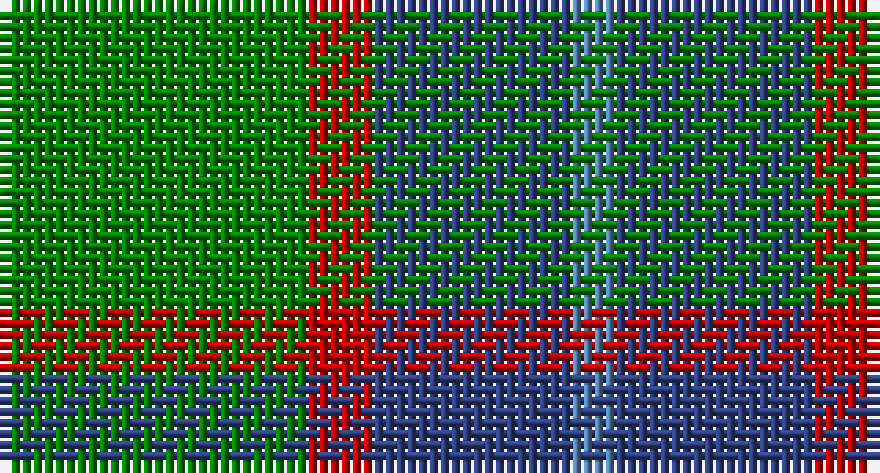

This page is one **sett** — a single exact thread-count. It belongs to the [tartan](/setts/g14r3db9t2/)
(the same proportion at any scale), whose colour order is pattern [BBRG](/stripes/bbrg/).

Sourced from weddslist.  It is a [4 stripe tartan](/stripes/stripes4/).

Original link http://www.weddslist.com/cgi-bin/tartans/pg.pl?source=sts

## Thread count
G/28 R6 B18 Ba/4

One full sett is **80 threads**.

## Palette

Palette: <strong>custom</strong>
<table><thead><tr><th>Colour</th><th>Threads</th><th>Shade</th><th>Base</th><th>OKLCh</th></tr></thead><tbody><tr><td>G/</td><td style="text-align:right;font-variant-numeric:tabular-nums">28</td><td><code style="background-color:#008000;">#008000</code> <small style="color:#888">#008000</small></td><td>G <code style="background-color:#006100;">#006100</code></td><td><small style="color:#888">oklch(52.0% 0.177 142.5)</small></td></tr><tr><td>R</td><td style="text-align:right;font-variant-numeric:tabular-nums">6</td><td><code style="background-color:#C00000;">#C00000</code> <small style="color:#888">#C00000</small></td><td>R <code style="background-color:#CC0000;">#CC0000</code></td><td><small style="color:#888">oklch(50.7% 0.208 29.2)</small></td></tr><tr><td>B</td><td style="text-align:right;font-variant-numeric:tabular-nums">18</td><td><code style="background-color:#304080;">#304080</code> <small style="color:#888">#304080</small></td><td>B <code style="background-color:#2A418A;">#2A418A</code></td><td><small style="color:#888">oklch(39.4% 0.109 270.2)</small></td></tr><tr><td>Ba/</td><td style="text-align:right;font-variant-numeric:tabular-nums">4</td><td><code style="background-color:#5480B0;">#5480B0</code> <small style="color:#888">#5480B0</small></td><td>B <code style="background-color:#2A418A;">#2A418A</code></td><td><small style="color:#888">oklch(58.8% 0.089 251.5)</small></td></tr></tbody></table>

# Sample pattern

## Nearest tartans

The nearest existing variants by ΔTartan distance, with this tartan at the top so the swatches line up against it.

ΔTartan

Tartan

Sett

—

<a href="/ttd/edit/#slug=g14r3db9t2~x2">Unidentified 10</a> <a class="nn-out" href="/variants/s4/g14r3db9t2~x2/" title="open its dictionary page">↗</a>

1.03

<a href="/ttd/edit/#slug=db3o10g9r1g3~x4&amp;base=g14r3db9t2~x2">Bethlehem, City of (District)</a> <a class="nn-out" href="/variants/s5/db3o10g9r1g3~x4/" title="open its dictionary page">↗</a>

1.21

<a href="/ttd/edit/#slug=dg14r3db9t2~x2&amp;base=g14r3db9t2~x2">Unidentified #4</a> <a class="nn-out" href="/variants/s4/dg14r3db9t2~x2/" title="open its dictionary page">↗</a>

1.26

<a href="/ttd/edit/#slug=dg15r3db11t2~x2&amp;base=g14r3db9t2~x2">MacNab</a> <a class="nn-out" href="/variants/s4/dg15r3db11t2~x2/" title="open its dictionary page">↗</a>

1.28

<a href="/variants/s4/g13r2t13~x2/">Wilson's No.161</a>

1.34

<a href="/ttd/edit/#slug=g3db1g8db7k3ly1~x2&amp;base=g14r3db9t2~x2">Trafalgar (Fashion)</a> <a class="nn-out" href="/variants/s6/g3db1g8db7k3ly1~x2/" title="open its dictionary page">↗</a>

1.37

<a href="/ttd/edit/#slug=dg3r1dg9o10db3~x4&amp;base=g14r3db9t2~x2">Bethlehem, City of</a> <a class="nn-out" href="/variants/s5/dg3r1dg9o10db3~x4/" title="open its dictionary page">↗</a>

1.39

<a href="/ttd/edit/#slug=db5g6r1~x4&amp;base=g14r3db9t2~x2">Wilson's No 84, Ferguson</a> <a class="nn-out" href="/variants/s3/db5g6r1~x4/" title="open its dictionary page">↗</a>

1.42

<a href="/ttd/edit/#slug=r3g28db9dg18w3~x2&amp;base=g14r3db9t2~x2">Simple Technology (Corporate)</a> <a class="nn-out" href="/variants/s5/r3g28db9dg18w3~x2/" title="open its dictionary page">↗</a>

1.43

<a href="/ttd/edit/#slug=r5g20r5g20db24g6ly4&amp;base=g14r3db9t2~x2">Cameron of Lochiel (Hunting) Clan/Family Tartan</a> <a class="nn-out" href="/variants/s7/r5g20r5g20db24g6ly4/" title="open its dictionary page">↗</a>

1.44

<a href="/ttd/edit/#slug=db13r2g13~x2&amp;base=g14r3db9t2~x2">Wilson's No 62, (Ferguson)</a> <a class="nn-out" href="/variants/s3/db13r2g13~x2/" title="open its dictionary page">↗</a>

## Neighbour map

Every grey dot is one of 14360 variants placed by the first two principal components of the ΔTartan feature space (44% of its variance). Red is this tartan; blue dots are its nearest — click one to open its page.

<svg viewBox="0 0 640 380" role="img" style="max-width:100%;height:auto;border:1px solid #e0e0e0;border-radius:4px;display:block" xmlns="http://www.w3.org/2000/svg"><image href="/nn/cloud.v1.png" width="640" height="380"/><a href="/variants/s5/db3o10g9r1g3~x4/"><circle cx="279.3" cy="256.1" r="4" fill="#3465a4"><title>Bethlehem, City of (District)</title></circle></a><a href="/variants/s4/dg14r3db9t2~x2/"><circle cx="292.0" cy="285.5" r="4" fill="#3465a4"><title>Unidentified #4</title></circle></a><a href="/variants/s4/dg15r3db11t2~x2/"><circle cx="282.6" cy="278.9" r="4" fill="#3465a4"><title>MacNab</title></circle></a><a href="/variants/s4/g13r2t13~x2/"><circle cx="289.5" cy="291.6" r="4" fill="#3465a4"><title>Wilson's No.161</title></circle></a><a href="/variants/s6/g3db1g8db7k3ly1~x2/"><circle cx="248.7" cy="248.4" r="4" fill="#3465a4"><title>Trafalgar (Fashion)</title></circle></a><a href="/variants/s5/dg3r1dg9o10db3~x4/"><circle cx="256.1" cy="243.8" r="4" fill="#3465a4"><title>Bethlehem, City of</title></circle></a><a href="/variants/s3/db5g6r1~x4/"><circle cx="291.3" cy="324.9" r="4" fill="#3465a4"><title>Wilson's No 84, Ferguson</title></circle></a><a href="/variants/s5/r3g28db9dg18w3~x2/"><circle cx="234.7" cy="232.4" r="4" fill="#3465a4"><title>Simple Technology (Corporate)</title></circle></a><a href="/variants/s7/r5g20r5g20db24g6ly4/"><circle cx="263.7" cy="248.8" r="4" fill="#3465a4"><title>Cameron of Lochiel (Hunting) Clan/Family Tartan</title></circle></a><a href="/variants/s3/db13r2g13~x2/"><circle cx="288.4" cy="321.5" r="4" fill="#3465a4"><title>Wilson's No 62, (Ferguson)</title></circle></a><circle cx="267.3" cy="272.4" r="5" fill="#c00000"/></svg>

ID: /variants/s4/g14r3db9t2~x2/
