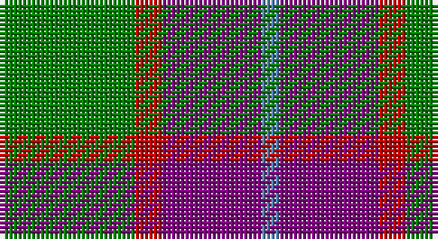

This page is one **sett** — a single exact thread-count. It belongs to the [tartan](/setts/g15r3p11t2/)
(the same proportion at any scale), whose colour order is pattern [BBRG](/stripes/bbrg/).

Sourced from weddslist.  It is a [4 stripe tartan](/stripes/stripes4/).

Original link http://www.weddslist.com/cgi-bin/tartans/pg.pl?source=sts

## Thread count
G/30 R6 P22 B/4

One full sett is **90 threads**.

## Palette

Palette: <strong>custom</strong>
<table><thead><tr><th>Colour</th><th>Threads</th><th>Shade</th><th>Base</th><th>OKLCh</th></tr></thead><tbody><tr><td>G/</td><td style="text-align:right;font-variant-numeric:tabular-nums">30</td><td><code style="background-color:#008000;">#008000</code> <small style="color:#888">#008000</small></td><td>G <code style="background-color:#006100;">#006100</code></td><td><small style="color:#888">oklch(52.0% 0.177 142.5)</small></td></tr><tr><td>R</td><td style="text-align:right;font-variant-numeric:tabular-nums">6</td><td><code style="background-color:#C00000;">#C00000</code> <small style="color:#888">#C00000</small></td><td>R <code style="background-color:#CC0000;">#CC0000</code></td><td><small style="color:#888">oklch(50.7% 0.208 29.2)</small></td></tr><tr><td>P</td><td style="text-align:right;font-variant-numeric:tabular-nums">22</td><td><code style="background-color:#800080;">#800080</code> <small style="color:#888">#800080</small></td><td>B <code style="background-color:#2A418A;">#2A418A</code></td><td><small style="color:#888">oklch(42.1% 0.193 328.4)</small></td></tr><tr><td>B/</td><td style="text-align:right;font-variant-numeric:tabular-nums">4</td><td><code style="background-color:#5480B0;">#5480B0</code> <small style="color:#888">#5480B0</small></td><td>B <code style="background-color:#2A418A;">#2A418A</code></td><td><small style="color:#888">oklch(58.8% 0.089 251.5)</small></td></tr></tbody></table>

# Sample pattern

## Nearest tartans

The nearest existing variants by ΔTartan distance, with this tartan at the top so the swatches line up against it.

ΔTartan

Tartan

Sett

—

<a href="/ttd/edit/#slug=g15r3p11t2~x2">MacNab 7</a> <a class="nn-out" href="/variants/s4/g15r3p11t2~x2/" title="open its dictionary page">↗</a>

0.71

<a href="/ttd/edit/#slug=dg15r3dp11lb2&amp;base=g15r3p11t2~x2">MacNab WI2</a> <a class="nn-out" href="/variants/s4/dg15r3dp11lb2/" title="open its dictionary page">↗</a>

0.98

<a href="/ttd/edit/#slug=r10dy60dt13lb24dt24dy8&amp;base=g15r3p11t2~x2">Bronte House Check (Fashion)</a> <a class="nn-out" href="/variants/s6/r10dy60dt13lb24dt24dy8/" title="open its dictionary page">↗</a>

1.03

<a href="/ttd/edit/#slug=o24r11k6db4~x4&amp;base=g15r3p11t2~x2">Nebar (Corporate)</a> <a class="nn-out" href="/variants/s4/o24r11k6db4~x4/" title="open its dictionary page">↗</a>

1.05

<a href="/ttd/edit/#slug=k4lb4k4o15r2~x4&amp;base=g15r3p11t2~x2">Oban Grey (Fashion)</a> <a class="nn-out" href="/variants/s5/k4lb4k4o15r2~x4/" title="open its dictionary page">↗</a>

1.06

<a href="/ttd/edit/#slug=r5g7k2t1~x4&amp;base=g15r3p11t2~x2">Wilson's No.195</a> <a class="nn-out" href="/variants/s4/r5g7k2t1~x4/" title="open its dictionary page">↗</a>

1.08

<a href="/ttd/edit/#slug=db3g6ly1r3~x10&amp;base=g15r3p11t2~x2">Delroeux (Personal)</a> <a class="nn-out" href="/variants/s4/db3g6ly1r3~x10/" title="open its dictionary page">↗</a>

1.10

<a href="/ttd/edit/#slug=g30ly3db8r25~x2&amp;base=g15r3p11t2~x2">Dohmen (Personal)</a> <a class="nn-out" href="/variants/s4/g30ly3db8r25~x2/" title="open its dictionary page">↗</a>

1.12

<a href="/ttd/edit/#slug=r2dg17r8db8ly2~x4&amp;base=g15r3p11t2~x2">British Hills</a> <a class="nn-out" href="/variants/s5/r2dg17r8db8ly2~x4/" title="open its dictionary page">↗</a>

1.16

<a href="/ttd/edit/#slug=o5dp3o18k16ly3~x4&amp;base=g15r3p11t2~x2">New York State Police Pipe Band</a> <a class="nn-out" href="/variants/s5/o5dp3o18k16ly3~x4/" title="open its dictionary page">↗</a>

1.16

<a href="/ttd/edit/#slug=n11k4r4lo4n1~x4&amp;base=g15r3p11t2~x2">Ikelman #2 (Personal)</a> <a class="nn-out" href="/variants/s5/n11k4r4lo4n1~x4/" title="open its dictionary page">↗</a>

## Neighbour map

Every grey dot is one of 14360 variants placed by the first two principal components of the ΔTartan feature space (44% of its variance). Red is this tartan; blue dots are its nearest — click one to open its page.

<svg viewBox="0 0 640 380" role="img" style="max-width:100%;height:auto;border:1px solid #e0e0e0;border-radius:4px;display:block" xmlns="http://www.w3.org/2000/svg"><image href="/nn/cloud.v1.png" width="640" height="380"/><a href="/variants/s4/dg15r3dp11lb2/"><circle cx="252.9" cy="255.8" r="4" fill="#3465a4"><title>MacNab WI2</title></circle></a><a href="/variants/s6/r10dy60dt13lb24dt24dy8/"><circle cx="231.6" cy="221.3" r="4" fill="#3465a4"><title>Bronte House Check (Fashion)</title></circle></a><a href="/variants/s4/o24r11k6db4~x4/"><circle cx="267.9" cy="259.5" r="4" fill="#3465a4"><title>Nebar (Corporate)</title></circle></a><a href="/variants/s5/k4lb4k4o15r2~x4/"><circle cx="241.8" cy="218.9" r="4" fill="#3465a4"><title>Oban Grey (Fashion)</title></circle></a><a href="/variants/s4/r5g7k2t1~x4/"><circle cx="232.3" cy="260.0" r="4" fill="#3465a4"><title>Wilson's No.195</title></circle></a><a href="/variants/s4/db3g6ly1r3~x10/"><circle cx="194.3" cy="270.5" r="4" fill="#3465a4"><title>Delroeux (Personal)</title></circle></a><a href="/variants/s4/g30ly3db8r25~x2/"><circle cx="262.4" cy="247.4" r="4" fill="#3465a4"><title>Dohmen (Personal)</title></circle></a><a href="/variants/s5/r2dg17r8db8ly2~x4/"><circle cx="220.0" cy="222.2" r="4" fill="#3465a4"><title>British Hills</title></circle></a><a href="/variants/s5/o5dp3o18k16ly3~x4/"><circle cx="234.9" cy="235.1" r="4" fill="#3465a4"><title>New York State Police Pipe Band</title></circle></a><a href="/variants/s5/n11k4r4lo4n1~x4/"><circle cx="266.0" cy="232.6" r="4" fill="#3465a4"><title>Ikelman #2 (Personal)</title></circle></a><circle cx="251.6" cy="249.7" r="5" fill="#c00000"/></svg>

ID: /variants/s4/g15r3p11t2~x2/
