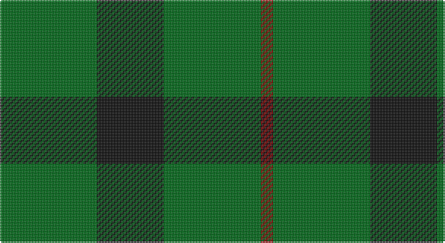

This page is one **sett** — a single exact thread-count. It belongs to the [tartan](/setts/g16k11g16r2/)
(the same proportion at any scale), whose colour order is pattern [GKGR](/stripes/gkgr/).

Part of the [Kincaid of Kincaid](/tartans/kincaid-of-kincaid/) tartan — the named design grouping this sett with its other cloths.

Sourced from register-of-tartans.  It is a [4 stripe tartan](/stripes/stripes4/).

Original link https://www.tartanregister.gov.uk/tartanDetails.aspx?ref=1978

## Also known as

This cloth is also recorded under:

- Kincaid, of Kincaid

## Register references

External register numbers recorded for this tartan.

- Scottish Register of Tartans: [1978](https://www.tartanregister.gov.uk/tartanDetails.aspx?ref=1978)
- Scottish Tartans Authority (ITI): 1106
- Scottish Tartans World Register: 1106

## Thread count
G/64 K44 G64 DR/8

One full sett is **288 threads**.

## Palette

Palette: <strong>Tartan Register</strong>
<table><thead><tr><th>Colour</th><th>Threads</th><th>Shade</th><th>Base</th><th>OKLCh</th></tr></thead><tbody><tr><td>G/</td><td style="text-align:right;font-variant-numeric:tabular-nums">64</td><td><code style="background-color:#006818;">#006818</code> <small style="color:#888">#006818</small></td><td>G <code style="background-color:#006100;">#006100</code></td><td><small style="color:#888">oklch(45.0% 0.142 145.0)</small></td></tr><tr><td>K</td><td style="text-align:right;font-variant-numeric:tabular-nums">44</td><td><code style="background-color:#101010;">#101010</code> <small style="color:#888">#101010</small></td><td>K <code style="background-color:#000000;">#000000</code></td><td><small style="color:#888">oklch(17.3% 0.000 89.9)</small></td></tr><tr><td>G</td><td style="text-align:right;font-variant-numeric:tabular-nums">64</td><td><code style="background-color:#006818;">#006818</code> <small style="color:#888">#006818</small></td><td>G <code style="background-color:#006100;">#006100</code></td><td><small style="color:#888">oklch(45.0% 0.142 145.0)</small></td></tr><tr><td>DR/</td><td style="text-align:right;font-variant-numeric:tabular-nums">8</td><td><code style="background-color:#880000;">#880000</code> <small style="color:#888">#880000</small></td><td>R <code style="background-color:#CC0000;">#CC0000</code></td><td><small style="color:#888">oklch(39.4% 0.162 29.2)</small></td></tr></tbody></table>

# Sample pattern

## Nearest tartans

The nearest existing variants by ΔTartan distance, with this tartan at the top so the swatches line up against it.

ΔTartan

Tartan

Sett

—

<a href="/ttd/edit/#slug=g16k11g16r2~x4">Kincaid of Kincaid</a> <a class="nn-out" href="/variants/s4/g16k11g16r2~x4/" title="open its dictionary page">↗</a>

1.35

<a href="/ttd/edit/#slug=dp7g23r3g7~x2&amp;base=g16k11g16r2~x4">Highland Spring (1997) (Corporate)</a> <a class="nn-out" href="/variants/s4/dp7g23r3g7~x2/" title="open its dictionary page">↗</a>

1.52

<a href="/ttd/edit/#slug=g30k20g3~x2&amp;base=g16k11g16r2~x4">Scotch Tape (Corporate)</a> <a class="nn-out" href="/variants/s3/g30k20g3~x2/" title="open its dictionary page">↗</a>

1.63

<a href="/ttd/edit/#slug=g18ly2g18k4g2k15~x2&amp;base=g16k11g16r2~x4">MacArthur (Highland Society)</a> <a class="nn-out" href="/variants/s6/g18ly2g18k4g2k15~x2/" title="open its dictionary page">↗</a>

1.66

<a href="/ttd/edit/#slug=g9o20g40w5~x2&amp;base=g16k11g16r2~x4">O'Neill (Australia) (Name)</a> <a class="nn-out" href="/variants/s4/g9o20g40w5~x2/" title="open its dictionary page">↗</a>

1.69

<a href="/ttd/edit/#slug=g7r3g23m7~x2&amp;base=g16k11g16r2~x4">Highland Spring (Green)</a> <a class="nn-out" href="/variants/s4/g7r3g23m7~x2/" title="open its dictionary page">↗</a>

1.74

<a href="/ttd/edit/#slug=dg9y4lo1~x8&amp;base=g16k11g16r2~x4">Ledford</a> <a class="nn-out" href="/variants/s3/dg9y4lo1~x8/" title="open its dictionary page">↗</a>

1.80

<a href="/ttd/edit/#slug=o20g40w5g40o20g9~x2&amp;base=g16k11g16r2~x4">O'Neill (Australia)</a> <a class="nn-out" href="/variants/s6/o20g40w5g40o20g9~x2/" title="open its dictionary page">↗</a>

1.83

<a href="/ttd/edit/#slug=g9n1g2k4g2~x4&amp;base=g16k11g16r2~x4">Peterhead (Personal)</a> <a class="nn-out" href="/variants/s5/g9n1g2k4g2~x4/" title="open its dictionary page">↗</a>

1.86

<a href="/variants/s4/g6dp2g1~x4/">Elphinstone</a>

1.86

<a href="/variants/s4/g6dp2g1~x20/">Elphinstone Check (Clan)</a>

## Neighbour map

Every grey dot is one of 14360 variants placed by the first two principal components of the ΔTartan feature space (44% of its variance). Red is this tartan; blue dots are its nearest — click one to open its page.

<svg viewBox="0 0 640 380" role="img" style="max-width:100%;height:auto;border:1px solid #e0e0e0;border-radius:4px;display:block" xmlns="http://www.w3.org/2000/svg"><image href="/nn/cloud.v1.png" width="640" height="380"/><a href="/variants/s4/dp7g23r3g7~x2/"><circle cx="471.0" cy="290.0" r="4" fill="#3465a4"><title>Highland Spring (1997) (Corporate)</title></circle></a><a href="/variants/s3/g30k20g3~x2/"><circle cx="419.8" cy="324.6" r="4" fill="#3465a4"><title>Scotch Tape (Corporate)</title></circle></a><a href="/variants/s6/g18ly2g18k4g2k15~x2/"><circle cx="386.0" cy="265.9" r="4" fill="#3465a4"><title>MacArthur (Highland Society)</title></circle></a><a href="/variants/s4/g9o20g40w5~x2/"><circle cx="412.5" cy="287.6" r="4" fill="#3465a4"><title>O'Neill (Australia) (Name)</title></circle></a><a href="/variants/s4/g7r3g23m7~x2/"><circle cx="473.4" cy="289.1" r="4" fill="#3465a4"><title>Highland Spring (Green)</title></circle></a><a href="/variants/s3/dg9y4lo1~x8/"><circle cx="421.0" cy="307.3" r="4" fill="#3465a4"><title>Ledford</title></circle></a><a href="/variants/s6/o20g40w5g40o20g9~x2/"><circle cx="421.3" cy="295.6" r="4" fill="#3465a4"><title>O'Neill (Australia)</title></circle></a><a href="/variants/s5/g9n1g2k4g2~x4/"><circle cx="461.0" cy="275.1" r="4" fill="#3465a4"><title>Peterhead (Personal)</title></circle></a><a href="/variants/s4/g6dp2g1~x4/"><circle cx="407.8" cy="315.6" r="4" fill="#3465a4"><title>Elphinstone</title></circle></a><a href="/variants/s4/g6dp2g1~x20/"><circle cx="407.8" cy="315.6" r="4" fill="#3465a4"><title>Elphinstone Check (Clan)</title></circle></a><circle cx="424.2" cy="322.6" r="5" fill="#c00000"/></svg>

ID: /variants/s4/g16k11g16r2~x4/
