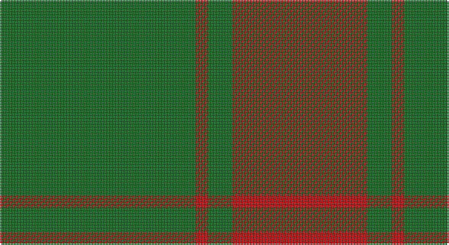

This page is one **sett** — a single exact thread-count. It belongs to the [tartan](/setts/g16r1g2r11/)
(the same proportion at any scale), whose colour order is pattern [GRGR](/stripes/grgr/).

Sourced from register-of-tartans.  It is a [4 stripe tartan](/stripes/stripes4/).

Original link https://www.tartanregister.gov.uk/tartanDetails.aspx?ref=2947

## Provenance

Earliest known date: 1906 Sir Thomas Middleton of Rosefarm in Cromarty was a distinguished agriculturalist in the Department of Food Production during the First World War. Middletons are associated with the Forbes and the Innes Clans.

4 attestations — the source records this cloth was collapsed from (oldest owns this page)

<ul>
<li>01/01/1906 — Middleton (register-of-tartans, <a href="https://www.tartanregister.gov.uk/tartanDetails.aspx?ref=2947">record</a>)</li>
<li>pre 1906 — Middleton (Name) (tartans-authority, <a href="http://www.tartansauthority.com/tartan-ferret/display/903/">record</a>)</li>
<li>undated — Middleton (weddslist, <a href="http://www.weddslist.com/cgi-bin/tartans/pg.pl?source=sts">record</a>)</li>
<li>undated — Middleton Family Tartan (house-of-tartan, <a href="http://www.house-of-tartan.scotland.net/house/TartanViewjs.asp?colr=Def&tnam=903">record</a>)</li>
</ul>

## Register references

External register numbers recorded for this tartan.

- Scottish Register of Tartans: [2947](https://www.tartanregister.gov.uk/tartanDetails.aspx?ref=2947)
- Scottish Tartans Authority (ITI): 903
- Scottish Tartans World Register: 903

## Thread count
G/128 R8 G16 R/88

One full sett is **264 threads**.

## Palette

Palette: <strong>Tartan Register</strong>
<table><thead><tr><th>Colour</th><th>Threads</th><th>Shade</th><th>Base</th><th>OKLCh</th></tr></thead><tbody><tr><td>G/</td><td style="text-align:right;font-variant-numeric:tabular-nums">128</td><td><code style="background-color:#006818;">#006818</code> <small style="color:#888">#006818</small></td><td>G <code style="background-color:#006100;">#006100</code></td><td><small style="color:#888">oklch(45.0% 0.142 145.0)</small></td></tr><tr><td>R</td><td style="text-align:right;font-variant-numeric:tabular-nums">8</td><td><code style="background-color:#C80000;">#C80000</code> <small style="color:#888">#C80000</small></td><td>R <code style="background-color:#CC0000;">#CC0000</code></td><td><small style="color:#888">oklch(52.3% 0.215 29.2)</small></td></tr><tr><td>G</td><td style="text-align:right;font-variant-numeric:tabular-nums">16</td><td><code style="background-color:#006818;">#006818</code> <small style="color:#888">#006818</small></td><td>G <code style="background-color:#006100;">#006100</code></td><td><small style="color:#888">oklch(45.0% 0.142 145.0)</small></td></tr><tr><td>R/</td><td style="text-align:right;font-variant-numeric:tabular-nums">88</td><td><code style="background-color:#C80000;">#C80000</code> <small style="color:#888">#C80000</small></td><td>R <code style="background-color:#CC0000;">#CC0000</code></td><td><small style="color:#888">oklch(52.3% 0.215 29.2)</small></td></tr></tbody></table>

# Sample pattern

## Nearest tartans

The nearest existing variants by ΔTartan distance, with this tartan at the top so the swatches line up against it.

ΔTartan

Tartan

Sett

—

<a href="/ttd/edit/#slug=g16r1g2r11~x8">Middleton</a> <a class="nn-out" href="/variants/s4/g16r1g2r11~x8/" title="open its dictionary page">↗</a>

1.12

<a href="/ttd/edit/#slug=g8r2g9r16g1~x2&amp;base=g16r1g2r11~x8">MacGregor of Glen Strae</a> <a class="nn-out" href="/variants/s5/g8r2g9r16g1~x2/" title="open its dictionary page">↗</a>

1.29

<a href="/ttd/edit/#slug=r18g7r2g18~x2&amp;base=g16r1g2r11~x8">Applecross</a> <a class="nn-out" href="/variants/s4/r18g7r2g18~x2/" title="open its dictionary page">↗</a>

1.29

<a href="/ttd/edit/#slug=r18g7r2g18~x4&amp;base=g16r1g2r11~x8">Applecross (District)</a> <a class="nn-out" href="/variants/s4/r18g7r2g18~x4/" title="open its dictionary page">↗</a>

1.42

<a href="/ttd/edit/#slug=dy12lo6dy2ly1~x4&amp;base=g16r1g2r11~x8">Loch Garth Tartan</a> <a class="nn-out" href="/variants/s4/dy12lo6dy2ly1~x4/" title="open its dictionary page">↗</a>

1.50

<a href="/ttd/edit/#slug=g75r2g4r40~x2&amp;base=g16r1g2r11~x8">Duke of Windsor (Royal)</a> <a class="nn-out" href="/variants/s4/g75r2g4r40~x2/" title="open its dictionary page">↗</a>

1.58

<a href="/ttd/edit/#slug=dg8r2dg9r16dg1~x2&amp;base=g16r1g2r11~x8">MacGregor of Glenstrae</a> <a class="nn-out" href="/variants/s5/dg8r2dg9r16dg1~x2/" title="open its dictionary page">↗</a>

1.64

<a href="/ttd/edit/#slug=do12y6do2lo1~x4&amp;base=g16r1g2r11~x8">Loch Garth</a> <a class="nn-out" href="/variants/s4/do12y6do2lo1~x4/" title="open its dictionary page">↗</a>

1.66

<a href="/ttd/edit/#slug=r16g1r1g1r4g12~x4&amp;base=g16r1g2r11~x8">MacQuarrie #5</a> <a class="nn-out" href="/variants/s6/r16g1r1g1r4g12~x4/" title="open its dictionary page">↗</a>

1.69

<a href="/ttd/edit/#slug=r2g2r16g15r2g2~x2&amp;base=g16r1g2r11~x8">Unidentified, NW Highlands</a> <a class="nn-out" href="/variants/s6/r2g2r16g15r2g2~x2/" title="open its dictionary page">↗</a>

1.69

<a href="/variants/s4/r17g9r2~x2/">MacGregor of Glenstrae</a>

## Neighbour map

Every grey dot is one of 14360 variants placed by the first two principal components of the ΔTartan feature space (44% of its variance). Red is this tartan; blue dots are its nearest — click one to open its page.

<svg viewBox="0 0 640 380" role="img" style="max-width:100%;height:auto;border:1px solid #e0e0e0;border-radius:4px;display:block" xmlns="http://www.w3.org/2000/svg"><image href="/nn/cloud.v1.png" width="640" height="380"/><a href="/variants/s5/g8r2g9r16g1~x2/"><circle cx="385.8" cy="245.2" r="4" fill="#3465a4"><title>MacGregor of Glen Strae</title></circle></a><a href="/variants/s4/r18g7r2g18~x2/"><circle cx="382.0" cy="293.3" r="4" fill="#3465a4"><title>Applecross</title></circle></a><a href="/variants/s4/r18g7r2g18~x4/"><circle cx="382.0" cy="293.3" r="4" fill="#3465a4"><title>Applecross (District)</title></circle></a><a href="/variants/s4/dy12lo6dy2ly1~x4/"><circle cx="463.3" cy="263.6" r="4" fill="#3465a4"><title>Loch Garth Tartan</title></circle></a><a href="/variants/s4/g75r2g4r40~x2/"><circle cx="513.0" cy="218.2" r="4" fill="#3465a4"><title>Duke of Windsor (Royal)</title></circle></a><a href="/variants/s5/dg8r2dg9r16dg1~x2/"><circle cx="380.5" cy="239.0" r="4" fill="#3465a4"><title>MacGregor of Glenstrae</title></circle></a><a href="/variants/s4/do12y6do2lo1~x4/"><circle cx="448.4" cy="256.3" r="4" fill="#3465a4"><title>Loch Garth</title></circle></a><a href="/variants/s6/r16g1r1g1r4g12~x4/"><circle cx="455.5" cy="215.6" r="4" fill="#3465a4"><title>MacQuarrie #5</title></circle></a><a href="/variants/s6/r2g2r16g15r2g2~x2/"><circle cx="379.4" cy="242.8" r="4" fill="#3465a4"><title>Unidentified, NW Highlands</title></circle></a><a href="/variants/s4/r17g9r2~x2/"><circle cx="354.3" cy="294.5" r="4" fill="#3465a4"><title>MacGregor of Glenstrae</title></circle></a><circle cx="442.1" cy="255.6" r="5" fill="#c00000"/></svg>

ID: /variants/s4/g16r1g2r11~x8/
