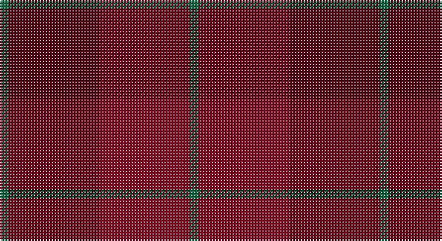

This page is one **sett** — a single exact thread-count. It belongs to the [tartan](/setts/g1dr10r10g1/)
(the same proportion at any scale), whose colour order is pattern [GBRG](/stripes/gbrg/).

Part of the [Stirling of Keir](/tartans/stirling-of-keir/) tartan — the named design grouping this sett with its other cloths.

Sourced from tartans-authority.  It is a [4 stripe tartan](/stripes/stripes4/).

Original link http://www.tartansauthority.com/tartan-ferret/display/7817/

## Register references

External register numbers recorded for this tartan.

- Scottish Tartans Authority (ITI): 7817

## Thread count
G/6 DR60 DRa60 G/6

One full sett is **252 threads**.

## Palette

Palette: <strong>custom</strong>
<table><thead><tr><th>Colour</th><th>Threads</th><th>Shade</th><th>Base</th><th>OKLCh</th></tr></thead><tbody><tr><td>G/</td><td style="text-align:right;font-variant-numeric:tabular-nums">6</td><td><code style="background-color:#006840;">#006840</code> <small style="color:#888">#006840</small></td><td>G <code style="background-color:#006100;">#006100</code></td><td><small style="color:#888">oklch(45.6% 0.106 158.5)</small></td></tr><tr><td>DR</td><td style="text-align:right;font-variant-numeric:tabular-nums">60</td><td><code style="background-color:#5C0014;">#5C0014</code> <small style="color:#888">#5C0014</small></td><td>B <code style="background-color:#2A418A;">#2A418A</code></td><td><small style="color:#888">oklch(30.1% 0.121 18.8)</small></td></tr><tr><td>DRa</td><td style="text-align:right;font-variant-numeric:tabular-nums">60</td><td><code style="background-color:#8C0020;">#8C0020</code> <small style="color:#888">#8C0020</small></td><td>R <code style="background-color:#CC0000;">#CC0000</code></td><td><small style="color:#888">oklch(40.5% 0.163 20.3)</small></td></tr><tr><td>G/</td><td style="text-align:right;font-variant-numeric:tabular-nums">6</td><td><code style="background-color:#006840;">#006840</code> <small style="color:#888">#006840</small></td><td>G <code style="background-color:#006100;">#006100</code></td><td><small style="color:#888">oklch(45.6% 0.106 158.5)</small></td></tr></tbody></table>

# Sample pattern

## Compared to the master

This cloth is one sett of its design; the master sett (the exemplar the design is anchored on) is below for comparison.

<figure style="margin:0"><figcaption style="color:#888;font-size:smaller">this sett</figcaption></figure>
<figure style="margin:0"><figcaption style="color:#888;font-size:smaller"><a href="/setts/g1k10k10g1/">master sett →</a></figcaption></figure>

## Nearest tartans

The nearest existing variants by ΔTartan distance, with this tartan at the top so the swatches line up against it.

ΔTartan

Tartan

Sett

—

<a href="/ttd/edit/#slug=g1dr10r10g1~x6">Stirling of Keir (Clan)</a> <a class="nn-out" href="/variants/s4/g1dr10r10g1~x6/" title="open its dictionary page">↗</a>

1.73

<a href="/ttd/edit/#slug=r5n35r46o5~x2&amp;base=g1dr10r10g1~x6">Bryce</a> <a class="nn-out" href="/variants/s4/r5n35r46o5~x2/" title="open its dictionary page">↗</a>

1.81

<a href="/ttd/edit/#slug=r23o4r23o32r4~x2&amp;base=g1dr10r10g1~x6">Hamilton, Red (Fashion?)</a> <a class="nn-out" href="/variants/s5/r23o4r23o32r4~x2/" title="open its dictionary page">↗</a>

2.29

<a href="/ttd/edit/#slug=r24g2t1g1ri24~x2&amp;base=g1dr10r10g1~x6">MacNab 4</a> <a class="nn-out" href="/variants/s5/r24g2t1g1ri24~x2/" title="open its dictionary page">↗</a>

2.32

<a href="/ttd/edit/#slug=r32lo4r32o23r4o23r4o23~x2&amp;base=g1dr10r10g1~x6">Hamilton, Red</a> <a class="nn-out" href="/variants/s8/r32lo4r32o23r4o23r4o23~x2/" title="open its dictionary page">↗</a>

2.43

<a href="/ttd/edit/#slug=r24g2t1g1m24~x4&amp;base=g1dr10r10g1~x6">MacNab (Smith)</a> <a class="nn-out" href="/variants/s5/r24g2t1g1m24~x4/" title="open its dictionary page">↗</a>

2.46

<a href="/ttd/edit/#slug=do1dy6do6dy1n6dy1~x8&amp;base=g1dr10r10g1~x6">Brown Heather (Fashion)</a> <a class="nn-out" href="/variants/s6/do1dy6do6dy1n6dy1~x8/" title="open its dictionary page">↗</a>

2.48

<a href="/ttd/edit/#slug=r2k1r12ri12t1m2~x4&amp;base=g1dr10r10g1~x6">Grelloch (Fashion)</a> <a class="nn-out" href="/variants/s6/r2k1r12ri12t1m2~x4/" title="open its dictionary page">↗</a>

2.49

<a href="/ttd/edit/#slug=do2m2do17oi17o2oi2~x4&amp;base=g1dr10r10g1~x6">Cypress</a> <a class="nn-out" href="/variants/s6/do2m2do17oi17o2oi2~x4/" title="open its dictionary page">↗</a>

2.54

<a href="/ttd/edit/#slug=y4r18dy2r2dy5k2dy15r1y4~x2&amp;base=g1dr10r10g1~x6">Redwoods</a> <a class="nn-out" href="/variants/s9/y4r18dy2r2dy5k2dy15r1y4~x2/" title="open its dictionary page">↗</a>

2.54

<a href="/ttd/edit/#slug=dr24dg1b1dg2r24~x2&amp;base=g1dr10r10g1~x6">MacNab WI 1</a> <a class="nn-out" href="/variants/s5/dr24dg1b1dg2r24~x2/" title="open its dictionary page">↗</a>

## Neighbour map

Every grey dot is one of 14360 variants placed by the first two principal components of the ΔTartan feature space (44% of its variance). Red is this tartan; blue dots are its nearest — click one to open its page.

<svg viewBox="0 0 640 380" role="img" style="max-width:100%;height:auto;border:1px solid #e0e0e0;border-radius:4px;display:block" xmlns="http://www.w3.org/2000/svg"><image href="/nn/cloud.v1.png" width="640" height="380"/><a href="/variants/s4/r5n35r46o5~x2/"><circle cx="529.2" cy="338.0" r="4" fill="#3465a4"><title>Bryce</title></circle></a><a href="/variants/s5/r23o4r23o32r4~x2/"><circle cx="482.9" cy="328.9" r="4" fill="#3465a4"><title>Hamilton, Red (Fashion?)</title></circle></a><a href="/variants/s5/r24g2t1g1ri24~x2/"><circle cx="472.0" cy="220.0" r="4" fill="#3465a4"><title>MacNab 4</title></circle></a><a href="/variants/s8/r32lo4r32o23r4o23r4o23~x2/"><circle cx="439.5" cy="297.6" r="4" fill="#3465a4"><title>Hamilton, Red</title></circle></a><a href="/variants/s5/r24g2t1g1m24~x4/"><circle cx="474.0" cy="218.4" r="4" fill="#3465a4"><title>MacNab (Smith)</title></circle></a><a href="/variants/s6/do1dy6do6dy1n6dy1~x8/"><circle cx="365.8" cy="341.2" r="4" fill="#3465a4"><title>Brown Heather (Fashion)</title></circle></a><a href="/variants/s6/r2k1r12ri12t1m2~x4/"><circle cx="409.2" cy="226.9" r="4" fill="#3465a4"><title>Grelloch (Fashion)</title></circle></a><a href="/variants/s6/do2m2do17oi17o2oi2~x4/"><circle cx="378.9" cy="251.5" r="4" fill="#3465a4"><title>Cypress</title></circle></a><a href="/variants/s9/y4r18dy2r2dy5k2dy15r1y4~x2/"><circle cx="412.1" cy="233.4" r="4" fill="#3465a4"><title>Redwoods</title></circle></a><a href="/variants/s5/dr24dg1b1dg2r24~x2/"><circle cx="447.5" cy="214.8" r="4" fill="#3465a4"><title>MacNab WI 1</title></circle></a><circle cx="453.0" cy="314.9" r="5" fill="#c00000"/></svg>

ID: /variants/s4/g1dr10r10g1~x6/
